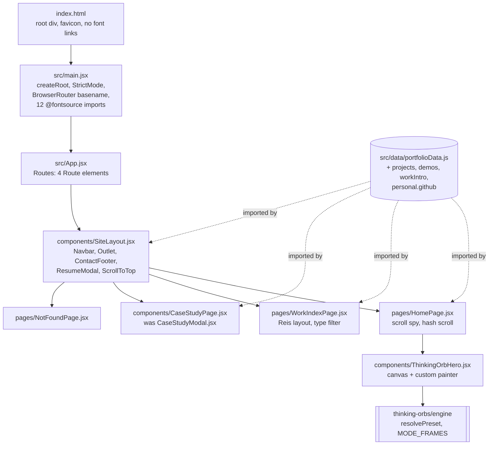

# Spec: Deployed multi-page portfolio on GitHub Pages

Change id: `2026-09-11-deployed-multi-page-portfolio-on-github-pages`
Intent: [intent.md](./intent.md)
Status: draft, awaiting G2
Risk tier: 2
Policy skills applied: `wh-agent-rules`, `wh-security-baseline`, `wh-readable-code`, `wh-adr`,
`wh-review-packet`
Written: 2026-09-11 by the spec architect, against the working tree at `main` (clean).

Every factual claim below carries a label. **Confirmed** means this agent read the file or the
tool output named. **Believed, not verified** means it was inferred, reported by an earlier
agent, or could not be checked from this host. No command was run during this phase: the Bash
tool is disabled in this session (confirmed by attempting one call and receiving
`No such tool available: Bash`), so every version and licence pin below is labelled accordingly
and R77 makes resolving them a binding build-phase control.

---

## Summary

This change turns a single-page, undeployable Vite and React scaffold into a three-route
portfolio published to `https://muhibm1.github.io/Portfolio/` by a GitHub Actions workflow, with
a live `thinking-orbs` hero, self-hosted typefaces, a real `npm test`, and the owner's phone
number removed from the public surface. The one design decision that matters most is that deep
links to `/work/:slug` survive on GitHub Pages by copying the built `dist/index.html` to
`dist/404.html` at build time, with no redirect shim and therefore no `sessionStorage`, which
keeps the project's absolute no-storage position intact. Everything else follows from that
choice plus the design authority in `docs/design-brief.md`.

**On size.** This change is large: 79 requirements across routing, two new page types, a canvas
component, a font migration, a test toolchain, a deploy pipeline, and seven debt items. It is
not separable into independently shippable changes, because nothing here delivers value alone: a
router with no deploy is not a portfolio, and a deploy of today's page misses the point of the
request. So it is specified as one change and built in four sequential waves (see
[Build waves](#build-waves)), which is what `profile.build.max_parallel: 4` and the wave model
exist for. If the owner wants a smaller first increment, the natural cut is waves 1, 2 and 4
(toolchain, routing shell, pipeline) shipping a deployed but visually unchanged site, with wave
3 (hero, work index, case-study page) following. That is stated as an option, not a
recommendation.

---

## Requirements

79 requirements. Every one has an acceptance check a test, a grep, or a command can implement.
`SHALL` is mandatory. The `Source` column traces to `intent.md` Outcomes (O1 to O14), success
metrics (M1 to M17), the G1 decisions (D1 to D5), `docs/design-brief.md`,
`docs/sdlc/constraints.md`, `.workhorse/profile.yml`, or the global security baseline.

### A. Routing and page shell

| ID | Requirement | Acceptance check | Source |
|----|-------------|------------------|--------|
| R1 | The app SHALL use `react-router` 7.9.4 in declarative mode, with `BrowserRouter` imported from `react-router` (not `react-router-dom`) and mounted in `src/main.jsx` around `<App />`. | `grep -n "from 'react-router'" src/main.jsx` returns exactly 1 match; `package.json` `dependencies` contains `"react-router": "7.9.4"` with no range prefix. | O2, D3 |
| R2 | `BrowserRouter` SHALL receive a `basename` computed from `import.meta.env.BASE_URL` with any trailing slash removed, falling back to `/` when the result is empty. The computation SHALL live in one exported helper so it is testable without a DOM. | Unit test "strips the trailing slash from the Vite base url" asserts the helper maps `/Portfolio/` to `/Portfolio` and `/` to `/`. | O2, O5 |
| R3 | The route table SHALL be exactly four routes: `/` to `HomePage`, `/work` to `WorkIndexPage`, `/work/:slug` to `CaseStudyPage`, `*` to `NotFoundPage`. No other route SHALL exist. | Tests render `/`, `/work`, the three case-study paths and `/work/no-such-study` and assert the expected level-1 heading for each; `grep -c "<Route " src/App.jsx` equals 4. | O2, O3, M5 |
| R4 | All four routes SHALL render inside one shared layout, `src/components/SiteLayout.jsx`, which renders `Navbar`, an `<Outlet />`, `ContactFooter`, and the resume modal. | Test asserts the footer email link is present on `/`, `/work` and `/work/apple-llm-triage`. | O2, codebase-map "patterns to follow" |
| R5 | The resume viewer SHALL stay a modal owned by `SiteLayout` and SHALL NOT become a route. | `grep -rn "ResumeModal" src/` shows an import only in `SiteLayout.jsx`; no `<Route>` path contains `resume`. | ADR 0008 |
| R6 | The case-study modal SHALL be replaced by the `/work/:slug` page. `src/components/CaseStudyModal.jsx` SHALL be renamed to `src/components/CaseStudyPage.jsx`, and its hard-coded `mailto:` at line 298 SHALL read `personal.email`. | `git ls-files` contains no `CaseStudyModal.jsx`; `grep -rn "mmalqaim@gmail.com" src/` matches `src/data/portfolioData.js` and nothing else. | O14, constraints.md debt 8 |
| R7 | On a route change with no hash, the app SHALL scroll the window to the top. | Test navigates `/` to `/work` and asserts `window.scrollTo` was called with `(0, 0)`. | O2 |
| R8 | `HomePage` SHALL scroll to the element named by `location.hash` on mount and on hash change, smoothly unless `prefers-reduced-motion: reduce` matches, in which case instantly. | Test renders `/#simulator` and asserts `scrollIntoView` was called on the element with `id="simulator"`. | O4, design-brief 3 |
| R9 | The scroll spy that highlights the active navbar link SHALL move from `App` (today `src/App.jsx` lines 20 to 40) into `HomePage` and SHALL run only on `/`. | Test renders `/work` with a spy on `window.addEventListener` and asserts no `scroll` listener is registered by the page. | codebase-map "state and interaction patterns" |
| R10 | The navbar SHALL show a `Work` link to `/work` on every route, and the home section anchors only when the path is `/`. | Test asserts `getByRole('link', { name: /work/i })` exists on `/work`, and that no link with `href` `#philosophy` exists on `/work`. | O2 |

### B. Base path and deep links

| ID | Requirement | Acceptance check | Source |
|----|-------------|------------------|--------|
| R11 | `vite.config.js` SHALL set `base: "/Portfolio/"`. | `npm run build` exit 0; `grep -c 'src="/Portfolio/' dist/index.html` is at least 1 and `grep -c '"/assets/' dist/index.html` is 0. | O1, M2, D3 |
| R12 | The build SHALL write `dist/404.html` as a byte-identical copy of the final `dist/index.html`, produced by a `closeBundle` step declared inline in `vite.config.js` using `node:fs` only, with no new dependency and no shell. | After `npm run build`, `dist/404.html` exists and its SHA-256 equals that of `dist/index.html`. | O5, M7 |
| R13 | Deep-link recovery SHALL NOT use `sessionStorage`, `localStorage`, `document.cookie`, or a query-string redirect shim. | The M10 grep over `src/` and `index.html` for `gtag\|analytics\|dataLayer\|document.cookie\|localStorage\|sessionStorage` returns 0 matches. | M10, profile `style_notes`, ADR 0002 |
| R14 | `index.html` SHALL declare the favicon that already exists at `public/favicon.svg`, referenced as `%BASE_URL%favicon.svg` so it survives the base rewrite. | `dist/index.html` contains `/Portfolio/favicon.svg`. | scope addition, see note under [Scope additions](#scope-additions) |

### C. The `/work` index

| ID | Requirement | Acceptance check | Source |
|----|-------------|------------------|--------|
| R15 | `/work` SHALL list exactly three case studies, three projects and one live demo, grouped into three regions labelled "Case studies", "Projects" and "Live demo". | RTL test counts `getAllByRole('article')` inside each region: 3, 3 and 1. | O4, M6 |
| R16 | The three project entries SHALL be `workhorse`, `Shu` and `wasl`, sourced from a new `projects` array in `src/data/portfolioData.js`. No fourth project SHALL appear. | Test asserts the three names render and that `portfolioData.projects.length === 3`. | O4, design-brief 3 |
| R17 | The one live-demo entry SHALL be the interactive triage simulator, sourced from a new `demos` array, linking to `/#simulator`. | Test asserts the entry's link `href` ends with `/#simulator`. | O4 |
| R18 | `src/data/portfolioData.js` SHALL be extended with the keys `projects`, `demos`, `workIntro`, `personal.github` and `personal.githubHandle`, and with nothing else. No existing key, string or number SHALL change, except the deletion in R41. | `git diff src/data/portfolioData.js` reviewed at G4, plus a unit test asserting the four `telemetry` metric strings, the three `caseStudies` ids and the three `caseStudies` titles verbatim. | O9, M17, CLAUDE.md "Protected" |
| R19 | `/work` SHALL follow the Jakub Reis layout recorded in `docs/design-brief.md` lines 44 to 49: 1200 px max width, a two-column asymmetric grid with staggered row offsets, 80 px between entries, weights 300 and 400 only, 0 px radius, no shadows, no borders, no buttons, `~` as the only separator, email top left and social links top right. | Design review at G4 against `docs/design-brief.md` lines 44 to 49. | O8, design-brief |
| R20 | `/work` SHALL offer a type filter with the values All, Case study, Project and Live demo, defaulting to All, rendered as text links rather than buttons so it does not violate R19. | Test asserts 7 articles at default and 3 articles after activating "Project". | design-brief 3 |

### D. The `/work/:slug` case-study page

| ID | Requirement | Acceptance check | Source |
|----|-------------|------------------|--------|
| R21 | `/work/:slug` SHALL resolve for `apple-llm-triage`, `apple-data-health` and `neural-newsletters-llm`, and SHALL render `NotFoundPage` for any other slug. | Four tests, one per slug plus one unknown slug. | O3, M5 |
| R22 | The page SHALL be laid out per `public/mockup-casestudy.jpg`: eyebrow line, large uppercase display title, a row of four tab chips, a flow diagram on the left, a stacked metric column on the right headed "Key enterprise metrics", then tech stack, then previous and next links. | Test asserts the four chip labels and both column headings; visual review at G4 against the mockup. | O3, design-brief 3 |
| R23 | The four tabs SHALL be Challenge, System Architecture, Production Deployment and Measured Impact, sourced only from existing data: `challenge`, `diagramSteps`, `solution` with `techStack`, and `impact` respectively. No new prose SHALL be written into any case study. | Test asserts each tab body's text is a substring of the matching field in `portfolioData`. | O3, O9, constraints.md business constraint 1 |
| R24 | The flow diagram SHALL be generated from `diagramSteps` for any array length, not hard-coded to one case study. | Test renders all three case studies and asserts the rendered node count equals `diagramSteps.length` for each. | O3 |
| R25 | Previous and next links SHALL wrap around the `caseStudies` order. | Test asserts that on the last case study the next link points at the first. | design-brief 3 |
| R26 | The mockup's "Log in" and "Sign up" controls SHALL NOT be built. They are reference-template chrome; this site has no accounts. | Test asserts no element with an accessible name matching `/log ?in\|sign ?up/i` exists on any route. | codebase-map "Validation, errors, auth, logging" |

### E. Hero and the orb

| ID | Requirement | Acceptance check | Source |
|----|-------------|------------------|--------|
| R27 | The hero SHALL match `public/mockup-home.jpg`: stacked uppercase name on two lines, the role line, the availability pill, the telemetry strip, and the orb on the right where the monogram is today. All four `telemetry` entries SHALL render; the mockup shows three because of its crop, and dropping one would delete a factual claim. | Test asserts the heading text, the pill text, all four telemetry metric strings, and the orb's presence. | O6, O9 |
| R28 | `src/components/MmLogo.jsx` SHALL be deleted once the orb replaces it and nothing imports it. Git history retains it. | `git ls-files` contains no `MmLogo.jsx`; `grep -rn "MmLogo" src/` returns nothing. | O6 |
| R29 | A new `src/components/ThinkingOrbHero.jsx` SHALL render one `<canvas role="img">` whose geometry comes from `thinking-orbs/engine` using exactly two exports, `resolvePreset` and `MODE_FRAMES`, resolved as `resolvePreset('working', 64)` and painted through `MODE_FRAMES[mode](size, t, opts)`. The package's `paint`, `paintFrame`, `paintLines` and its `ThinkingOrb` component SHALL NOT be used. | `grep -n "thinking-orbs" src/components/ThinkingOrbHero.jsx` shows one import from `thinking-orbs/engine` naming only those two symbols. | O7, design-brief 2 |
| R30 | The painter SHALL colour each dot by its depth across the stops `#facb0e`, `#f06ba8`, `#78bae6` and `#ffffff`, which are the OFF+BRAND gradient in `docs/design-brief.md` line 34 and the `--accent-amber`, `--accent-rose`, `--accent-blue` tokens in `src/index.css` lines 13 to 15, with no canvas shadow. | Design review at G4 against `public/mockup-home.jpg`. | O7, O8, design-brief |
| R31 | The canvas CSS width SHALL be 420 px at viewport widths of 1024 px and above, set as an inline style so it is readable without layout, and SHALL shrink to `viewportWidth - 48` clamped to a minimum of 280 px on narrower viewports. | Test asserts `canvas.style.width === '420px'` under the jsdom default viewport, and that 380 <= 420 <= 440. | O7, M11 |
| R32 | Under `prefers-reduced-motion: reduce` the component SHALL paint exactly one frame at `t = 0.6` and SHALL NOT call `requestAnimationFrame` at all. | Test with a mocked `matchMedia` asserts the `requestAnimationFrame` call count is 0. | O7, M12 |
| R33 | The component SHALL pause its loop when the canvas is not intersecting the viewport and when `document.visibilityState` is `hidden`, resume on both, and feature-detect `IntersectionObserver`, running unpaused when it is absent. | Test with a stubbed `IntersectionObserver` asserts `cancelAnimationFrame` is called when the entry reports `isIntersecting: false`. | O7 |
| R34 | The effect SHALL cancel its animation frame, disconnect its observer, and remove its `visibilitychange` and `matchMedia` listeners on unmount. | Test unmounts and asserts both `cancelAnimationFrame` and `disconnect` were called. | O7, constraints.md debt 10 |
| R35 | The component SHALL return without painting when `getContext('2d')` returns `null`, so it renders in a DOM environment with no canvas implementation. | All orb tests run under jsdom and none throws. | R49, ADR 0003 |
| R36 | The backing store SHALL be `size * min(2, devicePixelRatio || 1)` in each dimension, with the context transform set to that ratio before each clear and paint. | Test asserts `canvas.width === 840` when `devicePixelRatio` is stubbed to 2. | design-brief 2 |

### F. Fonts and design tokens

| ID | Requirement | Acceptance check | Source |
|----|-------------|------------------|--------|
| R37 | `index.html` lines 8 to 10 SHALL be deleted. | `grep -rc "fonts.googleapis.com\|fonts.gstatic.com" index.html dist/` returns 0 everywhere. | O11, M9, D2 |
| R38 | Inter, JetBrains Mono and Space Grotesk SHALL be self-hosted from `@fontsource/inter`, `@fontsource/jetbrains-mono` and `@fontsource/space-grotesk`, weights 400, 500, 600 and 700 for each, imported in `src/main.jsx` above `./index.css`. Weight 300 and the italic face SHALL NOT be imported, because `grep -rn "font-light\|font-thin\|font-extralight\|italic" src/` returns no matches today (confirmed). | `grep -c "@fontsource" src/main.jsx` equals 12; `dist/assets/` contains at least 12 `.woff2` files. | O11, M9, D2 |
| R39 | `src/index.css` SHALL declare `--font-sans`, `--font-mono` and `--font-display` in a Tailwind `@theme` block naming the three self-hosted families, and the hard-coded system stack at `src/index.css` line 22 SHALL be removed, so Inter is actually applied. Today it is loaded and never used (confirmed by reading `src/index.css` line 22 against `src/App.jsx` line 50). | The built CSS contains `font-family:Inter` and the body rule no longer contains `-apple-system`. | O8, O11, design-brief 31 to 40 |
| R40 | `src/index.css` SHALL add a `@media (prefers-reduced-motion: reduce)` block neutralising animation duration, iteration count, transition duration and `scroll-behavior` site-wide, so the promise in R32 is not orb-only. | The built CSS contains `prefers-reduced-motion`. | O7, security baseline "defaults" |

### G. Personal data

| ID | Requirement | Acceptance check | Source |
|----|-------------|------------------|--------|
| R41 | The phone number SHALL be removed from `src/data/portfolioData.js` line 8, `src/components/ContactFooter.jsx` lines 68 to 73, and `src/components/ResumeModal.jsx` lines 10 and 69. `personal.phone` SHALL be deleted, not blanked, so no component can silently render an empty field. | `grep -rn "508-1536" src/ dist/` returns 0 matches, and `grep -rn "personal.phone" src/` returns 0 matches. | O10, M8, D1 |
| R42 | Email and LinkedIn SHALL remain reachable on every route. | Test asserts a `mailto:` link and a LinkedIn link on `/`, `/work` and a case-study page. | O10, D1, constraints.md "must not change" |
| R43 | `personal.github` and `personal.githubHandle` SHALL be added and used for the three project links and for the `/work` header social links. | Test asserts the three project links point at `https://github.com/muhibm1/<name>`. | O4, OQ4 |
| R44 | No analytics, cookie, storage call, tracking pixel, embedded widget or third-party script SHALL be introduced anywhere. | The M10 grep returns 0 matches across `src/` and `index.html`. | M10, profile `style_notes`, constraints.md "must not change" |

### H. The simulator

| ID | Requirement | Acceptance check | Source |
|----|-------------|------------------|--------|
| R45 | `InteractiveTriageSimulator` SHALL show a visible label naming its data as an illustrative example with fictional data, placed next to the scenario list and again on the payload inspector, not only as a page footnote. | Test asserts visible text matching `/illustrative example/i` and `/fictional/i`. | M16, D5, constraints.md compliance |
| R46 | The three `setTimeout` calls in `src/components/InteractiveTriageSimulator.jsx` at lines 75, 79 and 83 SHALL be tracked and cleared on reset and on unmount. | Fake-timer test asserts `vi.getTimerCount()` is 0 after unmounting mid-run. | constraints.md debt 10, intent risk signals |
| R47 | The copy-confirmation timers at `src/components/Navbar.jsx` line 19 and `src/components/ContactFooter.jsx` line 12 SHALL also be cleared on unmount. | One test per component, same pattern as R46. | see [Correction to a carried finding](#correction-to-a-carried-finding) |
| R48 | The three `navigator.clipboard.writeText` calls (`Navbar.jsx` line 17, `ContactFooter.jsx` line 10, `ResumeModal.jsx` line 10) SHALL handle rejection by surfacing a failed state instead of reporting success. | Test rejects the clipboard promise and asserts the button does not display "Copied". | constraints.md debt 11, security baseline "no silent consequential failure" |

### I. Test toolchain

| ID | Requirement | Acceptance check | Source |
|----|-------------|------------------|--------|
| R49 | `vitest`, `@testing-library/react`, `@testing-library/dom`, `@testing-library/jest-dom` and `jsdom` SHALL be added as exact-pinned devDependencies at the versions in the [Dependency table](#dependency-table). | Every value under `devDependencies` is a bare version with no `^` or `~`. | O12, D3, profile `style_notes` |
| R50 | `vite.config.js` SHALL carry a `test` block with `environment: 'jsdom'`, `globals: true`, `setupFiles: ['./src/test/setup.js']`, `css: false`, `include: ['src/**/*.test.{js,jsx}']` and `restoreMocks: true`. | `npm test` exit 0 and `npm run build` exit 0, proving Vite 5 accepts the extra top-level key. | O12 |
| R51 | `package.json` SHALL define `"test": "vitest run"` and `"test:watch": "vitest"`, both runnable on Windows PowerShell with no shell builtin, no POSIX path and no `&&`. | `npm test` exits 0 on the Windows host. | O12, constraints.md technical constraint 4 |
| R52 | The suite SHALL report at least 12 passing tests and 0 skipped tests. | Read the Vitest summary line. | M4, security baseline "assert a non-zero test count" |
| R53 | `.workhorse/profile.yml` SHALL set `commands.test` to `npm test` and `commands.test_file` to `npm test --`. | Read the file at G4. | O12, D3 |
| R54 | `src/test/setup.js` SHALL import `@testing-library/jest-dom/vitest` and install stubs for `matchMedia` (defaulting to not matching), `IntersectionObserver`, and `HTMLCanvasElement.prototype.getContext` (returning `null`), restored between tests. | The suite passes with no unhandled jsdom "not implemented" output. | R32, R33, R35 |

### J. Deploy pipeline

| ID | Requirement | Acceptance check | Source |
|----|-------------|------------------|--------|
| R55 | Exactly one workflow file SHALL exist, `.github/workflows/deploy.yml`, triggered on `push` to `main` and on `workflow_dispatch`. | `ls .github/workflows` has one entry; the file parses as YAML. | O1, M13 |
| R56 | The build job SHALL run, in order, `npm ci`, `npm run lint`, `npm test`, `npm run build`, then `npm audit --audit-level=high --omit=dev`. A non-zero exit from any of them SHALL stop the deploy. | Read the file; first workflow run exit codes. | M14, security baseline "minimum CI" |
| R57 | A second, non-blocking `npm audit --audit-level=high` over the full tree SHALL run with `continue-on-error: true`, so dev-only advisories are visible without blocking a portfolio deploy. | Read the file. | see [Security and privacy](#security-and-privacy) |
| R58 | Publication SHALL use the official flow: `actions/configure-pages`, `actions/upload-pages-artifact` with `path: dist`, and `actions/deploy-pages`, in a two-job build-then-deploy shape with the deploy job bound to the `github-pages` environment. | Read the file. | O1, ADR 0005 |
| R59 | Every `uses:` line SHALL be pinned to a full 40-character commit SHA with the human-readable tag in a trailing comment. | `grep -c "uses: .*@[0-9a-f]\{40\}" .github/workflows/deploy.yml` equals the count of `uses:` lines. | security baseline "pinned to an exact version" |
| R60 | `permissions` SHALL be exactly `contents: read`, `pages: write`, `id-token: write` at workflow level, with nothing wider anywhere. | Read the file. | security baseline |
| R61 | `concurrency` SHALL be `group: pages` with `cancel-in-progress: false`, so two pushes deploy in order rather than interleaving. | Read the file. | O1 |
| R62 | `actions/setup-node` SHALL pin `node-version: 22` and enable the npm cache. | Read the file. | see [Node version](#node-version) |
| R63 | After deploy, a smoke step SHALL fetch the published URL and fail unless the response is 200 and the body contains the owner's name, retrying up to 5 times at 10 second intervals. | First workflow run. | [Observability](#observability) |
| R64 | The workflow SHALL reference no secret of any kind. | `grep -c "secrets\." .github/workflows/deploy.yml` is 0. | profile: no secrets exist |

### K. Security baseline defaults

| ID | Requirement | Acceptance check | Source |
|----|-------------|------------------|--------|
| R65 | A build-only Vite `transformIndexHtml` step declared in `vite.config.js` SHALL insert a `Content-Security-Policy` meta tag as the first element inside `<head>` of the built HTML, with the policy in [Security and privacy](#security-and-privacy). The source `index.html` SHALL NOT carry it, so `npm run dev` is unaffected. | `grep -c "Content-Security-Policy" dist/index.html dist/404.html` is 1 in each; the same grep on the source `index.html` is 0. | security baseline "defaults from the first week", ADR 0006 |
| R66 | `dist/index.html` SHALL contain no inline `<script>` without a `src` attribute, so `script-src 'self'` does not break the page. | Grep `dist/index.html` for `<script` not followed by `src=`. If one appears, set `build.modulePreload.polyfill: false` or add its SHA-256 to `script-src`, and record which was done. | R65 |
| R67 | `public/.well-known/security.txt` SHALL exist with `Contact`, `Expires` (one year from the build date), `Preferred-Languages` and `Canonical` fields. | `dist/.well-known/security.txt` exists and contains all four field names. | security baseline, constraints.md "one that does" |
| R68 | `.github/dependabot.yml` SHALL exist with weekly `npm` and `github-actions` ecosystems and `open-pull-requests-limit: 5`. | File exists and parses as YAML; both ecosystems present. | security baseline, constraints.md "one that does" |
| R69 | `docs/hosted-config.md` SHALL exist and record every setting that lives only in the GitHub dashboard: Pages source set to "GitHub Actions", repository visibility, the deliberate absence of branch protection with its reason, and the absence of any Actions secret. | File exists and names all four. | security baseline "config that lives only in a vendor dashboard" |

### L. Cleanup and toolchain repair

| ID | Requirement | Acceptance check | Source |
|----|-------------|------------------|--------|
| R70 | `@rolldown/binding-win32-x64-msvc` SHALL be removed from `dependencies`. | `grep -c rolldown package.json` is 0. | constraints.md technical constraint 8, M14 |
| R71 | `node_modules` and `package-lock.json` SHALL be deleted and regenerated in one owner-approved `npm install`, and the regenerated `package-lock.json` SHALL be committed. | `npm run lint` exits 0 afterwards. | O13, M3, constraints.md technical constraint 5 |
| R72 | `generate_viewer.cjs` SHALL be removed from the repository with `git rm`. | `git ls-files` has no match for `generate_viewer`. | O14, M15 |
| R73 | `.gitignore` SHALL contain the pattern `.env*`, not an enumeration of filenames. | `grep -c "^\.env\*" .gitignore` is 1, and `git ls-files` shows no tracked env file. | O14, M15, security baseline |

### M. Non-functional and platform

| ID | Requirement | Acceptance check | Source |
|----|-------------|------------------|--------|
| R74 | `npm run build` SHALL exit 0 on the Windows dev host and on `ubuntu-latest`. | Run it in both places. | M1 |
| R75 | No `package.json` script SHALL use a shell builtin, a POSIX-only path separator, or `&&`. | Read `scripts`. | constraints.md technical constraint 4, profile `build` |
| R76 | The build phase SHALL run at most 4 builders in parallel. | The planner reads `profile.build.max_parallel: 4`. | profile `build.max_parallel` |
| R77 | Before installing, the builder SHALL resolve each added package's current version and read the `license` field from the installed `node_modules/<pkg>/package.json`, and SHALL record both in the G4 evidence table. Any pin in the [Dependency table](#dependency-table) that does not resolve SHALL be escalated to the owner, never silently bumped. | G4 evidence table has one row per added package with a resolved version and a licence read from disk. | profile `style_notes`, `wh-agent-rules` |
| R78 | Exactly 4 runtime dependencies and 5 devDependencies SHALL be added, and exactly 1 runtime dependency removed. No other dependency change SHALL occur. | `git diff package.json` reviewed at G4. | profile `style_notes` |

### N. Visual style

| ID | Requirement | Acceptance check | Source |
|----|-------------|------------------|--------|
| R79 | Every surface SHALL follow the OFF+BRAND treatment in `docs/design-brief.md` lines 31 to 42: the parchment, ink, paper, ash and stone palette; zero shadows; 0 px radius on cards and 10 px on interactive elements; one chromatic element only, which is the orb. The home case-study cards SHALL follow the Varick pattern recorded in `docs/design-brief.md` lines 25 to 29: title, context paragraph, capability bullets, and a link to the dedicated page. This requirement is subject to D4, the radius and shadow conflict between the brief and the mockups. | Design review at G4 against `docs/design-brief.md` lines 25 to 42, plus a grep showing `shadow-` classes removed from `src/components/` if D4 resolves in favour of the brief. | O8, design-brief |

---

## Design

### Architecture

The change keeps the existing shape: one React root, static content from one data module,
Tailwind utility classes in JSX, one default-exported component per file under `src/components`.
It adds a router between the root and the sections, and splits `src/App.jsx` into a layout plus
four pages.

Today (confirmed by reading `src/main.jsx`, `src/App.jsx` and all eleven component files):
`index.html` mounts `src/main.jsx`, which renders `App`; `App` holds three `useState` hooks and
renders eight sections plus two conditional modals.

After this change:



**New components, one paragraph each.**

`src/components/SiteLayout.jsx`. Responsibility: the chrome every route shares. Interface: no
props; renders `Navbar`, `<Outlet />`, `ContactFooter`, `ResumeModal` and a `ScrollToTop`
effect, and owns the `isResumeOpen` state that `App.jsx` holds today (line 17). Dependencies:
`react-router` (`Outlet`, `useLocation`), the four existing components, `portfolioData`.

`src/pages/HomePage.jsx`. Responsibility: the `/` route, which is today's `App.jsx` body minus
the chrome. Interface: no props. Dependencies: `Hero`, `FdePhilosophy`, `CaseStudiesSection`,
`InteractiveTriageSimulator`, `ExperienceTimeline`, `SkillsMatrix`. It owns the scroll spy moved
out of `App` (R9) and the hash-scroll effect (R8).

`src/pages/WorkIndexPage.jsx`. Responsibility: the `/work` index. Interface: no props. Holds one
`useState` for the type filter (R20), mirroring the existing filter pattern in
`src/components/CaseStudiesSection.jsx` lines 7 to 13. Dependencies: `portfolioData`,
`react-router` `Link`.

`src/components/CaseStudyPage.jsx`. Responsibility: the `/work/:slug` page. Interface: no props;
reads `useParams().slug` and looks the study up in `portfolioData.caseStudies`, rendering
`NotFoundPage` when the lookup misses. This file is `CaseStudyModal.jsx` renamed and reshaped:
its four-tab body (lines 67 to 283 today) already maps one to one onto the mockup's four chips,
so the tab content is preserved and the modal chrome (lines 10 to 30 and 285 to 304) is replaced
by page chrome plus previous and next links.

`src/pages/NotFoundPage.jsx`. Responsibility: the `*` route and the unknown-slug case. Interface:
no props. Renders a heading, one sentence, and links back to `/` and `/work`. No image, no orb.

`src/components/ThinkingOrbHero.jsx`. Responsibility: the hero animation. Interface: one prop,
`size`, default 420. Dependencies: `thinking-orbs/engine` only. Detailed contract under
[The orb](#the-orb).

**Components kept and modified.** `Navbar.jsx` (route-aware links, R10; clipboard fixes, R47,
R48), `Hero.jsx` (orb replaces `MmLogo`, R27), `CaseStudiesSection.jsx` (cards link to
`/work/:slug` instead of calling `onSelectCaseStudy`; the home filter is removed because the
filterable index now lives at `/work`), `InteractiveTriageSimulator.jsx` (label R45, timers
R46), `ContactFooter.jsx` (phone removed R41, timer R47, clipboard R48), `ResumeModal.jsx`
(phone removed R41, clipboard R48), `FdePhilosophy.jsx`, `ExperienceTimeline.jsx`,
`SkillsMatrix.jsx` (restyle only, per R19 and the OFF+BRAND section of the design brief).

**Components deleted.** `MmLogo.jsx` (R28). `CaseStudyModal.jsx` is renamed, not deleted (R6).

### Routing

Package choice: **`react-router` 7.9.4, MIT**. In v7 the DOM entry points moved into the
`react-router` package and `react-router-dom` is published only as a re-export shim (confirmed
against the v7 CHANGELOG via context7: "The `react-router-dom` ... have been collapsed into the
`react-router` package ... `react-router-dom` is still published in v7 as a re-export"). We
import from `react-router` and do not install `react-router-dom`. `BrowserRouter` accepts a
`basename` prop (confirmed against the v7.9.4 API doc for `BrowserRouter`, signature
`function BrowserRouter({ basename, children, window }: BrowserRouterProps)`).

Route table:

| Path | Element | Renders | Notes |
|------|---------|---------|-------|
| `/` | `HomePage` | hero, philosophy, featured case studies, simulator, experience, skills | section ids preserved so existing anchors keep working |
| `/work` | `WorkIndexPage` | 3 case studies, 3 projects, 1 live demo | Reis layout, type filter |
| `/work/:slug` | `CaseStudyPage` | one case study | unknown slug renders `NotFoundPage` |
| `*` | `NotFoundPage` | heading, one sentence, two links | |

**How `base`, `basename` and `404.html` interact.** Three separate mechanisms have to agree:

1. `vite.config.js` `base: "/Portfolio/"` makes Vite emit every asset URL as `/Portfolio/...`
   and sets `import.meta.env.BASE_URL` to `/Portfolio/` in both dev and build (believed, not
   verified; the acceptance check in R11 settles it empirically at build time).
2. `BrowserRouter basename` must be `/Portfolio` with no trailing slash, so React Router strips
   the prefix from `location.pathname` before matching. R2 requires a single tested helper for
   this rather than trusting React Router's trailing-slash normalisation, which this agent has
   not verified.
3. GitHub Pages serves `<site>/404.html` for any path with no matching file. A request for
   `/Portfolio/work/apple-llm-triage` therefore receives the body of `/Portfolio/404.html` with
   HTTP status 404. Because R12 makes that file a byte-identical copy of the built
   `index.html`, the SPA boots, reads the real `location.pathname`, strips the basename, and
   renders the case study. No redirect, no shim, no storage.

Two consequences, both accepted and recorded: the HTTP status on a deep link is 404, so search
engines will not index `/work/:slug` pages (they will index `/` and any page reached by an
in-app link from `/`); and any future crawler or link-preview service that checks the status
code will treat a deep link as missing. The primary traffic is a human clicking a link from a
resume or an application, for whom the status code is invisible. ADR 0002 records the
alternatives.

**Modals.** `CaseStudyModal` becomes the `/work/:slug` page (R6). `ResumeModal` stays a modal
(R5): it is a print surface (`window.print` at `ResumeModal.jsx` line 16) rather than a
destination, and making it a route would add a fifth route shape the intent did not ask for.
ADR 0008.

**Deliberate deviation from the letter of Outcome 14.** Outcome 14 says
"`CaseStudyModal.jsx` reads the email from `portfolioData`". That file no longer exists after
R6; the requirement is met at the renamed path `CaseStudyPage.jsx`, and the acceptance check is
strengthened from "one file reads from data" to "`grep -rn "mmalqaim@gmail.com" src/` matches
only the data module", which also catches two occurrences the intent did not name
(`Navbar.jsx` line 17 and `ContactFooter.jsx` line 38, both confirmed by reading). The
constraint auditor should confirm this substitution is acceptable.

### The `/work` index

Layout follows `docs/design-brief.md` lines 44 to 49 (Jakub Reis): bone background, black text,
weights 300 and 400 only, tracked-out display type, two-column asymmetric grid with staggered
heights, header split with the discipline line left and an intro paragraph right, email top left
and social links top right, 1200 px max width, 80 px between entries, 0 px radius, no buttons,
badges, shadows or borders, and `~` as the only separator.

Concretely: a twelve-column grid at `max-w-[1200px]`; case-study entries occupy columns 1 to 7,
project entries occupy columns 6 to 12 with a top offset that produces the stagger, and the live
demo occupies columns 1 to 7. Vertical rhythm is 80 px (`gap-y-20`). Each entry is an
`<article>` inside a `<section aria-labelledby>` region, which is what makes R15's count check
possible without adding test-only attributes.

Contents, exactly seven entries:

| Region | Count | Source |
|--------|-------|--------|
| Case studies | 3 | existing `portfolioData.caseStudies` |
| Projects | 3 | new `portfolioData.projects`: `workhorse`, `Shu`, `wasl` |
| Live demo | 1 | new `portfolioData.demos`: the triage simulator, linking to `/#simulator` |

### Data

There is no database, no migration, no RLS policy, no `SECURITY DEFINER` function and no
storage bucket in this project (confirmed by the discovery analyst across the whole repository
and re-confirmed here by reading every file under `src/`). The security baseline's database
sections are **not applicable** for that reason, and the analogous control is stated below
rather than skipped.

The only data store is `src/data/portfolioData.js`, a single exported object compiled into the
public JavaScript bundle.

| Key | Status | Who may read | Who may write | Pinned against change? |
|-----|--------|--------------|---------------|------------------------|
| `personal.name`, `.role`, `.subtitle`, `.email`, `.location`, `.linkedin`, `.linkedinHandle`, `.status`, `.summary`, `.monogram` | existing, unchanged | everyone, it is in the bundle | the owner, by commit | yes, by CLAUDE.md "Protected" and by review at G4 |
| `personal.phone` | **deleted** by R41 | n/a | n/a | removal authorised by G1 D1 in `approvals.md` |
| `personal.github`, `personal.githubHandle` | **new** | everyone | the owner | new field, see OQ4 |
| `telemetry` (4 entries) | existing, unchanged | everyone | the owner | yes, pinned by the unit test in R18 |
| `philosophy`, `experience`, `education`, `skills` | existing, unchanged | everyone | the owner | yes, by review at G4 |
| `caseStudies` (3 entries, ids `apple-llm-triage`, `apple-data-health`, `neural-newsletters-llm`, confirmed at lines 66, 94, 122) | existing, unchanged | everyone | the owner | ids and titles pinned by the unit test in R18; the ids are now URL slugs, so changing one breaks any link already sent out |
| `projects` (3 entries) | **new** | everyone | the owner | content is the owner's to write, see D1 |
| `demos` (1 entry) | **new** | everyone | the owner | |
| `workIntro` | **new** | everyone | the owner | |

**The column-pinning analogue.** The baseline's rule is that a policy which gates rows does not
gate columns, so identity-bearing values need a trigger. Here the equivalent identity-bearing
values are the employer-derived claims and the case-study ids: the claims because the owner is
the only person who may write them (CLAUDE.md, `constraints.md` business constraint 1), and the
ids because they now decide a URL. The instrument is the unit test in R18, which asserts the
four telemetry metric strings, the three case-study ids and the three case-study titles
verbatim. A build agent that rewrites a metric fails CI. That is the closest thing this project
has to a `BEFORE UPDATE` trigger, and it is cheap.

**Retention.** Everything in this file is published and effectively permanent: archives and
search engines copy it (`constraints.md` technical constraint 2). Removing the phone number now
does not unpublish copies made before the first deploy, but the site has never been deployed
(confirmed: no `.github/` directory, no Pages configuration), so there are no prior copies to
worry about. That is the single reason D1 is cheap today and expensive later.

**Migrations.** Not applicable: there is no schema. The `portfolioData.js` change is additive
only (R18) and is therefore trivially reversible by reverting one commit.

### Interfaces

**URLs.** The four routes above. Every one is a GET of a static file; there is no request body,
no response body the app controls, and no error contract in the HTTP sense. The application's
own error contract is: an unknown path or unknown slug renders `NotFoundPage`, and the HTTP
status is 200 for `/` and `/work` (real files after the build writes them? no: only
`index.html` and `404.html` are real files, so `/` is 200 and every other path is 404 with the
app shell; see [Routing](#routing)).

**New data shapes.** Additive keys in `src/data/portfolioData.js`:

```
projects: [
  {
    id: string,            // kebab-case, stable, not a URL slug (projects have no page)
    name: string,          // exactly the repository name: "workhorse", "Shu", "wasl"
    type: "Project",
    tagline: string,       // one line, owner-supplied, see D1
    description: string,   // one short paragraph, owner-supplied, see D1
    repo: string,          // https://github.com/muhibm1/<name>
    techStack: string[],
    year: string
  }
]

demos: [
  {
    id: "triage-simulator",
    name: string,
    type: "Live demo",
    tagline: string,
    href: "/#simulator"
  }
]

workIntro: string          // one paragraph for the Reis header right column

personal.github: "https://github.com/muhibm1"
personal.githubHandle: "github.com/muhibm1"
```

**Component interface, `ThinkingOrbHero`.**

```
ThinkingOrbHero({ size?: number })   // default 420, clamped as in R31
```
It renders exactly one element: `<canvas role="img" aria-label="..." style={{ width, height, display:'block' }} />`.
No children, no imperative handle, no context.

**Engine interface used.** From `thinking-orbs/engine`, two exports only:

```
resolvePreset(state: OrbState, size: OrbSize): { mode: ModeKey, speed: number, opts: ModeOpts }
MODE_FRAMES[mode](size: number, t: number, opts: ModeOpts): { dots: Dot[], lines: Line[] }
```
Both confirmed exported: `node_modules/thinking-orbs/dist/engine/index.d.ts` lines 1 and 2, and
the ESM export list at `node_modules/thinking-orbs/dist/engine.es.js` lines 546 to 557.
`resolvePreset('working', 64)` returns mode `orbits` (confirmed, `STATE_TO_MODE` at
`engine.es.js` line 490 maps `working` to `"orbits"`), speed `1.885` and the unmodified
`orbits` base profile, because the 64 preset uses `count: 1, size: 1` and so skips both scaling
passes (confirmed, `engine.es.js` lines 500 to 503 and 537 to 545). The frame function scales
dot radii from the `size` argument through `radiusScale(size, opts.rsPow)` internally
(confirmed, `engine.es.js` line 239), which is why passing `size = 420` with the 64-tuned opts
produces a correctly proportioned 420 px orb.

`Dot` is `{ x, y, z, r, white, a? }` with `x`, `y` already projected into canvas coordinates and
the array already z-sorted far to near (confirmed, `dist/engine/core.d.ts` lines 1 to 30 and
the `finalizeFrame` doc comment at lines 52 to 62). That is exactly what a custom painter needs:
it iterates the array in order and draws, deriving colour from `z` and alpha from `a`.

**Workflow interface.** Trigger: `push` to `main`, or `workflow_dispatch`. Inputs: none.
Secrets: none (R64). Outputs: a GitHub Pages deployment and the `page_url` from
`actions/deploy-pages`, consumed by the smoke step in R63.

### The orb

Responsibility: draw the `working` state of `thinking-orbs` at hero scale with the OFF+BRAND
palette, and stop drawing when nobody is looking.

Why not the package's own component: `ThinkingOrb` accepts only `size: 64 | 20` (confirmed,
`dist/types.d.ts` line 22, "Exactly two tuned presets ship") and paints matte grayscale
(confirmed, the `paint` doc comment at `dist/engine/core.d.ts` lines 44 to 49). The hero needs
420 px and three colours. ADR 0003.

Behaviour contract:

| Concern | Contract | Requirement |
|---------|----------|-------------|
| Geometry | `resolvePreset('working', 64)` then `MODE_FRAMES.orbits(size, t, opts)` each frame | R29 |
| Time base | `t = performance.now() / 1000 * speed`, `speed` from the preset (1.885) | R29 |
| Colour | depth `z` in [-1, 1] mapped across `#facb0e`, `#f06ba8`, `#78bae6`, `#ffffff`; alpha from `dot.a`; no `shadowBlur` | R30 |
| Size | inline CSS width and height; 420 at viewport >= 1024, else `viewportWidth - 48` clamped to >= 280 | R31 |
| Backing store | `size * min(2, devicePixelRatio \|\| 1)`, transform set before each clear | R36 |
| Reduced motion | one frame at `t = 0.6`, zero `requestAnimationFrame` calls, live-updating on the media query's `change` event | R32 |
| Offscreen | `IntersectionObserver` pauses and resumes; `document.visibilitychange` pauses and resumes; both feature-detected, unpaused fallback when `IntersectionObserver` is absent | R33 |
| Unmount | cancel the frame, disconnect the observer, remove both listeners | R34 |
| No canvas | return without painting when `getContext('2d')` is `null` | R35 |
| Accessibility | `role="img"` with an `aria-label` naming it as a decorative animation | R29 |

The reduced-motion and offscreen contracts, and the `t = 0.6` static frame, are copied from the
package's own component so the behaviour matches the upstream design rather than being invented
(confirmed by reading `dist/index.es.js` lines 48 to 57, 83 to 113 and 118 to 120).

The existing ambient glow treatment stays: the `radial-gradient` plus `.animate-iridescent`
currently on `MmLogo.jsx` lines 7 to 13 and defined at `src/index.css` lines 53 to 67 moves to
the orb's wrapper, so the hero still reads like `public/mockup-home.jpg`. R40's site-wide
reduced-motion block neutralises that animation too.

### Fonts

Three families, self-hosted, replacing `index.html` lines 8 to 10 (confirmed: two
`<link rel="preconnect">` tags and one stylesheet request to `fonts.googleapis.com` covering
Inter 300 to 700, JetBrains Mono 400 to 600 plus italic 400, and Space Grotesk 400 to 700).

| Package | Weights imported | Why not more |
|---------|------------------|--------------|
| `@fontsource/inter` | 400, 500, 600, 700 | weight 300 is loaded today and used by nothing: `grep -rn "font-light\|font-thin\|font-extralight" src/` returns no matches (confirmed) |
| `@fontsource/jetbrains-mono` | 400, 500, 600, 700 | the italic face is loaded today and used by nothing: `grep -rn "italic" src/` returns no matches (confirmed). Weight 700 is required because `font-bold font-mono` appears, for example `src/components/Hero.jsx` line 102 |
| `@fontsource/space-grotesk` | 400, 500, 600, 700 | applied through the arbitrary-value class `font-['Space_Grotesk',sans-serif]`, which appears in nine components (confirmed) |

Imported in `src/main.jsx`, twelve lines, above `import './index.css'` so the `@font-face`
rules precede the Tailwind layer. Vite rewrites the packages' relative `url()` references to
`/Portfolio/assets/*.woff2` under `base` (believed, not verified; R38's `.woff2` count check
and R11's asset-path check settle it).

**The part the intent did not notice.** Self-hosting alone changes nothing visible, because
Inter is not applied today: `src/index.css` line 22 hard-codes a system font stack on `body`,
and `src/App.jsx` line 50 applies Tailwind's `font-sans`, whose default is also a system stack.
So the site currently downloads three families from Google and renders in the OS font for
everything except the Space Grotesk headings. R39 therefore also wires the families into a
Tailwind `@theme` block (`--font-sans`, `--font-mono`, `--font-display`) and removes the
hard-coded stack. Without R39 the change would close the privacy gap and leave the typography
in `docs/design-brief.md` unimplemented, with M9 passing and Outcome 8 quietly failing. The
existing `font-['Space_Grotesk',sans-serif]` arbitrary-value classes keep working unchanged,
because they name the family directly; new components use `font-display`. The inconsistency
between the two idioms is recorded under findings outside scope.

### Test toolchain

| Piece | Choice | Why |
|-------|--------|-----|
| Runner | `vitest` 3.2.4 | Vitest 4 requires Vite >= 6.0.0 and Node >= 20 (confirmed from the v4.1.6 migration guide via context7); this project is on Vite 5.4.11 (confirmed, `vite --help` prints `vite/5.4.11` per `codebase-map.md`). Vitest 3 is the last major that supports Vite 5 (believed, not verified). Upgrading to Vite 6 would touch `vite.config.js` and the whole build in the same change as the first deploy, which is the wrong risk to take together. ADR 0004 |
| DOM | `jsdom` | the default pairing with React Testing Library and the environment the profile's `test_globs` conventions assume. `happy-dom` is faster but diverges more from browser behaviour, and neither implements canvas, so the choice does not affect the orb tests |
| React bindings | `@testing-library/react` 16 plus its required peer `@testing-library/dom` 10 | RTL 16 is the line that supports React 19, which this project uses (confirmed, `package.json` line 16). RTL 16 declares `@testing-library/dom` as a peer dependency rather than bundling it, so it must be installed explicitly (believed, not verified; R77 confirms at install time) |
| Matchers | `@testing-library/jest-dom` 6 | `toBeInTheDocument` and `toHaveAttribute`, imported once in the setup file through its `/vitest` entry point |

`vite.config.js` gains a `test` block (R50) rather than a separate `vitest.config.js`, keeping
one config file. The `defineConfig` import stays `from 'vite'` so `vite build` does not depend
on a devDependency being present. Vite is believed to ignore unknown top-level config keys; if
it warns or errors, the documented fallback is to change the import to `vitest/config`, which
re-exports Vite's `defineConfig`. R50's acceptance check (`npm run build` exit 0) is what
settles this, and the builder records which form was used.

Test layout follows `CLAUDE.md` ("tests live next to the component as `*.test.jsx`"):

| File | Tests |
|------|-------|
| `src/basename.test.js` | strips the trailing slash from the Vite base url |
| `src/routes.test.jsx` | renders the home page at `/`; renders the work index at `/work`; renders each of the three case studies; renders the not-found page for an unknown slug; scrolls to the top on a route change |
| `src/pages/WorkIndexPage.test.jsx` | lists exactly three case studies, three projects and one live demo; shows only the three projects when the Project filter is active |
| `src/components/ThinkingOrbHero.test.jsx` | renders a canvas 420 css pixels wide; paints one frame and schedules no animation frame when reduced motion is preferred; stops the loop when the orb leaves the viewport; releases its frame and observer on unmount |
| `src/components/InteractiveTriageSimulator.test.jsx` | labels the sample tickets as an illustrative example with fictional data; clears its pending timers on unmount |
| `src/components/CaseStudyPage.test.jsx` | draws one flow node per diagram step for every case study; links from the last case study to the first |
| `src/data/portfolioData.test.js` | publishes no phone number; keeps the four telemetry metrics and the three case-study ids verbatim |

That is 18 tests, above R52's floor of 12.

### Deploy pipeline

One file, `.github/workflows/deploy.yml`, two jobs.

```
name:        Build and deploy to GitHub Pages
on:          push to main; workflow_dispatch
permissions: contents: read, pages: write, id-token: write
concurrency: group: pages, cancel-in-progress: false

job build (ubuntu-latest)
  actions/checkout            @<sha>   # v5
  actions/setup-node          @<sha>   # v5, node-version 22, cache npm
  npm ci
  npm run lint
  npm test
  npm run build
  npm audit --audit-level=high --omit=dev          # blocking
  npm audit --audit-level=high                     # continue-on-error: true
  actions/configure-pages     @<sha>   # v5
  actions/upload-pages-artifact @<sha> # v4, path: dist

job deploy (ubuntu-latest, needs: build, environment: github-pages)
  actions/deploy-pages        @<sha>   # v4
  smoke: fetch ${{ steps.deployment.outputs.page_url }}, expect 200 and the owner's name
```

Action major versions in the comments are believed, not verified; R59 requires the builder to
resolve each action's current release to a full commit SHA (for example with
`gh api repos/actions/checkout/git/ref/tags/v5`) and pin that SHA, with the tag in a trailing
comment. Dependabot's `github-actions` ecosystem (R68) is what keeps those SHAs current, which
is why the two requirements ship together.

**Repository setting the owner must make.** GitHub Pages will not accept an Actions deployment
until the repository's Settings, Pages, "Build and deployment", Source is set to
**GitHub Actions** rather than "Deploy from a branch". That is a dashboard setting, not
something the workflow can do, and the first run fails without it. R69 records it in
`docs/hosted-config.md`; the owner performs it.

**Branch protection is deliberately absent.** The security baseline calls for branch protection
requiring CI, even for a sole committer. It is not added here, because `constraints.md` names
the deploy-on-push model as a thing that must not change without the owner saying so, and a
protection rule requiring a pull request would break the owner's release mechanism. This is
documented risk acceptance, recorded in `docs/hosted-config.md` with the reason, not a silent
omission. The compensating control is that the workflow runs lint, tests, build and audit before
publishing, so a broken commit fails before it reaches Pages, just after the push rather than
before the merge.

### Security and privacy

**Data categories handled.** One: the owner's own contact and career detail, published
deliberately. No visitor data of any kind is collected, stored, or transmitted to this project
(confirmed by grep across `src/` and `index.html`). No special-category data under GDPR Art. 9
is present or inferable (confirmed by reading the whole of `src/data/portfolioData.js`;
independently confirmed earlier by the discovery analyst and compliance mapper).

**Threats considered, per interface.**

| Interface | Threat | Control |
|-----------|--------|---------|
| The published HTML and JS | Injected script through a compromised dependency or a future edit | CSP meta with `script-src 'self'` and `object-src 'none'` (R65); no inline script (R66); `npm audit` blocking on runtime dependencies (R56); Dependabot (R68) |
| `index.html` | A new third-party origin added without the lawful-basis question being asked | `index.html` is a profile `sensitive_path`, so every edit prompts the owner; the CSP's `default-src 'self'` also fails closed on any new origin |
| The Google Fonts call | Discloses every visitor's IP to Google LLC | Removed entirely (R37, R38). This closes the GDPR-adjacent gap recorded in `constraints.md` "Compliance controls" without needing to settle the unsettled legal question, which is the reason self-hosting is preferred over recording a lawful basis |
| GitHub Pages hosting | Discloses every visitor's IP to GitHub Inc. | Unavoidable for any host. Named as the single remaining subprocessor in `docs/hosted-config.md` (R69) |
| Deep links | A redirect shim that needs `sessionStorage` would create a storage obligation where none exists | Not used (R13). The `404.html` copy needs no storage |
| The deploy workflow | Over-broad token permissions; a compromised third-party action | Minimal `permissions` (R60); SHA-pinned actions (R59); no secrets (R64); no `pull_request_target` trigger |
| `mailto:` links | Address harvesting | Accepted. The address is already public by design and the owner wants to be contacted |
| The phone number | Permanent scraping of a personal phone number | Removed before the first deploy (R41), authorised in `approvals.md` G1 note "D1 remove phone" |

**Content-Security-Policy.** GitHub Pages cannot set response headers, so the achievable
control is a `<meta http-equiv>` tag, which cannot express `frame-ancestors`, `report-uri` or
`sandbox` (believed, not verified against the CSP specification in this session). The policy:

```
default-src 'self';
script-src 'self';
style-src 'self' 'unsafe-inline';
img-src 'self' data:;
font-src 'self';
connect-src 'self';
object-src 'none';
base-uri 'self';
form-action 'none';
upgrade-insecure-requests
```

`style-src 'unsafe-inline'` is required and is a real weakening: React inline `style` props are
covered by `style-src-attr`, and this codebase uses them (for example `src/components/MmLogo.jsx`
line 9 today, and the orb canvas after this change). It is accepted because the alternative,
removing every inline style, is a larger change with no security benefit on a site that has no
user input, no auth token and no storage to steal. `frame-ancestors` is omitted rather than
written and silently ignored; clickjacking a static portfolio with no controls has no payoff.
The tag is injected at build time only (R65) so the Vite dev server's websocket and inline
styles are unaffected. ADR 0006.

**Dependency audit policy.** The blocking step is `npm audit --audit-level=high --omit=dev`,
which covers everything that reaches a visitor. The full-tree audit runs alongside with
`continue-on-error: true` for visibility. The reason for the split: the deployed artifact
contains no devDependency code, and blocking every deploy on an advisory in a jsdom or vitest
transitive chain would train the owner to ignore a red check, which is the exact failure the
baseline warns about in reverse. `.workhorse/profile.yml` `commands.security_audit` is left
unchanged at the full `npm audit --audit-level=high`, because as a local check the stricter form
is right. The divergence is deliberate and recorded here so a reader does not treat it as drift.

**Pre-ship checklist mapping.** The baseline's database items are not applicable, and are listed
as such in the G2 packet's checklist rather than dropped. The items that do apply are R59, R65,
R66, R67, R68, R69, R73, R77 and R78.

### Failure modes

For the eval designer: every row below is a failure or adversarial case.

| Dependency or condition | Failure | Effect | Handling | Eval |
|---|---|---|---|---|
| npm registry slow or down | `npm ci` times out in CI | No deploy | GitHub Actions retries nothing; the run fails loudly and the previous deployment stays live. Acceptable: the last good site keeps serving | workflow run status |
| `@rolldown/binding-win32-x64-msvc` still present | `npm ci` fails on Linux with `EBADPLATFORM` | First deploy blocked | R70 removes it; R71 regenerates the lockfile | M14, first workflow run |
| `package-lock.json` out of sync with `package.json` | `npm ci` fails | No deploy | R71 commits the regenerated lockfile in the same commit | M14 |
| Wrong `base` | Site serves with no CSS or JS | A broken page, worse than no page | R11 plus the `dist/index.html` asset-path grep | M2 |
| `dist/404.html` missing or stale | Every deep link shows GitHub's own 404 page | Case-study links from applications break | R12 copies the built file at `closeBundle`, so it cannot drift | M7 |
| `basename` keeps its trailing slash | Every route falls through to `NotFoundPage` | Site appears empty | R2's tested helper | `src/basename.test.js` |
| Vite injects an inline module-preload polyfill script | CSP `script-src 'self'` blocks it; the page does not boot | Blank page in production only, invisible in dev | R66 greps the built HTML and either disables `build.modulePreload.polyfill` or hashes the script | R66 |
| CSP too strict for a `@fontsource` `url()` | Fonts silently fall back to the system stack | Typography regression, no error | `font-src 'self'` covers same-origin woff2; verified by loading the built site in the smoke step | R63 plus manual check at G4 |
| `getContext('2d')` returns null (jsdom, or a browser with canvas disabled) | Orb paints nothing | Hero renders without the orb, no exception | R35 returns early | orb tests |
| `matchMedia` absent (old browser, or jsdom without the stub) | Reduced-motion check throws | Whole page fails to render | Feature-detect, as the package does (`typeof matchMedia > "u"`, confirmed at `dist/index.es.js` line 51); R54 stubs it in tests | R32, R54 |
| `IntersectionObserver` absent | No pause when offscreen | Battery drain only | Feature-detect and run unpaused, as the package does (confirmed, `dist/index.es.js` line 111) | R33 |
| The orb's `requestAnimationFrame` loop outlives the component | Leak once routing unmounts the hero | Growing CPU use as a visitor navigates | R34 | orb unmount test |
| Simulator timers outlive the component | Three pending `setTimeout` callbacks call setters on an unmounted component | React warning, wasted work; this is a bug this change would otherwise introduce | R46 | fake-timer test |
| Clipboard permission denied | Button reports "Copied" when nothing was copied | A visitor pastes nothing and blames the site | R48 | clipboard rejection test |
| GitHub Pages source not set to "GitHub Actions" | `actions/deploy-pages` fails | First deploy fails with a message naming the setting | R69 records it; the owner sets it before the first push | first workflow run |
| Pages propagation lag after deploy | Smoke step fetches a stale or missing page | False failure | R63 retries 5 times at 10 second intervals | R63 |
| An `npm audit` high advisory in a runtime dependency | Deploy blocked | Site does not update until resolved | Intended. The dev-tree audit is non-blocking so this only fires for code a visitor runs | R56, R57 |
| A Dependabot pull request is merged | A deploy runs immediately, because merging to `main` is the release | An unreviewed dependency bump goes live | `open-pull-requests-limit: 5` plus the full CI gate on every push. Recorded in the risk register |
| Two pushes in quick succession | Interleaved deployments | Wrong artifact live | `concurrency` with `cancel-in-progress: false` (R61) serialises them |
| Node 21 on the dev host versus Node 22 in CI | `npm install` prints `EBADENGINE` for Vitest locally | Noise, possibly a subtle runtime difference | See [Node version](#node-version) | R77 |

**Idempotency.** Re-running the workflow on the same commit produces the same `dist` (asset
filenames are content-hashed) and replaces the Pages deployment. Running it twice is safe.
Deleting and recreating the Pages site loses nothing, because the source of truth is the
repository.

### Observability

There is no runtime observability and there will not be: `.workhorse/profile.yml`
`style_notes` forbids analytics, tracking pixels, cookies and visitor data collection of any
kind, and `constraints.md` names the no-tracking position as a thing that must not change
without the owner saying so. The usual "error tracking from day one" default therefore does
not apply, and that is recorded as a deliberate position rather than an omission.

What exists after this change:

| Signal | Where the owner sees it | Added by |
|--------|------------------------|----------|
| Build, lint, test or audit failure | A red check on the commit in GitHub, plus GitHub's own workflow-failure email to the actor (believed, not verified) | R55 to R57 |
| Deploy failure | The same, plus the Pages deployment history on the repository's Environments tab | R58 |
| The published site is broken after a successful deploy | The smoke step fails the run: HTTP status not 200, or the owner's name missing from the body | R63 |
| Test count regression | Vitest's summary line in the run log; R52 asserts at least 12 | R52 |

**The gap, stated plainly.** A page that renders blank in a visitor's browser after a green
deploy produces no signal anywhere. Nobody is paged, no error is recorded, and the owner learns
about it only if someone tells him. That is the accepted consequence of the no-tracking
constraint. The smoke step (R63) is the one mitigation available without adding a third party:
it catches a site that fails to serve or fails to contain its own content, which covers the
`base`, `404.html` and CSP failure modes above. It does not catch a JavaScript exception in a
specific browser. There is no on-call, no SLA and no incident process, which `constraints.md`
already records.

---

## Alternatives considered

| Option | Why not |
|--------|---------|
| Stay single-page with modals, no router | Drops `/work` and `/work/:slug`, which is most of `docs/design-brief.md` section 3 and Outcomes 2, 3, 4 and 5. Rejected by the owner at G1 (D3) |
| `wouter` instead of `react-router` (about 2 kB, MIT) | Smaller, but the project has no bundle-size pressure, `react-router` is the pattern every React engineer recognises (`wh-readable-code`: "no construct a mid-level engineer would not recognise"), and its v7 basename handling is documented. ADR 0001 |
| `HashRouter`, URLs like `/Portfolio/#/work/apple-llm-triage` | Needs no `404.html` and always returns 200, but produces URLs that look broken on a resume and that some applicant-tracking systems mangle. ADR 0002 |
| The `spa-github-pages` redirect shim | The standard GitHub Pages workaround, but it stores the original path in `sessionStorage` and round-trips through a query string. That introduces browser storage into a project whose entire privacy position is "no storage of any kind", and it would fail the M10 grep. ADR 0002 |
| Pre-render every route to a static HTML file at build time | Gives real 200s and search-engine indexing for `/work/:slug`, which the `404.html` approach does not. Costs a pre-rendering plugin (a new dependency) and a second rendering path to keep correct. Deferred, recorded as a follow-up. ADR 0002 |
| Use the package's `ThinkingOrb` component scaled up with a CSS transform | Renders a 64 px canvas scaled 6.5x: visibly soft, and still monochrome. ADR 0003 |
| Keep the MM monogram and skip the orb | Contradicts the owner's explicit request quoted in `docs/design-brief.md` |
| Keep Google Fonts | Leaves the GDPR-adjacent gap open and requires recording a lawful basis for disclosing every EU and UK visitor's IP to Google LLC. Rejected by the owner at G1 (D2) |
| Download the three woff2 files into `public/fonts` by hand | No new dependency, but the owner then owns subsetting, `@font-face` blocks, and licence files by hand, and the versions are untracked. ADR 0007 |
| Vitest 4 with a Vite 6 upgrade | Current, but pairs a build-tool major upgrade with the first production deploy. ADR 0004 |
| Playwright end-to-end instead of RTL unit tests | Would catch the CSP and `base` failures a jsdom test cannot, but needs browser downloads in CI and on a Windows laptop, and the profile has no `e2e` command. The smoke step in R63 covers the highest-value part of that at a fraction of the cost |
| `peaceiris/actions-gh-pages` or pushing `dist` to a `gh-pages` branch | Both are the older pattern; the branch push puts build output in git history forever. ADR 0005 |
| No CSP at all, on the grounds that a static site with no auth has little to protect | Defensible, and it is what the site has today. Rejected because the tag costs one build step, and "no CSP" is a due-diligence question with an embarrassing answer on an engineering portfolio. ADR 0006 |

---

## Decisions

| ADR | Title |
|-----|-------|
| [0001](./adr/0001-use-react-router-7-declarative-with-a-basename-from-vite-base-url.md) | Use react-router 7 in declarative mode with a basename derived from Vite's BASE_URL |
| [0002](./adr/0002-serve-deep-links-by-copying-index-html-to-404-html-at-build-time.md) | Serve deep links by copying index.html to 404.html at build time |
| [0003](./adr/0003-draw-the-hero-orb-with-a-custom-painter-over-thinking-orbs-engine.md) | Draw the hero orb with a custom painter over thinking-orbs/engine geometry |
| [0004](./adr/0004-pin-vitest-3-and-stay-on-vite-5.md) | Pin Vitest 3.2.4 and stay on Vite 5 |
| [0005](./adr/0005-publish-with-the-official-github-pages-actions-flow.md) | Publish with the official GitHub Pages Actions flow, pinned to commit SHAs |
| [0006](./adr/0006-inject-the-csp-meta-tag-at-build-time-only.md) | Inject the Content-Security-Policy meta tag at build time only |
| [0007](./adr/0007-self-host-the-typefaces-with-fontsource-and-wire-them-into-the-tailwind-theme.md) | Self-host the typefaces with @fontsource and wire them into the Tailwind theme |
| [0008](./adr/0008-replace-the-case-study-modal-with-a-page-and-keep-the-resume-as-a-modal.md) | Replace the case-study modal with a page and keep the resume as a modal |

---

## Dependency table

Every version below is **believed, not verified**: the Bash tool is disabled in this session
(confirmed by attempting a call), so no registry query was possible. Two versions are confirmed
to *exist upstream* because context7 returned documentation tagged at them:
`react-router@7.9.4` and `vitest@3.2.4`. R77 makes resolving and recording every version and
licence from the installed tree a binding build-phase control, and any pin that does not resolve
is escalated to the owner rather than bumped.

### Added, runtime

| Package | Version | Licence | Why nothing present works |
|---------|---------|---------|---------------------------|
| `react-router` | 7.9.4 | MIT (believed) | No router is installed (confirmed, `package.json` lines 12 to 20). Outcomes 2 to 5 need one. `react-router-dom` is not installed separately because v7 collapsed it into `react-router` (confirmed via context7 against the v7 CHANGELOG) |
| `@fontsource/inter` | 5.2.8 | OFL-1.1 for the font files (believed) | The family currently loads from Google's CDN. Nothing in the repo ships a woff2 |
| `@fontsource/jetbrains-mono` | 5.2.8 | OFL-1.1 (believed) | same |
| `@fontsource/space-grotesk` | 5.2.8 | OFL-1.1 (believed) | same |

Fontsource publishes each family independently, so these three may not share a version number.
The builder resolves the current 5.x release for each, pins that exact value, and records it.
A deviation from 5.2.8 is expected and is not a spec change.

### Added, development

| Package | Version | Licence | Why nothing present works |
|---------|---------|---------|---------------------------|
| `vitest` | 3.2.4 | MIT (believed) | No test runner exists (confirmed, `package.json` lines 6 to 11 and 21 to 27). Vitest 3 is pinned rather than 4 because Vitest 4 requires Vite >= 6 (confirmed via context7) and this project is on Vite 5.4.11 |
| `@testing-library/react` | 16.3.0 | MIT (believed) | Needed to render routes and components in a test. The 16 line is the one that supports React 19 |
| `@testing-library/dom` | 10.4.1 | MIT (believed) | A required peer of `@testing-library/react` 16, not bundled by it (believed; R77 confirms) |
| `@testing-library/jest-dom` | 6.9.1 | MIT (believed) | DOM matchers. Named explicitly in `intent.md` Constraints |
| `jsdom` | 26.1.0 | MIT (believed) | The DOM environment Vitest needs. `happy-dom` was the alternative |

### Removed

| Package | Version | Licence | Why |
|---------|---------|---------|-----|
| `@rolldown/binding-win32-x64-msvc` | ^1.2.8 | MIT (believed) | A direct, non-optional dependency restricted to `os: win32` and `cpu: x64` that nothing needs: `rolldown` is not installed and Vite 5.4.11 bundles with rollup and esbuild (confirmed by the discovery analyst reading the installed manifests). Expected to fail `npm ci` on a Linux runner with `EBADPLATFORM` (believed, not verified) |

### Already present, used more

| Package | Version | Licence | Note |
|---------|---------|---------|------|
| `thinking-orbs` | 0.3.1 | MIT (**confirmed**, `node_modules/thinking-orbs/package.json` line 75) | Declared but imported by nothing today (confirmed). This change imports two symbols from its `./engine` subpath export |
| `@vitejs/plugin-react` | ^4.3.4 | MIT (believed) | Already a devDependency; no change |

Net: 4 runtime dependencies added, 1 removed, 5 devDependencies added (R78).

---

## Windows and platform constraints

- The dev host is one Windows 10 laptop, PowerShell primary, Node v21.7.3, npm 10.5.0
  (confirmed by the discovery analyst; `constraints.md` technical constraint 4).
- `build.max_parallel` is 4 (confirmed, `.workhorse/profile.yml` line 103). R76.
- No `package.json` script may use a shell builtin, a POSIX path separator or `&&` (R75). Both
  added scripts are bare binary invocations: `vitest run` and `vitest`.
- The `404.html` copy runs inside the Vite build using `node:fs`, not a shell command, so it
  works identically on Windows and on `ubuntu-latest` (R12).
- CI steps may use shell, because they run on `ubuntu-latest`. The no-shell rule is about
  `package.json` scripts, which the owner runs on Windows.

### Node version

The dev host is Node v21.7.3 (confirmed). Node 21 is not a long-term-support line. Vitest 3.x
is believed to declare `engines.node` as `^18.0.0 || ^20.0.0 || >=22.0.0`, which excludes 21;
npm treats `engines` as advisory unless `engine-strict` is set, and there is no `.npmrc` in this
repository (confirmed by glob), so a local install would print `EBADENGINE` and continue.
R62 pins CI to Node 22. The recommended resolution is that the owner moves the dev host to Node
22 LTS; that is an environment change, not a repository change, and it is recorded as OQ5 with
"do it at your convenience" as the proposed default. R77 requires the builder to read the actual
`engines` range from `node_modules/vitest/package.json` after install and record it, so this
claim is settled with evidence rather than left as a guess.

---

## Build waves

The planner is free to re-group, but this is the file-disjointness the spec assumes.

| Wave | Scope | Files |
|------|-------|-------|
| 1 | Toolchain and dead code | `package.json`, `package-lock.json`, `vite.config.js`, `.gitignore`, `index.html`, `src/index.css`, `src/test/setup.js`, delete `generate_viewer.cjs` |
| 2 | Routing shell and data | `src/main.jsx`, `src/App.jsx`, `src/components/SiteLayout.jsx`, `src/pages/*`, `src/components/Navbar.jsx`, `src/data/portfolioData.js` |
| 3 | Surfaces | `src/components/Hero.jsx`, `ThinkingOrbHero.jsx`, `CaseStudyPage.jsx` (renamed), `CaseStudiesSection.jsx`, `InteractiveTriageSimulator.jsx`, `ContactFooter.jsx`, `ResumeModal.jsx`, delete `MmLogo.jsx`, all `*.test.jsx` |
| 4 | Pipeline and defaults | `.github/workflows/deploy.yml`, `.github/dependabot.yml`, `public/.well-known/security.txt`, `docs/hosted-config.md`, `.workhorse/profile.yml` |

---

## Scope additions

Three things are specified here that `intent.md` did not name. Each is small, each sits in a
file this change already edits, and each is called out so the constraint auditor can reject it
rather than discover it in a diff.

1. **R14, the favicon link.** `public/favicon.svg` exists (confirmed by glob) and `index.html`
   never references it (confirmed by reading all 16 lines), so every visitor's browser requests
   `/favicon.ico` and gets a 404. One line in a file we are already editing.
2. **R47 and R48, the copy-confirmation timers and clipboard rejections in `Navbar.jsx` and
   `ContactFooter.jsx`.** The same two functions are already being edited for the
   email-from-data fix (R6) and the phone removal (R41). Two lines each.
3. **R40, the site-wide reduced-motion block.** Outcome 7 promises reduced-motion behaviour for
   the orb; the availability pill's `animate-ping` (`src/components/Hero.jsx` line 18), the
   `.animate-iridescent` glow and `html.scroll-smooth` (`index.html` line 2) all keep animating
   without it, which makes the promise half-true.

The three first-week security defaults (R65 to R69) are a larger addition and are raised as
decision D2 in the G2 packet rather than assumed, because `intent.md` listed them under
non-goals.

---

## Correction to a carried finding

`docs/sdlc/constraints.md` known-debt item 10 and `intent.md`'s risk signals both say
`InteractiveTriageSimulator.jsx` contains **four** uncleared `setTimeout` calls at lines 64 to
90 or 70 to 90.

**Confirmed by reading the file:** it contains **three**, at lines 75, 79 and 83, all inside
`handleRunSimulation`. The fourth uncleared timer the earlier agents were probably counting is
elsewhere: `src/components/Navbar.jsx` line 19 and `src/components/ContactFooter.jsx` line 12
each hold one more, both `setTimeout(() => setCopied(false), 2000)` with no cleanup, for five in
total across the app. R46 and R47 fix all five. The count matters because an eval written to
assert "four timers cleared in one file" would be wrong.

The same read surfaced a second correction: `intent.md` names only
`CaseStudyModal.jsx` line 298 as hard-coding the email, but `Navbar.jsx` line 17 and
`ContactFooter.jsx` line 38 also contain the literal address (confirmed). R6's grep-based
acceptance check covers all three.

---

## Open questions

| # | Question | Proposed default | Owner |
|---|----------|------------------|-------|
| OQ1 | What is the one-line tagline and short description for each of `workhorse`, `Shu` and `wasl`? `docs/design-brief.md` has a phrase for the first two and nothing for `wasl`. No agent may invent this text | Ship whatever the owner writes. If he supplies nothing before the build, the three entries render as repository name plus link plus tech stack, with no prose, rather than inventing a description | Site owner (D1 in the packet) |
| OQ2 | Are all three repositories public? A link to a private repository shows a 404 to every visitor | Assume public; the build phase checks each URL returns 200 before the first deploy and reports any that do not | Site owner |
| OQ3 | `docs/design-brief.md` specifies 0 px card radius and zero shadows (OFF+BRAND); `public/mockup-home.jpg` and `public/mockup-casestudy.jpg` show rounded cards with a soft shadow, and the current code uses `rounded-2xl` and `shadow-2xs` throughout | Follow the design brief for tokens (0 px on cards, 10 px on interactive elements, no shadows) because `intent.md` names it the design authority, and follow the mockups for layout and content placement | Site owner (D4 in the packet) |
| OQ4 | Adding `personal.github` and `personal.githubHandle` adds a new personal-data field. `constraints.md` says not to add new personal data fields without the owner saying so | Add them. A public GitHub profile handle is already the owner's public professional identity, `docs/design-brief.md` names it, and Outcome 4 cannot be met without linking the three repositories | Site owner |
| OQ5 | The dev host runs Node v21.7.3, which is outside Vitest 3's believed supported range and is not an LTS line | CI pins Node 22 (R62); the owner upgrades the dev host to Node 22 LTS at his convenience. `engine-strict` stays off, so the local install warns rather than fails | Site owner |
| OQ6 | `public/` contains four design mockup JPEGs that will be published at `/Portfolio/mockup-*.jpg`, including one showing "Log in" and "Sign up" chrome this site does not have | Leave them for now and record it. Moving them to `docs/design/` would break the paths that `intent.md`, `docs/design-brief.md` and this spec all reference | Site owner |
| OQ7 | Should `src/data/portfolioData.js` be added to `.workhorse/profile.yml` `sensitive_paths`, as the compliance mapper recommended, so every content edit prompts the owner? | Yes, add it in wave 4 alongside the `commands.test` change. It costs one prompt per content edit and it is the only tool-enforced protection for the employer-derived claims | Site owner |

Carried from `intent.md` and now closed: all seven of that document's open questions were
decided at G1 and are recorded in `approvals.md` ("D1 remove phone; D4 content is mine to
publish", 2026-09-11).

---

## Findings outside scope

Recorded, not acted on. Each is from `docs/sdlc/constraints.md` "Known debt" or from reading the
code during this phase.

| # | Item | Where | Why it is not in this change |
|---|------|-------|------------------------------|
| 1 | README is still the create-vite template | `README.md` | Named a non-goal in `intent.md`. It should be rewritten before the repository is linked from an application, since a recruiter who opens the repo sees it |
| 2 | No error boundary anywhere | all of `src/` | Named a non-goal. Routing raises the stakes (an exception now blanks the nav too), but a fallback needs its own design: what it says, and whether it logs, given that the profile forbids error-tracking third parties. Accepted risk, stated |
| 3 | CSS custom properties in `src/index.css` lines 5 to 17 are declared and unused; components hard-code hex | `src/index.css`, all components | Partly addressed: R39 adds font tokens in a `@theme` block. Full palette tokenisation is a separate restyle |
| 4 | Two idioms for the display font will coexist: the existing `font-['Space_Grotesk',sans-serif]` arbitrary-value classes in nine components, and the new `font-display` token | `src/components/*` | Converting all nine is churn with no user-visible effect. Do it in the next styling change |
| 5 | `src/assets/react.svg`, `vite.svg` and `hero.png` are imported by nothing | `src/assets/` | Not named in the intent. `hero.png` in particular may have been intended for the hero and never wired up; the owner should look before anyone deletes it |
| 6 | `public/icons.svg` is served publicly and imported by nothing | `public/` | Same |
| 7 | Four design mockups are published at `/Portfolio/mockup-*.jpg` | `public/` | OQ6 |
| 8 | `.workhorse/profile.yml` does not protect `src/data/portfolioData.js` | profile | OQ7 proposes fixing it in wave 4; if the owner declines, this stays open |
| 9 | Deep links return HTTP 404 with the app shell, so `/work/:slug` will not be indexed by search engines | by design, see ADR 0002 | Pre-rendering would fix it and costs a new dependency and a second rendering path. Revisit if organic search ever matters |
| 10 | `security.txt` will live at `/Portfolio/.well-known/security.txt`, not at the origin root that RFC 9116 requires, because the origin root belongs to the `muhibm1.github.io` user-site repository | `public/.well-known/` | Unavoidable without a custom domain. Recorded in `docs/hosted-config.md`, along with the annual `Expires` renewal it creates |

---

## Constraint audit

Filled by the constraint auditor on 2026-09-11. This is the canonical table; severity High or
above blocks G2.

**Audit result: blocked (2 high).** 2 High, 13 Medium, 7 Low.

Method and its limits. Every row is labelled `confirmed` (this agent read the file or ran the
grep named) or `believed, not verified`. The Bash tool is **not** available in this session
either, contrary to the brief handed to this agent: the tool list is Read, Glob, Grep and Edit
only. No `npm view` was run, so the [Dependency table](#dependency-table) could not be settled
from the registry, and no version or licence in it is confirmed by this audit beyond
`thinking-orbs` 0.3.1 MIT, re-read at `node_modules/thinking-orbs/package.json` lines 2, 3 and
75. See finding M11.

Checked and found sound, recorded so the absence of a finding is not read as an absence of a
check: the database, RLS, `SECURITY DEFINER`, storage bucket, admin log, free-text and account
-deletion items of the security baseline are correctly marked not applicable and not dropped; no
compliance regime is selected in `.workhorse/profile.yml` and none is triggered by this change;
no special-category data is present or inferable in `personal` or `telemetry` (confirmed by
reading `src/data/portfolioData.js` lines 1 to 41), and none is added by `projects`, `demos`,
`workIntro` or `personal.github`; the `constraints.md` spec-phase compliance controls are all
discharged (self-hosting replaces the lawful-basis question, R37 and R38; the `portfolioData.js`
change is stated and tied to the owner's D4 note in `approvals.md`; the simulator label is R45);
no new visitor-facing third-party origin is introduced anywhere, and the CSP `connect-src 'self'`
plus `default-src 'self'` fail closed on one (confirmed by reading the policy, the dependency
list and the workflow design); every one of Outcomes 1 to 14 and metrics M1 to M17 maps to at
least one requirement, and every requirement carries a `Source` cell; the non-goals on backend,
API, database, analytics, cookies, consent banners, embedded widgets, contact forms, CMS, custom
domain, extra case studies and rewritten claims are all honoured; `R73`'s `.env*` pattern and its
`git ls-files` check match the baseline exactly; `R59`'s SHA-pin check is a real machine check;
`.gitignore` today has no `.env` entry (confirmed by reading all 26 lines) and does not ignore
`package-lock.json`, which exists on disk (confirmed by glob), so the lockfile is believed
tracked, not verified, because `git ls-files` could not be run.

| Severity | Constraint source | Item | Resolution |
|----------|-------------------|------|------------|
| High | Security baseline, "Never let a failure path be both silent and consequential"; "Verify empirically before asserting" | **R63, and the claims in [Observability](#observability) and the risk register that depend on it.** The smoke assertion "the body contains the owner's name" is satisfied by the un-executed shell. `index.html` line 6 is `<title>Muhammad Muhibullah \| Forward Deployed Engineer & Systems Integration</title>` and line 7 repeats the role in a `description` meta tag (confirmed by reading the file). A fetch of the published URL therefore returns 200 with the owner's name in the body even when the CSP blocks every script, `base` is wrong, or React never mounts. [Observability](#observability) credits R63 with covering "the `base`, `404.html` and CSP failure modes"; the risk register credits it with catching "a page that fails to serve or contain its content"; the [Failure modes](#failure-modes) row for a CSP-blocked module-preload polyfill names "blank page in production only, invisible in dev" as the worst failure shape. R63 as written cannot detect any of them, and the spec names it as the only runtime signal this project will ever have. | open |
| High | Security baseline pre-ship checklist, "New third-party import in a runtime path pinned to an exact version"; profile `style_notes`, "No new runtime dependency without naming it, its licence and its exact version in the plan" | **R49, R78 and the packet's own security checklist.** R49's pin requirement and its acceptance check cover `devDependencies` only: "Every value under `devDependencies` is a bare version with no `^` or `~`". R1 pins `react-router` exactly. Nothing in the spec requires or checks an exact pin for `@fontsource/inter`, `@fontsource/jetbrains-mono` or `@fontsource/space-grotesk`, which are runtime dependencies whose woff2 files ship in the bundle. R78's only check is a human `git diff package.json` review at G4. The G2 packet nevertheless ticks the baseline item as "**Applies.** R49 and R78 pin exactly" (confirmed by reading lines 1137 to 1138). That is a claimed control the cited requirements do not implement, for three of the four added runtime dependencies. | open |
| Medium | Security baseline, "Verify empirically before asserting"; `constraints.md` known debt 10 | **R47 and [Correction to a carried finding](#correction-to-a-carried-finding).** The correction states five uncleared `setTimeout` calls across the app. Confirmed by grep over `src/`: there are six. `ResumeModal.jsx` line 12 holds a sixth `setTimeout(() => setCopied(false), 2000)` with no cleanup, and R47 names only `Navbar.jsx` line 19 and `ContactFooter.jsx` line 12. `ResumeModal` is conditionally rendered, so it is the one component that already unmounts on every close, which makes the omitted timer the likeliest of the six to fire after unmount. The section exists to warn that a wrong count yields a wrong eval; the corrected count is itself wrong. | open |
| Medium | Security baseline, least privilege for CI tokens; the spec's own threat table names "Minimal `permissions` (R60)" as the control for "over-broad token permissions" | **R60 and ADR 0005.** `permissions` are declared at workflow level, so the build job holds `pages: write` and `id-token: write` while it runs `npm ci` (lifecycle scripts across a fully regenerated tree, ten direct entries of which are new) and four third-party actions. Those two scopes are exactly what publishes the site, and only the deploy job needs them. `npm ci` is not run with `--ignore-scripts`. Whether `actions/configure-pages` needs `pages: write` in the build job is believed, not verified (no network access in this session), and that is the question the spec must answer before R60 can be called minimal. | open |
| Medium | `constraints.md`, "Things that must not change without the owner saying so": the deploy-on-push model, "the owner performs production deploys himself" | **R55.** The workflow triggers on `push` to `main` **and** `workflow_dispatch`, which is a second production-publish path. `git push origin main` is denied to agents by the bash guard, but `gh workflow run` is in profile `ask_commands`, not `deny_commands` (confirmed, `.workhorse/profile.yml` lines 90 to 96), so the second path is agent-reachable behind a prompt while the first is not reachable at all. The asymmetry is not named in the G2 packet's decisions and is not recorded as an accepted risk. | open |
| Medium | Security baseline, supply chain and exact pinning; internal contradiction between two requirements | **R71 against R78.** Every existing dependency uses a caret range (confirmed, `package.json` lines 13 to 26). Deleting `package-lock.json` and regenerating it re-resolves all of them plus the entire transitive tree, so `react`, `react-dom`, `tailwindcss`, `@tailwindcss/vite`, `lucide-react`, `vite` and `oxlint` move to whatever the registry serves on install day. R78 states "No other dependency change SHALL occur" and checks it with `git diff package.json`, which cannot see lockfile drift. The risk register's "Ten new packages enter the supply chain at once" therefore understates the change on the first production publication. No requirement reviews the lockfile diff. | open |
| Medium | Security baseline, "Defaults from the first week": CSP, HSTS, `X-Content-Type-Options`, `Referrer-Policy`, `Permissions-Policy` | **R65, ADR 0006, [Security and privacy](#security-and-privacy).** Only the CSP is addressed. `Referrer-Policy` is expressible in the built HTML as `<meta name="referrer">`, costs nothing in the build step R65 already adds, and is neither specified nor recorded as declined. HSTS, `X-Content-Type-Options` and `Permissions-Policy` are header-only and so unachievable on GitHub Pages, but the spec does not say so: ADR 0006 names only `frame-ancestors`, HSTS and `report-uri`. This project's stated discipline is to record inapplicable baseline items rather than drop them (`constraints.md`, "Security baseline items that do not yet apply, and one that does"). Four of six headers are dropped silently. | open |
| Medium | G1 approval note "D1 remove phone"; `constraints.md` technical constraint 2, everything published is permanent | **R41 and the Retention paragraph under [Data](#data).** The removal is scoped to `src/` and `dist/`. `(512) 508-1536` also sits in three committed files: `docs/sdlc/constraints.md` line 102, `intent.md` line 199 and `spec.md` line 125 (confirmed: a grep for `508-1536` across the repository matches exactly four files, the fourth being `portfolioData.js`), and it stays in git history after R41. If the repository is public, which R69 asks the owner to record and which this agent could not verify, the number remains fetchable after this change ships. The Retention paragraph's "there are no prior copies to worry about" is true of the site and not of the repository, and the difference is the whole value of doing D1 before the first deploy. | open |
| Medium | Security baseline, "CI must actually run the security tests": assert a non-zero test count and fail loudly | **R52.** "The suite SHALL report at least 12 passing tests and 0 skipped tests" has the acceptance check "Read the Vitest summary line", which is a human step at G4. R56 puts `npm test` in the workflow, but nothing in CI asserts the floor or asserts that nothing was skipped, so a suite that silently drops to two tests still deploys green. That `vitest run` exits non-zero when no test file matches is believed, not verified, and is a weaker control than the one the baseline asks for. | open |
| Medium | `constraints.md`, "Controls each later phase must honour", Review: "rerun the same grep the discovery analyst and this mapper both used"; profile `style_notes`, no tracking of any kind | **R13, R44 and the M10 grep.** The M10 pattern is `gtag\|analytics\|dataLayer\|document.cookie\|localStorage\|sessionStorage`. The grep it claims to be is `fetch(\|XMLHttpRequest\|axios\|localStorage\|sessionStorage\|document.cookie\|gtag\|analytics\|dataLayer` (confirmed, `constraints.md` line 208 and the G0 evidence table at line 326). The three dropped alternatives are precisely the ones that would catch a newly introduced outbound call, and R44 is the machine check for the one rule the owner named as unchangeable. Compensating controls exist (`index.html` is a `sensitive_path`; CSP `default-src 'self'` fails closed on a new origin) but the check is weaker than the one mandated. The narrowing originates in the approved `intent.md`, so it needs a correction here rather than a rejection there. | open |
| Medium | `constraints.md` technical constraint 1 and ADR 0005, "Cost, and the owner must act on it" | **R69 as bundled into G2 decision D2.** D2's alternative states that declining it deletes R65 to R69. R69 is `docs/hosted-config.md`, the only record of the Pages source setting the first deploy requires, and the risk register rates "First CI run fails because Pages source is not set" at Likelihood High. Bundling deploy documentation into a rejectable security-defaults decision means one owner "no" removes a control the deploy itself depends on. R69 is not a security default in the same sense as R65, R67 and R68. | open |
| Medium | `intent.md` Non-goals, approved at G1 | **R48, and in part R39.** The non-goals sentence reads "the other open debt items in `docs/sdlc/constraints.md` that this request does not name (README rewrite, CSS custom properties, error boundary, clipboard catch, security headers meta, `security.txt`, Dependabot)". Three items from that single sentence are correctly raised as decision D2. "Clipboard catch" is `constraints.md` debt 11 and is implemented by R48 as a scope addition rather than a decision, and [Scope additions](#scope-additions) does not say it is a named non-goal. R39's `@theme` block partially addresses "CSS custom properties" (debt 9), disclosed only under findings outside scope item 3. Either all items from that sentence get the D2 treatment or the spec states why three do and two do not. | open |
| Medium | Profile `style_notes`, exact version and licence in the plan; `wh-agent-rules`, evidence before assertion | **[Dependency table](#dependency-table) and R77.** Nine of ten licence values and eight of ten versions are "believed, not verified". This agent could not close the gap: the Bash tool is unavailable here too, so no registry query was run, and none of `react-router`, `vitest` or `jsdom` exists under `node_modules` to read a licence from (confirmed by glob). R77 is a real control and its escalation clause is the right shape. The table's own carve-out is not: "A deviation from 5.2.8 is expected and is not a spec change" contradicts R77 for the three `@fontsource` packages and means three runtime versions would be approved at G2 as ranges in all but name. Either the three versions are resolved before G2 approval, or R77 is amended so the carve-out also escalates. | open |
| Medium | Security baseline, "Branch protection requiring CI to pass, even as a sole committer" | **[Deploy pipeline](#deploy-pipeline) and ADR 0005.** The waiver reasons from one variant of branch protection to all of them: "a rule requiring a pull request would break the deploy-on-push model that `docs/sdlc/constraints.md` protects". Protections that do not require a pull request, in particular blocking force pushes and blocking branch deletion on `main`, are compatible with deploy-on-push and are not considered. Whether GitHub can require status checks without requiring a pull request is believed, not verified from this host. The risk is accepted with a named owner in the risk register, so the gap is the reasoning the owner is deciding on rather than the absence of a decision. | open |
| Medium | `wh-agent-rules`, artifacts are the record; traceability to `approvals.md` | **The Requirements `Source` column against [Decisions requested](#2-decisions-requested).** `D1` to `D5` denote the G1 decisions in the Source column (R41 cites "O10, M8, D1", which is G1 D1, remove phone) and the G2 packet's new decisions elsewhere in the same document (the [Data](#data) table's `projects` row says "content is the owner's to write, see D1", which is G2 D1, project copy; R79 says "subject to D4", which is G2 D4, radius and shadows, while G1 D4 is content publishability). No label carries a gate prefix, so a reader cannot resolve a Source cell against `approvals.md` without guessing which gate is meant. | open |
| Low | `constraints.md` known debt 8; `intent.md` Outcome 14 | **R6.** The rename to `CaseStudyPage.jsx` is an acceptable substitute for Outcome 14's literal wording: the same intent's Outcomes 2 and 3 require the modal to become a page, so the filename in Outcome 14 was already inconsistent with its own document, the strengthened check is a strict superset of the outcome, and the packet checklist asks the owner to accept the rename explicitly. The count is wrong, though. The spec says three occurrences of the literal address in components; there are four. `Navbar.jsx` line 87 renders `mmalqaim@gmail.com` as display text in addition to line 17 (confirmed by grep over `src/`). The repo-wide grep check catches it; the prose a builder reads does not, and R6's requirement text mandates only the line 298 fix while its acceptance check is repo-wide. | open |
| Low | Security baseline, CSP defaults | **ADR 0006 and the policy in [Security and privacy](#security-and-privacy).** `style-src 'self' 'unsafe-inline'` also admits injected `<style>` elements, which is wider than the stated need. The stated need is React inline `style` props, which fall under `style-src-attr`. The narrower split is not in the alternatives table. The weakening is disclosed and reasoned, so this is advisory only. | open |
| Low | `constraints.md` technical constraint 5, lint must go green; R56 blocks the deploy on `npm run lint` | **R41.** Removing the phone leaves the `Phone` icon imported and unused at `ContactFooter.jsx` line 2 and `ResumeModal.jsx` line 2 (confirmed by reading both lines). R41's two greps both pass with the dead imports still in place, and oxlint may then fail the build job for an unused import, which would block the deploy for a reason the requirement did not anticipate. | open |
| Low | Security baseline, "Verify empirically before asserting" | **[Security and privacy](#security-and-privacy), dependency audit policy.** The rationale for the split, "the blocking step covers everything that reaches a visitor", does not hold: `tailwindcss` and `@tailwindcss/vite` sit in `dependencies`, not `devDependencies` (confirmed, `package.json` lines 14 and 18), so `--omit=dev` still audits two build-only packages, and neither R70 nor R78 moves them. The divergence from `commands.security_audit` is deliberate and documented, which is the right handling; only the stated reason is inexact, and it errs safe. | open |
| Low | `wh-agent-rules`, fill every section; testability of failure modes | **[Failure modes](#failure-modes).** Two rows carry five cells in a six-column table and therefore no eval category: "A Dependabot pull request is merged" and "Two pushes in quick succession". The eval designer at G3 reads this table as its input, so both failure classes would arrive at G3 with no eval. | open |
| Low | Testability | **R60 and R61.** The two workflow properties that decide token scope and deployment ordering are checked by "Read the file", while the less consequential R59 and R64 get greps. Both are greppable, and R60 is the subject of a Medium finding above. | open |
| Low | Security baseline, no failure path both silent and consequential | **R66.** Of its two remedies, `build.modulePreload.polyfill: false` is self-maintaining and the SHA-256 hash branch is not: the hash stops matching on any Vite patch bump, and the symptom is a blank page in production only. No requirement re-checks the hash after an upgrade, and Dependabot (R68) will propose exactly such bumps. | open |

---
---

# Review packet: G2 spec

Change id: `2026-09-11-deployed-multi-page-portfolio-on-github-pages`
Gate: G2
Tier: 2
Branch: `main`, clean
PR: none
Prepared: 2026-09-11

## 1. TL;DR

This spec turns the approved intent into 79 numbered requirements, a routing and page design, a
canvas-orb contract against the `thinking-orbs` engine, a self-hosted font plan, a Vitest and
React Testing Library toolchain, and a GitHub Actions Pages pipeline, plus eight ADRs. It exists
because the owner needs a working portfolio link now, and because the five sensitive paths this
change touches need a design a reviewer can check before any code is written. You are asked to
decide five things, of which two expand scope beyond the intent's non-goals and one is blocking
content only you can write.

The change is large but not separable: nothing here ships value alone, so it is built in four
sequential waves rather than split into four changes. If you want a smaller first increment,
waves 1, 2 and 4 deploy a working but visually unchanged site and wave 3 follows.

## 2. Decisions requested

| # | Decision | Recommendation | Alternative | If you choose the alternative |
|---|----------|----------------|-------------|-------------------------------|
| D1 | Project copy for `workhorse`, `Shu` and `wasl` | You write one tagline and one short description per project, plus confirm all three repositories are public | Ship name, link and tech stack only, with no prose | `/work` shows three bare repository links next to three rich case studies, which reads as unfinished. No agent may write this copy for you (`constraints.md` business constraint 1) |
| D2 | Fold the three first-week security defaults into this change: a build-time CSP meta tag (R65), `public/.well-known/security.txt` (R67), `.github/dependabot.yml` (R68), plus `docs/hosted-config.md` (R69) | Include all four. They ship with the workflow, cost minutes, and each is a due-diligence question an engineering hiring manager may actually check | Leave them out; `intent.md` listed them under non-goals | The spec drops R65 to R69 and records four accepted risks: no CSP on a public site, no disclosure contact, no dependency-update automation, and GitHub dashboard settings recorded nowhere in version control |
| D3 | Pin Vitest 3.2.4 and stay on Vite 5.4.11 | Pin Vitest 3.2.4. Vitest 4 requires Vite >= 6 (confirmed), and a build-tool major upgrade does not belong in the same change as the first production deploy | Upgrade to Vite 6 and Vitest 4 now | `vite.config.js`, every plugin and the whole build change in the same commit as the first deploy. Adds an unbounded debugging risk to a change already touching five sensitive paths. Vitest 3 then needs a follow-up upgrade within roughly a year |
| D4 | Card radius and shadows (R79), where `docs/design-brief.md` and the mockups disagree | Follow the design brief: 0 px on cards, 10 px on interactive elements, no shadows. `intent.md` names the brief the design authority | Follow the mockups: rounded cards with a soft shadow, which is also what the current code does | The site keeps today's `rounded-2xl` and `shadow-2xs` treatment, the OFF+BRAND "zero shadows, 0 px cards" direction in the brief is not implemented, and Outcome 8 is met only partially |
| D5 | Fidelity to `public/mockup-casestudy.jpg` | Build the flow diagram from each case study's `diagramSteps` (4 nodes, linear) rather than reproducing the mockup's 5-box fork, and do not build the mockup's "Log in" and "Sign up" controls | Reproduce the mockup exactly | The fork diagram would be hard-coded to one case study and wrong for the other two, or it would require inventing architecture detail the data does not contain, which `constraints.md` forbids. "Log in" and "Sign up" would be dead controls on a site with no accounts |

## 3. Evidence

Spec is a reading and design phase. No build, lint, test or install command was run, by design,
and the Bash tool was unavailable in this session in any case.

| Check | Command or file read | Exit code | Output | Status |
|-------|----------------------|-----------|--------|--------|
| Approved intent and G1 notes | read `intent.md`, `approvals.md` | n/a | G1 approved 2026-09-11, "D1 remove phone; D4 content is mine to publish" | confirmed |
| Profile constraints, sensitive paths, parallelism | read `.workhorse/profile.yml` | n/a | 5 sensitive paths, `max_parallel: 4`, `commands.test` empty, `regimes: []` | confirmed |
| Design authority | read `docs/design-brief.md` | n/a | OFF+BRAND palette and gradient at line 34, Reis layout at lines 44 to 49, orb direction at section 2 | confirmed |
| Visual targets | viewed `public/mockup-home.jpg`, `public/mockup-casestudy.jpg` | n/a | hero composition and case-study composition as described in the Design section | confirmed |
| Current app shape | read `src/App.jsx`, `src/main.jsx`, all 11 files in `src/components/`, `src/index.css`, `index.html`, `vite.config.js`, `package.json`, `.gitignore` | n/a | no router, no `base`, no test script, no `.env` pattern, Google Fonts at `index.html` lines 8 to 10 | confirmed |
| Case-study ids that become slugs | read `src/data/portfolioData.js` lines 64 to 148 | n/a | `apple-llm-triage`, `apple-data-health`, `neural-newsletters-llm` | confirmed |
| Phone number locations | read `portfolioData.js` line 8, `ContactFooter.jsx` line 71, `ResumeModal.jsx` lines 10 and 69 | n/a | all four present as reported | confirmed |
| Hard-coded email locations | read `CaseStudyModal.jsx` line 298, `Navbar.jsx` line 17, `ContactFooter.jsx` line 38 | n/a | three occurrences, not one as the intent says | confirmed, corrects the intent |
| Simulator timer count | read `InteractiveTriageSimulator.jsx` lines 64 to 95 | n/a | three `setTimeout` calls at lines 75, 79, 83, not four | confirmed, corrects `constraints.md` item 10 |
| Unused font weights | grep `font-light\|font-thin\|font-extralight\|font-black\|italic` over `src/` | 1, no matches | none | confirmed |
| Inter is loaded but not applied | read `src/index.css` line 22 against `src/App.jsx` line 50 | n/a | body hard-codes a system stack; `font-sans` resolves to Tailwind's default | confirmed |
| Orb engine exports | read `node_modules/thinking-orbs/dist/engine/index.d.ts`, `dist/engine/core.d.ts`, `dist/engine.es.js` lines 238 to 246, 413 to 423, 489 to 503, 537 to 557 | n/a | `MODE_FRAMES`, `resolvePreset` exported; `working` maps to `orbits`; the frame function takes `(size, t, opts)` and scales radii from `size` | confirmed |
| Package reduced-motion and offscreen handling | read `node_modules/thinking-orbs/dist/index.es.js` lines 48 to 124 | n/a | `matchMedia('(prefers-reduced-motion: reduce)')`, static frame at `t = 0.6`, `IntersectionObserver`, `visibilitychange`, DPR clamped to 2 | confirmed |
| `thinking-orbs` licence | read `node_modules/thinking-orbs/package.json` line 75 | n/a | MIT | confirmed |
| No `.npmrc`, so `engine-strict` is off | glob `.npmrc` | n/a | no file | confirmed |
| `favicon.svg` exists and is unreferenced | glob `public/**`, read `index.html` | n/a | file present, no `<link rel="icon">` | confirmed |
| react-router v7 package layout and `basename` | context7, `/remix-run/react-router/react-router_7.9.4` | n/a | `BrowserRouter` imported from `react-router`; `react-router-dom` is a re-export; `basename` is a documented prop | confirmed via context7 |
| Vitest 4 requires Vite >= 6 and Node >= 20 | context7, `/vitest-dev/vitest/v4.1.6` | n/a | migration guide prerequisites | confirmed via context7 |
| Vitest 3's latest minor is 3.2 | context7, `/vitest-dev/vitest/v3_2_4` | n/a | supported-versions map | confirmed via context7 |
| Vitest 3's own minimum Vite and Node versions | not retrievable; context7 returned main-branch content for Vitest 5 | n/a | n/a | **believed, not verified**. R77 settles it from the installed manifest |
| Every added package's exact version and licence | no registry query possible; Bash tool disabled | n/a | n/a | **believed, not verified**. R77 is the control |
| `npm ci` fails on Linux with the rolldown binding | not runnable from a Windows host, and not runnable at all in this session | n/a | n/a | **believed, not verified** |
| GitHub Pages is configurable for this repository | not checkable from the repository | n/a | no `.github/` directory exists | **believed, not verified** |
| Build, lint, test, install | not run | n/a | spec does not run commands | **not verified** |

Eval pass rates: not applicable. The 17 success metrics in `intent.md` become the eval set at
G3; nothing has been built, so every row is unmeasured. The [Failure modes](#failure-modes)
table is written to be turned directly into failure and adversarial cases.

## 4. Constraint audit

Canonical table: the [Constraint audit](#constraint-audit) section above. The auditor fills it
there and copies anything at severity High or above into this section.

**Audit result: blocked (2 high).** 2 High, 13 Medium, 7 Low. The two High findings are
reproduced verbatim below; the thirteen Medium and seven Low findings are in the canonical table
with their constraint sources and are all `open`.

| Severity | Constraint source | Item | Resolution |
|----------|-------------------|------|------------|
| High | Security baseline, "Never let a failure path be both silent and consequential"; "Verify empirically before asserting" | **R63, and the claims in [Observability](#observability) and the risk register that depend on it.** The smoke assertion "the body contains the owner's name" is satisfied by the un-executed shell. `index.html` line 6 is `<title>Muhammad Muhibullah \| Forward Deployed Engineer & Systems Integration</title>` and line 7 repeats the role in a `description` meta tag (confirmed by reading the file). A fetch of the published URL therefore returns 200 with the owner's name in the body even when the CSP blocks every script, `base` is wrong, or React never mounts. [Observability](#observability) credits R63 with covering "the `base`, `404.html` and CSP failure modes"; the risk register credits it with catching "a page that fails to serve or contain its content"; the [Failure modes](#failure-modes) row for a CSP-blocked module-preload polyfill names "blank page in production only, invisible in dev" as the worst failure shape. R63 as written cannot detect any of them, and the spec names it as the only runtime signal this project will ever have. | open |
| High | Security baseline pre-ship checklist, "New third-party import in a runtime path pinned to an exact version"; profile `style_notes`, "No new runtime dependency without naming it, its licence and its exact version in the plan" | **R49, R78 and the packet's own security checklist.** R49's pin requirement and its acceptance check cover `devDependencies` only: "Every value under `devDependencies` is a bare version with no `^` or `~`". R1 pins `react-router` exactly. Nothing in the spec requires or checks an exact pin for `@fontsource/inter`, `@fontsource/jetbrains-mono` or `@fontsource/space-grotesk`, which are runtime dependencies whose woff2 files ship in the bundle. R78's only check is a human `git diff package.json` review at G4. The G2 packet nevertheless ticks the baseline item as "**Applies.** R49 and R78 pin exactly". That is a claimed control the cited requirements do not implement, for three of the four added runtime dependencies. | open |

The auditor could not run any command: the Bash tool is unavailable in the audit session as well
as the spec session, so the [Dependency table](#dependency-table) is still entirely unverified
against the registry. See Medium finding M11 in the canonical table.

The items the auditor was asked to start from, and where each landed:

- Outcome 14's filename versus R6's rename: acceptable substitute, Low finding on the occurrence
  count only.
- R65 to R69 raised as decision D2 rather than assumed: correct handling, with one Medium on
  R69 being bundled into a rejectable decision.
- The CI audit divergence from `commands.security_audit`: correct handling, Low on the stated
  reason.
- Scope additions R14, R40, R47, R48: R14 and R40 accepted, R47 incomplete (Medium), R48 is a
  named non-goal in the approved intent and needs a decision (Medium).
- Branch protection, `style-src 'unsafe-inline'`, D1 coverage, the no-tracking rule and the
  workflow design: one Medium each on branch protection, workflow permissions, the
  `workflow_dispatch` trigger, the phone number's survival in committed artifacts and the
  narrowed no-tracking grep; Low on `style-src`.

The items the spec itself flagged as where it could be wrong:

- `constraints.md` "must not change without the owner saying so", contact details in either
  direction. R41 removes the phone number. Authorised in `approvals.md`.
- `constraints.md` "must not change", the factual content of `portfolioData.js`. R18 restricts
  the change to five additive keys and pins the rest with a unit test.
- Profile `style_notes`, no runtime dependency without name, licence and exact version. The
  [Dependency table](#dependency-table) names all ten, and every version is labelled believed
  with R77 as the control. An auditor may reasonably call that insufficient.
- Profile `sensitive_paths`, all five touched. Each edit prompts the owner through the hook.
- `intent.md` non-goals list CSP meta, `security.txt` and Dependabot. R65 to R69 add them
  anyway. That is D2, and if D2 is rejected those five requirements are deleted.
- Outcome 14 names `CaseStudyModal.jsx` by filename; R6 renames it. See the deliberate
  deviation note under [Routing](#routing).
- Three unrequested scope additions are listed under [Scope additions](#scope-additions).

## 5. Risk register

| Risk | Likelihood | Impact | Mitigation | Owner |
|------|------------|--------|------------|-------|
| A pinned version in the dependency table does not resolve on the registry | Medium | An install fails and the builder is tempted to bump silently | R77: resolve, record, escalate. Never bump without telling the owner | Build phase |
| A published employer claim turns out to be confidential | Low | Reputational, possibly contractual, irreversible once indexed | Answered at G1 ("D4 content is mine to publish"); R18 prevents any agent changing a claim in either direction | Site owner |
| First CI run fails because Pages source is not set to "GitHub Actions" | High | First deploy blocked for one setting | R69 records it; the owner sets it before the first push | Site owner |
| Vite injects an inline script that `script-src 'self'` blocks | Medium | Blank page in production, working page in dev, the worst failure shape | R66 greps the built HTML and names two concrete remedies | Build phase |
| CSP breaks something subtle that only shows in a browser | Medium | A visibly broken portfolio | The R63 smoke step catches a page that fails to serve or contain its content; a manual browser check at G4 catches the rest | Build and review |
| `base` or `basename` wrong | High without the checks | Unstyled page, or every route empty | R11's asset grep and R2's unit test | Build phase |
| Deep links return 404 status, so search engines do not index case studies | Certain, by design | Organic search never surfaces a case study | Accepted. Recorded as finding 9 and in ADR 0002. Revisit with pre-rendering if it ever matters | Site owner |
| Merging a Dependabot pull request publishes the site immediately | Medium | An unreviewed bump goes live | Full CI gate on every push plus `open-pull-requests-limit: 5`. The owner reads the diff before merging | Site owner |
| No branch protection, so a bad direct push reaches CI with nothing between | Medium | A broken commit fails CI after the fact rather than before the merge | Deliberate: protection would break the deploy-on-push model `constraints.md` protects. Recorded in `docs/hosted-config.md` | Site owner |
| A blocking `npm audit` stops deploys for an advisory in a dev-only chain | Medium | The owner starts ignoring red | The blocking audit is `--omit=dev`; the full audit is informational. The divergence from `commands.security_audit` is documented | Build phase |
| Ten new packages enter the supply chain at once | Medium | Unreviewed transitive code on a public site | Exact pins, licences recorded from disk, CSP `script-src 'self'`, blocking runtime audit, Dependabot | Spec and Build |
| The orb drifts from the package's accessibility behaviour | Medium | Reduced-motion and battery regressions | R32 to R35, each with a named test; the package's own handling is confirmed and is what the contract copies | Build phase |
| A render exception blanks the whole site, including the nav, with no signal | Low | Total outage with zero observability | Accepted and stated. No error boundary in this change (finding 2); the R63 smoke step catches a shell that fails to render at all | Site owner |
| The site is large enough that one of the 79 requirements is quietly dropped | Medium | A silently unmet outcome | Every requirement has a machine-checkable acceptance check; G4 verifies against this table | Review phase |

## 6. Design tour

Ordered by risk. Sensitive paths first, then the paths that decide whether the site works at
all, then content, then tests and docs.

1. **`.github/workflows/deploy.yml`** (new, profile `sensitive_path`, `tier_floor_paths.2`).
   The only path that can publish to production. Read `permissions`, `concurrency`, the SHA
   pins, and the fact that no secret appears. R55 to R64. This sits first because it runs with
   `id-token: write` and because everything else is invisible until it works.
2. **`vite.config.js`** (edited, sensitive). Gains `base`, two inline build steps (copy to
   `404.html`, inject the CSP meta tag) and the `test` block. A wrong `base` serves a page with
   no CSS or JavaScript; a wrong CSP serves a blank one. R11, R12, R50, R65.
3. **`index.html`** (edited, sensitive). Loses the three Google Fonts tags, which is the whole
   privacy change, and gains one favicon line. Nothing else. R14, R37.
4. **`package.json` and `package-lock.json`** (edited, sensitive). Ten dependency changes and
   two new scripts. Read the [Dependency table](#dependency-table) alongside. R49, R51, R70,
   R71, R78.
5. **`.github/dependabot.yml`, `public/.well-known/security.txt`, `docs/hosted-config.md`**
   (new). The first-week defaults. Subject to D2. R67 to R69.
6. **`src/main.jsx` and `src/App.jsx`** (edited). Where the router mounts and where the route
   table lives. A wrong `basename` makes every route fall through to the not-found page. R1 to
   R3.
7. **`src/data/portfolioData.js`** (edited). The owner's factual record. Five additive keys, one
   deletion (`personal.phone`), and nothing else. This is the file `CLAUDE.md` protects by
   convention and `constraints.md` protects by policy. R18, R41, R43.
8. **`src/components/SiteLayout.jsx`, `src/pages/*`, `src/components/CaseStudyPage.jsx`** (new
   and renamed). The page structure. R4 to R10, R15 to R26.
9. **`src/components/ThinkingOrbHero.jsx`** (new). The only component with a timer, an observer
   and a canvas, and therefore the only one that can leak. R29 to R36.
10. **`src/components/InteractiveTriageSimulator.jsx`** (edited). The illustrative-example label
    and the timer cleanup. R45, R46.
11. **`src/components/ContactFooter.jsx`, `ResumeModal.jsx`, `Navbar.jsx`, `Hero.jsx`,
    `CaseStudiesSection.jsx`** (edited). Phone removal, email from data, clipboard handling,
    links to the new routes, the orb in place of the monogram. R6, R41, R42, R47, R48.
12. **`src/index.css`** (edited). Font tokens, the system-stack removal that actually applies
    Inter, and the site-wide reduced-motion block. R39, R40.
13. **Tests** (`src/**/*.test.{js,jsx}`, `src/test/setup.js`, new). 18 tests, the first
    automated evidence this project has ever had. R52, R54.
14. **Deleted** (`generate_viewer.cjs`, `src/components/MmLogo.jsx`). R28, R72.
15. **`.gitignore`, `.workhorse/profile.yml`** (edited). The `.env*` pattern and the new test
    commands. R53, R73.

## 7. Checklist

- [ ] The five decisions above are answered, in particular D1, which blocks `/work` content
- [ ] The route shapes `/`, `/work`, `/work/:slug` are what you want, and you accept that deep
      links return HTTP 404 with the correct page body
- [ ] You accept that `CaseStudyModal.jsx` is renamed to `CaseStudyPage.jsx` rather than kept
- [ ] `MmLogo.jsx` being deleted is what you want; git history keeps it
- [ ] The dependency table is acceptable: 4 runtime added, 5 dev added, 1 removed
- [ ] You will set the repository's Pages source to "GitHub Actions" before the first push
- [ ] You accept no branch protection on `main`, for the reason stated
- [ ] The three unrequested scope additions are acceptable

Security pre-ship checklist, embedded verbatim at tier 2. Items with no database are marked not
applicable rather than dropped; confirmed by the discovery analyst and re-confirmed here by
reading every file under `src/`.

- [ ] Every new or changed `for update` policy: all columns listed, each decided, pinning
      trigger added where the policy is not sufficient. **Not applicable: no database.** The
      analogue is R18, which pins the factual claims and the case-study ids with a unit test
- [ ] Every new or changed `for insert` policy: the UPDATE path re-checks the same invariants.
      **Not applicable: no database**
- [ ] Every new function: explicit grant or revoke in the same migration; `SECURITY DEFINER`
      justified; `search_path` set; anchored to `auth.uid()` or the reason stated.
      **Not applicable: no database**
- [ ] Every `CREATE OR REPLACE`: diffed line by line; side effects confirmed present.
      **Not applicable: no database**
- [ ] Every new policy ships two tests in the same commit, one admitting, one denying.
      **Not applicable: no policies.** The analogue is R21, which tests both that the three real
      slugs resolve and that an unknown slug does not
- [ ] Deny-side assertions distinguish failure modes. **Not applicable: no policies**
- [ ] New storage bucket private unless there is a written reason. **Not applicable: no buckets.**
      Note that everything in `public/` is world-readable by nature of a static site, which is
      why OQ6 exists
- [ ] New table holding user free text: length constraint and a rate limit.
      **Not applicable: no user input of any kind anywhere on the site**
- [ ] New admin capability writes to an append-only log. **Not applicable: no admin surface**
- [ ] New secret or env var covered by `.gitignore` as a pattern; confirmed with `git ls-files`.
      **Applies.** R73 adds `.env*` as a pattern and the check is `git ls-files`, not reading
      `.gitignore`
- [ ] New third-party import in a runtime path pinned to an exact version. **Applies.** R49 and
      R78 pin exactly; R59 pins every GitHub Action to a commit SHA; R77 verifies from disk

**Recommend hold. G2 is blocked by 2 High findings** in the
[Constraint audit](#constraint-audit) and reproduced in section 4. Both are claimed controls that
the requirements naming them do not implement: R63's smoke assertion passes on a blank page,
and no requirement pins the three `@fontsource` runtime dependencies to an exact version. Both
are cheap to resolve in the spec and neither needs the owner. The architect resolves them, the
auditor re-checks, and the packet then returns for approval.

When it returns, the five decisions still stand: the owner answers D1, because `/work` cannot be
built without project copy, and D2, because five requirements are deleted if it is declined. The
thirteen Medium findings must each have a resolution or a named owner before G4.

## Approve

```
/workhorse:approve G2
/workhorse:approve G2 --reject "notes"
```
