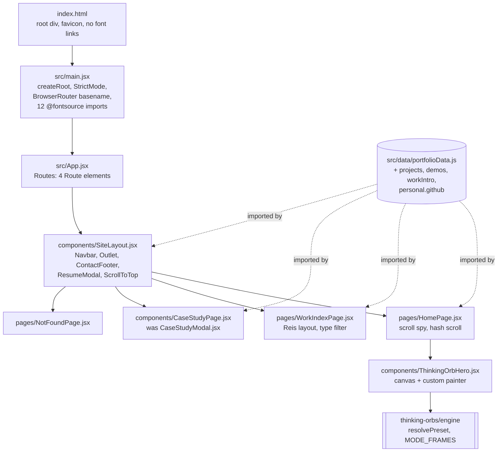

# Spec: Deployed multi-page portfolio on GitHub Pages

Change id: `2026-09-11-deployed-multi-page-portfolio-on-github-pages`
Intent: [intent.md](./intent.md)
Status: G1, G2 and G3 approved (confirmed, `approvals.md`); in Verify, heading to G4 (confirmed,
`conductor-log.md` line 71). Amended during Build and Verify: B2 and B3 dependency amendments
2026-09-12, audit-command alignment 2026-09-13; see the amendment lines below and the dated notes
inline.
Risk tier: 2
Policy skills applied: `wh-agent-rules`, `wh-security-baseline`, `wh-readable-code`, `wh-adr`,
`wh-review-packet`
Written: 2026-09-11 by the spec architect, against the working tree at `main` (clean).
Revised: 2026-09-11 by the spec architect, rework round 1 of 2, answering the G2 constraint
audit. Every finding in [Constraint audit](#constraint-audit) has one line in
[Response to audit](#response-to-audit), which is what the auditor re-checks against. R1 to R79
and M1 to M17 keep their numbers because `evals.md` and the audit table reference them; the ten
requirements added by this revision are R80 to R89.
Amended: 2026-09-12 by the spec architect. A narrow amendment, not a re-spec, recording owner
build decisions B2 and B3 (`conductor-log.md` line 35), landed as commit `a98fdcf`: `react-router`
7.9.4 to 7.18.3 and `vitest` 3.2.4 to 3.2.7 (B2); `tailwindcss` and `@tailwindcss/vite` moved to
`devDependencies` at exact 4.3.3 (B3); [ADR 0009](./adr/0009-accept-dev-only-vite-and-vitest-advisories.md)
added. No requirement is renumbered, and the G2 packet is annotated, not rewritten.
Amended again: 2026-09-12 by the spec architect, after verification at `cf969de` found golden case
GC78 asserting 10 `dependencies` and 10 `devDependencies` against an actual 8 and 12
(`verification.md` line 139). R78 now states the B3 exception and the final section counts; six
passages that described the pre-B3 placement or counts are annotated, not rewritten. No other
requirement changes.
Amended a third time: 2026-09-13 by the spec architect. An editorial amendment that changes no
requirement's SHALL text, acceptance check or Source cell. At `26b5c0e` the main session, acting
under the owner's delegation, confirmed ADR 0009 and set `.workhorse/profile.yml`
`commands.security_audit` to `npm audit --omit=dev --audit-level=high`, the same command as R56
(confirmed, profile line 41 and `conductor-log.md` line 70). Stale wording was corrected to match:
this status line, the dependency audit policy under [Security and privacy](#security-and-privacy),
R49's sentence on existing entries, the [Moved to development](#moved-to-development) preamble,
findings outside scope item 11, Response to audit Low 4, one Low row's resolution cell in
[Constraint audit](#constraint-audit), and one risk-register row. No command was run in this
amendment: the Bash tool is not available in this session either (confirmed by its absence from
the tool list), so every fact cited is from reading the named file.
Amended a fourth time: 2026-09-13 by the spec architect, after the G4 rejection. Adds R91 (Back to
Top on every route) and R92 (mockups out of `public/`). Widens R89 to every full and partial form
of the phone number in every tracked file, this one included, and rewrites R41's and R82's checks
so no check carries the digits. Adds ADRs 0010 to 0012. One quote per rejection note, and what
changed, is under [G4 rejection response](#g4-rejection-response-2026-09-13). No command was
run: the Bash tool is absent in this session too (confirmed by the tool list).

Every factual claim below carries a label. **Confirmed** means this agent read the file or the
tool output named. **Believed, not verified** means it was inferred, reported by an earlier
agent, or could not be checked from this host. No command was run during either the original
phase or this revision: the Bash tool is disabled in both sessions (confirmed by attempting one
call and receiving `No such tool available: Bash`), so every version and licence pin below is
labelled accordingly and R77 makes resolving them a binding build-phase control. The greps this
revision does cite as confirmed were run with the Grep tool, which is available.

---

## Summary

This change turns a single-page, undeployable Vite and React scaffold into a three-route
portfolio published to `https://muhibm1.github.io/Portfolio/` by a GitHub Actions workflow, with
a live `thinking-orbs` hero, self-hosted typefaces, a real `npm test`, and the owner's phone
number removed from the public surface. The one design decision that matters most is that deep
links to `/work/:slug` survive on GitHub Pages by copying the built `dist/index.html` to
`dist/404.html` at build time, with no redirect shim and therefore no `sessionStorage`, which
keeps the project's absolute no-storage position intact. Everything else follows from that
choice plus the design authority in `docs/design-brief.md`.

**On size.** This change is large: 90 requirements across routing, two new page types, a canvas
component, a font migration, a test toolchain, a deploy pipeline, and seven debt items. It is
not separable into independently shippable changes, because nothing here delivers value alone: a
router with no deploy is not a portfolio, and a deploy of today's page misses the point of the
request. So it is specified as one change and built in four sequential waves (see
[Build waves](#build-waves)), which is what `profile.build.max_parallel: 4` and the wave model
exist for. If the owner wants a smaller first increment, the natural cut is waves 1, 2 and 4
(toolchain, routing shell, pipeline) shipping a deployed but visually unchanged site, with wave
3 (hero, work index, case-study page) following. That is stated as an option, not a
recommendation.

---

## Requirements

90 requirements: R1 to R79 from the first draft with their numbers untouched, plus R80 to R90
added by the [Response to audit](#response-to-audit). R91 and R92 were added on 2026-09-13 by the
[G4 rejection response](#g4-rejection-response-2026-09-13), for 92 in total. Every one has an acceptance check a test,
a grep, or a command can implement, except the five that are permanently manual and say so in
their own row (R19, R77, R84, and the design reviews in R22 and R79). `SHALL` is mandatory. The `Source` column traces to `intent.md`
Outcomes (O1 to O14), success metrics (M1 to M17), a gate decision, `docs/design-brief.md`,
`docs/sdlc/constraints.md`, `.workhorse/profile.yml`, or the global security baseline.

**Decision labels carry their gate.** `G1-D1` to `G1-D5` are the five decisions in the G1 packet,
approved and recorded in `approvals.md` ("D1 remove phone; D4 content is mine to publish",
2026-09-11). `G2-D1` to `G2-D5` are the five decisions in section 2 of the G2 packet at the
bottom of this file, which are still open. The first draft wrote both as bare `D1` to `D5`, which
a reader could not resolve against `approvals.md`; every occurrence now carries its prefix.

### A. Routing and page shell

| ID | Requirement | Acceptance check | Source |
|----|-------------|------------------|--------|
| R1 | The app SHALL use `react-router` 7.18.3 in declarative mode, with `BrowserRouter` imported from `react-router` (not `react-router-dom`) and mounted in `src/main.jsx` around `<App />`. | `grep -n "from 'react-router'" src/main.jsx` returns exactly 1 match; `package.json` `dependencies` contains `"react-router": "7.18.3"` with no range prefix. | O2, G1-D3; pin amended 2026-09-12 from 7.9.4 by owner decision B2, commit `a98fdcf` |
| R2 | `BrowserRouter` SHALL receive a `basename` computed from `import.meta.env.BASE_URL` with any trailing slash removed, falling back to `/` when the result is empty. The computation SHALL live in one exported helper so it is testable without a DOM. | Unit test "strips the trailing slash from the Vite base url" asserts the helper maps `/Portfolio/` to `/Portfolio` and `/` to `/`. | O2, O5 |
| R3 | The route table SHALL be exactly four routes: `/` to `HomePage`, `/work` to `WorkIndexPage`, `/work/:slug` to `CaseStudyPage`, `*` to `NotFoundPage`. No other route SHALL exist. | Tests render `/`, `/work`, the three case-study paths and `/work/no-such-study` and assert the expected level-1 heading for each; `grep -c "<Route " src/App.jsx` equals 4. | O2, O3, M5 |
| R4 | All four routes SHALL render inside one shared layout, `src/components/SiteLayout.jsx`, which renders `Navbar`, an `<Outlet />`, `ContactFooter`, and the resume modal. | Test asserts the footer email link is present on `/`, `/work` and `/work/apple-llm-triage`. | O2, codebase-map "patterns to follow" |
| R5 | The resume viewer SHALL stay a modal owned by `SiteLayout` and SHALL NOT become a route. | `grep -rn "ResumeModal" src/` shows an import only in `SiteLayout.jsx`; no `<Route>` path contains `resume`. | ADR 0008 |
| R6 | The case-study modal SHALL be replaced by the `/work/:slug` page. `src/components/CaseStudyModal.jsx` SHALL be renamed to `src/components/CaseStudyPage.jsx`. All four hard-coded occurrences of the literal email address in components SHALL read `personal.email` instead: `CaseStudyModal.jsx` line 298 (`mailto:` href), `Navbar.jsx` line 17 (clipboard argument), `Navbar.jsx` line 87 (visible display text) and `ContactFooter.jsx` line 38 (visible display text). All four confirmed by grep over `src/` during this revision. | `git ls-files` contains no `CaseStudyModal.jsx`; `grep -rn "mmalqaim@gmail.com" src/` matches `src/data/portfolioData.js` and nothing else. | O14, constraints.md debt 8 |
| R7 | On a route change with no hash, the app SHALL scroll the window to the top. | Test navigates `/` to `/work` and asserts `window.scrollTo` was called with `(0, 0)`. | O2 |
| R8 | `HomePage` SHALL scroll to the element named by `location.hash` on mount and on hash change, smoothly unless `prefers-reduced-motion: reduce` matches, in which case instantly. | Test renders `/#simulator` and asserts `scrollIntoView` was called on the element with `id="simulator"`. | O4, design-brief 3 |
| R9 | The scroll spy that highlights the active navbar link SHALL move from `App` (today `src/App.jsx` lines 20 to 40) into `HomePage` and SHALL run only on `/`. | Test renders `/work` with a spy on `window.addEventListener` and asserts no `scroll` listener is registered by the page. | codebase-map "state and interaction patterns" |
| R10 | The navbar SHALL show a `Work` link to `/work` on every route, and the home section anchors only when the path is `/`. | Test asserts `getByRole('link', { name: /work/i })` exists on `/work`, and that no link with `href` `#philosophy` exists on `/work`. | O2 |

### B. Base path and deep links

| ID | Requirement | Acceptance check | Source |
|----|-------------|------------------|--------|
| R11 | `vite.config.js` SHALL set `base: "/Portfolio/"`. | `npm run build` exit 0; `grep -c 'src="/Portfolio/' dist/index.html` is at least 1 and `grep -c '"/assets/' dist/index.html` is 0. | O1, M2, G1-D3 |
| R12 | The build SHALL write `dist/404.html` as a byte-identical copy of the final `dist/index.html`, produced by a `closeBundle` step declared inline in `vite.config.js` using `node:fs` only, with no new dependency and no shell. | After `npm run build`, `dist/404.html` exists and its SHA-256 equals that of `dist/index.html`. | O5, M7 |
| R13 | Deep-link recovery SHALL NOT use `sessionStorage`, `localStorage`, `document.cookie`, or a query-string redirect shim. | The full no-tracking grep over `src/` and `index.html` for `fetch(\|XMLHttpRequest\|axios\|localStorage\|sessionStorage\|document.cookie\|gtag\|analytics\|dataLayer` returns 0 matches. This is the discovery analyst's original pattern, restored: see the note under [The no-tracking grep](#the-no-tracking-grep). | M10, profile `style_notes`, ADR 0002 |
| R14 | `index.html` SHALL declare the favicon that already exists at `public/favicon.svg`, referenced as `%BASE_URL%favicon.svg` so it survives the base rewrite. | `dist/index.html` contains `/Portfolio/favicon.svg`. | scope addition, see note under [Scope additions](#scope-additions) |

### C. The `/work` index

| ID | Requirement | Acceptance check | Source |
|----|-------------|------------------|--------|
| R15 | `/work` SHALL list exactly three case studies, three projects and one live demo, grouped into three regions labelled "Case studies", "Projects" and "Live demo". | RTL test counts `getAllByRole('article')` inside each region: 3, 3 and 1. | O4, M6 |
| R16 | The three project entries SHALL be `workhorse`, `Shu` and `wasl`, sourced from a new `projects` array in `src/data/portfolioData.js`. No fourth project SHALL appear. | Test asserts the three names render and that `portfolioData.projects.length === 3`. | O4, design-brief 3 |
| R17 | The one live-demo entry SHALL be the interactive triage simulator, sourced from a new `demos` array, linking to `/#simulator`. | Test asserts the entry's link `href` ends with `/#simulator`. | O4 |
| R18 | `src/data/portfolioData.js` SHALL be extended with the keys `projects`, `demos`, `workIntro`, `personal.github` and `personal.githubHandle`, and with nothing else. No existing key, string or number SHALL change, except the deletion in R41. | `git diff src/data/portfolioData.js` reviewed at G4, plus a unit test asserting the four `telemetry` metric strings, the three `caseStudies` ids and the three `caseStudies` titles verbatim. | O9, M17, CLAUDE.md "Protected" |
| R19 | `/work` SHALL follow the Jakub Reis layout recorded in `docs/design-brief.md` lines 44 to 49: 1200 px max width, a two-column asymmetric grid with staggered row offsets, 80 px between entries, weights 300 and 400 only, 0 px radius, no shadows, no borders, no buttons, `~` as the only separator, email top left and social links top right. | Design review at G4 against `docs/design-brief.md` lines 44 to 49. **Permanently manual**, not an open item: max width, grid stagger and tracked-out type are computed-style and layout properties, jsdom has no layout engine and no fonts, and the profile has no `e2e` command by design (Playwright was considered and rejected on cost, see [Alternatives considered](#alternatives-considered)). This ceiling is recorded so no later phase reads the manual marker as an eval gap. | O8, design-brief |
| R20 | `/work` SHALL offer a type filter with the values All, Case study, Project and Live demo, defaulting to All, rendered as text links rather than buttons so it does not violate R19. | Test asserts 7 articles at default and 3 articles after activating "Project". | design-brief 3 |

### D. The `/work/:slug` case-study page

| ID | Requirement | Acceptance check | Source |
|----|-------------|------------------|--------|
| R21 | `/work/:slug` SHALL resolve for `apple-llm-triage`, `apple-data-health` and `neural-newsletters-llm`, and SHALL render `NotFoundPage` for any other slug. | Four tests, one per slug plus one unknown slug. | O3, M5 |
| R22 | The page SHALL be laid out per `public/mockup-casestudy.jpg`: eyebrow line, large uppercase display title, a row of four tab chips, a flow diagram on the left, a stacked metric column on the right headed "Key enterprise metrics", then tech stack, then previous and next links. | Test asserts the four chip labels and both column headings; visual review at G4 against the mockup. | O3, design-brief 3 |
| R23 | The four tabs SHALL be Challenge, System Architecture, Production Deployment and Measured Impact, sourced only from existing data: `challenge`, `diagramSteps`, `solution` with `techStack`, and `impact` respectively. No new prose SHALL be written into any case study. | Test asserts each tab body's text is a substring of the matching field in `portfolioData`. | O3, O9, constraints.md business constraint 1 |
| R24 | The flow diagram SHALL be generated from `diagramSteps` for any array length, not hard-coded to one case study. | Test renders all three case studies and asserts the rendered node count equals `diagramSteps.length` for each. | O3 |
| R25 | Previous and next links SHALL wrap around the `caseStudies` order. | Test asserts that on the last case study the next link points at the first. | design-brief 3 |
| R26 | The mockup's "Log in" and "Sign up" controls SHALL NOT be built. They are reference-template chrome; this site has no accounts. | Test asserts no element with an accessible name matching `/log ?in\|sign ?up/i` exists on any route. | codebase-map "Validation, errors, auth, logging" |

### E. Hero and the orb

| ID | Requirement | Acceptance check | Source |
|----|-------------|------------------|--------|
| R27 | The hero SHALL match `public/mockup-home.jpg`: stacked uppercase name on two lines, the role line, the availability pill, the telemetry strip, and the orb on the right where the monogram is today. All four `telemetry` entries SHALL render; the mockup shows three because of its crop, and dropping one would delete a factual claim. | Test asserts the heading text, the pill text, all four telemetry metric strings, and the orb's presence. | O6, O9 |
| R28 | `src/components/MmLogo.jsx` SHALL be deleted once the orb replaces it and nothing imports it. Git history retains it. | `git ls-files` contains no `MmLogo.jsx`; `grep -rn "MmLogo" src/` returns nothing. | O6 |
| R29 | A new `src/components/ThinkingOrbHero.jsx` SHALL render one `<canvas role="img">` whose geometry comes from `thinking-orbs/engine` using exactly two exports, `resolvePreset` and `MODE_FRAMES`, resolved as `resolvePreset('working', 64)` and painted through `MODE_FRAMES[mode](size, t, opts)`. The package's `paint`, `paintFrame`, `paintLines` and its `ThinkingOrb` component SHALL NOT be used. | `grep -n "thinking-orbs" src/components/ThinkingOrbHero.jsx` shows one import from `thinking-orbs/engine` naming only those two symbols. | O7, design-brief 2 |
| R30 | The painter SHALL colour each dot by its depth across the stops `#facb0e`, `#f06ba8`, `#78bae6` and `#ffffff`, which are the OFF+BRAND gradient in `docs/design-brief.md` line 34 and the `--accent-amber`, `--accent-rose`, `--accent-blue` tokens in `src/index.css` lines 13 to 15, with no canvas shadow. The interpolation SHALL be a small exported pure function, `colourForDepth(z)`, taking `z` in [-1, 1] and returning a CSS colour string, so the mapping is testable without a canvas. | Unit test "maps the near, middle and far depths onto the brand stops" calls `colourForDepth` at `z = -1`, `0` and `1` and asserts the exact returned strings, plus design review at G4 against `public/mockup-home.jpg`. A grep alone cannot tell the four stops apart, which is why the pure function is required. | O7, O8, design-brief |
| R31 | The canvas CSS width SHALL be `Math.min(420, Math.max(280, viewportWidth - 48))` and SHALL be set as an inline style so it is readable without layout. That is 420 px at viewport widths of 468 px and above, `viewportWidth - 48` between 328 px and 468 px, and 280 px below that. The clamp SHALL be a small exported pure function, `canvasWidthForViewport(viewportWidth)`. | Unit test calls the helper at 1440, 1024, 700, 468 and 320 and asserts 420, 420, 420, 420 and 280; a render test asserts `canvas.style.width === '420px'` under the jsdom default viewport, which satisfies M11's 380 to 440 band. | O7, M11 |
| R32 | Under `prefers-reduced-motion: reduce` the component SHALL paint exactly one frame at `t = 0.6` and SHALL NOT call `requestAnimationFrame` at all. | Test with a mocked `matchMedia` asserts the `requestAnimationFrame` call count is 0. | O7, M12 |
| R33 | The component SHALL pause its loop when the canvas is not intersecting the viewport and when `document.visibilityState` is `hidden`, resume on both, and feature-detect `IntersectionObserver`, running unpaused when it is absent. | Test with a stubbed `IntersectionObserver` asserts `cancelAnimationFrame` is called when the entry reports `isIntersecting: false`. | O7 |
| R34 | The effect SHALL cancel its animation frame, disconnect its observer, and remove its `visibilitychange` and `matchMedia` listeners on unmount. | Test unmounts and asserts both `cancelAnimationFrame` and `disconnect` were called. | O7, constraints.md debt 10 |
| R35 | The component SHALL return without painting when `getContext('2d')` returns `null`, so it renders in a DOM environment with no canvas implementation. | All orb tests run under jsdom and none throws. | R49, ADR 0003 |
| R36 | The backing store SHALL be `size * min(2, devicePixelRatio || 1)` in each dimension, with the context transform set to that ratio before each clear and paint. | Test asserts `canvas.width === 840` when `devicePixelRatio` is stubbed to 2. | design-brief 2 |

### F. Fonts and design tokens

| ID | Requirement | Acceptance check | Source |
|----|-------------|------------------|--------|
| R37 | `index.html` lines 8 to 10 SHALL be deleted. | `grep -rc "fonts.googleapis.com\|fonts.gstatic.com" index.html dist/` returns 0 everywhere, and the deployed smoke check in R82 re-asserts it on the served HTML. | O11, M9, G1-D2 |
| R38 | Inter, JetBrains Mono and Space Grotesk SHALL be self-hosted from `@fontsource/inter`, `@fontsource/jetbrains-mono` and `@fontsource/space-grotesk`, weights 400, 500, 600 and 700 for each, imported in `src/main.jsx` above `./index.css`. Weight 300 and the italic face SHALL NOT be imported, because `grep -rn "font-light\|font-thin\|font-extralight\|italic" src/` returns no matches today (confirmed). | `grep -c "@fontsource" src/main.jsx` equals 12; `dist/assets/` contains at least 12 `.woff2` files. | O11, M9, G1-D2 |
| R39 | `src/index.css` SHALL declare `--font-sans`, `--font-mono` and `--font-display` in a Tailwind `@theme` block naming the three self-hosted families, and the hard-coded system stack at `src/index.css` line 22 SHALL be removed, so Inter is actually applied. Today it is loaded and never used (confirmed by reading `src/index.css` line 22 against `src/App.jsx` line 50). | The built CSS contains `font-family:Inter` and the body rule no longer contains `-apple-system`. | O8, O11, design-brief 31 to 40 |
| R40 | `src/index.css` SHALL add a `@media (prefers-reduced-motion: reduce)` block neutralising animation duration, iteration count, transition duration and `scroll-behavior` site-wide, so the promise in R32 is not orb-only. | The built CSS contains `prefers-reduced-motion`. | O7, security baseline "defaults" |

### G. Personal data

| ID | Requirement | Acceptance check | Source |
|----|-------------|------------------|--------|
| R41 | The phone number SHALL be removed from `src/data/portfolioData.js` line 8, `src/components/ContactFooter.jsx` lines 68 to 73, and `src/components/ResumeModal.jsx` lines 10 and 69. `personal.phone` SHALL be deleted, not blanked, so no component can silently render an empty field. The now-unused `Phone` icon SHALL also be dropped from the `lucide-react` import lists at `ContactFooter.jsx` line 2 and `ResumeModal.jsx` line 2 (both confirmed present by reading the lines during this revision), because oxlint may fail the build job on an unused import and block the deploy for a reason this requirement did not intend. | After `npm run build`, `node scripts/check-phone-redaction.mjs dist` exits 0. That script scans every tracked file, `src/` included, plus the named `dist/` directory; R89 defines it. The unit test "publishes no phone number" in `src/data/portfolioData.test.js` passes; `grep -rn "personal.phone" src/` returns 0 matches; `grep -rn "Phone" src/` returns 0 matches. **Amended 2026-09-13 (G4-D3):** the first check grepped for the number's literal digits. It now names the R89 script, so no check carries the digits; the property checked is unchanged. | O10, M8, G1-D1, G4-D3 |
| R42 | Email and LinkedIn SHALL remain reachable on every route. | Test asserts a `mailto:` link and a LinkedIn link on `/`, `/work` and a case-study page. | O10, G1-D1, constraints.md "must not change" |
| R43 | `personal.github` and `personal.githubHandle` SHALL be added and used for the three project links and for the `/work` header social links. | Test asserts the three project links point at `https://github.com/muhibm1/<name>`. | O4, OQ4 |
| R44 | No analytics, cookie, storage call, tracking pixel, embedded widget, third-party script or new outbound runtime call SHALL be introduced anywhere. | The full no-tracking grep, `grep -rn "fetch(\|XMLHttpRequest\|axios\|localStorage\|sessionStorage\|document.cookie\|gtag\|analytics\|dataLayer" src index.html`, returns 0 matches, exit 1. This is the pattern at `docs/sdlc/constraints.md` line 208 and in the G0 evidence table, verbatim (confirmed by reading line 208 during this revision). If a test file ever legitimately needs one of these tokens, the exception is recorded in this spec rather than the pattern narrowed. | M10, profile `style_notes`, constraints.md "must not change" |

### H. The simulator

| ID | Requirement | Acceptance check | Source |
|----|-------------|------------------|--------|
| R45 | `InteractiveTriageSimulator` SHALL show a visible label naming its data as an illustrative example with fictional data, placed next to the scenario list and again on the payload inspector, not only as a page footnote. | Test asserts visible text matching `/illustrative example/i` and `/fictional/i`. | M16, G1-D5, constraints.md compliance |
| R46 | The three `setTimeout` calls in `src/components/InteractiveTriageSimulator.jsx` at lines 75, 79 and 83 SHALL be tracked and cleared on reset and on unmount. | Fake-timer test asserts `vi.getTimerCount()` is 0 after unmounting mid-run. | constraints.md debt 10, intent risk signals |
| R47 | The copy-confirmation timers at `src/components/Navbar.jsx` line 19, `src/components/ContactFooter.jsx` line 12 **and `src/components/ResumeModal.jsx` line 12** SHALL also be cleared on unmount. All three confirmed by grep over `src/` during this revision; the `ResumeModal` one was missed by the first draft and matters most, because `ResumeModal` is conditionally rendered and therefore unmounts on every close. | One test per component, three in total, same pattern as R46: `vi.getTimerCount()` is 0 after unmounting with the confirmation pending. | see [Correction to a carried finding](#correction-to-a-carried-finding) |
| R48 | The three `navigator.clipboard.writeText` calls (`Navbar.jsx` line 17, `ContactFooter.jsx` line 10, `ResumeModal.jsx` line 10) SHALL handle rejection by surfacing a failed state instead of reporting success. | Test rejects the clipboard promise and asserts the button does not display "Copied", one per component. | constraints.md debt 11 ("clipboard catch"), which `intent.md` names in its non-goals sentence, so this requirement is **subject to G2-D2** and is deleted if G2-D2 is declined; security baseline "no silent consequential failure" |

### I. Test toolchain

| ID | Requirement | Acceptance check | Source |
|----|-------------|------------------|--------|
| R49 | `vitest`, `@testing-library/react`, `@testing-library/dom`, `@testing-library/jest-dom` and `jsdom` SHALL be added as exact-pinned devDependencies at the versions in the [Dependency table](#dependency-table). **Every package this change adds SHALL be pinned to an exact version, in `dependencies` and in `devDependencies` alike**: that is the four runtime packages `react-router`, `@fontsource/inter`, `@fontsource/jetbrains-mono`, `@fontsource/space-grotesk` and the five devDependencies above, nine in total. No added package SHALL carry `^`, `~`, `>=`, `<`, `*`, `x`, a tag such as `latest`, or a URL or git specifier. Existing entries keep their ranges, except `tailwindcss` and `@tailwindcss/vite`, which owner decision B3 pinned exact at 4.3.3 when it moved them to `devDependencies` (R78, [Moved to development](#moved-to-development)); R86 governs the drift the remaining ranges cause. **Amended 2026-09-13**, a factual correction only: this sentence first said every existing entry keeps its range, which B3 made untrue. The nine-package set and both greps are unchanged, and neither grep names a Tailwind package. | Two greps over `package.json`. First, `grep -c "\"\(react-router\|@fontsource/inter\|@fontsource/jetbrains-mono\|@fontsource/space-grotesk\|vitest\|@testing-library/react\|@testing-library/dom\|@testing-library/jest-dom\|jsdom\)\": \"[0-9]"` equals 9. Second, the same package alternation followed by `": "[\^~><*x]` or `": "latest` returns 0 matches. R85 runs both in CI on every push, so the pin cannot rot after G4. | O12, G1-D3, profile `style_notes`, security baseline "New third-party import in a runtime path pinned to an exact version" |
| R50 | `vite.config.js` SHALL carry a `test` block with `environment: 'jsdom'`, `globals: true`, `setupFiles: ['./src/test/setup.js']`, `css: false`, `include: ['src/**/*.test.{js,jsx}']` and `restoreMocks: true`. | `npm test` exit 0 and `npm run build` exit 0, proving Vite 5 accepts the extra top-level key. | O12 |
| R51 | `package.json` SHALL define `"test": "vitest run"` and `"test:watch": "vitest"`, both runnable on Windows PowerShell with no shell builtin, no POSIX path and no `&&`. | `npm test` exits 0 on the Windows host. | O12, constraints.md technical constraint 4 |
| R52 | The suite SHALL report at least 12 passing tests and 0 skipped tests, and **the build job SHALL enforce that floor rather than leave it to a human reading a summary line**. The workflow's test step SHALL run `npm test -- --reporter=json --outputFile=vitest-results.json`, and the step after it SHALL fail the run unless `numPassedTests` is at least 12 and `numPendingTests` plus `numTodoTests` plus `numFailedTests` is 0, using `node -e` with no new dependency. The failure message SHALL name the observed counts. | `grep -c "numPassedTests" .github/workflows/deploy.yml` is at least 1; the first workflow run's log shows the observed counts. The floor stays at 12 because `evals.md` is written against that number. | M4, security baseline "CI must actually run the security tests" and "assert a non-zero test count" |
| R53 | `.workhorse/profile.yml` SHALL set `commands.test` to `npm test` and `commands.test_file` to `npm test --`. | Read the file at G4. | O12, G1-D3 |
| R54 | `src/test/setup.js` SHALL import `@testing-library/jest-dom/vitest` and install stubs for `matchMedia` (defaulting to not matching), `IntersectionObserver`, and `HTMLCanvasElement.prototype.getContext` (returning `null`), restored between tests. | The suite passes with no unhandled jsdom "not implemented" output. | R32, R33, R35 |

### J. Deploy pipeline

| ID | Requirement | Acceptance check | Source |
|----|-------------|------------------|--------|
| R55 | Exactly one workflow file SHALL exist, `.github/workflows/deploy.yml`, triggered on `push` to `main` and **on nothing else**. `workflow_dispatch` SHALL NOT be declared, because it is a second production-publish path that is agent-reachable behind a prompt (`gh workflow run` is in profile `ask_commands`, confirmed at `.workhorse/profile.yml` line 96) while `git push origin main` is denied to agents outright. Re-running a failed deployment stays possible from the Actions UI, which is the owner's own session and re-runs the same commit rather than publishing a new one. | `ls .github/workflows` has one entry; `grep -c "workflow_dispatch\|pull_request" .github/workflows/deploy.yml` is 0; `grep -A3 "^on:"` shows `push` with `branches: [main]` only. Full YAML validity is confirmed by GitHub's own parser on the first run, not by this repository: see [YAML validity](#yaml-validity). | O1, M13 |
| R56 | The build job SHALL run, in order, `npm ci`, `npm run lint`, `npm test`, `npm run build`, then `npm audit --audit-level=high --omit=dev`. A non-zero exit from any of them SHALL stop the deploy. | Read the file; first workflow run exit codes. | M14, security baseline "minimum CI" |
| R57 | A second, non-blocking `npm audit --audit-level=high` over the full tree SHALL run with `continue-on-error: true`, so dev-only advisories are visible without blocking a portfolio deploy. | Read the file. | see [Security and privacy](#security-and-privacy) |
| R58 | Publication SHALL use the official flow: `actions/configure-pages`, `actions/upload-pages-artifact` with `path: dist`, and `actions/deploy-pages`, in a two-job build-then-deploy shape with the deploy job bound to the `github-pages` environment. | Read the file. | O1, ADR 0005 |
| R59 | Every `uses:` line SHALL be pinned to a full 40-character commit SHA with the human-readable tag in a trailing comment. | `grep -c "uses: .*@[0-9a-f]\{40\}" .github/workflows/deploy.yml` equals the count of `uses:` lines. | security baseline "pinned to an exact version" |
| R60 | Token scope SHALL be least-privilege **per job**, not workflow-wide. Workflow level SHALL declare `permissions: contents: read` only. The build job SHALL declare `contents: read` and `pages: read`, and SHALL call `actions/configure-pages` with `enablement: false`. The deploy job SHALL declare `pages: write` and `id-token: write`, and nothing else. No job SHALL hold a write scope it does not use, and `write-all` SHALL not appear. The reason: the build job runs `npm ci` over a fully regenerated tree with lifecycle scripts enabled, plus four third-party actions, and `pages: write` with `id-token: write` are exactly the two scopes that publish the site. | `grep -n -A4 "permissions:" .github/workflows/deploy.yml` shows three blocks in that shape; `grep -c "write-all" ` is 0; `grep -c "id-token: write" ` is 1 and it sits inside the deploy job. | security baseline "least privilege", ADR 0005 |
| R61 | `concurrency` SHALL be `group: pages` with `cancel-in-progress: false`, so two pushes deploy in order rather than interleaving. | `grep -c "group: pages" .github/workflows/deploy.yml` is 1 and `grep -c "cancel-in-progress: false" .github/workflows/deploy.yml` is 1. | O1 |
| R62 | `actions/setup-node` SHALL pin `node-version: 22` and enable the npm cache. | Read the file. | see [Node version](#node-version) |
| R63 | After deploy, a smoke step SHALL fetch `${{ steps.deployment.outputs.page_url }}` with `curl` and fail unless the HTTP status is 200, retrying up to 5 times at 10 second intervals to absorb Pages propagation lag. The fetched body SHALL be saved to a file for R80 to R82 to assert against. **The "body contains the owner's name" assertion of the first draft is removed**: `index.html` line 6 is the `<title>` and line 7 the `description` meta, both containing the owner's name (confirmed by reading the file), so that assertion passes on an un-executed shell and proved nothing. | First workflow run: the step's exit code, and the saved body in the run log. | [Observability](#observability), audit High finding 1 |
| R64 | The workflow SHALL reference no secret of any kind. | `grep -c "secrets\." .github/workflows/deploy.yml` is 0. | profile: no secrets exist |
| R80 | The smoke step SHALL parse every `src=` and `href=` asset reference out of the fetched body, fail unless each begins `/Portfolio/`, then fetch the module script URL and the stylesheet URL and fail unless each returns 200 with a `content-type` naming JavaScript and CSS respectively. It SHALL then fetch the first `.woff2` URL referenced by the fetched stylesheet and fail unless that returns 200. This is the assertion that detects a wrong `base`, a missing asset and a font file that 404s. | First workflow run; the step logs each URL and status. | audit High finding 1, M2, M9 |
| R81 | The smoke step SHALL fetch `<page_url>work/apple-llm-triage` and fail unless the returned body is byte-identical to the body fetched in R63. The HTTP status of that request is 404 by design (see [Routing](#routing)) and SHALL NOT be asserted as 200. This is the assertion that detects a missing or stale `dist/404.html`. | First workflow run; the step compares SHA-256 digests of the two bodies. | audit High finding 1, M7, O5 |
| R82 | The smoke step SHALL assert, against the body fetched in R63: exactly one `Content-Security-Policy` meta tag; exactly one `name="referrer"` meta tag; zero `<script` elements without a `src` attribute; zero occurrences of `fonts.googleapis.com` or `fonts.gstatic.com`; and zero matches of the generic phone-number pattern that `src/data/portfolioData.test.js` line 50 defines, which fits any North American number and is not built from the owner's digits, in both the fetched HTML body and the module script fetched under R80. Any failure fails the run. This is the assertion that detects a dropped CSP injection, an inline script that `script-src 'self'` would block, and a regression on either privacy removal, on the artifact that visitors actually receive rather than on the one the build produced locally. **Amended 2026-09-13 (G4-D3):** the phone half first named the owner's last seven digits and read only the HTML body, which never held the number (constraint audit Medium on R82). It now names the generic pattern and also reads the module script, where `portfolioData.js` ships. That matches `.github/workflows/deploy.yml` lines 300 to 310 as built (confirmed by reading those lines). | First workflow run; each assertion logs its own pass or fail line. | audit High finding 1, R65, R66, R88, M8, M9, G4-D3 |
| R83 | The smoke step SHALL be blocking: no `continue-on-error`, and a failure SHALL fail the workflow run. Each assertion SHALL fail with a message naming which assertion failed and the URL fetched, so the run log alone is enough to diagnose. The smoke step SHALL NOT claim to verify that the application mounted; see [Observability](#observability) for what it cannot prove and who owns that gap. | `grep -c "continue-on-error" .github/workflows/deploy.yml` is 1, and that single occurrence is on the informational audit step required by R57, not on any smoke step. | audit High finding 1, security baseline "no failure path both silent and consequential" |
| R85 | The build job SHALL run a dependency-pin check before `npm ci` that fails the run when any of the nine packages named in R49 carries a range specifier, a tag, a URL or a git specifier in `package.json`. It SHALL be a `node -e` step reading `package.json`, with no new dependency, and SHALL name the offending package and specifier in its failure message. | `grep -c "pin check\|assertExactPins" .github/workflows/deploy.yml` is at least 1; the first workflow run's log shows the nine packages and their resolved specifiers. | audit High finding 2, security baseline pre-ship checklist |
| R87 | The smoke step SHALL fetch the response headers of the published URL (`curl -sSI`) and print them to the run log, so which security headers GitHub Pages sets on its own is settled with evidence at the first deploy instead of being asserted here. The owner SHALL copy the observed header list into `docs/hosted-config.md` (R69) after the first successful run. The step SHALL NOT fail on a missing header, because this project cannot set one. | First workflow run log contains the header dump; `docs/hosted-config.md` contains the copied list after the first deploy. | audit Medium finding 5, security baseline "defaults from the first week" |

### K. Security baseline defaults

| ID | Requirement | Acceptance check | Source |
|----|-------------|------------------|--------|
| R65 | A build-only Vite `transformIndexHtml` step declared in `vite.config.js` SHALL insert a `Content-Security-Policy` meta tag as the first element inside `<head>` of the built HTML, with the policy in [Security and privacy](#security-and-privacy). The source `index.html` SHALL NOT carry it, so `npm run dev` is unaffected. The same step injects the `Referrer-Policy` meta required by R88. | `grep -c "Content-Security-Policy" dist/index.html dist/404.html` is 1 in each; the same grep on the source `index.html` is 0; R82 re-asserts it on the served page. | security baseline "defaults from the first week", ADR 0006, G2-D2 |
| R66 | `dist/index.html` SHALL contain no inline `<script>` without a `src` attribute, so `script-src 'self'` does not break the page. If one appears, the remedy SHALL be `build.modulePreload.polyfill: false`. **Adding the script's SHA-256 to `script-src` is explicitly not permitted**: the hash stops matching on any Vite patch bump, the symptom is a blank page in production only, Dependabot (R68) will propose exactly such bumps, and nothing would re-check it. If disabling the polyfill does not clear the inline script, the builder escalates to the owner rather than reaching for a hash. | Grep `dist/index.html` and `dist/404.html` for `<script` not followed by `src=`, expecting 0; `grep -c "sha256-" dist/index.html` is 0. R82 re-runs the same assertion against the served page on every deploy, so a future regression fails the run instead of a visitor's browser. | R65, audit Low finding 7 |
| R67 | `public/.well-known/security.txt` SHALL exist with `Contact`, `Expires` (one year from the build date), `Preferred-Languages` and `Canonical` fields. | `dist/.well-known/security.txt` exists and contains all four field names. | security baseline, constraints.md "one that does" |
| R68 | `.github/dependabot.yml` SHALL exist with weekly `npm` and `github-actions` ecosystems and `open-pull-requests-limit: 5`. | `grep -c "package-ecosystem" .github/dependabot.yml` is 2, one `npm` and one `github-actions`; `grep -c "open-pull-requests-limit: 5"` is 1; `grep -c "interval: \"weekly\"\|interval: weekly"` is 2. Full YAML validity is confirmed by Dependabot's first scheduled run, not by this repository: see [YAML validity](#yaml-validity). | security baseline, constraints.md "one that does" |
| R69 | `docs/hosted-config.md` SHALL exist and record every setting that lives only in the GitHub dashboard: Pages source set to "GitHub Actions"; repository visibility; which branch protections are enabled on `main` and which are deliberately not, with the reason (see [Branch protection](#deploy-pipeline)); the absence of any Actions secret; the response headers GitHub Pages sets, copied from the first run under R87; the dated post-deploy manual check log under R84; and the accepted position on the phone number in git history under R89. **This requirement is unconditional and is not part of G2-D2**, unlike R65, R67, R68 and R88: the first deploy fails without the Pages source setting, and the risk register rates that failure Likely. Bundling deploy documentation into a rejectable security-defaults decision would let one owner "no" delete a control the deploy itself needs. | File exists and names all seven items. | security baseline "config that lives only in a vendor dashboard", audit Medium finding 9 |

### L. Cleanup and toolchain repair

| ID | Requirement | Acceptance check | Source |
|----|-------------|------------------|--------|
| R70 | `@rolldown/binding-win32-x64-msvc` SHALL be removed from `dependencies`. | `grep -c rolldown package.json` is 0. | constraints.md technical constraint 8, M14 |
| R71 | `node_modules` and `package-lock.json` SHALL be deleted and regenerated in one owner-approved `npm install`, and the regenerated `package-lock.json` SHALL be committed. Regeneration re-resolves every existing caret range and the whole transitive tree, which `git diff package.json` cannot see; R86 is the review that covers it. | `npm run lint` exits 0 afterwards, and R86's before-and-after table exists in the G4 evidence. | O13, M3, constraints.md technical constraint 5 |
| R72 | `generate_viewer.cjs` SHALL be removed from the repository with `git rm`. | `git ls-files` has no match for `generate_viewer`. | O14, M15 |
| R73 | `.gitignore` SHALL contain the pattern `.env*`, not an enumeration of filenames. | `grep -c "^\.env\*" .gitignore` is 1, and `git ls-files` shows no tracked env file. | O14, M15, security baseline |

### M. Non-functional and platform

| ID | Requirement | Acceptance check | Source |
|----|-------------|------------------|--------|
| R74 | `npm run build` SHALL exit 0 on the Windows dev host and on `ubuntu-latest`. | Run it in both places. | M1 |
| R75 | No `package.json` script SHALL use a shell builtin, a POSIX-only path separator, or `&&`. | Read `scripts`. | constraints.md technical constraint 4, profile `build` |
| R76 | `.workhorse/profile.yml` SHALL keep `build.max_parallel: 4`, and no wave in [Build waves](#build-waves) SHALL contain a group of tasks that requires more than 4 workers running at once. The requirement is about the configured value and the wave shape, both of which are artifacts; it is deliberately not a claim about what the conductor did at run time, which no file records. | `grep -c "max_parallel: 4" .workhorse/profile.yml` is 1, and the wave table names 4 waves each of which is file-disjoint within itself. | profile `build.max_parallel`, eval note 2 |
| R77 | Before installing, the builder SHALL resolve each added package's current version and read the `license` field from the installed `node_modules/<pkg>/package.json`, and SHALL record both in the G4 evidence table. Any pin in the [Dependency table](#dependency-table) that does not resolve, **or that resolves to a version other than the one written there**, SHALL be escalated to the owner and recorded, never silently bumped. That applies to the three `@fontsource` packages exactly as it applies to the other six; the first draft's carve-out for them is withdrawn. | G4 evidence table has one row per added package with a resolved version and a licence read from disk, plus an explicit line for any package where the resolved version differs from the table. **This check is permanently manual and that is accepted, not a gap**: reading a licence field requires an owner-approved `npm install` first (`npm install` is in profile `ask_commands`), and the evidence table is authored and reviewed by people. Owner: build phase, reviewed by the site owner at G4. | profile `style_notes`, `wh-agent-rules`, eval note 3, audit Medium finding 11 |
| R78 | Exactly 4 runtime dependencies and 5 devDependencies SHALL be added, and exactly 1 runtime dependency removed. No other dependency change SHALL occur in `package.json`, except one owner-approved move: `tailwindcss` and `@tailwindcss/vite` SHALL sit in `devDependencies`, moved from `dependencies` with their resolved version unchanged at 4.3.3 (owner decision B3, see [Moved to development](#moved-to-development)). `package.json` SHALL therefore end with exactly 8 `dependencies` and 12 `devDependencies`, and SHALL NOT contain `@rolldown/binding-win32-x64-msvc`. Lockfile-level drift is out of this requirement's reach and is governed by R86. **Amended 2026-09-12**: the B3 exception and the final counts were added because the verifier found GC78 asserting 10 and 10 against an actual 8 and 12 at `cf969de` (`verification.md` line 139); the added and removed bounds are unchanged. | A `node -e` check over `package.json` (GC78) exits 0 only when `dependencies` has 8 keys, `devDependencies` has 12 keys, `@rolldown/binding-win32-x64-msvc` is not a key of `dependencies`, and `tailwindcss` and `@tailwindcss/vite` are both keys of `devDependencies`; R70's `grep -c rolldown package.json` covers the whole file. Plus `git diff package.json` reviewed at G4, R49's two greps for the pin shape and R85's CI check. | profile `style_notes`; owner decision B3 (`conductor-log.md` line 35) |

### N. Visual style

| ID | Requirement | Acceptance check | Source |
|----|-------------|------------------|--------|
| R79 | Every surface SHALL follow the OFF+BRAND treatment in `docs/design-brief.md` lines 31 to 42: the parchment, ink, paper, ash and stone palette; zero shadows; 0 px radius on cards and 10 px on interactive elements; one chromatic element only, which is the orb. The home case-study cards SHALL follow the Varick pattern recorded in `docs/design-brief.md` lines 25 to 29: title, context paragraph, capability bullets, and a link to the dedicated page. This requirement is subject to G2-D4, the radius and shadow conflict between the brief and the mockups. | Design review at G4 against `docs/design-brief.md` lines 25 to 42, plus a grep showing `shadow-` classes removed from `src/components/` if G2-D4 resolves in favour of the brief. | O8, design-brief |

### O. Added by the response to the G2 constraint audit

R80 to R83, R85 and R87 sit with the deploy pipeline in section J because that is where they run.
The five below have no other home. All ten are new; R1 to R79 keep their original numbers.

| ID | Requirement | Acceptance check | Source |
|----|-------------|------------------|--------|
| R84 | `docs/hosted-config.md` SHALL carry a "Post-deploy manual check" section listing the four things no step this project can run is able to prove, and the owner SHALL work through it and append a dated line after the first deploy and after any later change to `vite.config.js`, `index.html` or `package.json`. The four: the home page renders content inside `#root` in a real browser; the orb animates and stops when the tab is hidden; a deep link pasted into a fresh tab renders the case study; the browser console shows no CSP violation and no uncaught error. | The section exists with the four items; after the first deploy the file carries at least one dated line. Owner: site owner. This is a manual control by necessity, not by preference: there is no browser in CI and adding one (Playwright) was rejected on cost in [Alternatives considered](#alternatives-considered). | audit High finding 1, [Observability](#observability) |
| R86 | Before committing the regenerated `package-lock.json` (R71), the builder SHALL record the resolved version of every direct dependency from the pre-existing lockfile and from the regenerated one, and SHALL put both columns in the G4 evidence table. Any direct dependency whose **major** version moved SHALL be escalated to the owner before the commit, never merged silently. The transitive tree is not reviewed entry by entry; that residue is an accepted risk with a named owner in the [Risk register](#5-risk-register). | G4 evidence table contains a before-and-after row for each of the 11 direct dependencies, with a stated verdict on every row that moved. | audit Medium finding 4, security baseline supply chain |
| R88 | The build-only `transformIndexHtml` step that injects the CSP (R65) SHALL also inject `<meta name="referrer" content="strict-origin-when-cross-origin">`. It is the only baseline header besides the CSP that a meta tag can express, and it costs nothing in a step that already exists. | `grep -c 'name="referrer"' dist/index.html dist/404.html` is 1 in each and 0 in the source `index.html`; R82 re-asserts it on the served page. | audit Medium finding 5, security baseline, ADR 0006, G2-D2 |
| R89 | No file tracked at HEAD SHALL contain the owner's phone number in any of three forms: the full ten digits; the last seven digits (exchange plus line number); or the area code plus exchange. The last form is the redaction this requirement first prescribed, and combined with any last-seven occurrence it rebuilds the number. A form matches with any separator between its digit groups, or none. The scope includes the approved G1 text in `intent.md` and the approved G2 text in this file. Each occurrence SHALL be replaced by a form with no digit of the number, such as "the owner's phone number" or `(NNN) NNN-NNNN`. No check, test, script or workflow SHALL contain the digits. Detection SHALL use `scripts/check-phone-redaction.mjs`, which derives the number at run time from `b50497f` and never prints it. Its contract is under [G4 rejection response](#g4-rejection-response-2026-09-13), and the reasoning is in [ADR 0010](./adr/0010-detect-the-owners-phone-number-by-deriving-it-from-git-history-at-run-time.md). **Git history is out of scope**: commits from `b50497f` onward keep the number, which is accepted, not rewritten; see [Retention](#data). **Amended 2026-09-13 (G4-D3):** as approved at G2, this requirement kept the literal in this file's checks and redacted two other sites to the area-code-and-exchange form. Both positions are withdrawn. | On the dev host, on a clean working tree at HEAD: `node scripts/check-phone-redaction.mjs --self-test` exits 0, which proves each of the three forms is detected and the look-alike in `src/data/portfolioData.test.js` is not. Then `node scripts/check-phone-redaction.mjs` exits 0 and reports more than 0 files scanned. Exit 2, meaning the number could not be derived, is a failure, never a pass. The script does not run in CI, by design; see ADR 0010. | audit Medium finding 6, G1-D1, G4-D3, constraints.md technical constraint 2 |
| R90 | No requirement in this spec SHALL claim a detection capability that the check named beside it does not have. Where a failure mode has no automatable detection in this project, the spec SHALL name it as an accepted risk with an owner rather than crediting a step that cannot see it. | Review at re-audit: [Observability](#observability), [Failure modes](#failure-modes) and the [Risk register](#5-risk-register) each name R63 and R80 to R83 only for what they assert, and name R84 for the rest. | audit High finding 1, `wh-agent-rules` "evidence before assertion" |

### P. Added by the G4 rejection response (2026-09-13)

| ID | Requirement | Acceptance check | Source |
|----|-------------|------------------|--------|
| R91 | The footer's "Back to Top" control SHALL take the visitor to the top of the page they are on, on every route (`/`, `/work`, `/work/:slug` and the not-found page), without changing the URL or the route. It SHALL be a `<button type="button">` in `src/components/ContactFooter.jsx` that calls `window.scrollTo({ top: 0, behavior })`. `behavior` SHALL be `'auto'` when `prefersReducedMotion()` from `src/prefersReducedMotion.js` returns true and `'smooth'` otherwise, the rule `src/pages/HomePage.jsx` line 71 already applies. The `href="#overview"` anchor at line 94 SHALL be removed. Only `ContactFooter.jsx` and `ContactFooter.test.jsx` SHALL change; `Navbar.jsx` and `SiteLayout.jsx` SHALL NOT. [ADR 0011](./adr/0011-make-back-to-top-a-button-that-scrolls-the-window.md) | In `src/components/ContactFooter.test.jsx`, an `it.each` over `/`, `/work`, `/work/apple-llm-triage`, `/work/no-such-study` and `/no-such-page` renders `<App />` in a `MemoryRouter` (the `renderAppAt` pattern in `src/routes.test.jsx`), replaces `window.scrollTo` with a spy, and clicks `getByRole('button', { name: /back to top/i })`. It then asserts three things: the spy was called exactly once, with `{ top: 0, behavior: 'smooth' }`; the level-1 heading text is the same before and after the click; and `queryByRole('link', { name: /back to top/i })` is null. A sixth test makes `window.matchMedia` match `(prefers-reduced-motion: reduce)` and asserts `{ top: 0, behavior: 'auto' }`. Separately, `grep -c 'href="#overview"' src/components/ContactFooter.jsx` is 0, and the fix commit's `git diff --name-only` lists only the two files. | G4-D5 (`approvals.md` G4 note); bug reviewer Medium, `review-packet.md` line 74; R4, R40 |
| R92 | The four design mockups (`mockup-home.jpg`, `mockup-casestudy.jpg`, `mockup-maroon.jpg`, `mockup-mmlogo.jpg`) SHALL move from `public/` to `docs/design/` with `git mv`. `public/` SHALL then hold no file whose name starts `mockup-`, and no mockup SHALL reach `dist/`. A new test file, `src/publicDirectory.test.js`, SHALL fail if one could. It asserts: no file under `public/` is named `mockup-*`; all four files exist under `docs/design/`; no file under `src/`, and not `index.html`, contains the string `mockup-` (the test excludes itself by path); and `vite.config.js` does not contain `publicDir`. Paths SHALL resolve from the test file's location, not the working directory. The path references in `docs/design-brief.md` (lines 6, 17, 56, 63, 76) and `docs/sdlc/codebase-map.md` (lines 188, 259, 260) SHALL point to `docs/design/`; ADR 0008's reference was repointed by the spec architect on 2026-09-13. **No edit to `vite.config.js`, `package.json` or `.github/workflows/deploy.yml` is required**: the test runs in CI through `npm test` (R56), before the build. [ADR 0012](./adr/0012-guard-the-design-mockups-with-a-vitest-check-over-public-and-src.md) | `npm test -- src/publicDirectory.test.js` exits 0 with 4 passing tests. After `npm run build`, the verifier expects 0 from `find dist -name 'mockup-*' \| wc -l` (Git Bash) or from `(Get-ChildItem -Path dist -Recurse -File -Filter 'mockup-*' \| Measure-Object).Count` (PowerShell). This runs on the dev host, not in CI. `git ls-files docs/design` lists the four files; `git ls-files public` lists none named `mockup-*`. `grep -c "public/mockup-"` over `docs/sdlc/codebase-map.md` and ADR 0008 is 0 in each. In `docs/design-brief.md`, `grep -c "mockup-"` equals `grep -c "docs/design/mockup-"`. A reviewer reads design-brief line 6 and codebase-map line 188, which name the directory without a filename. | G4-D4 (`approvals.md` G4 note); security reviewer Medium, `review-packet.md` line 73; supersedes OQ6 |

---

## Design

### Architecture

The change keeps the existing shape: one React root, static content from one data module,
Tailwind utility classes in JSX, one default-exported component per file under `src/components`.
It adds a router between the root and the sections, and splits `src/App.jsx` into a layout plus
four pages.

Today (confirmed by reading `src/main.jsx`, `src/App.jsx` and all eleven component files):
`index.html` mounts `src/main.jsx`, which renders `App`; `App` holds three `useState` hooks and
renders eight sections plus two conditional modals.

After this change:



**New components, one paragraph each.**

`src/components/SiteLayout.jsx`. Responsibility: the chrome every route shares. Interface: no
props; renders `Navbar`, `<Outlet />`, `ContactFooter`, `ResumeModal` and a `ScrollToTop`
effect, and owns the `isResumeOpen` state that `App.jsx` holds today (line 17). Dependencies:
`react-router` (`Outlet`, `useLocation`), the four existing components, `portfolioData`.

`src/pages/HomePage.jsx`. Responsibility: the `/` route, which is today's `App.jsx` body minus
the chrome. Interface: no props. Dependencies: `Hero`, `FdePhilosophy`, `CaseStudiesSection`,
`InteractiveTriageSimulator`, `ExperienceTimeline`, `SkillsMatrix`. It owns the scroll spy moved
out of `App` (R9) and the hash-scroll effect (R8).

`src/pages/WorkIndexPage.jsx`. Responsibility: the `/work` index. Interface: no props. Holds one
`useState` for the type filter (R20), mirroring the existing filter pattern in
`src/components/CaseStudiesSection.jsx` lines 7 to 13. Dependencies: `portfolioData`,
`react-router` `Link`.

`src/components/CaseStudyPage.jsx`. Responsibility: the `/work/:slug` page. Interface: no props;
reads `useParams().slug` and looks the study up in `portfolioData.caseStudies`, rendering
`NotFoundPage` when the lookup misses. This file is `CaseStudyModal.jsx` renamed and reshaped:
its four-tab body (lines 67 to 283 today) already maps one to one onto the mockup's four chips,
so the tab content is preserved and the modal chrome (lines 10 to 30 and 285 to 304) is replaced
by page chrome plus previous and next links.

`src/pages/NotFoundPage.jsx`. Responsibility: the `*` route and the unknown-slug case. Interface:
no props. Renders a heading, one sentence, and links back to `/` and `/work`. No image, no orb.

`src/components/ThinkingOrbHero.jsx`. Responsibility: the hero animation. Interface: one prop,
`size`, default 420. Dependencies: `thinking-orbs/engine` only. Detailed contract under
[The orb](#the-orb).

**Components kept and modified.** `Navbar.jsx` (route-aware links, R10; clipboard fixes, R47,
R48), `Hero.jsx` (orb replaces `MmLogo`, R27), `CaseStudiesSection.jsx` (cards link to
`/work/:slug` instead of calling `onSelectCaseStudy`; the home filter is removed because the
filterable index now lives at `/work`), `InteractiveTriageSimulator.jsx` (label R45, timers
R46), `ContactFooter.jsx` (phone removed R41, timer R47, clipboard R48), `ResumeModal.jsx`
(phone removed R41, clipboard R48), `FdePhilosophy.jsx`, `ExperienceTimeline.jsx`,
`SkillsMatrix.jsx` (restyle only, per R19 and the OFF+BRAND section of the design brief).

**Components deleted.** `MmLogo.jsx` (R28). `CaseStudyModal.jsx` is renamed, not deleted (R6).

### Routing

Package choice: **`react-router` 7.18.3, MIT** (licence and engines `node >=20.0.0` confirmed,
`node_modules/react-router/package.json` lines 18 and 157). Amendment 2026-09-12: the spec first
pinned 7.9.4, which fails `npm audit` on a high-severity range, 6.0.0 to 7.17.0, with 7.18.3
named as the fix (confirmed, `verify-logs/audit.log` lines 23 to 39); owner decision B2 moved it
within the same major in commit `a98fdcf`. In v7 the DOM entry points moved into the
`react-router` package and `react-router-dom` is published only as a re-export shim (confirmed
against the v7 CHANGELOG via context7: "The `react-router-dom` ... have been collapsed into the
`react-router` package ... `react-router-dom` is still published in v7 as a re-export"). We
import from `react-router` and do not install `react-router-dom`. `BrowserRouter` accepts a
`basename` prop (confirmed against the v7.9.4 API doc for `BrowserRouter`, signature
`function BrowserRouter({ basename, children, window }: BrowserRouterProps)`; that 7.18.3 keeps
it is believed, not verified, on the grounds that it is the same major).

Route table:

| Path | Element | Renders | Notes |
|------|---------|---------|-------|
| `/` | `HomePage` | hero, philosophy, featured case studies, simulator, experience, skills | section ids preserved so existing anchors keep working |
| `/work` | `WorkIndexPage` | 3 case studies, 3 projects, 1 live demo | Reis layout, type filter |
| `/work/:slug` | `CaseStudyPage` | one case study | unknown slug renders `NotFoundPage` |
| `*` | `NotFoundPage` | heading, one sentence, two links | |

**How `base`, `basename` and `404.html` interact.** Three separate mechanisms have to agree:

1. `vite.config.js` `base: "/Portfolio/"` makes Vite emit every asset URL as `/Portfolio/...`
   and sets `import.meta.env.BASE_URL` to `/Portfolio/` in both dev and build (believed, not
   verified; the acceptance check in R11 settles it empirically at build time).
2. `BrowserRouter basename` must be `/Portfolio` with no trailing slash, so React Router strips
   the prefix from `location.pathname` before matching. R2 requires a single tested helper for
   this rather than trusting React Router's trailing-slash normalisation, which this agent has
   not verified.
3. GitHub Pages serves `<site>/404.html` for any path with no matching file. A request for
   `/Portfolio/work/apple-llm-triage` therefore receives the body of `/Portfolio/404.html` with
   HTTP status 404. Because R12 makes that file a byte-identical copy of the built
   `index.html`, the SPA boots, reads the real `location.pathname`, strips the basename, and
   renders the case study. No redirect, no shim, no storage.

Two consequences, both accepted and recorded: the HTTP status on a deep link is 404, so search
engines will not index `/work/:slug` pages (they will index `/` and any page reached by an
in-app link from `/`); and any future crawler or link-preview service that checks the status
code will treat a deep link as missing. The primary traffic is a human clicking a link from a
resume or an application, for whom the status code is invisible. ADR 0002 records the
alternatives.

**Modals.** `CaseStudyModal` becomes the `/work/:slug` page (R6). `ResumeModal` stays a modal
(R5): it is a print surface (`window.print` at `ResumeModal.jsx` line 16) rather than a
destination, and making it a route would add a fifth route shape the intent did not ask for.
ADR 0008.

**Deliberate deviation from the letter of Outcome 14.** Outcome 14 says
"`CaseStudyModal.jsx` reads the email from `portfolioData`". That file no longer exists after
R6; the requirement is met at the renamed path `CaseStudyPage.jsx`, and the acceptance check is
strengthened from "one file reads from data" to "`grep -rn "mmalqaim@gmail.com" src/` matches
only the data module", which also catches three occurrences the intent did not name:
`Navbar.jsx` line 17 (the clipboard argument), `Navbar.jsx` line 87 (visible display text) and
`ContactFooter.jsx` line 38 (visible display text). Four in total, all confirmed by grep over
`src/` during this revision; the first draft said three and missed `Navbar.jsx` line 87. R6's
requirement text now names all four, so a builder reading the prose sees the same set the grep
enforces.

### The `/work` index

Layout follows `docs/design-brief.md` lines 44 to 49 (Jakub Reis): bone background, black text,
weights 300 and 400 only, tracked-out display type, two-column asymmetric grid with staggered
heights, header split with the discipline line left and an intro paragraph right, email top left
and social links top right, 1200 px max width, 80 px between entries, 0 px radius, no buttons,
badges, shadows or borders, and `~` as the only separator.

Concretely: a twelve-column grid at `max-w-[1200px]`; case-study entries occupy columns 1 to 7,
project entries occupy columns 6 to 12 with a top offset that produces the stagger, and the live
demo occupies columns 1 to 7. Vertical rhythm is 80 px (`gap-y-20`). Each entry is an
`<article>` inside a `<section aria-labelledby>` region, which is what makes R15's count check
possible without adding test-only attributes.

Contents, exactly seven entries:

| Region | Count | Source |
|--------|-------|--------|
| Case studies | 3 | existing `portfolioData.caseStudies` |
| Projects | 3 | new `portfolioData.projects`: `workhorse`, `Shu`, `wasl` |
| Live demo | 1 | new `portfolioData.demos`: the triage simulator, linking to `/#simulator` |

### Data

There is no database, no migration, no RLS policy, no `SECURITY DEFINER` function and no
storage bucket in this project (confirmed by the discovery analyst across the whole repository
and re-confirmed here by reading every file under `src/`). The security baseline's database
sections are **not applicable** for that reason, and the analogous control is stated below
rather than skipped.

The only data store is `src/data/portfolioData.js`, a single exported object compiled into the
public JavaScript bundle.

| Key | Status | Who may read | Who may write | Pinned against change? |
|-----|--------|--------------|---------------|------------------------|
| `personal.name`, `.role`, `.subtitle`, `.email`, `.location`, `.linkedin`, `.linkedinHandle`, `.status`, `.summary`, `.monogram` | existing, unchanged | everyone, it is in the bundle | the owner, by commit | yes, by CLAUDE.md "Protected" and by review at G4 |
| `personal.phone` | **deleted** by R41 | n/a | n/a | removal authorised by G1-D1 in `approvals.md` |
| `personal.github`, `personal.githubHandle` | **new** | everyone | the owner | new field, see OQ4 |
| `telemetry` (4 entries) | existing, unchanged | everyone | the owner | yes, pinned by the unit test in R18 |
| `philosophy`, `experience`, `education`, `skills` | existing, unchanged | everyone | the owner | yes, by review at G4 |
| `caseStudies` (3 entries, ids `apple-llm-triage`, `apple-data-health`, `neural-newsletters-llm`, confirmed at lines 66, 94, 122) | existing, unchanged | everyone | the owner | ids and titles pinned by the unit test in R18; the ids are now URL slugs, so changing one breaks any link already sent out |
| `projects` (3 entries) | **new** | everyone | the owner | content is the owner's to write, see G2-D1 |
| `demos` (1 entry) | **new** | everyone | the owner | |
| `workIntro` | **new** | everyone | the owner | |

**The column-pinning analogue.** The baseline's rule is that a policy which gates rows does not
gate columns, so identity-bearing values need a trigger. Here the equivalent identity-bearing
values are the employer-derived claims and the case-study ids: the claims because the owner is
the only person who may write them (CLAUDE.md, `constraints.md` business constraint 1), and the
ids because they now decide a URL. The instrument is the unit test in R18, which asserts the
four telemetry metric strings, the three case-study ids and the three case-study titles
verbatim. A build agent that rewrites a metric fails CI. That is the closest thing this project
has to a `BEFORE UPDATE` trigger, and it is cheap.

**Retention.** Everything in this file is published and effectively permanent: archives and
search engines copy it (`constraints.md` technical constraint 2). Removing the phone number now
does not unpublish copies made before the first deploy, but the **site** has never been deployed
(confirmed: no `.github/` directory, no Pages configuration), so there are no prior copies of the
site to worry about. That is the single reason G1-D1 is cheap today and expensive later.

**The repository is a separate question, and the first draft conflated the two.** At G2 the
owner's phone number also sat in three committed markdown files: `docs/sdlc/constraints.md`
line 102, `intent.md` line 199 and this file (confirmed at the time by grep across the
repository: four files matched, the fourth being `portfolioData.js`). If the repository is
public, and R69 asks the owner to record whether it is, those copies stay fetchable after R41
ships. Two decisions, both taken here:

1. **Redact the working tree.** As approved at G2, R89 kept the number in this spec's machine
   checks and redacted the two other artifacts to an area-code-and-exchange form,
   `(NNN) NNN-xxxx`. **Amended 2026-09-13 (G4-D3):** that form, plus any committed last-seven
   occurrence, rebuilt the full number. R89 now removes every full and partial form from every
   tracked file, this one included; see the
   [G4 rejection response](#g4-rejection-response-2026-09-13). Editing approved artifacts
   (`intent.md` and this file) is deliberate and is called out so the auditor reads it as
   intentional rather than as drift. It changes no decision, and G1-D1 itself is unaffected.
2. **Git history is accepted, not rewritten.** Commits from `b50497f` onward contain the number.
   Rewriting history with `git filter-repo` would invalidate every commit SHA quoted in
   `approvals.md`, `state.json` and the SDLC artifacts, on a repository whose whole purpose is to
   be published and whose sole committer is the data subject himself, for a number that is on his
   own resume. The residual exposure is one phone number, the owner's own, reachable only by
   someone who clones the repository and reads its history. **Accepted risk, owner: site owner**,
   recorded in `docs/hosted-config.md` under R69 and in the [Risk register](#5-risk-register).
   The owner may reverse this by making the repository private or by rewriting history before the
   first push; after the first push, neither undoes a clone.

**Migrations.** Not applicable: there is no schema. The `portfolioData.js` change is additive
only (R18) and is therefore trivially reversible by reverting one commit.

### Interfaces

**URLs.** The four routes above. Every one is a GET of a static file; there is no request body,
no response body the app controls, and no error contract in the HTTP sense. The application's
own error contract is: an unknown path or unknown slug renders `NotFoundPage`, and the HTTP
status is 200 for `/` and `/work` (real files after the build writes them? no: only
`index.html` and `404.html` are real files, so `/` is 200 and every other path is 404 with the
app shell; see [Routing](#routing)).

**New data shapes.** Additive keys in `src/data/portfolioData.js`:

```
projects: [
  {
    id: string,            // kebab-case, stable, not a URL slug (projects have no page)
    name: string,          // exactly the repository name: "workhorse", "Shu", "wasl"
    type: "Project",
    tagline: string,       // one line, owner-supplied, see G2-D1
    description: string,   // one short paragraph, owner-supplied, see G2-D1
    repo: string,          // https://github.com/muhibm1/<name>
    techStack: string[],
    year: string
  }
]

demos: [
  {
    id: "triage-simulator",
    name: string,
    type: "Live demo",
    tagline: string,
    href: "/#simulator"
  }
]

workIntro: string          // one paragraph for the Reis header right column

personal.github: "https://github.com/muhibm1"
personal.githubHandle: "github.com/muhibm1"
```

**Component interface, `ThinkingOrbHero`.**

```
ThinkingOrbHero({ size?: number })   // default 420, clamped as in R31
```
It renders exactly one element: `<canvas role="img" aria-label="..." style={{ width, height, display:'block' }} />`.
No children, no imperative handle, no context.

**Engine interface used.** From `thinking-orbs/engine`, two exports only:

```
resolvePreset(state: OrbState, size: OrbSize): { mode: ModeKey, speed: number, opts: ModeOpts }
MODE_FRAMES[mode](size: number, t: number, opts: ModeOpts): { dots: Dot[], lines: Line[] }
```
Both confirmed exported: `node_modules/thinking-orbs/dist/engine/index.d.ts` lines 1 and 2, and
the ESM export list at `node_modules/thinking-orbs/dist/engine.es.js` lines 546 to 557.
`resolvePreset('working', 64)` returns mode `orbits` (confirmed, `STATE_TO_MODE` at
`engine.es.js` line 490 maps `working` to `"orbits"`), speed `1.885` and the unmodified
`orbits` base profile, because the 64 preset uses `count: 1, size: 1` and so skips both scaling
passes (confirmed, `engine.es.js` lines 500 to 503 and 537 to 545). The frame function scales
dot radii from the `size` argument through `radiusScale(size, opts.rsPow)` internally
(confirmed, `engine.es.js` line 239), which is why passing `size = 420` with the 64-tuned opts
produces a correctly proportioned 420 px orb.

`Dot` is `{ x, y, z, r, white, a? }` with `x`, `y` already projected into canvas coordinates and
the array already z-sorted far to near (confirmed, `dist/engine/core.d.ts` lines 1 to 30 and
the `finalizeFrame` doc comment at lines 52 to 62). That is exactly what a custom painter needs:
it iterates the array in order and draws, deriving colour from `z` and alpha from `a`.

**Workflow interface.** Trigger: `push` to `main`, and nothing else (R55). Inputs: none.
Secrets: none (R64). Outputs: a GitHub Pages deployment and the `page_url` from
`actions/deploy-pages`, consumed by the smoke step in R63 and its assertions R80 to R83.

### The orb

Responsibility: draw the `working` state of `thinking-orbs` at hero scale with the OFF+BRAND
palette, and stop drawing when nobody is looking.

Why not the package's own component: `ThinkingOrb` accepts only `size: 64 | 20` (confirmed,
`dist/types.d.ts` line 22, "Exactly two tuned presets ship") and paints matte grayscale
(confirmed, the `paint` doc comment at `dist/engine/core.d.ts` lines 44 to 49). The hero needs
420 px and three colours. ADR 0003.

Behaviour contract:

| Concern | Contract | Requirement |
|---------|----------|-------------|
| Geometry | `resolvePreset('working', 64)` then `MODE_FRAMES.orbits(size, t, opts)` each frame | R29 |
| Time base | `t = performance.now() / 1000 * speed`, `speed` from the preset (1.885) | R29 |
| Colour | depth `z` in [-1, 1] mapped across `#facb0e`, `#f06ba8`, `#78bae6`, `#ffffff` by the pure exported helper `colourForDepth(z)`; alpha from `dot.a`; no `shadowBlur` | R30 |
| Size | inline CSS width and height, from the pure helper `canvasWidthForViewport(w) = min(420, max(280, w - 48))`: 420 at 468 px and above, `w - 48` between 328 and 468, 280 below | R31 |
| Backing store | `size * min(2, devicePixelRatio \|\| 1)`, transform set before each clear | R36 |
| Reduced motion | one frame at `t = 0.6`, zero `requestAnimationFrame` calls, live-updating on the media query's `change` event | R32 |
| Offscreen | `IntersectionObserver` pauses and resumes; `document.visibilitychange` pauses and resumes; both feature-detected, unpaused fallback when `IntersectionObserver` is absent | R33 |
| Unmount | cancel the frame, disconnect the observer, remove both listeners | R34 |
| No canvas | return without painting when `getContext('2d')` is `null` | R35 |
| Accessibility | `role="img"` with an `aria-label` naming it as a decorative animation | R29 |

The reduced-motion and offscreen contracts, and the `t = 0.6` static frame, are copied from the
package's own component so the behaviour matches the upstream design rather than being invented
(confirmed by reading `dist/index.es.js` lines 48 to 57, 83 to 113 and 118 to 120).

The existing ambient glow treatment stays: the `radial-gradient` plus `.animate-iridescent`
currently on `MmLogo.jsx` lines 7 to 13 and defined at `src/index.css` lines 53 to 67 moves to
the orb's wrapper, so the hero still reads like `public/mockup-home.jpg`. R40's site-wide
reduced-motion block neutralises that animation too.

### Fonts

Three families, self-hosted, replacing `index.html` lines 8 to 10 (confirmed: two
`<link rel="preconnect">` tags and one stylesheet request to `fonts.googleapis.com` covering
Inter 300 to 700, JetBrains Mono 400 to 600 plus italic 400, and Space Grotesk 400 to 700).

| Package | Weights imported | Why not more |
|---------|------------------|--------------|
| `@fontsource/inter` | 400, 500, 600, 700 | weight 300 is loaded today and used by nothing: `grep -rn "font-light\|font-thin\|font-extralight" src/` returns no matches (confirmed) |
| `@fontsource/jetbrains-mono` | 400, 500, 600, 700 | the italic face is loaded today and used by nothing: `grep -rn "italic" src/` returns no matches (confirmed). Weight 700 is required because `font-bold font-mono` appears, for example `src/components/Hero.jsx` line 102 |
| `@fontsource/space-grotesk` | 400, 500, 600, 700 | applied through the arbitrary-value class `font-['Space_Grotesk',sans-serif]`, which appears in nine components (confirmed) |

Imported in `src/main.jsx`, twelve lines, above `import './index.css'` so the `@font-face`
rules precede the Tailwind layer. Vite rewrites the packages' relative `url()` references to
`/Portfolio/assets/*.woff2` under `base` (believed, not verified; R38's `.woff2` count check
and R11's asset-path check settle it).

**The part the intent did not notice.** Self-hosting alone changes nothing visible, because
Inter is not applied today: `src/index.css` line 22 hard-codes a system font stack on `body`,
and `src/App.jsx` line 50 applies Tailwind's `font-sans`, whose default is also a system stack.
So the site currently downloads three families from Google and renders in the OS font for
everything except the Space Grotesk headings. R39 therefore also wires the families into a
Tailwind `@theme` block (`--font-sans`, `--font-mono`, `--font-display`) and removes the
hard-coded stack. Without R39 the change would close the privacy gap and leave the typography
in `docs/design-brief.md` unimplemented, with M9 passing and Outcome 8 quietly failing. The
existing `font-['Space_Grotesk',sans-serif]` arbitrary-value classes keep working unchanged,
because they name the family directly; new components use `font-display`. The inconsistency
between the two idioms is recorded under findings outside scope.

### Test toolchain

| Piece | Choice | Why |
|-------|--------|-----|
| Runner | `vitest` 3.2.7 | Vitest 4 requires Vite >= 6.0.0 and Node >= 20 (confirmed from the v4.1.6 migration guide via context7); this project is on Vite 5, declared `^5.4.11` and resolved to 5.4.21 at `a98fdcf` (confirmed, `node_modules/vite/package.json` line 3). Vitest 3.2.7 declares `vite` as `^5.0.0 \|\| ^6.0.0 \|\| ^7.0.0-0` (confirmed, `node_modules/vitest/package.json` line 162), so with the Vitest 4 floor above, Vitest 3 is the last major that supports Vite 5 (confirmed from those two facts). Upgrading to Vite 6 would touch `vite.config.js` and the whole build in the same change as the first deploy, which is the wrong risk to take together. ADR 0004. Amendment 2026-09-12: first pinned at 3.2.4; owner decision B2 moved it to 3.2.7, same major, in commit `a98fdcf`, to clear critical advisory GHSA-5xrq-8626-4rwp (as recorded in `conductor-log.md` line 30) |
| DOM | `jsdom` | the default pairing with React Testing Library and the environment the profile's `test_globs` conventions assume. `happy-dom` is faster but diverges more from browser behaviour, and neither implements canvas, so the choice does not affect the orb tests |
| React bindings | `@testing-library/react` 16 plus its required peer `@testing-library/dom` 10 | RTL 16 is the line that supports React 19, which this project uses (confirmed, `package.json` line 16). RTL 16 declares `@testing-library/dom` as a peer dependency rather than bundling it, so it must be installed explicitly (believed, not verified; R77 confirms at install time) |
| Matchers | `@testing-library/jest-dom` 6 | `toBeInTheDocument` and `toHaveAttribute`, imported once in the setup file through its `/vitest` entry point |

`vite.config.js` gains a `test` block (R50) rather than a separate `vitest.config.js`, keeping
one config file. The `defineConfig` import stays `from 'vite'` so `vite build` does not depend
on a devDependency being present. Vite is believed to ignore unknown top-level config keys; if
it warns or errors, the documented fallback is to change the import to `vitest/config`, which
re-exports Vite's `defineConfig`. R50's acceptance check (`npm run build` exit 0) is what
settles this, and the builder records which form was used.

Test layout follows `CLAUDE.md` ("tests live next to the component as `*.test.jsx`"):

| File | Tests |
|------|-------|
| `src/basename.test.js` | strips the trailing slash from the Vite base url |
| `src/routes.test.jsx` | renders the home page at `/`; renders the work index at `/work`; renders each of the three case studies; renders the not-found page for an unknown slug; scrolls to the top on a route change |
| `src/pages/WorkIndexPage.test.jsx` | lists exactly three case studies, three projects and one live demo; shows only the three projects when the Project filter is active |
| `src/components/ThinkingOrbHero.test.jsx` | renders a canvas 420 css pixels wide; clamps the canvas width to 420 at wide viewports and 280 at narrow ones; maps the near, middle and far depths onto the brand stops; paints one frame and schedules no animation frame when reduced motion is preferred; stops the loop when the orb leaves the viewport; releases its frame and observer on unmount |
| `src/components/InteractiveTriageSimulator.test.jsx` | labels the sample tickets as an illustrative example with fictional data; clears its pending timers on unmount |
| `src/components/CaseStudyPage.test.jsx` | draws one flow node per diagram step for every case study; links from the last case study to the first |
| `src/components/Navbar.test.jsx` | clears its copy-confirmation timer on unmount; does not report a successful copy when the clipboard rejects |
| `src/components/ContactFooter.test.jsx` | same two, for the footer copy button |
| `src/components/ResumeModal.test.jsx` | same two, for the resume copy button, which is the one component that unmounts on every close |
| `src/data/portfolioData.test.js` | publishes no phone number; keeps the four telemetry metrics and the three case-study ids verbatim |

That is 28 tests across ten files. The first draft said 18 against a shorter list and undercounted
its own rows; the corrected count is written here rather than changed silently. R52's floor stays
at **12**, unchanged, because `evals.md` is written against that number and R52 now enforces it in
CI rather than by eye. If G2-D2 is declined, the six clipboard-rejection and copy-timer tests in
the last three files reduce to three (R47 survives, R48 does not), which is still 25.

### Deploy pipeline

One file, `.github/workflows/deploy.yml`, two jobs.

```
name:        Build and deploy to GitHub Pages
on:          push to main            # and nothing else (R55)
permissions: contents: read          # workflow level, read only (R60)
concurrency: group: pages, cancel-in-progress: false

job build (ubuntu-latest)
  permissions: contents: read, pages: read          # no write scope in this job (R60)
  actions/checkout            @<sha>   # v5
  actions/setup-node          @<sha>   # v5, node-version 22, cache npm
  node -e assertExactPins             # R85, fails on any range specifier
  npm ci
  npm run lint
  npm test -- --reporter=json --outputFile=vitest-results.json
  node -e assertTestFloor             # R52, >= 12 passed, 0 skipped/todo/failed
  npm run build
  npm audit --audit-level=high --omit=dev          # blocking
  npm audit --audit-level=high                     # continue-on-error: true
  actions/configure-pages     @<sha>   # v5, enablement: false
  actions/upload-pages-artifact @<sha> # v4, path: dist

job deploy (ubuntu-latest, needs: build, environment: github-pages)
  permissions: pages: write, id-token: write       # the only write scopes anywhere (R60)
  actions/deploy-pages        @<sha>   # v4
  smoke (R63, R80 to R83, R87), blocking, against ${{ steps.deployment.outputs.page_url }}:
    curl the page_url, expect 200, retry 5 x 10s, save the body       # R63
    curl -sSI the page_url, print the response headers to the log     # R87
    every asset path in the body begins /Portfolio/                   # R80
    the module script, the stylesheet and one woff2 each return 200   # R80
    <page_url>work/apple-llm-triage returns a body identical to the root body  # R81
    exactly 1 CSP meta, exactly 1 referrer meta, 0 inline scripts,
      0 fonts.googleapis.com, 0 fonts.gstatic.com, 0 phone number     # R82
```

Action major versions in the comments are believed, not verified; R59 requires the builder to
resolve each action's current release to a full commit SHA (for example with
`gh api repos/actions/checkout/git/ref/tags/v5`) and pin that SHA, with the tag in a trailing
comment. Dependabot's `github-actions` ecosystem (R68) is what keeps those SHAs current, which
is why the two requirements ship together.

**Repository setting the owner must make.** GitHub Pages will not accept an Actions deployment
until the repository's Settings, Pages, "Build and deployment", Source is set to
**GitHub Actions** rather than "Deploy from a branch". That is a dashboard setting, not
something the workflow can do, and the first run fails without it. R69 records it in
`docs/hosted-config.md`; the owner performs it.

**Token scope, and why it is per job.** Workflow-level `permissions` are `contents: read`. The
build job adds `pages: read` and nothing more; the deploy job holds `pages: write` and
`id-token: write`, which are exactly the two scopes that publish the site (R60). The reason to
split rather than declare all three at workflow level, which is what GitHub's own starter
workflow does, is that the build job runs `npm ci` over a fully regenerated tree with lifecycle
scripts enabled, plus four third-party actions, and none of that needs the ability to publish.

Whether `actions/configure-pages` can run with only `pages: read` when `enablement` is `false`
is **believed, not verified**: no network access was available in this session and GitHub's
documentation was not read. The action is called with `enablement: false` because the owner sets
the Pages source by hand (R69), so the action has nothing to create. If the first run fails on
that step with a permissions error, the documented remedy is to **move
`actions/configure-pages` into the deploy job**, not to widen the build job: this workflow
consumes none of the action's outputs, because `base` is hard-coded by R11 rather than taken
from `steps.pages.outputs.base_path`. The builder records which shape shipped.

**Branch protection: the narrow waiver, corrected.** The security baseline calls for branch
protection requiring CI, even for a sole committer. The first draft waived all branch protection
by reasoning from one variant to every variant. Corrected position, in three parts:

1. **A rule requiring a pull request is declined.** `constraints.md` names the deploy-on-push
   model as a thing that must not change without the owner saying so, and requiring a pull
   request would break the owner's release mechanism.
2. **Two protections that do not require a pull request are recommended and cost nothing:**
   block force pushes on `main`, and block deletion of `main`. Neither interferes with
   `git push origin main`. The owner enables both when he sets the Pages source, and R69 records
   the outcome either way.
3. **Whether GitHub can require status checks to pass without also requiring a pull request** is
   believed, not verified from this host. If it can, it is the one protection that would turn
   "CI fails just after the push" into "the push is refused", and the owner should enable it. If
   it cannot, the gap stands as accepted risk, owner: site owner, with the compensating control
   that the workflow runs the pin check, lint, tests, the test-count floor, build and audit
   before anything reaches Pages.

### YAML validity

R55 and R68 originally said each file "parses as YAML". The eval designer pointed out that this
project has no YAML parser and that adding one contradicts its own dependency discipline. The
framing is accepted explicitly rather than left ambiguous:

- The machine checks for both files are **structural greps**, listed in R55 and R68. They catch
  a missing trigger, an extra trigger, a missing ecosystem and a wrong limit, which are the
  failure modes that matter here.
- **Full YAML validity is confirmed by the consumer, not by this repository**: GitHub's own
  parser accepts or rejects `deploy.yml` on the first push, visibly, and Dependabot's first
  scheduled run does the same for `dependabot.yml`. Both are recorded as evidence at G4.
- No YAML parser is added as a dependency for this. That is a deliberate choice, not an
  oversight, and the residual risk is that a malformed file is discovered one push later rather
  than one commit earlier. Owner: build phase.

### Security and privacy

**Data categories handled.** One: the owner's own contact and career detail, published
deliberately. No visitor data of any kind is collected, stored, or transmitted to this project
(confirmed by grep across `src/` and `index.html`). No special-category data under GDPR Art. 9
is present or inferable (confirmed by reading the whole of `src/data/portfolioData.js`;
independently confirmed earlier by the discovery analyst and compliance mapper).

**Threats considered, per interface.**

| Interface | Threat | Control |
|-----------|--------|---------|
| The published HTML and JS | Injected script through a compromised dependency or a future edit | CSP meta with `script-src 'self'` and `object-src 'none'` (R65); no inline script (R66); `npm audit` blocking on runtime dependencies (R56); Dependabot (R68) |
| `index.html` | A new third-party origin added without the lawful-basis question being asked | `index.html` is a profile `sensitive_path`, so every edit prompts the owner; the CSP's `default-src 'self'` also fails closed on any new origin |
| The Google Fonts call | Discloses every visitor's IP to Google LLC | Removed entirely (R37, R38). This closes the GDPR-adjacent gap recorded in `constraints.md` "Compliance controls" without needing to settle the unsettled legal question, which is the reason self-hosting is preferred over recording a lawful basis |
| GitHub Pages hosting | Discloses every visitor's IP to GitHub Inc. | Unavoidable for any host. Named as the single remaining subprocessor in `docs/hosted-config.md` (R69) |
| Deep links | A redirect shim that needs `sessionStorage` would create a storage obligation where none exists | Not used (R13). The `404.html` copy needs no storage |
| The deploy workflow | Over-broad token permissions; a compromised third-party action | Per-job `permissions`, with `pages: write` and `id-token: write` only in the deploy job (R60); SHA-pinned actions (R59); no secrets (R64); `push` to `main` as the only trigger, so no `workflow_dispatch`, no `pull_request` and no `pull_request_target` (R55) |
| `package.json` and the lockfile | A range specifier or a silent major bump enters the supply chain of a public site | Exact pins on all nine added packages (R49), enforced in CI on every push (R85); direct-dependency drift from the lockfile regeneration reviewed before commit (R86); versions and licences read from disk and escalated on any difference (R77) |
| `mailto:` links | Address harvesting | Accepted. The address is already public by design and the owner wants to be contacted |
| The phone number | Permanent scraping of a personal phone number | Removed before the first deploy (R41), authorised in `approvals.md` G1 note "D1 remove phone" |

**Content-Security-Policy.** GitHub Pages cannot set response headers, so the achievable
control is a `<meta http-equiv>` tag, which cannot express `frame-ancestors`, `report-uri` or
`sandbox` (believed, not verified against the CSP specification in this session). The policy:

```
default-src 'self';
script-src 'self';
style-src 'self' 'unsafe-inline';
img-src 'self' data:;
font-src 'self';
connect-src 'self';
object-src 'none';
base-uri 'self';
form-action 'none';
upgrade-insecure-requests
```

**The other five baseline headers, each named rather than dropped.** The baseline asks for CSP,
HSTS, `X-Content-Type-Options`, `Referrer-Policy` and `Permissions-Policy`. The first draft
addressed only the CSP and said nothing about the rest, which read as four silent omissions.
Each is now placed:

| Header | Position |
|--------|----------|
| `Content-Security-Policy` | Achievable as a meta tag. R65, policy above, ADR 0006 |
| `Referrer-Policy` | Achievable as `<meta name="referrer" content="strict-origin-when-cross-origin">`, injected by the same build step, free. **Added: R88** |
| `Strict-Transport-Security` | **Unachievable here.** HSTS is ignored in a meta tag (believed, not verified against the specification in this session) and GitHub Pages does not let anyone set response headers. Believed, not verified, that `github.io` is on the HSTS preload list, which would make the point moot for this origin; R87 settles it by printing the actual response headers into the first run's log |
| `X-Content-Type-Options` | **Unachievable here.** Header only; browsers ignore the `http-equiv` form (believed, not verified). Believed, not verified, that GitHub Pages sets `nosniff` itself; R87 settles it |
| `Permissions-Policy` | **Unachievable here.** Header only, no meta form exists (believed, not verified) |

The three unachievable ones become achievable only with a host that can set headers, which means
a custom domain and a different host, both non-goals. They are recorded here and in
`docs/hosted-config.md` (R69) so a future reader sees a decision rather than an oversight.

`style-src 'unsafe-inline'` is required and is a real weakening: React inline `style` props are
covered by `style-src-attr`, and this codebase uses them (for example `src/components/MmLogo.jsx`
line 9 today, and the orb canvas after this change). It is accepted because the alternative,
removing every inline style, is a larger change with no security benefit on a site that has no
user input, no auth token and no storage to steal. `frame-ancestors` is omitted rather than
written and silently ignored; clickjacking a static portfolio with no controls has no payoff.
The tag is injected at build time only (R65) so the Vite dev server's websocket and inline
styles are unaffected. ADR 0006.

**The no-tracking grep.** The single check the owner named as protecting the one rule that must
not change is the no-tracking grep, so it runs in its mandated form, not a narrowed one. The
pattern is `fetch(\|XMLHttpRequest\|axios\|localStorage\|sessionStorage\|document.cookie\|gtag\|analytics\|dataLayer`
over `src` and `index.html`, which is `docs/sdlc/constraints.md` line 208 and the G0 evidence
table verbatim (confirmed by reading line 208 during this revision). `intent.md`'s M10 row
dropped `fetch(`, `XMLHttpRequest` and `axios`, which are precisely the three tokens that would
catch a newly introduced outbound call. R13 and R44 now name the full pattern. The narrowing
originated in the approved intent, so it is corrected here rather than treated as a defect in
that document; M10's target is unchanged in substance, only widened.

**Dependency audit policy.** The blocking step is `npm audit --audit-level=high --omit=dev`
(R56). Since owner decision B3 it audits the eight `dependencies` in `package.json` lines 14 to 23
and no build-only package (the list is confirmed by reading `package.json`; that each of the
eight ships code or assets to a visitor is believed, not verified against `dist/`). The full-tree
audit runs alongside with `continue-on-error: true` for visibility (R57). The reason for the
split: the deployed artifact contains no devDependency code, and blocking every deploy on an
advisory in a jsdom or vitest transitive chain would train the owner to ignore a red check, which
is the exact failure the baseline warns about in reverse. `.workhorse/profile.yml`
`commands.security_audit` runs the same blocking command, `npm audit --omit=dev
--audit-level=high` (confirmed, profile line 41), so the local verify and CI enforce one gate and
do not diverge. The five dev-only advisories in Vite, esbuild and `@vitest/mocker` that the full
audit still reports are accepted, owner: site owner, in
[ADR 0009](./adr/0009-accept-dev-only-vite-and-vitest-advisories.md), which lists them by GHSA
id; any advisory not in that list is new and not covered.

**How this paragraph changed, amended 2026-09-12 and 2026-09-13.** As approved at G2 it said
three things that no longer hold. They are kept here so the change is legible:

1. That `tailwindcss` and `@tailwindcss/vite` sat in `dependencies` (confirmed at the time,
   `package.json` lines 14 and 18 before B3), so `--omit=dev` audited two build-only packages,
   and that this "errs safe", so moving them would be "for no security gain". **Superseded
   2026-09-12** by owner decision B3 (commit `a98fdcf`): both now sit in `devDependencies` at
   lines 25 and 34, and `package.json` declares 8 `dependencies` and 12 `devDependencies`
   (confirmed by reading `package.json`); R78 states the exception. **Reasoning corrected
   2026-09-13:** the placement did not err safe in practice. A high-severity Vite dev-server
   advisory, which cannot reach a visitor, reached the blocking `--omit=dev` audit through
   `@tailwindcss/vite` and failed it (`conductor-log.md` lines 30 and 33, confirmed as the
   conductor's recorded audit output, not re-run here). After B2 and B3 the same audit exits 0
   (`conductor-log.md` line 37, same label). Moving the packages made the blocking gate audit only
   what ships, which is what the split above intends, and that was B3's motive.
2. That the move belonged to a later dependency change, via
   [Findings outside scope](#findings-outside-scope) item 11. **Superseded 2026-09-12:** item 11
   is marked resolved.
3. That `commands.security_audit` stayed at the full `npm audit --audit-level=high` and that "the
   divergence is deliberate". **Superseded 2026-09-13:** at `26b5c0e` the main session, under the
   owner's standing instruction "Approve every command yourself, I'm busy", changed it to the
   `--omit=dev` form and revised ADR 0009 to reverse the alternative it had rejected (confirmed,
   profile line 41, ADR 0009 status line and alternatives table, `conductor-log.md` line 70). The
   owner has not read that revision; it is flagged at G4.

**Pre-ship checklist mapping.** The baseline's database items are not applicable, and are listed
as such in the G2 packet's checklist rather than dropped. The items that do apply are R49, R59,
R65, R66, R67, R68, R69, R73, R77, R78, R85, R86 and R88. The "third-party import pinned to an
exact version" line is carried by R49 plus R85, not by R78: R78 bounds how many packages are
added, R49 bounds how they are written, and R85 is the machine that keeps it true.

### Failure modes

For the eval designer: every row below is a failure or adversarial case.

| Dependency or condition | Failure | Effect | Handling | Eval |
|---|---|---|---|---|
| npm registry slow or down | `npm ci` times out in CI | No deploy | GitHub Actions retries nothing; the run fails loudly and the previous deployment stays live. Acceptable: the last good site keeps serving | workflow run status |
| `@rolldown/binding-win32-x64-msvc` still present | `npm ci` fails on Linux with `EBADPLATFORM` | First deploy blocked | R70 removes it; R71 regenerates the lockfile | M14, first workflow run |
| `package-lock.json` out of sync with `package.json` | `npm ci` fails | No deploy | R71 commits the regenerated lockfile in the same commit | M14 |
| Wrong `base` | Site serves with no CSS or JS | A broken page, worse than no page | R11 plus the `dist/index.html` asset-path grep at build time, and R80 at deploy time, which fetches the asset URLs off the served page and requires 200 | M2, R80 |
| `dist/404.html` missing or stale | Every deep link shows GitHub's own 404 page | Case-study links from applications break | R12 copies the built file at `closeBundle`, so it cannot drift; R81 re-checks on the live site by fetching a deep link and comparing bodies | M7, R81 |
| `basename` keeps its trailing slash | Every route falls through to `NotFoundPage` | Site appears empty | R2's tested helper | `src/basename.test.js` |
| Vite injects an inline module-preload polyfill script | CSP `script-src 'self'` blocks it; the page does not boot | Blank page in production only, invisible in dev | R66 greps the built HTML and disables `build.modulePreload.polyfill`; hashing is no longer permitted because the hash rots on a patch bump; R82 re-asserts "no inline script" against the served page on every deploy | R66, R82 |
| A woff2 referenced by the built CSS 404s | Fonts silently fall back to the system stack | Typography regression, no error | R80 fetches one woff2 off the served stylesheet and requires 200. `font-src 'self'` covers same-origin woff2, so CSP is not the likely cause; a wrong `base` is | R80 |
| `getContext('2d')` returns null (jsdom, or a browser with canvas disabled) | Orb paints nothing | Hero renders without the orb, no exception | R35 returns early | orb tests |
| `matchMedia` absent (old browser, or jsdom without the stub) | Reduced-motion check throws | Whole page fails to render | Feature-detect, as the package does (`typeof matchMedia > "u"`, confirmed at `dist/index.es.js` line 51); R54 stubs it in tests | R32, R54 |
| `IntersectionObserver` absent | No pause when offscreen | Battery drain only | Feature-detect and run unpaused, as the package does (confirmed, `dist/index.es.js` line 111) | R33 |
| The orb's `requestAnimationFrame` loop outlives the component | Leak once routing unmounts the hero | Growing CPU use as a visitor navigates | R34 | orb unmount test |
| Simulator timers outlive the component | Three pending `setTimeout` callbacks call setters on an unmounted component | React warning, wasted work; this is a bug this change would otherwise introduce | R46 | fake-timer test |
| Clipboard permission denied | Button reports "Copied" when nothing was copied | A visitor pastes nothing and blames the site | R48 | clipboard rejection test |
| GitHub Pages source not set to "GitHub Actions" | `actions/deploy-pages` fails | First deploy fails with a message naming the setting | R69 records it; the owner sets it before the first push | first workflow run |
| Pages propagation lag after deploy | Smoke step fetches a stale or missing page | False failure | R63 retries 5 times at 10 second intervals | R63 |
| React throws during mount, or a runtime exception blanks the page | The shell serves, every asset returns 200, and `#root` stays empty | A blank portfolio with a green check and no signal anywhere | **Not detectable by any step this project can run.** No browser runs in CI; curl sees the pre-mount shell, which is identical whether or not the app mounts. Accepted risk, owner: site owner, mitigated only by the manual post-deploy check in R84 | R84, manual |
| A Dependabot pull request is merged | A deploy runs immediately, because merging to `main` is the release | An unreviewed dependency bump goes live | `open-pull-requests-limit: 5` plus the full CI gate on the merge commit: R85's pin check, lint, R52's test floor, build and the blocking runtime audit all run before Pages sees it. The owner reads the diff before merging | R85, R52, R56 on the merge commit |
| Two pushes in quick succession | Interleaved deployments | Wrong artifact live | `concurrency` with `group: pages` and `cancel-in-progress: false` (R61) serialises them | R61's two greps, plus the deployment history showing two sequential `pages` deployments |
| An `npm audit` high advisory in a runtime dependency | Deploy blocked | Site does not update until resolved | Intended. The dev-tree audit is non-blocking so this only fires for code a visitor runs | R56, R57 |
| A pinned version does not resolve, or resolves to a different version | `npm install` fails, or installs something other than the spec | An unreviewed version on a public site | R77 escalates to the owner; R49 and R85 refuse a range; R86 reviews direct-dependency drift from the lockfile regeneration | R77, R85, R86 |
| Node 21 on the dev host versus Node 22 in CI | `npm install` prints `EBADENGINE` for Vitest locally | Noise, possibly a subtle runtime difference | See [Node version](#node-version) | R77 |

**Idempotency.** Re-running the workflow on the same commit produces the same `dist` (asset
filenames are content-hashed) and replaces the Pages deployment. Running it twice is safe.
Deleting and recreating the Pages site loses nothing, because the source of truth is the
repository.

### Observability

There is no runtime observability and there will not be: `.workhorse/profile.yml`
`style_notes` forbids analytics, tracking pixels, cookies and visitor data collection of any
kind, and `constraints.md` names the no-tracking position as a thing that must not change
without the owner saying so. The usual "error tracking from day one" default therefore does
not apply, and that is recorded as a deliberate position rather than an omission.

What exists after this change:

| Signal | Where the owner sees it | Added by |
|--------|------------------------|----------|
| Build, lint, test or audit failure | A red check on the commit in GitHub, plus GitHub's own workflow-failure email to the actor (believed, not verified) | R55 to R57 |
| Deploy failure | The same, plus the Pages deployment history on the repository's Environments tab | R58 |
| The published site does not serve, or serves the wrong artifact | The smoke step fails the run, naming the failed assertion and the URL | R63, R80 to R83 |
| Which security headers GitHub Pages sets on its own | The header dump in the run log, copied into `docs/hosted-config.md` | R87 |
| Test count regression | The build job fails: at least 12 passed, 0 skipped, asserted by a step, not by eye | R52 |
| A range specifier creeping into a pinned dependency | The build job fails before `npm ci`, naming the package | R85 |

**What the smoke step can prove, and what it cannot.** This matters enough to be explicit,
because the first draft credited a single `curl` with catching failure modes it could not see.
There is no browser in CI, and adding one (Playwright) was rejected on cost. A `curl`-based
step sees exactly one thing: the bytes GitHub Pages returns. So:

| Failure mode | Detected by a curl step? | How, or why not |
|---|---|---|
| Pages does not serve at all | **Yes** | R63: status 200 required, 5 retries |
| Wrong `base`, so assets 404 | **Yes** | R80: every asset path must begin `/Portfolio/`, and the module script, the stylesheet and one woff2 must each return 200 |
| `dist/404.html` missing or stale, so deep links break | **Yes** | R81: a deep link returns a body identical to the root body |
| The CSP injection silently stopped happening | **Yes** | R82: exactly one CSP meta tag on the served page |
| An inline script exists that `script-src 'self'` would block | **Yes** | R82: zero `<script` without `src` on the served page. This is the mechanism by which "the CSP blanks the page" is caught, and it is caught by inspecting the artifact, not by executing it |
| Google Fonts or the phone number regressed into the shipped HTML | **Yes** | R82 |
| A CSP directive blocks something at run time that the markup does not reveal | **No** | A violation is reported by a browser's engine, which no step here runs. Partly mitigated: the only script sources are same-origin and R82 proves there are none inline |
| React throws during mount, or any runtime exception, so `#root` stays empty | **No** | The served HTML is byte-identical whether or not the app mounts. `curl` cannot tell them apart |
| The orb does not paint, fonts fall back visually, or the layout breaks | **No** | Requires rendering, layout and a font stack |
| A visitor's specific browser fails where CI's would not | **No** | No browser matrix exists |

**The gap, stated plainly, with an owner.** A page that mounts blank after a green deploy
produces no automated signal anywhere. Nobody is paged, no error is recorded, and there is no
on-call, no SLA and no incident process, which `constraints.md` already records. That is the
accepted consequence of the no-tracking constraint, not something a check can close: application
error tracking, the baseline's usual answer, is forbidden by profile `style_notes` and by
`constraints.md`. **Accepted risk. Owner: the site owner.** The compensating control is R84: a
four-item manual browser check in `docs/hosted-config.md`, performed after the first deploy and
after any later change to `vite.config.js`, `index.html` or `package.json`, with a dated line
appended each time. A manual control with a name and a date on it is worth more than a `curl`
assertion that passes on a blank page, which is what the first draft had.

---

## Alternatives considered

| Option | Why not |
|--------|---------|
| Stay single-page with modals, no router | Drops `/work` and `/work/:slug`, which is most of `docs/design-brief.md` section 3 and Outcomes 2, 3, 4 and 5. Rejected by the owner at G1 (G1-D3) |
| `wouter` instead of `react-router` (about 2 kB, MIT) | Smaller, but the project has no bundle-size pressure, `react-router` is the pattern every React engineer recognises (`wh-readable-code`: "no construct a mid-level engineer would not recognise"), and its v7 basename handling is documented. ADR 0001 |
| `HashRouter`, URLs like `/Portfolio/#/work/apple-llm-triage` | Needs no `404.html` and always returns 200, but produces URLs that look broken on a resume and that some applicant-tracking systems mangle. ADR 0002 |
| The `spa-github-pages` redirect shim | The standard GitHub Pages workaround, but it stores the original path in `sessionStorage` and round-trips through a query string. That introduces browser storage into a project whose entire privacy position is "no storage of any kind", and it would fail the M10 grep. ADR 0002 |
| Pre-render every route to a static HTML file at build time | Gives real 200s and search-engine indexing for `/work/:slug`, which the `404.html` approach does not. Costs a pre-rendering plugin (a new dependency) and a second rendering path to keep correct. Deferred, recorded as a follow-up. ADR 0002 |
| Use the package's `ThinkingOrb` component scaled up with a CSS transform | Renders a 64 px canvas scaled 6.5x: visibly soft, and still monochrome. ADR 0003 |
| Keep the MM monogram and skip the orb | Contradicts the owner's explicit request quoted in `docs/design-brief.md` |
| Keep Google Fonts | Leaves the GDPR-adjacent gap open and requires recording a lawful basis for disclosing every EU and UK visitor's IP to Google LLC. Rejected by the owner at G1 (G1-D2) |
| Download the three woff2 files into `public/fonts` by hand | No new dependency, but the owner then owns subsetting, `@font-face` blocks, and licence files by hand, and the versions are untracked. ADR 0007 |
| Vitest 4 with a Vite 6 upgrade | Current, but pairs a build-tool major upgrade with the first production deploy. ADR 0004 |
| Playwright end-to-end instead of RTL unit tests | It is the only thing that would prove the app mounts, the CSP does not block anything at run time, and the layout renders. Rejected because it needs browser downloads in CI and on a Windows laptop, adds a large dependency tree to a static portfolio, and the profile has no `e2e` command. The smoke assertions R80 to R82 cover the artifact-level half of that cheaply; the run-time half is not covered by anything and is an accepted risk with the owner named, in [Observability](#observability) and R84. Revisit if the site ever grows a second contributor |
| `peaceiris/actions-gh-pages` or pushing `dist` to a `gh-pages` branch | Both are the older pattern; the branch push puts build output in git history forever. ADR 0005 |
| No CSP at all, on the grounds that a static site with no auth has little to protect | Defensible, and it is what the site has today. Rejected because the tag costs one build step, and "no CSP" is a due-diligence question with an embarrassing answer on an engineering portfolio. ADR 0006 |

---

## Decisions

| ADR | Title |
|-----|-------|
| [0001](./adr/0001-use-react-router-7-declarative-with-a-basename-from-vite-base-url.md) | Use react-router 7 in declarative mode with a basename derived from Vite's BASE_URL |
| [0002](./adr/0002-serve-deep-links-by-copying-index-html-to-404-html-at-build-time.md) | Serve deep links by copying index.html to 404.html at build time |
| [0003](./adr/0003-draw-the-hero-orb-with-a-custom-painter-over-thinking-orbs-engine.md) | Draw the hero orb with a custom painter over thinking-orbs/engine geometry |
| [0004](./adr/0004-pin-vitest-3-and-stay-on-vite-5.md) | Pin Vitest 3.2.7 and stay on Vite 5 |
| [0005](./adr/0005-publish-with-the-official-github-pages-actions-flow.md) | Publish with the official GitHub Pages Actions flow, pinned to commit SHAs |
| [0006](./adr/0006-inject-the-csp-meta-tag-at-build-time-only.md) | Inject the Content-Security-Policy meta tag at build time only |
| [0007](./adr/0007-self-host-the-typefaces-with-fontsource-and-wire-them-into-the-tailwind-theme.md) | Self-host the typefaces with @fontsource and wire them into the Tailwind theme |
| [0008](./adr/0008-replace-the-case-study-modal-with-a-page-and-keep-the-resume-as-a-modal.md) | Replace the case-study modal with a page and keep the resume as a modal |
| [0009](./adr/0009-accept-dev-only-vite-and-vitest-advisories.md) | Accept the dev-only Vite, esbuild and Vitest advisories until the Vite upgrade (added 2026-09-12, owner decision B3) |
| [0010](./adr/0010-detect-the-owners-phone-number-by-deriving-it-from-git-history-at-run-time.md) | Detect the owner's phone number by deriving it from git history at run time (added 2026-09-13, G4-D3, R89) |
| [0011](./adr/0011-make-back-to-top-a-button-that-scrolls-the-window.md) | Make Back to Top a button that scrolls the window (added 2026-09-13, G4-D5, R91) |
| [0012](./adr/0012-guard-the-design-mockups-with-a-vitest-check-over-public-and-src.md) | Guard the design mockups with a Vitest check over public/ and src/ (added 2026-09-13, G4-D4, R92) |

---

## Dependency table

When the spec was written every version below was **believed, not verified**: the Bash tool was
disabled (confirmed by attempting a call), so no registry query was possible. Two versions were
confirmed to *exist upstream* because context7 returned documentation tagged at them:
`react-router@7.9.4` and `vitest@3.2.4`. **Amendment 2026-09-12:** owner decision B2 moved those
two to `react-router@7.18.3` and `vitest@3.2.7` in commit `a98fdcf`, within their majors, to clear
`npm audit` advisories. Those two rows and the two Tailwind rows under "Moved to development" now
carry versions and licences confirmed from the installed manifests; every other row keeps its
original label until R77's G4 evidence table records it. R77 makes resolving and recording every version and
licence from the installed tree a binding build-phase control, and any pin that does not resolve
is escalated to the owner rather than bumped.

### Added, runtime

| Package | Version | Licence | Why nothing present works |
|---------|---------|---------|---------------------------|
| `react-router` | 7.18.3 | MIT (confirmed, `node_modules/react-router/package.json` line 18) | No router is installed (confirmed, `package.json` lines 12 to 20). Outcomes 2 to 5 need one. `react-router-dom` is not installed separately because v7 collapsed it into `react-router` (confirmed via context7 against the v7 CHANGELOG). Amended 2026-09-12: first pinned at 7.9.4; owner decision B2, commit `a98fdcf` |
| `@fontsource/inter` | 5.2.8 | OFL-1.1 for the font files (believed) | The family currently loads from Google's CDN. Nothing in the repo ships a woff2 |
| `@fontsource/jetbrains-mono` | 5.2.8 | OFL-1.1 (believed) | same |
| `@fontsource/space-grotesk` | 5.2.8 | OFL-1.1 (believed) | same |

Fontsource publishes each family independently, so these three may not share a version number.
The builder resolves the current 5.x release for each, pins that exact value with no range
prefix (R49, checked in CI by R85), and records it. **The first draft's carve-out, "a deviation
from 5.2.8 is expected and is not a spec change", is withdrawn**: it contradicted R77 and meant
three runtime versions would have been approved at G2 as ranges in all but name. R77 now governs
these three exactly as it governs the other six, so any resolved version that differs from the
pin above is recorded in the G4 evidence table and escalated to the owner before install. That
costs one message and removes the only place in this spec where a runtime version was open-ended.

### Added, development

| Package | Version | Licence | Why nothing present works |
|---------|---------|---------|---------------------------|
| `vitest` | 3.2.7 | MIT (confirmed, `node_modules/vitest/package.json` line 7) | No test runner exists (confirmed, `package.json` lines 6 to 11 and 21 to 27). Vitest 3 is pinned rather than 4 because Vitest 4 requires Vite >= 6 (confirmed via context7) and this project is on Vite 5, resolved 5.4.21 (confirmed, `node_modules/vite/package.json` line 3). Amended 2026-09-12: first pinned at 3.2.4; owner decision B2, commit `a98fdcf`. The dev-only advisories left in the full audit are accepted in ADR 0009 |
| `@testing-library/react` | 16.3.0 | MIT (believed) | Needed to render routes and components in a test. The 16 line is the one that supports React 19 |
| `@testing-library/dom` | 10.4.1 | MIT (believed) | A required peer of `@testing-library/react` 16, not bundled by it (believed; R77 confirms) |
| `@testing-library/jest-dom` | 6.9.1 | MIT (believed) | DOM matchers. Named explicitly in `intent.md` Constraints |
| `jsdom` | 26.1.0 | MIT (believed) | The DOM environment Vitest needs. `happy-dom` was the alternative |

### Removed

| Package | Version | Licence | Why |
|---------|---------|---------|-----|
| `@rolldown/binding-win32-x64-msvc` | ^1.2.8 | MIT (believed) | A direct, non-optional dependency restricted to `os: win32` and `cpu: x64` that nothing needs: `rolldown` is not installed and Vite 5.4.11 bundles with rollup and esbuild (confirmed by the discovery analyst reading the installed manifests). Expected to fail `npm ci` on a Linux runner with `EBADPLATFORM` (believed, not verified) |

### Moved to development

Added 2026-09-12 by owner decision B3, commit `a98fdcf`. Neither package is added or removed, so
R78's added and removed counts are unchanged, but the move is a dependency change R78 otherwise
forbids, and it drops the caret that R49's rule for existing entries would otherwise keep (R49
names this exception since the 2026-09-13 amendment). Both are owner-approved exceptions,
recorded here so G4 does not read them as drift. **Corrected 2026-09-12**: this paragraph first
said "R78's counts are unchanged", which is true of the counts added and removed and not of the
final section counts. Those move from 10 `dependencies` and 10 `devDependencies` to 8 and 12
(confirmed by reading `package.json`), and R78 now states the exception and the final counts. The
verifier's GC78 failure at `cf969de` surfaced the error (`verification.md` line 139).

| Package | Version | Licence | Why |
|---------|---------|---------|-----|
| `tailwindcss` | 4.3.3, exact (was `^4.3.3` under `dependencies`, already resolving to 4.3.3 per `conductor-log.md` line 36) | MIT (confirmed, `node_modules/tailwindcss/package.json` line 5) | Build-time only; nothing it contains reaches a visitor. Under `dependencies` it pulled Vite's dev-server advisories into the blocking `--omit=dev` audit (R56) (confirmed, `verification.md` line 17). Closes [Findings outside scope](#findings-outside-scope) item 11 |
| `@tailwindcss/vite` | 4.3.3, exact (same) | MIT (confirmed, `node_modules/@tailwindcss/vite/package.json` line 5) | Same |

### Already present, used more

| Package | Version | Licence | Note |
|---------|---------|---------|------|
| `thinking-orbs` | 0.3.1 | MIT (**confirmed**, `node_modules/thinking-orbs/package.json` line 75) | Declared but imported by nothing today (confirmed). This change imports two symbols from its `./engine` subpath export |
| `@vitejs/plugin-react` | ^4.3.4 | MIT (believed) | Already a devDependency; no change |

Net: 4 runtime dependencies added, 1 removed, 5 devDependencies added (R78). From a baseline of 7
`dependencies` and 5 `devDependencies`, those alone give 10 and 10; the B3 move of the two
Tailwind packages makes the final counts 8 `dependencies` and 12 `devDependencies` (amended
2026-09-12; final counts confirmed by reading `package.json`; baseline believed, not verified,
because `git show` could not be run from this session).

---

## Windows and platform constraints

- The dev host is one Windows 10 laptop, PowerShell primary, Node v21.7.3, npm 10.5.0
  (confirmed by the discovery analyst; `constraints.md` technical constraint 4).
- `build.max_parallel` is 4 (confirmed, `.workhorse/profile.yml` line 103). R76.
- No `package.json` script may use a shell builtin, a POSIX path separator or `&&` (R75). Both
  added scripts are bare binary invocations: `vitest run` and `vitest`.
- The `404.html` copy runs inside the Vite build using `node:fs`, not a shell command, so it
  works identically on Windows and on `ubuntu-latest` (R12).
- CI steps may use shell, because they run on `ubuntu-latest`. The no-shell rule is about
  `package.json` scripts, which the owner runs on Windows.

### Node version

The dev host is Node v21.7.3 (confirmed). Node 21 is not a long-term-support line. Vitest 3.x
is believed to declare `engines.node` as `^18.0.0 || ^20.0.0 || >=22.0.0`, which excludes 21;
npm treats `engines` as advisory unless `engine-strict` is set, and there is no `.npmrc` in this
repository (confirmed by glob), so a local install would print `EBADENGINE` and continue.
R62 pins CI to Node 22. The recommended resolution is that the owner moves the dev host to Node
22 LTS; that is an environment change, not a repository change, and it is recorded as OQ5 with
"do it at your convenience" as the proposed default. R77 requires the builder to read the actual
`engines` range from `node_modules/vitest/package.json` after install and record it, so this
claim is settled with evidence rather than left as a guess.

---

## Build waves

The planner is free to re-group, but this is the file-disjointness the spec assumes.

| Wave | Scope | Files |
|------|-------|-------|
| 1 | Toolchain and dead code | `package.json`, `package-lock.json`, `vite.config.js`, `.gitignore`, `index.html`, `src/index.css`, `src/test/setup.js`, delete `generate_viewer.cjs` |
| 2 | Routing shell and data | `src/main.jsx`, `src/App.jsx`, `src/components/SiteLayout.jsx`, `src/pages/*`, `src/components/Navbar.jsx`, `src/data/portfolioData.js` |
| 3 | Surfaces | `src/components/Hero.jsx`, `ThinkingOrbHero.jsx`, `CaseStudyPage.jsx` (renamed), `CaseStudiesSection.jsx`, `InteractiveTriageSimulator.jsx`, `ContactFooter.jsx`, `ResumeModal.jsx`, delete `MmLogo.jsx`, all `*.test.jsx` |
| 4 | Pipeline and defaults | `.github/workflows/deploy.yml`, `.github/dependabot.yml`, `public/.well-known/security.txt`, `docs/hosted-config.md`, `.workhorse/profile.yml`, and the R89 redactions in `docs/sdlc/constraints.md` and `docs/sdlc/<id>/intent.md` |

---

## Scope additions

Three things are specified here that `intent.md` did not name. Each is small, each sits in a
file this change already edits, and each is called out so the constraint auditor can reject it
rather than discover it in a diff.

1. **R14, the favicon link.** `public/favicon.svg` exists (confirmed by glob) and `index.html`
   never references it (confirmed by reading all 16 lines), so every visitor's browser requests
   `/favicon.ico` and gets a 404. One line in a file we are already editing.
2. **R47, the copy-confirmation timers in `Navbar.jsx`, `ContactFooter.jsx` and
   `ResumeModal.jsx`.** The same functions are already being edited for the email-from-data fix
   (R6) and the phone removal (R41). Two lines each. This is a correctness fix for a bug routing
   makes worse, not an item from the intent's non-goals sentence.
3. **R40, the site-wide reduced-motion block.** Outcome 7 promises reduced-motion behaviour for
   the orb; the availability pill's `animate-ping` (`src/components/Hero.jsx` line 18), the
   `.animate-iridescent` glow and `html.scroll-smooth` (`index.html` line 2) all keep animating
   without it, which makes the promise half-true.

**Items drawn from the intent's non-goals sentence, and where each landed.** That sentence reads:
"the other open debt items in `docs/sdlc/constraints.md` that this request does not name (README
rewrite, CSS custom properties, error boundary, clipboard catch, security headers meta,
`security.txt`, Dependabot)". Seven items. The first draft raised three of them as decision D2,
implemented a fourth as a scope addition without saying it was a named non-goal, partly addressed
a fifth under findings outside scope, and declined two. The corrected disposition:

| Item from the non-goals sentence | Disposition |
|---|---|
| Security headers meta | **G2-D2.** R65, R88 |
| `security.txt` | **G2-D2.** R67 |
| Dependabot | **G2-D2.** R68 |
| Clipboard catch (`constraints.md` debt 11) | **G2-D2.** R48. The first draft slipped this in as a scope addition; it is a named non-goal and gets the same treatment as the other three |
| CSS custom properties (debt 9) | **Not in G2-D2, and here is why.** R39 adds three font tokens in a `@theme` block because Outcomes 8 and 11 cannot be met without them: Inter is downloaded today and applied to nothing, so self-hosting alone would close the privacy gap and leave the typography unimplemented. That is required work under an approved outcome, not debt repayment. The palette half of debt 9, which is the larger part, is untouched and stays under [Findings outside scope](#findings-outside-scope) item 3 |
| README rewrite | Declined, stays a non-goal. [Findings outside scope](#findings-outside-scope) item 1 |
| Error boundary | Declined, stays a non-goal, with the reason recorded. [Findings outside scope](#findings-outside-scope) item 2 |

`docs/hosted-config.md` (R69) is **not** part of G2-D2, although the first draft bundled it
there. It is the only written record of the Pages source setting the first deploy depends on, so
declining a security-defaults decision must not delete it. See R69.

---

## Correction to a carried finding

`docs/sdlc/constraints.md` known-debt item 10 and `intent.md`'s risk signals both say
`InteractiveTriageSimulator.jsx` contains **four** uncleared `setTimeout` calls at lines 64 to
90 or 70 to 90.

**Confirmed by reading the file:** it contains **three**, at lines 75, 79 and 83, all inside
`handleRunSimulation`. The other uncleared timers are elsewhere, and the first draft of this
section counted them wrong too. A grep for `setTimeout` across `src/` during this revision
returns **six** matches in total (confirmed):

| File and line | Timer | Fixed by |
|---|---|---|
| `InteractiveTriageSimulator.jsx` 75, 79, 83 | the three simulation stages | R46 |
| `Navbar.jsx` 19 | `setTimeout(() => setCopied(false), 2000)` | R47 |
| `ContactFooter.jsx` 12 | the same | R47 |
| `ResumeModal.jsx` 12 | the same, **missed by the first draft** | R47 |

Six, not four as `constraints.md` item 10 and `intent.md` say, and not five as the first draft of
this section said. The `ResumeModal` one is the most consequential of the three copy timers,
because `ResumeModal` is conditionally rendered and therefore unmounts every time the viewer is
closed, so its pending callback fires on an unmounted component in ordinary use rather than only
on navigation. The count matters because an eval written against a wrong count is a wrong eval,
which is the reason this section exists; it was wrong twice and is now stated with the grep that
produced it.

The same read surfaced a second correction, also undercounted: `intent.md` names only
`CaseStudyModal.jsx` line 298 as hard-coding the email, but `Navbar.jsx` line 17, `Navbar.jsx`
line 87 and `ContactFooter.jsx` line 38 also contain the literal address. **Four in components,
plus the legitimate one in `portfolioData.js` line 7** (confirmed by grep during this revision;
the first draft said three and missed `Navbar.jsx` line 87, which is visible display text). R6
now names all four in its requirement text, and its grep-based acceptance check covers them.

---

## Open questions

| # | Question | Proposed default | Owner |
|---|----------|------------------|-------|
| OQ1 | What is the one-line tagline and short description for each of `workhorse`, `Shu` and `wasl`? `docs/design-brief.md` has a phrase for the first two and nothing for `wasl`. No agent may invent this text | Ship whatever the owner writes. If he supplies nothing before the build, the three entries render as repository name plus link plus tech stack, with no prose, rather than inventing a description | Site owner (G2-D1) |
| OQ2 | Are all three repositories public? A link to a private repository shows a 404 to every visitor | Assume public; the build phase checks each URL returns 200 before the first deploy and reports any that do not | Site owner |
| OQ3 | `docs/design-brief.md` specifies 0 px card radius and zero shadows (OFF+BRAND); `public/mockup-home.jpg` and `public/mockup-casestudy.jpg` show rounded cards with a soft shadow, and the current code uses `rounded-2xl` and `shadow-2xs` throughout | Follow the design brief for tokens (0 px on cards, 10 px on interactive elements, no shadows) because `intent.md` names it the design authority, and follow the mockups for layout and content placement | Site owner (G2-D4) |
| OQ4 | Adding `personal.github` and `personal.githubHandle` adds a new personal-data field. `constraints.md` says not to add new personal data fields without the owner saying so | Add them. A public GitHub profile handle is already the owner's public professional identity, `docs/design-brief.md` names it, and Outcome 4 cannot be met without linking the three repositories | Site owner |
| OQ5 | The dev host runs Node v21.7.3, which is outside Vitest 3's believed supported range and is not an LTS line | CI pins Node 22 (R62); the owner upgrades the dev host to Node 22 LTS at his convenience. `engine-strict` stays off, so the local install warns rather than fails | Site owner |
| OQ6 | `public/` contains four design mockup JPEGs that will be published at `/Portfolio/mockup-*.jpg`, including one showing "Log in" and "Sign up" chrome this site does not have | Leave them for now and record it. Moving them to `docs/design/` would break the paths that `intent.md`, `docs/design-brief.md` and this spec all reference. **Superseded 2026-09-13 by G4-D4 and R92:** the four files move to `docs/design/`, and the design brief, the codebase map and ADR 0008 are repointed in the same change. Older `public/mockup-*.jpg` paths in this spec, `intent.md` and `evals.md` are historical and now resolve under `docs/design/` | Site owner |
| OQ7 | Should `src/data/portfolioData.js` be added to `.workhorse/profile.yml` `sensitive_paths`, as the compliance mapper recommended, so every content edit prompts the owner? | Yes, add it in wave 4 alongside the `commands.test` change. It costs one prompt per content edit and it is the only tool-enforced protection for the employer-derived claims | Site owner |

Carried from `intent.md` and now closed: all seven of that document's open questions were
decided at G1 and are recorded in `approvals.md` ("D1 remove phone; D4 content is mine to
publish", 2026-09-11).

---

## Findings outside scope

Recorded, not acted on. Each is from `docs/sdlc/constraints.md` "Known debt" or from reading the
code during this phase.

| # | Item | Where | Why it is not in this change |
|---|------|-------|------------------------------|
| 1 | README is still the create-vite template | `README.md` | Named a non-goal in `intent.md`. It should be rewritten before the repository is linked from an application, since a recruiter who opens the repo sees it |
| 2 | No error boundary anywhere | all of `src/` | Named a non-goal. Routing raises the stakes (an exception now blanks the nav too), but a fallback needs its own design: what it says, and whether it logs, given that the profile forbids error-tracking third parties. Accepted risk, stated |
| 3 | CSS custom properties in `src/index.css` lines 5 to 17 are declared and unused; components hard-code hex | `src/index.css`, all components | Partly addressed: R39 adds font tokens in a `@theme` block. Full palette tokenisation is a separate restyle |
| 4 | Two idioms for the display font will coexist: the existing `font-['Space_Grotesk',sans-serif]` arbitrary-value classes in nine components, and the new `font-display` token | `src/components/*` | Converting all nine is churn with no user-visible effect. Do it in the next styling change |
| 5 | `src/assets/react.svg`, `vite.svg` and `hero.png` are imported by nothing | `src/assets/` | Not named in the intent. `hero.png` in particular may have been intended for the hero and never wired up; the owner should look before anyone deletes it |
| 6 | `public/icons.svg` is served publicly and imported by nothing | `public/` | Same |
| 7 | Four design mockups are published at `/Portfolio/mockup-*.jpg` | `public/` | OQ6. **Resolved 2026-09-13 by R92** (G4-D4): moved to `docs/design/`, guarded by `src/publicDirectory.test.js` |
| 8 | `.workhorse/profile.yml` does not protect `src/data/portfolioData.js` | profile | OQ7 proposes fixing it in wave 4; if the owner declines, this stays open |
| 9 | Deep links return HTTP 404 with the app shell, so `/work/:slug` will not be indexed by search engines | by design, see ADR 0002 | Pre-rendering would fix it and costs a new dependency and a second rendering path. Revisit if organic search ever matters |
| 10 | `security.txt` will live at `/Portfolio/.well-known/security.txt`, not at the origin root that RFC 9116 requires, because the origin root belongs to the `muhibm1.github.io` user-site repository | `public/.well-known/` | Unavoidable without a custom domain. Recorded in `docs/hosted-config.md`, along with the annual `Expires` renewal it creates |
| 11 | **Resolved in this change by B3.** `tailwindcss` and `@tailwindcss/vite` were declared under `dependencies` although nothing they contain reaches a visitor | `package.json` lines 14 and 18 before B3; lines 25 and 34 under `devDependencies` after it (confirmed) | Moving them to `devDependencies` is a dependency change outside R78's declared bounds, in the same change as the first production deploy, for no security gain: the misplacement makes the blocking audit stricter, not weaker. Do it in the next dependency change. **Amended 2026-09-12, superseded:** owner decision B3 (commit `a98fdcf`) moved both packages in this change, as an owner-approved exception R78 now states; see [Moved to development](#moved-to-development). Final counts 8 `dependencies` and 12 `devDependencies`. **Amended 2026-09-13:** the "no security gain" and "stricter, not weaker" reasoning in this row is superseded too. In practice, stricter meant a dev-only Vite advisory failed the blocking audit; see the dependency audit policy under [Security and privacy](#security-and-privacy) |
| 12 | The phone number stays in git history from `b50497f` onward | git history | Accepted, not fixed. R89 and the [Retention](#data) paragraph state the reason and name the owner |

---

## G4 rejection response (2026-09-13)

Written 2026-09-13 by the spec architect in answer to the G4 rejection in `approvals.md`
(G4 block, `2026-09-13T01:46:12.951Z`). The note says the main session made the decision under
the owner's delegation, and that the owner has not read the packet (confirmed, `approvals.md`
line 42). Each note is quoted verbatim, followed by what the spec now requires. No command was
run in this session. The Bash tool is absent (confirmed by the tool list), so every "confirmed"
below comes from the Read or Grep tool.

### D1, the `security_audit` scope

> "D1: ratified, ADR 0009 and the --omit=dev security_audit stand, owner to confirm when he reviews."

No change. ADR 0009 and `.workhorse/profile.yml` line 41 (`npm audit --omit=dev
--audit-level=high`) stand as written. This is a ratification under delegation, not an owner
acceptance, and it awaits the owner's own confirmation. Until he gives it, this spec records it
as ratified under delegation.

### D2, repository visibility

> "D2: deferred to the owner; do not change repository visibility and do not push main, the owner does both himself."

No requirement changes. Deferred to the owner. No agent changes repository visibility or pushes
`main`. The visibility item under R69 stays open until he decides.

### D3, the phone number

> "D3: redact every full and partial occurrence of the phone number in committed docs (intent.md, spec.md, evals.md and any other file), including the approved G1 text in intent.md; note in approvals context that the redaction changes the approved packet's bytes, not its meaning; git history is out of scope."

Changed:

- **R89 is rewritten.** It now covers three forms (the full number, the last seven digits, and
  the area code plus exchange) in every file tracked at HEAD. That includes the approved G1 text
  in `intent.md` and the approved G2 text in this file. No check carries the digits. **Git
  history is out of scope**; commits from `b50497f` onward keep the number, which is accepted.
- **R41's check and R82's served-page assertion are rewritten** so neither carries the digits.
  Each row has a dated amendment line. R82 now also matches `deploy.yml` as built.
- **This file is redacted.** The conductor listed 10 lines at HEAD before this edit (163, 204,
  254, 460, 467, 1302, 1466, 1481, 1482, 1613). Each now names the number in words or as
  `(NNN) NNN-xxxx`. Audit rows that quoted a digit grep now describe it in words, and each
  finding's meaning is unchanged.
- **R34 was named as possibly defining redaction scope. It does not.** R34 is the orb's unmount
  cleanup and has no phone literal (confirmed by reading the row). The rows that carried literals
  were R41, R82 and R89.

**Detection method: derive the number at run time from history.** [ADR 0010](./adr/0010-detect-the-owners-phone-number-by-deriving-it-from-git-history-at-run-time.md)
gives the reasons. In short, the check is exact and needs no allowlist. A generic regex cannot
see the partial forms without also matching every three-digit-dash-four-digit string, and it
matches substrings of hashes and lockfile integrity values. Contract for the new
`scripts/check-phone-redaction.mjs` (task F3; interface only, the builder writes it):

| Aspect | Contract |
|---|---|
| Reference | Reads `git show b50497f:src/data/portfolioData.js`, takes the one line holding the `phone` key, and keeps only its digits. Exactly ten are required; otherwise exit 2 with a message saying the reference could not be derived from `b50497f` |
| Forms | Full (groups of 3, 3, 4), last seven (3, 4), area code plus exchange (3, 3). Up to 3 separator characters (space, `.`, `-`, `(`, `)`) between groups, and no digit directly before or after |
| Scope | Every path `git ls-files` prints, read from disk, plus every directory passed as an argument, read recursively. Files containing a NUL byte are skipped |
| Output | One line per hit: path, line number, form name. Never the matched text, never a digit of the number. A final line gives files scanned and hits |
| Exit | 0 for no hit, 1 for any hit, 2 when the reference cannot be derived |
| `--self-test` | Builds each form in memory three ways (no separator, hyphens, parenthesised area code and a space), plus the look-alike on `src/data/portfolioData.test.js` line 48. Exits 0 only if all nine variants are hit and the look-alike is not |
| Where it runs | On the dev host: by the verifier, and by the owner before a push. Not in CI, because CI's checkout is shallow (ADR 0010) |
| Dependencies | Node built-ins and the `git` binary. No new package |

The checks that must also run in CI stay generic, because history is shallow there: the unit
test "publishes no phone number" in `src/data/portfolioData.test.js`, "shows no phone number" in
`src/components/ContactFooter.test.jsx`, and R82's served-page step.

**The approved packets' bytes.** `approvals.md` must not be edited, so the note the rejection asks
for lives here. **The redaction changes the bytes of two approved packets, not their meaning.**
G1 is `intent.md`, approved at artifact commit `a7ed6543000c6d7a679513cfe0288c618356b70e`.
G1-D1 ("remove phone") is unchanged; the redaction carries it further. G2 is this file, whose
sha256 is pinned on `approvals.md` line 22. The file had already moved off that digest before
this amendment, through the dated amendments of 2026-09-12 and 2026-09-13 (believed, not
verified: no hash could be computed without Bash). R41, R82 and R89 change their checks in
dated amendments rather than silently, and none changes what it protects. The approved bytes of
both packets stay retrievable from those commits, since git history is out of scope.

### D4, the mockups

> "D4: move public/mockup-*.jpg to docs/design/ and add a build or test check that no mockup file reaches dist/."

New **R92**, with reasoning in [ADR 0012](./adr/0012-guard-the-design-mockups-with-a-vitest-check-over-public-and-src.md).
The Vitest check is judged sufficient, so **no ask-first path needs editing** (`vite.config.js`,
`package.json`, `.github/workflows/deploy.yml`). OQ6 is superseded and findings-outside-scope
item 7 is resolved. The spec architect has already repointed ADR 0008's path, with a dated
amendment line, so F2 leaves that ADR alone.

### D5, Back to Top

> "D5: fix Back to Top in src/components/ContactFooter.jsx so it works on every route. Then re-verify on Node v22.12.0 and present G4 again."

New **R91**, with reasoning in [ADR 0011](./adr/0011-make-back-to-top-a-button-that-scrolls-the-window.md).
The control becomes a button that scrolls the window, using `prefersReducedMotion()`. A
route-aware link was rejected because it would take the visitor off the page they are on.
Re-verification runs with Node v22.12.0 first on PATH: install, lint, test, build and
`security_audit`, plus the three new checks. Those are the R89 script (self-test, then scan), the
R92 post-build count, and the new tests.

### Builder tasks

The three tasks share no file, so they can run in parallel.

| Task | Requirement | Files it may touch | Must not touch |
|---|---|---|---|
| F1 | R91 | `src/components/ContactFooter.jsx`, `src/components/ContactFooter.test.jsx` | `Navbar.jsx`, `SiteLayout.jsx`, `src/routes.test.jsx` |
| F2 | R92 | `git mv` of `public/mockup-home.jpg`, `public/mockup-casestudy.jpg`, `public/mockup-maroon.jpg` and `public/mockup-mmlogo.jpg` into `docs/design/`; new `src/publicDirectory.test.js`; `docs/design-brief.md` lines 6, 17, 56, 63, 76; `docs/sdlc/codebase-map.md` lines 188, 259, 260 | ADR 0008 (already done), `vite.config.js`, `package.json`, `.github/**`, `intent.md`, `evals.md` |
| F3 | R89, R41's check | New `scripts/check-phone-redaction.mjs`. `docs/sdlc/constraints.md` line 102: replace the area-code-and-exchange form with words. Line 106: say the digits were fully removed under G4-D3 and that the check is the R89 script. `src/data/portfolioData.test.js` line 49, comment only: it says GC41 and GC89 grep for the digits, and they will run the R89 script instead. No assertion changes | `spec.md` (done here), `evals.md` (eval designer), `intent.md` (intent writer), `.github/**` |

Scope of F3, confirmed with the Grep tool over the working tree. Hidden `.github` and
`.workhorse` were searched separately, since ripgrep skips hidden paths by default. Outside
`spec.md`, `evals.md` and `intent.md`, only `docs/sdlc/constraints.md` matches, on 1 line, as the
conductor found. That ripgrep's file set equals `git ls-files` is believed, not verified, and
F3's first run of the script settles it.

### What `evals.md` must change

The eval designer owns these changes.

- Remove every digit form from `evals.md`. The Grep tool counts 4 matching lines at the time of
  writing.
- GC41: replace the literal grep with `node scripts/check-phone-redaction.mjs dist` after a
  build. Keep the `personal.phone` and `Phone` greps and the unit test.
- GC89: use R89's acceptance check (self-test exits 0, then the scan exits 0 with more than 0
  files scanned). The allowed match set becomes empty. Withdraw the "option (a)" text that added
  `intent.md` to it, which G4-D3 supersedes.
- NF8, and any failure-taxonomy row that quotes the digits: name the R89 script and the generic
  unit test instead.
- Add GC91 for R91 (six tests) and GC92 for R92 (four tests, the post-build `dist/` count and the
  document-path greps), and update the traceability rows for R91, R92 and M8.
- GC22v, GC27v and GC30v: repoint `public/mockup-*.jpg` to `docs/design/`.

### Left open by this amendment

- D1 awaits the owner's own confirmation. D2 awaits his decision.
- CI does not run the R89 script. Adding `fetch-depth: 0` to `deploy.yml` would let it run there,
  but that is an ask-first edit and not required (ADR 0010).
- After Back to Top, keyboard focus stays in the footer (ADR 0011).
- The stale-document Lows in the G4 packet, such as the header's R80 to R89 count, are untouched.

---

## Response to audit

Written 2026-09-11 by the spec architect, rework round 1 of 2. One line per finding, in the
auditor's own order: the 2 High, then the 13 Medium, then the 7 Low. Each says what changed in
the spec, or records an explicit acceptance with a reason and a named owner. Nothing is left
silent. The auditor's [Constraint audit](#constraint-audit) table below is untouched; the
Resolution cells are the auditor's to set on re-check.

No command was run in this session either (no Bash tool). The greps quoted below as confirmed
were run with the Grep tool, which is available, over `src/` and the repository's markdown.

### High

**High 1, R63 and the claims that depend on it.** Fixed, and the over-crediting corrected in four
places. R63 no longer asserts "the body contains the owner's name"; the finding is accepted in
full, `index.html` lines 6 and 7 do contain it (re-confirmed by reading the file). R63 is now
only what a `curl` can honestly prove: status 200 with retries, and the body saved for the
assertions that follow. New R80 (every asset path begins `/Portfolio/`, and the script, stylesheet
and one woff2 each return 200), R81 (a deep link returns a body identical to the root body), R82
(exactly one CSP meta, exactly one referrer meta, zero inline scripts, zero Google Fonts origins,
zero phone number, on the served page) and R83 (blocking, with a message naming the failed
assertion). [Observability](#observability) now carries a table of what a curl step can and cannot
detect; the [Failure modes](#failure-modes) rows for `base`, `404.html`, the inline polyfill and
the font url each name the assertion that actually catches them; the Playwright row in
[Alternatives considered](#alternatives-considered) and the risk register rows are rewritten.
**The residue is accepted, not covered:** a runtime exception that leaves `#root` empty, a CSP
violation only a browser engine reports, and anything requiring layout or fonts are undetectable
by any step this project can run. Accepted risk, owner: site owner, with R84 as the compensating
manual control (a four-item browser check in `docs/hosted-config.md`, dated each time). R90 makes
"do not claim a detection you do not have" a standing rule.

**High 2, exact pins for the runtime dependencies.** Fixed. R49 now requires an exact pin for
**all nine added packages across `dependencies` and `devDependencies`**, names them, forbids `^`,
`~`, `>=`, `<`, `*`, `x`, tags, URLs and git specifiers, and carries two greps as its machine
check. New R85 runs the same check in CI before `npm ci` on every push, so the pin cannot rot
after G4. The packet's security checklist line is rewritten to name R49 and R85 instead of R49
and R78, because R78 bounds the count and never bounded the shape. The contradiction the auditor
found is resolved by withdrawing the carve-out: the [Dependency table](#dependency-table) no
longer says a deviation from 5.2.8 "is not a spec change", and R77 now escalates a pin that
resolves to a different version exactly as it escalates one that does not resolve at all.

### Medium

1. **R47, the sixth `setTimeout`.** Fixed. R47 now names `ResumeModal.jsx` line 12 as well, and
   requires three tests. [Correction to a carried finding](#correction-to-a-carried-finding) is
   rewritten as a six-row table produced by a grep over `src/`, and says plainly that the count
   was wrong twice. The test layout gains three component test files.
2. **R60, workflow-level permissions.** Fixed. Workflow level is `contents: read` only; the build
   job gets `contents: read` and `pages: read`; `pages: write` and `id-token: write` live only in
   the deploy job. `actions/configure-pages` is called with `enablement: false`. Whether it needs
   more than `pages: read` in that shape is **believed, not verified**, and the spec now says so
   and names the remedy if the first run disagrees: move the action into the deploy job, not
   widen the build job, because this workflow consumes none of its outputs. ADR 0005 updated.
3. **R55, the `workflow_dispatch` second publish path.** Fixed by dropping it. `push` to `main` is
   the only trigger; the acceptance check greps for its absence. Re-running a deployment stays
   possible from the Actions UI, which re-runs the same commit in the owner's own session.
4. **R71 against R78, lockfile drift.** Fixed. New R86 requires a before-and-after table of every
   direct dependency's resolved version across the regeneration, in the G4 evidence, with any
   major-version move escalated to the owner before the commit. R71 and R78 both point at it.
   The transitive tree is **accepted, not reviewed entry by entry**; owner: build phase, recorded
   in the risk register.
5. **The four silently dropped headers.** Fixed. [Security and privacy](#security-and-privacy)
   now places all five baseline headers in a table. `Referrer-Policy` is added as new R88, since
   it is free in the build step R65 already declares. HSTS, `X-Content-Type-Options` and
   `Permissions-Policy` are stated as unachievable on GitHub Pages (header only, no working meta
   form; believed, not verified against the specification here), and new R87 prints the actual
   response headers into the first run's log so what Pages sets by itself is settled with
   evidence rather than asserted. ADR 0006 updated.
6. **The phone number in committed artifacts and in history.** Split and decided. New R89
   redacts `docs/sdlc/constraints.md` line 102 and `intent.md` line 199 to an
   area-code-and-exchange form, `(NNN) NNN-xxxx`, in wave 4. The digits in this item were masked
   on 2026-09-13 under G4-D3, which also withdrew that form; see the
   [G4 rejection response](#g4-rejection-response-2026-09-13). The rest of this item reads as
   filed: leaving the literal only in this file's machine checks. Editing an approved artifact
   is called out as deliberate. **Git history is accepted, not rewritten**, owner: site owner: a
   rewrite would invalidate every commit SHA quoted in `approvals.md`, `state.json` and the
   artifacts, for the owner's own number on a repository he alone commits to. Reason and reversal
   options are in [Retention](#data); R69 records the position in `docs/hosted-config.md`.
7. **R52's test floor was a human step.** Fixed. The workflow runs the suite with the JSON
   reporter and a following `node -e` step fails the run unless at least 12 passed and skipped,
   todo and failed are all 0, naming the observed counts. The floor stays 12 because `evals.md`
   is written against that number.
8. **The narrowed no-tracking grep.** Fixed. R13 and R44 now carry the full pattern from
   `docs/sdlc/constraints.md` line 208 verbatim, including `fetch(`, `XMLHttpRequest` and
   `axios`, which are the three tokens that catch a new outbound call. A note under
   [Security and privacy](#security-and-privacy) records that the narrowing originated in the
   approved intent and is corrected here rather than treated as a defect there.
9. **R69 bundled into a rejectable decision.** Fixed. R69 is now explicitly unconditional and
   outside G2-D2, which covers R65, R67, R68, R88 and R48 only. The packet's D2 row says so.
10. **R48 and R39 against the intent's non-goals sentence.** Fixed. R48 moves into G2-D2 and is
    deleted with it if the owner declines, exactly like the other named non-goals; it is no
    longer presented as a quiet scope addition. R39 is **not** in G2-D2, and
    [Scope additions](#scope-additions) now has a seven-row table saying why: R39's font tokens
    are required by Outcomes 8 and 11, because Inter is downloaded today and applied to nothing,
    while the palette half of debt 9 stays untouched under findings outside scope.
11. **The dependency table's carve-out against R77.** Fixed, as described under High 2. Nine of
    ten licences and eight of ten versions remain **believed, not verified** and cannot be
    settled from this session: no Bash, no registry query, and none of the packages is on disk.
    That is accepted with R77 plus R85 as the controls; owner: build phase, escalating to the
    site owner on any difference.
12. **Branch protection, waived too broadly.** Fixed. The waiver is now three specific positions:
    a pull-request requirement is declined for the stated reason; blocking force pushes and
    blocking deletion of `main` are recommended because neither touches deploy-on-push; and
    whether GitHub can require status checks without requiring a pull request is believed, not
    verified, with the owner asked to check it when he sets the Pages source. R69 records the
    outcome. ADR 0005 updated.
13. **Gate prefixes on decision labels.** Fixed. Every decision reference now reads `G1-D1` to
    `G1-D5` or `G2-D1` to `G2-D5`, in the Source column, the Data table, the open questions, the
    alternatives table and the packet's own decision table, with a convention note under
    [Requirements](#requirements). Verbatim quotations of the `approvals.md` note keep its
    original wording, since that file is not editable here.

### Low

1. **R6's occurrence count.** Fixed. R6 names all four component occurrences, including
   `Navbar.jsx` line 87, which is visible display text. The deviation note under
   [Routing](#routing) and the correction section both say four.
2. **`style-src 'self' 'unsafe-inline'` is wider than the stated need.** Addressed as advisory.
   The narrower `style-src 'self'` plus `style-src-attr 'unsafe-inline'` split is added to ADR
   0006's alternatives with the reason it is not taken: CSP Level 3 `style-src-attr` support in
   a meta tag is believed, not verified, and a browser that ignores it falls back to blocking the
   inline `style` attributes the orb uses for its own dimensions, which is a visible regression
   with no signal. Accepted, owner: site owner, revisit when real headers are available.
3. **The unused `Phone` imports.** Fixed. R41 now requires dropping `Phone` from the
   `lucide-react` import lists at `ContactFooter.jsx` line 2 and `ResumeModal.jsx` line 2 (both
   confirmed by reading), and its acceptance check greps for zero `Phone` matches in `src/`.
4. **The audit-split rationale was inexact.** Fixed. The paragraph now states that `tailwindcss`
   and `@tailwindcss/vite` sit in `dependencies`, so `--omit=dev` audits two build-only packages,
   that this errs safe, and that they are deliberately not moved in this change. Recorded as
   findings outside scope item 11. **Amended 2026-09-12:** the "not moved in this change"
   position is superseded by owner decision B3 (commit `a98fdcf`), which moved both packages to
   `devDependencies`. The final counts are 8 `dependencies` and 12 `devDependencies`, R78 states
   the exception, and findings outside scope item 11 is marked resolved.
   **Amended 2026-09-13:** the paragraph now states the post-B3 position first and keeps the G2
   wording in a dated history list beneath it, with the "errs safe" reasoning corrected and the
   profile's audit command recorded as matching R56.
5. **Two five-cell rows in the failure-modes table.** Fixed. Both now have six cells and a named
   eval, and a third row is added for the mount-failure case that has no eval at all and says so.
6. **R60 and R61 checked by "read the file".** Fixed. Both now have greps.
7. **R66's SHA-256 hash branch.** Fixed. The hash remedy is removed outright, leaving
   `build.modulePreload.polyfill: false` and an escalation to the owner if that is not enough,
   and R82 re-asserts "no inline script" against the served page on every deploy.

### The eval designer's six notes

1. **R31 had no upper clamp.** Fixed: the formula is `min(420, max(280, viewportWidth - 48))`,
   exposed as the pure helper `canvasWidthForViewport`, with five tested points.
2. **R76 was a process property.** Fixed: R76 is now about the configured value and the wave
   shape, both of which are artifacts, and says why it is not a claim about run-time behaviour.
3. **R77 is inherently manual.** Accepted explicitly in R77's own row, with the reason (reading a
   licence needs an owner-approved install) and the owner named. Not a gap.
4. **"Parses as YAML" in R55 and R68.** Decided: structural greps are the machine check, full
   validity is confirmed by GitHub's and Dependabot's own parsers on first use, and no YAML
   parser is added. Written up under [YAML validity](#yaml-validity).
5. **R30's colour mapping was unverifiable.** Fixed: R30 requires a pure exported
   `colourForDepth(z)` and a unit test asserting exact output at three depths.
6. **R19 is a permanent manual ceiling.** Recorded as such in R19's own acceptance cell, with the
   reason, so no later phase reads it as an open eval gap.

---

## Constraint audit

Filled by the constraint auditor on 2026-09-11. This is the canonical table; severity High or
above blocks G2.

**Audit result: pass.** Re-audited 2026-09-11 after rework round 1 of 2. 0 High, 2 Medium, 9 Low
open. Of the 22 findings filed at the first audit (2 High, 13 Medium, 7 Low), 22 are fixed, 0
accepted and 0 open; both High findings are closed. The 11 rows below them are new, filed against
the material this revision added, and are open for the architect. As filed on 2026-09-11 before
the rework, the result was **blocked (2 high)**; that line is kept here rather than overwritten so
the change of verdict is legible.

Re-audit method and its limits. Each response was checked against the requirement text and the
design sections it names, not against [Response to audit](#response-to-audit) alone. The Bash tool
is unavailable in this session too, so no command was run; the greps cited in the new rows were
run with the Grep tool and are labelled `confirmed` where this agent read the output. The
[Dependency table](#dependency-table) is still unverified against the registry, which is finding
M11 and stays the build phase's to close through R77.

Checked at re-audit and found sound, recorded so the absence of a finding is not read as an
absence of a check. The per-job permission design is internally consistent with the actions the
build job calls: `actions/checkout` needs `contents: read`, which the build job declares;
`actions/configure-pages` with `enablement: false` reads the Pages configuration, which
`pages: read` covers; `actions/upload-pages-artifact` uploads through the Actions runtime token
rather than through `GITHUB_TOKEN` scopes; and no step in the build job publishes anything (the
first and third claims are believed, not verified, since no network access and no workflow run
were available; the finding on the deploy job's own set is below). R80 to R83 are implementable
in a GitHub Actions shell step with no new dependency: `curl`, `grep`, `sed` and `sha256sum` are
present on `ubuntu-latest` and are enough to extract asset references, follow them, compare two
bodies by digest and count meta and script tags (believed, not verified). R81 is right not to
assert 200 on the deep link, which is the trap that shape usually falls into. No new
special-category data arrives by inference through `projects`, `demos`, `workIntro` or
`personal.github`; no compliance regime in `.workhorse/profile.yml` is triggered by any of R80 to
R90; no new subprocessor is introduced, and R87 is a read of response headers rather than a new
outbound call from the site. Every one of R80 to R90 carries a `Source` cell that resolves to an
intent outcome, a metric, an audit finding or a policy skill, and every new requirement is
reachable from the [Build waves](#build-waves) table through wave 4.

Method and its limits, as filed at the first audit. Every row is labelled `confirmed` (this agent read the file or ran the
grep named) or `believed, not verified`. The Bash tool is **not** available in this session
either, contrary to the brief handed to this agent: the tool list is Read, Glob, Grep and Edit
only. No `npm view` was run, so the [Dependency table](#dependency-table) could not be settled
from the registry, and no version or licence in it is confirmed by this audit beyond
`thinking-orbs` 0.3.1 MIT, re-read at `node_modules/thinking-orbs/package.json` lines 2, 3 and
75. See finding M11.

Checked and found sound, recorded so the absence of a finding is not read as an absence of a
check: the database, RLS, `SECURITY DEFINER`, storage bucket, admin log, free-text and account
-deletion items of the security baseline are correctly marked not applicable and not dropped; no
compliance regime is selected in `.workhorse/profile.yml` and none is triggered by this change;
no special-category data is present or inferable in `personal` or `telemetry` (confirmed by
reading `src/data/portfolioData.js` lines 1 to 41), and none is added by `projects`, `demos`,
`workIntro` or `personal.github`; the `constraints.md` spec-phase compliance controls are all
discharged (self-hosting replaces the lawful-basis question, R37 and R38; the `portfolioData.js`
change is stated and tied to the owner's D4 note in `approvals.md`; the simulator label is R45);
no new visitor-facing third-party origin is introduced anywhere, and the CSP `connect-src 'self'`
plus `default-src 'self'` fail closed on one (confirmed by reading the policy, the dependency
list and the workflow design); every one of Outcomes 1 to 14 and metrics M1 to M17 maps to at
least one requirement, and every requirement carries a `Source` cell; the non-goals on backend,
API, database, analytics, cookies, consent banners, embedded widgets, contact forms, CMS, custom
domain, extra case studies and rewritten claims are all honoured; `R73`'s `.env*` pattern and its
`git ls-files` check match the baseline exactly; `R59`'s SHA-pin check is a real machine check;
`.gitignore` today has no `.env` entry (confirmed by reading all 26 lines) and does not ignore
`package-lock.json`, which exists on disk (confirmed by glob), so the lockfile is believed
tracked, not verified, because `git ls-files` could not be run.

| Severity | Constraint source | Item | Resolution |
|----------|-------------------|------|------------|
| High | Security baseline, "Never let a failure path be both silent and consequential"; "Verify empirically before asserting" | **R63, and the claims in [Observability](#observability) and the risk register that depend on it.** The smoke assertion "the body contains the owner's name" is satisfied by the un-executed shell. `index.html` line 6 is `<title>Muhammad Muhibullah \| Forward Deployed Engineer & Systems Integration</title>` and line 7 repeats the role in a `description` meta tag (confirmed by reading the file). A fetch of the published URL therefore returns 200 with the owner's name in the body even when the CSP blocks every script, `base` is wrong, or React never mounts. [Observability](#observability) credits R63 with covering "the `base`, `404.html` and CSP failure modes"; the risk register credits it with catching "a page that fails to serve or contain its content"; the [Failure modes](#failure-modes) row for a CSP-blocked module-preload polyfill names "blank page in production only, invisible in dev" as the worst failure shape. R63 as written cannot detect any of them, and the spec names it as the only runtime signal this project will ever have. | fixed (R63, R80 to R83, R84, R90, [Observability](#observability)). R63 no longer asserts the name; R80 to R82 assert things a blank or mis-based page fails; R83 makes them blocking; the Observability table now says per failure mode whether curl can see it, and the residue is an accepted risk with the site owner named and R84 as the manual control. Confirmed by reading R63, R80 to R84, R90 and the rewritten Observability, Failure modes and risk-register rows |
| High | Security baseline pre-ship checklist, "New third-party import in a runtime path pinned to an exact version"; profile `style_notes`, "No new runtime dependency without naming it, its licence and its exact version in the plan" | **R49, R78 and the packet's own security checklist.** R49's pin requirement and its acceptance check cover `devDependencies` only: "Every value under `devDependencies` is a bare version with no `^` or `~`". R1 pins `react-router` exactly. Nothing in the spec requires or checks an exact pin for `@fontsource/inter`, `@fontsource/jetbrains-mono` or `@fontsource/space-grotesk`, which are runtime dependencies whose woff2 files ship in the bundle. R78's only check is a human `git diff package.json` review at G4. The G2 packet nevertheless ticks the baseline item as "**Applies.** R49 and R78 pin exactly" (confirmed by reading lines 1137 to 1138). That is a claimed control the cited requirements do not implement, for three of the four added runtime dependencies. | fixed (R49, R85, [Dependency table](#dependency-table), packet checklist). R49 now names all nine added packages across both dependency blocks, forbids every range, tag, URL and git specifier, and carries two greps; R85 runs the same check in CI before `npm ci`; the `@fontsource` carve-out is withdrawn; the checklist line now names R49, R85, R77 and R59. Confirmed by reading R49, R85, the dependency table and the checklist |
| Medium | Security baseline, "Verify empirically before asserting"; `constraints.md` known debt 10 | **R47 and [Correction to a carried finding](#correction-to-a-carried-finding).** The correction states five uncleared `setTimeout` calls across the app. Confirmed by grep over `src/`: there are six. `ResumeModal.jsx` line 12 holds a sixth `setTimeout(() => setCopied(false), 2000)` with no cleanup, and R47 names only `Navbar.jsx` line 19 and `ContactFooter.jsx` line 12. `ResumeModal` is conditionally rendered, so it is the one component that already unmounts on every close, which makes the omitted timer the likeliest of the six to fire after unmount. The section exists to warn that a wrong count yields a wrong eval; the corrected count is itself wrong. | fixed (R47, [Correction to a carried finding](#correction-to-a-carried-finding)). R47 names `ResumeModal.jsx` line 12 and requires three tests; the correction section is now a six-row table. Re-confirmed at re-audit: a grep for `setTimeout` over `src/` returns exactly six matches, at `InteractiveTriageSimulator.jsx` 75, 79, 83, `Navbar.jsx` 19, `ContactFooter.jsx` 12 and `ResumeModal.jsx` 12 |
| Medium | Security baseline, least privilege for CI tokens; the spec's own threat table names "Minimal `permissions` (R60)" as the control for "over-broad token permissions" | **R60 and ADR 0005.** `permissions` are declared at workflow level, so the build job holds `pages: write` and `id-token: write` while it runs `npm ci` (lifecycle scripts across a fully regenerated tree, ten direct entries of which are new) and four third-party actions. Those two scopes are exactly what publishes the site, and only the deploy job needs them. `npm ci` is not run with `--ignore-scripts`. Whether `actions/configure-pages` needs `pages: write` in the build job is believed, not verified (no network access in this session), and that is the question the spec must answer before R60 can be called minimal. | fixed (R60, ADR 0005, [Deploy pipeline](#deploy-pipeline)). Permissions are per job: workflow `contents: read`, build `contents: read` plus `pages: read`, deploy `pages: write` plus `id-token: write`. The build job holds no write scope while it runs `npm ci` and four third-party actions. The `actions/configure-pages` question is answered in the only honest way available without network access: labelled believed, not verified, with a named remedy that moves the action rather than widening the job. Confirmed by reading R60 and ADR 0005 |
| Medium | `constraints.md`, "Things that must not change without the owner saying so": the deploy-on-push model, "the owner performs production deploys himself" | **R55.** The workflow triggers on `push` to `main` **and** `workflow_dispatch`, which is a second production-publish path. `git push origin main` is denied to agents by the bash guard, but `gh workflow run` is in profile `ask_commands`, not `deny_commands` (confirmed, `.workhorse/profile.yml` lines 90 to 96), so the second path is agent-reachable behind a prompt while the first is not reachable at all. The asymmetry is not named in the G2 packet's decisions and is not recorded as an accepted risk. | fixed (R55, ADR 0005). The trigger is `push` to `main` and nothing else, the reason is stated in the requirement, the acceptance check greps for the absence of `workflow_dispatch` and `pull_request`, and the alternatives table in ADR 0005 records why it was dropped. Confirmed by reading R55 and ADR 0005 |
| Medium | Security baseline, supply chain and exact pinning; internal contradiction between two requirements | **R71 against R78.** Every existing dependency uses a caret range (confirmed, `package.json` lines 13 to 26). Deleting `package-lock.json` and regenerating it re-resolves all of them plus the entire transitive tree, so `react`, `react-dom`, `tailwindcss`, `@tailwindcss/vite`, `lucide-react`, `vite` and `oxlint` move to whatever the registry serves on install day. R78 states "No other dependency change SHALL occur" and checks it with `git diff package.json`, which cannot see lockfile drift. The risk register's "Ten new packages enter the supply chain at once" therefore understates the change on the first production publication. No requirement reviews the lockfile diff. | fixed (R86, cited by R71 and R78). A before-and-after resolved-version table for every direct dependency, in the G4 evidence, with any major move escalated to the owner before the commit. The transitive residue is stated as accepted with an owner in the risk register rather than left implied. Confirmed by reading R86, R71, R78 and the risk register |
| Medium | Security baseline, "Defaults from the first week": CSP, HSTS, `X-Content-Type-Options`, `Referrer-Policy`, `Permissions-Policy` | **R65, ADR 0006, [Security and privacy](#security-and-privacy).** Only the CSP is addressed. `Referrer-Policy` is expressible in the built HTML as `<meta name="referrer">`, costs nothing in the build step R65 already adds, and is neither specified nor recorded as declined. HSTS, `X-Content-Type-Options` and `Permissions-Policy` are header-only and so unachievable on GitHub Pages, but the spec does not say so: ADR 0006 names only `frame-ancestors`, HSTS and `report-uri`. This project's stated discipline is to record inapplicable baseline items rather than drop them (`constraints.md`, "Security baseline items that do not yet apply, and one that does"). Four of six headers are dropped silently. | fixed (R88, R87, [Security and privacy](#security-and-privacy), ADR 0006). All five baseline headers are placed in one table: `Referrer-Policy` is implemented as R88 in the build step R65 already declares, and HSTS, `X-Content-Type-Options` and `Permissions-Policy` are recorded as header-only and unachievable on this host, labelled believed, not verified, with R87 printing the response headers Pages actually sets into the first run's log. Confirmed by reading the header table, R87, R88 and ADR 0006 |
| Medium | G1 approval note "D1 remove phone"; `constraints.md` technical constraint 2, everything published is permanent | **R41 and the Retention paragraph under [Data](#data).** The removal is scoped to `src/` and `dist/`. The owner's phone number also sits in three committed files: `docs/sdlc/constraints.md` line 102, `intent.md` line 199 and `spec.md` line 125 (confirmed: a grep for the number's last seven digits across the repository matches exactly four files, the fourth being `portfolioData.js`. The spec architect redacted the digits in this row on 2026-09-13 under G4-D3; its meaning is unchanged), and it stays in git history after R41. If the repository is public, which R69 asks the owner to record and which this agent could not verify, the number remains fetchable after this change ships. The Retention paragraph's "there are no prior copies to worry about" is true of the site and not of the repository, and the difference is the whole value of doing D1 before the first deploy. | fixed (R89, [Retention](#data), risk register, packet checklist). The site and the repository are now separated: R89 redacts the working-tree copies in wave 4, git history is stated as accepted rather than silently left, the owner is named, and the packet checklist asks him to accept it at G2. Two new rows below carry what R89 still misses: the occurrences in `evals.md`, and the fact that it edits an approved artifact on a checklist line rather than a decision row |
| Medium | Security baseline, "CI must actually run the security tests": assert a non-zero test count and fail loudly | **R52.** "The suite SHALL report at least 12 passing tests and 0 skipped tests" has the acceptance check "Read the Vitest summary line", which is a human step at G4. R56 puts `npm test` in the workflow, but nothing in CI asserts the floor or asserts that nothing was skipped, so a suite that silently drops to two tests still deploys green. That `vitest run` exits non-zero when no test file matches is believed, not verified, and is a weaker control than the one the baseline asks for. | fixed (R52, [Deploy pipeline](#deploy-pipeline)). The workflow runs the suite with the JSON reporter and a following `node -e` step fails the run unless at least 12 passed and pending, todo and failed are all 0, naming the observed counts. The floor is now machine-enforced rather than read by eye. Two new Low rows below are on the shape of that step, not on its existence |
| Medium | `constraints.md`, "Controls each later phase must honour", Review: "rerun the same grep the discovery analyst and this mapper both used"; profile `style_notes`, no tracking of any kind | **R13, R44 and the M10 grep.** The M10 pattern is `gtag\|analytics\|dataLayer\|document.cookie\|localStorage\|sessionStorage`. The grep it claims to be is `fetch(\|XMLHttpRequest\|axios\|localStorage\|sessionStorage\|document.cookie\|gtag\|analytics\|dataLayer` (confirmed, `constraints.md` line 208 and the G0 evidence table at line 326). The three dropped alternatives are precisely the ones that would catch a newly introduced outbound call, and R44 is the machine check for the one rule the owner named as unchangeable. Compensating controls exist (`index.html` is a `sensitive_path`; CSP `default-src 'self'` fails closed on a new origin) but the check is weaker than the one mandated. The narrowing originates in the approved `intent.md`, so it needs a correction here rather than a rejection there. | fixed (R13, R44, [The no-tracking grep](#the-no-tracking-grep)). Both requirements now carry the full pattern, and the correction is attributed to the intent rather than treated as a defect there. Re-confirmed at re-audit by reading `docs/sdlc/constraints.md` line 208: the pattern in R44 matches the mandated one token for token |
| Medium | `constraints.md` technical constraint 1 and ADR 0005, "Cost, and the owner must act on it" | **R69 as bundled into G2 decision D2.** D2's alternative states that declining it deletes R65 to R69. R69 is `docs/hosted-config.md`, the only record of the Pages source setting the first deploy requires, and the risk register rates "First CI run fails because Pages source is not set" at Likelihood High. Bundling deploy documentation into a rejectable security-defaults decision means one owner "no" removes a control the deploy itself depends on. R69 is not a security default in the same sense as R65, R67 and R68. | fixed (R69, packet decision G2-D2). R69's own row says it is unconditional and outside G2-D2, the G2-D2 row says the same and lists only R48, R65, R67, R68 and R88, and the design tour repeats it. One owner "no" can no longer delete the record the first deploy needs. Confirmed by reading R69, the G2-D2 row and [Scope additions](#scope-additions) |
| Medium | `intent.md` Non-goals, approved at G1 | **R48, and in part R39.** The non-goals sentence reads "the other open debt items in `docs/sdlc/constraints.md` that this request does not name (README rewrite, CSS custom properties, error boundary, clipboard catch, security headers meta, `security.txt`, Dependabot)". Three items from that single sentence are correctly raised as decision D2. "Clipboard catch" is `constraints.md` debt 11 and is implemented by R48 as a scope addition rather than a decision, and [Scope additions](#scope-additions) does not say it is a named non-goal. R39's `@theme` block partially addresses "CSS custom properties" (debt 9), disclosed only under findings outside scope item 3. Either all items from that sentence get the D2 treatment or the spec states why three do and two do not. | fixed ([Scope additions](#scope-additions), R48, G2-D2). The non-goals sentence is now a seven-row disposition table: R48 moves into G2-D2 and dies with it, R39 is argued as required by Outcomes 8 and 11 with the palette half left untouched, and the README and error boundary stay declined. Confirmed by reading the table, R48's Source cell and the G2-D2 row |
| Medium | Profile `style_notes`, exact version and licence in the plan; `wh-agent-rules`, evidence before assertion | **[Dependency table](#dependency-table) and R77.** Nine of ten licence values and eight of ten versions are "believed, not verified". This agent could not close the gap: the Bash tool is unavailable here too, so no registry query was run, and none of `react-router`, `vitest` or `jsdom` exists under `node_modules` to read a licence from (confirmed by glob). R77 is a real control and its escalation clause is the right shape. The table's own carve-out is not: "A deviation from 5.2.8 is expected and is not a spec change" contradicts R77 for the three `@fontsource` packages and means three runtime versions would be approved at G2 as ranges in all but name. Either the three versions are resolved before G2 approval, or R77 is amended so the carve-out also escalates. | fixed ([Dependency table](#dependency-table), R77). The second branch of the finding is taken: the carve-out is withdrawn in the table's own text and R77 now escalates a pin that resolves to a different version exactly as it escalates one that does not resolve. The versions and licences stay believed, not verified in both sessions, which no agent could close from this host; R77 plus R85 are the controls and the owner is the escalation point. Confirmed by reading the table and R77 |
| Medium | Security baseline, "Branch protection requiring CI to pass, even as a sole committer" | **[Deploy pipeline](#deploy-pipeline) and ADR 0005.** The waiver reasons from one variant of branch protection to all of them: "a rule requiring a pull request would break the deploy-on-push model that `docs/sdlc/constraints.md` protects". Protections that do not require a pull request, in particular blocking force pushes and blocking branch deletion on `main`, are compatible with deploy-on-push and are not considered. Whether GitHub can require status checks without requiring a pull request is believed, not verified from this host. The risk is accepted with a named owner in the risk register, so the gap is the reasoning the owner is deciding on rather than the absence of a decision. | fixed ([Deploy pipeline](#deploy-pipeline), ADR 0005, packet checklist). The waiver is now three separate positions: the pull-request requirement is declined with its reason, blocking force pushes and blocking deletion are recommended because neither touches deploy-on-push, and required status checks without a pull request is labelled believed, not verified with the owner asked to check it and R69 recording the outcome. Confirmed by reading the section, ADR 0005 and the checklist |
| Medium | `wh-agent-rules`, artifacts are the record; traceability to `approvals.md` | **The Requirements `Source` column against [Decisions requested](#2-decisions-requested).** `D1` to `D5` denote the G1 decisions in the Source column (R41 cites "O10, M8, D1", which is G1 D1, remove phone) and the G2 packet's new decisions elsewhere in the same document (the [Data](#data) table's `projects` row says "content is the owner's to write, see D1", which is G2 D1, project copy; R79 says "subject to D4", which is G2 D4, radius and shadows, while G1 D4 is content publishability). No label carries a gate prefix, so a reader cannot resolve a Source cell against `approvals.md` without guessing which gate is meant. | fixed ([Requirements](#requirements) convention note and every Source cell). Spot-checked at re-audit: R41 reads `G1-D1`, the [Data](#data) table's `projects` row reads `G2-D1`, R79 reads `G2-D4`, OQ3 and OQ4 carry their prefixes, and the packet's decision table is numbered `G2-D1` to `G2-D5`. ADR 0006 says "decision D2 at G2", which resolves from its own sentence |
| Low | `constraints.md` known debt 8; `intent.md` Outcome 14 | **R6.** The rename to `CaseStudyPage.jsx` is an acceptable substitute for Outcome 14's literal wording: the same intent's Outcomes 2 and 3 require the modal to become a page, so the filename in Outcome 14 was already inconsistent with its own document, the strengthened check is a strict superset of the outcome, and the packet checklist asks the owner to accept the rename explicitly. The count is wrong, though. The spec says three occurrences of the literal address in components; there are four. `Navbar.jsx` line 87 renders `mmalqaim@gmail.com` as display text in addition to line 17 (confirmed by grep over `src/`). The repo-wide grep check catches it; the prose a builder reads does not, and R6's requirement text mandates only the line 298 fix while its acceptance check is repo-wide. | fixed (R6). The requirement text names all four component occurrences, including `Navbar.jsx` line 87, and the deviation note under [Routing](#routing) and the correction section both say four. Confirmed by reading R6 |
| Low | Security baseline, CSP defaults | **ADR 0006 and the policy in [Security and privacy](#security-and-privacy).** `style-src 'self' 'unsafe-inline'` also admits injected `<style>` elements, which is wider than the stated need. The stated need is React inline `style` props, which fall under `style-src-attr`. The narrower split is not in the alternatives table. The weakening is disclosed and reasoned, so this is advisory only. | fixed (ADR 0006 alternatives). The narrower `style-src 'self'` plus `style-src-attr 'unsafe-inline'` split is now in the alternatives table with the reason it is not taken, labelled believed, not verified, and a revisit condition. That is what the finding asked for; the policy itself is unchanged and remains the architect's call |
| Low | `constraints.md` technical constraint 5, lint must go green; R56 blocks the deploy on `npm run lint` | **R41.** Removing the phone leaves the `Phone` icon imported and unused at `ContactFooter.jsx` line 2 and `ResumeModal.jsx` line 2 (confirmed by reading both lines). R41's two greps both pass with the dead imports still in place, and oxlint may then fail the build job for an unused import, which would block the deploy for a reason the requirement did not anticipate. | fixed (R41). The requirement drops `Phone` from both `lucide-react` import lists and its check is `grep -rn "Phone" src/` returning 0. Re-confirmed safe at re-audit: the only `Phone` matches in `src/` are those two imports and the "Direct Phone" label at `ContactFooter.jsx` line 69, which R41's line range removes, so the check is satisfiable |
| Low | Security baseline, "Verify empirically before asserting" | **[Security and privacy](#security-and-privacy), dependency audit policy.** The rationale for the split, "the blocking step covers everything that reaches a visitor", does not hold: `tailwindcss` and `@tailwindcss/vite` sit in `dependencies`, not `devDependencies` (confirmed, `package.json` lines 14 and 18), so `--omit=dev` still audits two build-only packages, and neither R70 nor R78 moves them. The divergence from `commands.security_audit` is deliberate and documented, which is the right handling; only the stated reason is inexact, and it errs safe. | fixed ([Security and privacy](#security-and-privacy), findings outside scope 11). The paragraph now states that `--omit=dev` still audits two build-only packages, that this errs safe, and that they are deliberately not moved in this change. Confirmed by reading the paragraph. **Note appended 2026-09-13 by the spec architect at the conductor's direction; the finding and resolution text above stand as filed.** Resolved in substance by owner decision B3 (commit `a98fdcf`): both packages now sit in `devDependencies` (confirmed, `package.json` lines 25 and 34), so `--omit=dev` no longer audits them. The divergence the finding describes is also gone: `commands.security_audit` now runs `npm audit --omit=dev --audit-level=high`, the same as R56 (confirmed, `.workhorse/profile.yml` line 41; ADR 0009 as revised at `26b5c0e`) |
| Low | `wh-agent-rules`, fill every section; testability of failure modes | **[Failure modes](#failure-modes).** Two rows carry five cells in a six-column table and therefore no eval category: "A Dependabot pull request is merged" and "Two pushes in quick succession". The eval designer at G3 reads this table as its input, so both failure classes would arrive at G3 with no eval. | fixed ([Failure modes](#failure-modes)). Both rows now carry six cells and a named eval, and a third row is added for the mount-failure case that says plainly it has no eval and names R84 and the accepted risk instead. Confirmed by reading the three rows |
| Low | Testability | **R60 and R61.** The two workflow properties that decide token scope and deployment ordering are checked by "Read the file", while the less consequential R59 and R64 get greps. Both are greppable, and R60 is the subject of a Medium finding above. | fixed (R60, R61). R60 now carries three greps and R61 two. A new Low row below notes that three of R60's greps are written without a file argument, which is a defect in the check rather than in the requirement |
| Low | Security baseline, no failure path both silent and consequential | **R66.** Of its two remedies, `build.modulePreload.polyfill: false` is self-maintaining and the SHA-256 hash branch is not: the hash stops matching on any Vite patch bump, and the symptom is a blank page in production only. No requirement re-checks the hash after an upgrade, and Dependabot (R68) will propose exactly such bumps. | fixed (R66, R82). The hash branch is removed outright and forbidden by name, the remaining remedy is `build.modulePreload.polyfill: false` with an escalation to the owner if that is not enough, and R82 re-asserts "no inline script" against the served page on every deploy. Confirmed by reading R66 and R82 |
| Medium | Security baseline, "Verify empirically before asserting"; this spec's own R90, "no requirement SHALL claim a detection the check beside it does not have" | **R82's phone-number assertion.** R82 asserts zero occurrences of the number's last seven digits against the body fetched in R63, which is the served HTML shell. The phone number does not live in the HTML: it is in `src/data/portfolioData.js`, which Vite compiles into the JavaScript bundle, and `index.html` contains only a title, a description meta, three font links and an empty `#root` (confirmed by reading all 16 lines of `index.html`, and by a repository grep for those digits that matches `portfolioData.js` and no other file under `src/`). So this assertion passes on a deploy that reintroduced the number, and R82's own stated purpose, "a regression on either privacy removal, on the artifact that visitors actually receive", is met for the Google Fonts half, whose tags are in the shell, and not for the phone half. The build-time controls still cover it: R41's grep runs over `dist/`, and the `portfolioData` unit test runs in CI under R52. The defect is the claim, which is the exact class R90 forbids. | open (either the assertion reaches the artifact the number ships in, or it is withdrawn and the coverage credited to R41 and the data test). **Note 2026-09-13 by the spec architect:** addressed by the R82 amendment, which now names the generic pattern and also reads the module script, matching `deploy.yml` lines 300 to 310 (confirmed by reading). The finding stands as filed for the auditor or the G4 reviewer to close. The digits in this row were redacted under G4-D3 |
| Medium | `wh-agent-rules`, artifacts are the record; testability of an acceptance check | **R89's acceptance check.** "After wave 4, a recursive grep for the number across the repository, excluding `.git` and `node_modules`, matches `spec.md` only" is already false. `evals.md` carries the number's last seven digits twice, at line 128 (the `GC41` check command) and line 301 (`NF8`), both as machine-check literals of exactly the kind R89 protects in `spec.md` (confirmed by grep at re-audit: five files match, `spec.md`, `evals.md`, `intent.md`, `docs/sdlc/constraints.md` and `src/data/portfolioData.js`). R89 names only two files to redact and one to keep, so as written wave 4 either fails its own check or forces an edit to the eval designer's artifact that nothing in this spec authorises. | open (R89 must name `evals.md` explicitly, as a literal that stays or one that is redacted, and its check must match that decision). **Note 2026-09-13 by the spec architect:** addressed by the R89 amendment under G4-D3. No tracked file may keep any form of the number, `evals.md` included, and the check is a script that carries no digits. The finding stands as filed for the auditor or the G4 reviewer to close. The digits in this row were redacted under G4-D3 |
| Low | `wh-agent-rules`, artifacts are the record; approvals chain | **R89's edit to `intent.md`.** `intent.md` is the artifact G1 was approved against, at commit `a7ed6543` (confirmed by reading `approvals.md`). The G1 note reads "D1 remove phone; D4 content is mine to publish", which authorises removing the number from the published surface and says nothing about editing the approved artifact. The spec surfaces the edit on a packet checklist line rather than as a G2 decision row, and the benefit is bounded: the number stays at that commit in history, which the spec itself accepts as not worth rewriting. The redaction is defensible as data minimisation; the authorisation for it is thinner than for anything else in wave 4. | open (either raise it as a G2 decision row so `approvals.md` records it, or leave `intent.md` as approved and carry the position in `docs/hosted-config.md` under R69) |
| Low | `wh-agent-rules`, artifacts are the record; internal consistency | **Header line 14 against line 52 and section O.** Line 14 says "the ten requirements added by this revision are R80 to R89"; line 52, the [Response to audit](#response-to-audit), the packet TL;DR and the requirement tables say eleven, R80 to R90, and section O's preamble says "All ten are new" over eleven rows (confirmed by reading all three). R90 is the requirement that falls out of the count, which is the one telling every later phase not to claim a detection it does not have. | open (one number, in three places) |
| Low | Security baseline, "CI must actually run the security tests, and fail loudly when it cannot" | **R52's reporter shape.** The step is `npm test -- --reporter=json --outputFile=vitest-results.json`, which replaces the default reporter rather than adding to it, so a failing run's log carries the counts in a JSON file and no failing test name (believed, not verified: Vitest is not installed here and no command could be run). Two consequences. When a test fails, `npm test` exits non-zero and the `node -e` step that names the observed counts never runs, so the loud failure the requirement describes fires only for a passing suite that is too small. And the owner diagnoses a red build from an artifact rather than from the log. Vitest accepts more than one `--reporter` with a per-reporter `--outputFile.json=`, which is the shape that keeps both (believed, not verified). | open (keep the default reporter alongside the JSON one, and say what the log shows on a failing run) |
| Low | Security baseline, "prefer asserting a non-zero test count for the security-critical project" | **R52's floor against the spec's own test layout.** The [Test toolchain](#test-toolchain) section plans 28 tests across ten files, and 25 if G2-D2 is declined. The enforced floor is 12. A regression that silently drops 16 tests, which is every orb, clipboard and data test, still passes CI green. The floor satisfies the baseline's non-zero count literally, and the reason it stays at 12, that `evals.md` is written against that number, is stated, so this is a note rather than a missing control. | open (raise the floor to the planned count in the same pass that updates `evals.md`, or record why 12 is the right number for a 28-test suite) |
| Low | Security baseline pre-ship checklist, "New third-party import in a runtime path pinned to an exact version" | **R85's allowlist.** The CI check is defined over the nine packages named in R49, read from `package.json`. Nothing fails when a tenth package is added later with a caret, which is the drift the check exists to prevent, and nothing requires the list to be updated when R78's dependency count changes. The narrowing is forced, since every pre-existing entry carries a caret and a blanket check would fail on day one, so the gap is that the forced narrowing is not written down next to the check. | open (state in R85 that the list is an allowlist, and name who updates it when a package is added) |
| Low | Security baseline, "Verify empirically before asserting"; least privilege | **R60's deploy-job scope set.** R60 states that the deploy job declares `pages: write` and `id-token: write` "and nothing else" as settled, while the same requirement labels the `actions/configure-pages` question believed, not verified and names a remedy for it. GitHub's own two-job Pages starter grants `contents: read` to the deploy job as well (believed, not verified: no network access in this session), and a job-level `permissions` block removes every scope it does not list. If `actions/deploy-pages` needs a scope this job does not hold, the first deploy fails on the one step the whole change exists for, and no remedy is named for that case as one is for the build job. | open (label the deploy job's set with the same epistemic marker as the build job's, and name the remedy) |
| Low | Testability; `wh-agent-rules`, evidence before assertion | **R60's acceptance greps.** Three of them are written with no file argument: `grep -c "write-all" `, `grep -c "id-token: write" ` and the trailing shape check. As written they read standard input and never return. R59, R61 and R64 all name `.github/workflows/deploy.yml` explicitly. The second half of the check, "and it sits inside the deploy job", is a human judgment no `grep -c` can make, which the requirement does not say. | open (name the file in all three, and say which part is read by a person) |
| Low | `wh-agent-rules`, evidence before assertion; testability | **R90 and the claim at [Requirements](#requirements).** Line 55 says every requirement has an acceptance check a test, a grep or a command can implement "except the five that are permanently manual", naming R19, R77, R84, R22 and R79. R90's check is "Review at re-audit", which is neither machine-implementable nor one of the five, and it is a one-time review rather than a standing control: nothing re-runs it at G3, G4 or on a later change. R78 ("`git diff package.json` reviewed at G4") and R86 ("G4 evidence table contains") are human reviews too. The rule R90 states is the right rule; the sentence counting the manual checks is inexact by at least three. | open (either count the human-reviewed requirements honestly at line 55, or give R90 a home other than the requirement list) |
| Low | Security baseline, "Never let a failure path be both silent and consequential" | **R84's dated line.** R84 is the only control for the accepted risk that the site mounts blank after a green deploy, and half of its acceptance check, "after the first deploy the file carries at least one dated line", cannot be verified at G4, because the first deploy happens after G5. Nothing in the artifact chain re-checks that the owner performed it and nothing carries it into a release runbook, so the compensating control for the largest accepted risk in this change is itself unverified. The requirement names the owner, which is the part that matters most. | open (carry R84 into `release.md`'s runbook as a G5 item, so the manual check has a place that outlives G4) |

---
---

# Review packet: G2 spec

Change id: `2026-09-11-deployed-multi-page-portfolio-on-github-pages`
Gate: G2
Tier: 2
Branch: `main`, clean
PR: none
Prepared: 2026-09-11
Revised: 2026-09-11, rework round 1 of 2, after the constraint audit blocked this gate

## 1. TL;DR

This spec turns the approved intent into 90 numbered requirements, a routing and page design, a
canvas-orb contract against the `thinking-orbs` engine, a self-hosted font plan, a Vitest and
React Testing Library toolchain, and a GitHub Actions Pages pipeline, plus eight ADRs. It exists
because the owner needs a working portfolio link now, and because the five sensitive paths this
change touches need a design a reviewer can check before any code is written. You are asked to
decide five things, of which two expand scope beyond the intent's non-goals and one is blocking
content only you can write.

The constraint audit blocked the first draft on two High findings and raised twenty more. Both
Highs are now closed in the requirements themselves: the post-deploy smoke step no longer asserts
something that passes on a blank page, and every added dependency is pinned exactly with a CI
check that keeps it that way. All twenty Medium and Low findings are either fixed or accepted
with a named owner, one line each in [Response to audit](#response-to-audit). Eleven requirements
were added, R80 to R90; R1 to R79 keep their numbers. The auditor re-checks before this gate is
decided.

The change is large but not separable: nothing here ships value alone, so it is built in four
sequential waves rather than split into four changes. If you want a smaller first increment,
waves 1, 2 and 4 deploy a working but visually unchanged site and wave 3 follows.

## 2. Decisions requested

| # | Decision | Recommendation | Alternative | If you choose the alternative |
|---|----------|----------------|-------------|-------------------------------|
| G2-D1 | Project copy for `workhorse`, `Shu` and `wasl` | You write one tagline and one short description per project, plus confirm all three repositories are public | Ship name, link and tech stack only, with no prose | `/work` shows three bare repository links next to three rich case studies, which reads as unfinished. No agent may write this copy for you (`constraints.md` business constraint 1) |
| G2-D2 | Fold the items from the intent's non-goals sentence that ship with the workflow into this change: a build-time CSP meta tag (R65), a `Referrer-Policy` meta tag (R88), `public/.well-known/security.txt` (R67), `.github/dependabot.yml` (R68), and the clipboard-failure fix (R48) | Include all five. They ship with the workflow, cost minutes, and each is a due-diligence question an engineering hiring manager may actually check. `docs/hosted-config.md` (R69) was in this row in the first draft and has been **taken out of it**: the first deploy fails without the Pages setting it records, so it is unconditional | Leave them out; `intent.md` listed them under non-goals | The spec drops R48, R65, R67, R68 and R88 and records five accepted risks: no CSP and no referrer policy on a public site, no disclosure contact, no dependency-update automation, and three copy buttons that report success when the clipboard refuses. R69 survives either way |
| G2-D3 | Pin Vitest 3.2.4 and stay on Vite 5.4.11 | Pin Vitest 3.2.4. Vitest 4 requires Vite >= 6 (confirmed), and a build-tool major upgrade does not belong in the same change as the first production deploy | Upgrade to Vite 6 and Vitest 4 now | `vite.config.js`, every plugin and the whole build change in the same commit as the first deploy. Adds an unbounded debugging risk to a change already touching five sensitive paths. Vitest 3 then needs a follow-up upgrade within roughly a year |
| G2-D4 | Card radius and shadows (R79), where `docs/design-brief.md` and the mockups disagree | Follow the design brief: 0 px on cards, 10 px on interactive elements, no shadows. `intent.md` names the brief the design authority | Follow the mockups: rounded cards with a soft shadow, which is also what the current code does | The site keeps today's `rounded-2xl` and `shadow-2xs` treatment, the OFF+BRAND "zero shadows, 0 px cards" direction in the brief is not implemented, and Outcome 8 is met only partially |
| G2-D5 | Fidelity to `public/mockup-casestudy.jpg` | Build the flow diagram from each case study's `diagramSteps` (4 nodes, linear) rather than reproducing the mockup's 5-box fork, and do not build the mockup's "Log in" and "Sign up" controls | Reproduce the mockup exactly | The fork diagram would be hard-coded to one case study and wrong for the other two, or it would require inventing architecture detail the data does not contain, which `constraints.md` forbids. "Log in" and "Sign up" would be dead controls on a site with no accounts |

Amendment 2026-09-12 to the G2-D3 row, which stays as the approved record: owner build decision
B2 moved the pin from Vitest 3.2.4 to 3.2.7, same major, in commit `a98fdcf`. The decision itself,
Vitest 3 on Vite 5, is unchanged; see ADR 0004.

## 3. Evidence

Spec is a reading and design phase. No build, lint, test or install command was run, by design,
and the Bash tool was unavailable in both the original session and the revision session. The
four rows at the end of the table were added by the revision and were produced with the Grep
tool, which is available.

| Check | Command or file read | Exit code | Output | Status |
|-------|----------------------|-----------|--------|--------|
| Approved intent and G1 notes | read `intent.md`, `approvals.md` | n/a | G1 approved 2026-09-11, "D1 remove phone; D4 content is mine to publish" | confirmed |
| Profile constraints, sensitive paths, parallelism | read `.workhorse/profile.yml` | n/a | 5 sensitive paths, `max_parallel: 4`, `commands.test` empty, `regimes: []` | confirmed |
| Design authority | read `docs/design-brief.md` | n/a | OFF+BRAND palette and gradient at line 34, Reis layout at lines 44 to 49, orb direction at section 2 | confirmed |
| Visual targets | viewed `public/mockup-home.jpg`, `public/mockup-casestudy.jpg` | n/a | hero composition and case-study composition as described in the Design section | confirmed |
| Current app shape | read `src/App.jsx`, `src/main.jsx`, all 11 files in `src/components/`, `src/index.css`, `index.html`, `vite.config.js`, `package.json`, `.gitignore` | n/a | no router, no `base`, no test script, no `.env` pattern, Google Fonts at `index.html` lines 8 to 10 | confirmed |
| Case-study ids that become slugs | read `src/data/portfolioData.js` lines 64 to 148 | n/a | `apple-llm-triage`, `apple-data-health`, `neural-newsletters-llm` | confirmed |
| Phone number locations | read `portfolioData.js` line 8, `ContactFooter.jsx` line 71, `ResumeModal.jsx` lines 10 and 69 | n/a | all four present as reported | confirmed |
| Hard-coded email locations | read `CaseStudyModal.jsx` line 298, `Navbar.jsx` line 17, `ContactFooter.jsx` line 38 | n/a | three occurrences, not one as the intent says | confirmed, corrects the intent |
| Simulator timer count | read `InteractiveTriageSimulator.jsx` lines 64 to 95 | n/a | three `setTimeout` calls at lines 75, 79, 83, not four | confirmed, corrects `constraints.md` item 10 |
| Unused font weights | grep `font-light\|font-thin\|font-extralight\|font-black\|italic` over `src/` | 1, no matches | none | confirmed |
| Inter is loaded but not applied | read `src/index.css` line 22 against `src/App.jsx` line 50 | n/a | body hard-codes a system stack; `font-sans` resolves to Tailwind's default | confirmed |
| Orb engine exports | read `node_modules/thinking-orbs/dist/engine/index.d.ts`, `dist/engine/core.d.ts`, `dist/engine.es.js` lines 238 to 246, 413 to 423, 489 to 503, 537 to 557 | n/a | `MODE_FRAMES`, `resolvePreset` exported; `working` maps to `orbits`; the frame function takes `(size, t, opts)` and scales radii from `size` | confirmed |
| Package reduced-motion and offscreen handling | read `node_modules/thinking-orbs/dist/index.es.js` lines 48 to 124 | n/a | `matchMedia('(prefers-reduced-motion: reduce)')`, static frame at `t = 0.6`, `IntersectionObserver`, `visibilitychange`, DPR clamped to 2 | confirmed |
| `thinking-orbs` licence | read `node_modules/thinking-orbs/package.json` line 75 | n/a | MIT | confirmed |
| No `.npmrc`, so `engine-strict` is off | glob `.npmrc` | n/a | no file | confirmed |
| `favicon.svg` exists and is unreferenced | glob `public/**`, read `index.html` | n/a | file present, no `<link rel="icon">` | confirmed |
| react-router v7 package layout and `basename` | context7, `/remix-run/react-router/react-router_7.9.4` | n/a | `BrowserRouter` imported from `react-router`; `react-router-dom` is a re-export; `basename` is a documented prop | confirmed via context7 |
| Vitest 4 requires Vite >= 6 and Node >= 20 | context7, `/vitest-dev/vitest/v4.1.6` | n/a | migration guide prerequisites | confirmed via context7 |
| Vitest 3's latest minor is 3.2 | context7, `/vitest-dev/vitest/v3_2_4` | n/a | supported-versions map | confirmed via context7 |
| Vitest 3's own minimum Vite and Node versions | not retrievable; context7 returned main-branch content for Vitest 5 | n/a | n/a | **believed, not verified**. R77 settles it from the installed manifest |
| Every added package's exact version and licence | no registry query possible; Bash tool disabled | n/a | n/a | **believed, not verified**. R77 is the control |
| `npm ci` fails on Linux with the rolldown binding | not runnable from a Windows host, and not runnable at all in this session | n/a | n/a | **believed, not verified** |
| GitHub Pages is configurable for this repository | not checkable from the repository | n/a | no `.github/` directory exists | **believed, not verified** |
| Build, lint, test, install | not run | n/a | spec does not run commands | **not verified** |
| Uncleared `setTimeout` count, revision | grep `setTimeout` over `src/` | 0, 6 matches | `InteractiveTriageSimulator.jsx` 75, 79, 83; `Navbar.jsx` 19; `ContactFooter.jsx` 12; `ResumeModal.jsx` 12 | confirmed, corrects the first draft's five |
| Hard-coded email occurrences, revision | grep `mmalqaim@gmail.com` over `src/` | 0, 5 matches | `portfolioData.js` 7 (legitimate); `CaseStudyModal.jsx` 298; `Navbar.jsx` 17; `Navbar.jsx` 87; `ContactFooter.jsx` 38 | confirmed, corrects the first draft's three |
| Unused `Phone` import after R41 | read `ContactFooter.jsx` line 2, `ResumeModal.jsx` line 2 | n/a | `Phone` imported from `lucide-react` in both | confirmed |
| The mandated no-tracking pattern | read `docs/sdlc/constraints.md` line 208 | n/a | `fetch(\|XMLHttpRequest\|axios\|localStorage\|sessionStorage\|document.cookie\|gtag\|analytics\|dataLayer` | confirmed, wider than `intent.md` M10 |
| Whether `actions/configure-pages` needs `pages: write` with `enablement: false` | no network access | n/a | n/a | **believed, not verified**. R60 names the remedy if the first run disagrees |
| Which security headers GitHub Pages sets on its own | no network access | n/a | n/a | **believed, not verified**. R87 settles it at the first deploy |

Amendment 2026-09-12 to the react-router evidence row, which stays as the record of what was
checked at G2: owner build decision B2 moved the pin from 7.9.4 to 7.18.3, same major, in commit
`a98fdcf`. The `basename` and package-layout facts were checked against 7.9.4 documentation; that
they hold in 7.18.3 is believed, not verified.

Eval pass rates: not applicable. The 17 success metrics in `intent.md` become the eval set at
G3; nothing has been built, so every row is unmeasured. The [Failure modes](#failure-modes)
table is written to be turned directly into failure and adversarial cases.

## 4. Constraint audit

Canonical table: the [Constraint audit](#constraint-audit) section above. The auditor fills it
there and copies anything at severity High or above into this section.

**Audit result as filed on 2026-09-11: blocked (2 high).** 2 High, 13 Medium, 7 Low.

**Audit result after re-audit, 2026-09-11: pass (0 high).** Of the 22 findings filed at the first
audit, 22 are fixed, 0 accepted and 0 open. Both High findings are closed in the requirements
themselves, not argued away. High 1 is closed by the rewrite of R63 and by R80 to R84 and R90,
with the [Observability](#observability) table now stating for each failure mode whether a curl
step can see it and naming R84 and an accepted risk for the ones it cannot. High 2 is closed by
R49 covering all nine added packages across `dependencies` and `devDependencies`, R85 enforcing
the same check in CI before `npm ci`, the withdrawal of the `@fontsource` carve-out from the
[Dependency table](#dependency-table), R77's extended escalation clause, and the rewritten
checklist line in section 7.

The re-audit also read the new material as a first draft: R80 to R90, the rewritten requirements,
the revised Observability, Failure modes, Security and privacy, Data (Retention), Dependency
table, Scope additions, Correction to a carried finding, and ADRs 0005 and 0006. It filed **11
further findings: 0 High, 2 Medium, 9 Low**, all open, all in the canonical table. No row is
reproduced here, because nothing sits at High or above. The two Medium rows are worth the
architect's attention before G4: R82's phone-number assertion runs against
the served HTML shell, which is not the artifact the phone number ships in (confirmed by reading
all 16 lines of `index.html`), and R89's acceptance check is already false against the working
tree, because `evals.md` lines 128 and 301 carry the number as machine-check literals (confirmed
by grep).

The auditor could not run any command: the Bash tool is unavailable in the re-audit session as
well as the audit and spec sessions, so the [Dependency table](#dependency-table) is still
entirely unverified against the registry. See Medium finding M11 in the canonical table. Every
grep cited in the new rows was run with the Grep tool, which is available.

The items the auditor was asked to start from, and where each landed:

- Outcome 14's filename versus R6's rename: acceptable substitute, Low finding on the occurrence
  count only.
- R65 to R69 raised as decision D2 rather than assumed: correct handling, with one Medium on
  R69 being bundled into a rejectable decision.
- The CI audit divergence from `commands.security_audit`: correct handling, Low on the stated
  reason.
- Scope additions R14, R40, R47, R48: R14 and R40 accepted, R47 incomplete (Medium), R48 is a
  named non-goal in the approved intent and needs a decision (Medium).
- Branch protection, `style-src 'unsafe-inline'`, D1 coverage, the no-tracking rule and the
  workflow design: one Medium each on branch protection, workflow permissions, the
  `workflow_dispatch` trigger, the phone number's survival in committed artifacts and the
  narrowed no-tracking grep; Low on `style-src`.

The items the spec itself flagged as where it could be wrong:

- `constraints.md` "must not change without the owner saying so", contact details in either
  direction. R41 removes the phone number. Authorised in `approvals.md`.
- `constraints.md` "must not change", the factual content of `portfolioData.js`. R18 restricts
  the change to five additive keys and pins the rest with a unit test.
- Profile `style_notes`, no runtime dependency without name, licence and exact version. The
  [Dependency table](#dependency-table) names all ten. The auditor called the first draft's
  handling insufficient and was right; after the revision, R49 requires an exact pin for all
  nine added packages, R85 checks it in CI, and R77 escalates any version that resolves
  differently. Every version and licence in the table is still labelled believed, not verified,
  because no registry query was possible in either session.
- Profile `sensitive_paths`, all five touched. Each edit prompts the owner through the hook.
- `intent.md` non-goals list CSP meta, `security.txt`, Dependabot, the clipboard catch, the CSS
  custom properties, the README and an error boundary. R65, R67, R68, R88 and R48 add five of
  them anyway, which is G2-D2; if G2-D2 is rejected those five requirements are deleted.
  `docs/hosted-config.md` (R69) is deliberately outside that decision, R39 is required by
  Outcomes 8 and 11 rather than being debt repayment, and the README and error boundary stay
  declined. The full disposition is the table under [Scope additions](#scope-additions).
- Outcome 14 names `CaseStudyModal.jsx` by filename; R6 renames it. See the deliberate
  deviation note under [Routing](#routing).
- Three unrequested scope additions are listed under [Scope additions](#scope-additions).

## 5. Risk register

| Risk | Likelihood | Impact | Mitigation | Owner |
|------|------------|--------|------------|-------|
| A pinned version in the dependency table does not resolve, or resolves to a different version | Medium | An install fails, or a version nobody approved ships to a public site | R77: resolve, record, escalate on either, never bump silently. R49 forbids a range; R85 fails CI on one | Build phase, escalating to the site owner |
| The lockfile regeneration moves an existing dependency to a new major | Medium | Untested behaviour change shipped alongside the first deploy | R86: before-and-after table of all 11 direct dependencies, major moves escalated before the commit | Build phase |
| The transitive tree moves in ways nobody reads | Medium | Unreviewed code in a public bundle | Accepted: nobody reads a 1000-entry lockfile diff. Compensating controls are the blocking runtime `npm audit`, CSP `script-src 'self'`, Dependabot and R86's direct-dependency review | Site owner |
| A published employer claim turns out to be confidential | Low | Reputational, possibly contractual, irreversible once indexed | Answered at G1 ("D4 content is mine to publish"); R18 prevents any agent changing a claim in either direction | Site owner |
| First CI run fails because Pages source is not set to "GitHub Actions" | High | First deploy blocked for one setting | R69 records it; the owner sets it before the first push | Site owner |
| Vite injects an inline script that `script-src 'self'` blocks | Medium | Blank page in production, working page in dev, the worst failure shape | R66 greps the built HTML and names two concrete remedies | Build phase |
| CSP breaks something subtle that only shows in a browser | Medium | A visibly broken portfolio | Partly covered: R82 proves on the served page that there is no inline script and that the CSP meta is present, which is the artifact half. A CSP violation raised by a browser engine is **not detectable by anything in CI**; R84's manual browser check is the control | Site owner |
| `base` or `basename` wrong | High without the checks | Unstyled page, or every route empty | R11's asset grep and R2's unit test at build time; R80 fetches the asset URLs off the published page and requires 200 on each | Build phase |
| The app mounts blank in a visitor's browser after a green deploy | Low to Medium | A blank portfolio, discovered only if someone says so | **Accepted, not covered.** No browser runs in CI and Playwright was rejected on cost; curl sees the same bytes either way. R84's dated manual browser check after the first deploy and after any change to `vite.config.js`, `index.html` or `package.json` is the only control | Site owner |
| The phone number stays in git history | Certain, by design | One personal number readable by anyone who clones and reads history | **Accepted.** R89 redacts the working tree; a history rewrite would invalidate every commit SHA the SDLC artifacts quote, for the owner's own number. Reversible only before the first push | Site owner |
| Deep links return 404 status, so search engines do not index case studies | Certain, by design | Organic search never surfaces a case study | Accepted. Recorded as finding 9 and in ADR 0002. Revisit with pre-rendering if it ever matters | Site owner |
| Merging a Dependabot pull request publishes the site immediately | Medium | An unreviewed bump goes live | Full CI gate on every push plus `open-pull-requests-limit: 5`. The owner reads the diff before merging | Site owner |
| No branch protection, so a bad direct push reaches CI with nothing between | Medium | A broken commit fails CI after the fact rather than before the merge | Deliberate: protection would break the deploy-on-push model `constraints.md` protects. Recorded in `docs/hosted-config.md` | Site owner |
| A blocking `npm audit` stops deploys for an advisory in a dev-only chain | Medium | The owner starts ignoring red | The blocking audit is `--omit=dev`; the full audit is informational. The divergence from `commands.security_audit` is documented. **Amended 2026-09-13:** there is no divergence now; the profile runs the same `--omit=dev` command (ADR 0009 as revised at `26b5c0e`), and the full audit's visibility rests on R57 | Build phase |
| Nine new packages enter the supply chain at once, on top of a full lockfile re-resolution | Medium | Unreviewed transitive code on a public site | Exact pins on all nine (R49), enforced in CI on every push (R85), licences and versions read from disk with escalation (R77), direct-dependency drift reviewed before the lockfile is committed (R86), CSP `script-src 'self'`, blocking runtime audit, Dependabot | Spec and Build |
| The orb drifts from the package's accessibility behaviour | Medium | Reduced-motion and battery regressions | R32 to R35, each with a named test; the package's own handling is confirmed and is what the contract copies | Build phase |
| A render exception blanks the whole site, including the nav, with no signal | Low | Total outage with zero observability | Accepted and stated. No error boundary in this change (finding 2), and no smoke step can see it: R84's manual check is the only control | Site owner |
| The site is large enough that one of the 90 requirements is quietly dropped | Medium | A silently unmet outcome | Every requirement has a machine-checkable acceptance check except the five marked permanently manual; G4 verifies against this table | Review phase |

## 6. Design tour

Ordered by risk. Sensitive paths first, then the paths that decide whether the site works at
all, then content, then tests and docs.

1. **`.github/workflows/deploy.yml`** (new, profile `sensitive_path`, `tier_floor_paths.2`).
   The only path that can publish to production. Read the per-job `permissions` first: the
   workflow is `contents: read`, the build job never holds a write scope, and `pages: write`
   plus `id-token: write` exist only in the deploy job. Then `concurrency`, the single `push`
   trigger with no `workflow_dispatch`, the SHA pins, the pin check and the test-count assertion,
   the smoke assertions, and the fact that no secret appears. R55 to R64, R80 to R83, R85, R87.
2. **`vite.config.js`** (edited, sensitive). Gains `base`, two inline build steps (copy to
   `404.html`, inject the CSP and referrer meta tags) and the `test` block. A wrong `base` serves
   a page with no CSS or JavaScript; a wrong CSP serves a blank one. R11, R12, R50, R65, R66,
   R88.
3. **`index.html`** (edited, sensitive). Loses the three Google Fonts tags, which is the whole
   privacy change, and gains one favicon line. Nothing else. R14, R37.
4. **`package.json` and `package-lock.json`** (edited, sensitive). Ten dependency changes, two
   new scripts, and a lockfile regenerated from scratch. Read the
   [Dependency table](#dependency-table) alongside, and R86's before-and-after table at G4:
   every existing dependency carries a caret today, so regeneration re-resolves all of them.
   R49, R51, R70, R71, R78, R85, R86.
5. **`.github/dependabot.yml`, `public/.well-known/security.txt`** (new). The first-week
   defaults, subject to G2-D2. R67, R68.
   **`docs/hosted-config.md`** (new). Unconditional, not part of G2-D2: it records the Pages
   source setting the first deploy needs, the branch-protection position, the observed response
   headers, the manual post-deploy check log, and the accepted position on git history. R69,
   R84, R87, R89.
6. **`src/main.jsx` and `src/App.jsx`** (edited). Where the router mounts and where the route
   table lives. A wrong `basename` makes every route fall through to the not-found page. R1 to
   R3.
7. **`src/data/portfolioData.js`** (edited). The owner's factual record. Five additive keys, one
   deletion (`personal.phone`), and nothing else. This is the file `CLAUDE.md` protects by
   convention and `constraints.md` protects by policy. R18, R41, R43.
8. **`src/components/SiteLayout.jsx`, `src/pages/*`, `src/components/CaseStudyPage.jsx`** (new
   and renamed). The page structure. R4 to R10, R15 to R26.
9. **`src/components/ThinkingOrbHero.jsx`** (new). The only component with a timer, an observer
   and a canvas, and therefore the only one that can leak. R29 to R36.
10. **`src/components/InteractiveTriageSimulator.jsx`** (edited). The illustrative-example label
    and the timer cleanup. R45, R46.
11. **`src/components/ContactFooter.jsx`, `ResumeModal.jsx`, `Navbar.jsx`, `Hero.jsx`,
    `CaseStudiesSection.jsx`** (edited). Phone removal including the dead `Phone` imports, all
    four hard-coded email occurrences moved to data, three copy timers cleared, clipboard
    rejection handled, links to the new routes, the orb in place of the monogram. R6, R41, R42,
    R47, R48.
12. **`src/index.css`** (edited). Font tokens, the system-stack removal that actually applies
    Inter, and the site-wide reduced-motion block. R39, R40.
13. **Tests** (`src/**/*.test.{js,jsx}`, `src/test/setup.js`, new). 28 tests across ten files,
    the first automated evidence this project has ever had, with the floor of 12 now asserted by
    the workflow rather than by eye. R52, R54.
14. **Deleted** (`generate_viewer.cjs`, `src/components/MmLogo.jsx`). R28, R72.
15. **`.gitignore`, `.workhorse/profile.yml`** (edited). The `.env*` pattern and the new test
    commands. R53, R73.

## 7. Checklist

- [ ] The five decisions above are answered, in particular G2-D1, which blocks `/work` content
- [ ] The route shapes `/`, `/work`, `/work/:slug` are what you want, and you accept that deep
      links return HTTP 404 with the correct page body
- [ ] You accept that `CaseStudyModal.jsx` is renamed to `CaseStudyPage.jsx` rather than kept
- [ ] `MmLogo.jsx` being deleted is what you want; git history keeps it
- [ ] The dependency table is acceptable: 4 runtime added, 5 dev added, 1 removed, all nine
      pinned exactly, and the lockfile regenerated with only its direct dependencies reviewed
- [ ] You will set the repository's Pages source to "GitHub Actions" before the first push
- [ ] You accept the branch-protection position: no pull-request requirement, but you enable
      "block force pushes" and "block deletions" on `main`, and you check whether required
      status checks can be enabled without a pull-request requirement
- [ ] You accept that nothing in CI can prove the site actually mounts in a browser, and that
      you personally perform the four-item post-deploy check in `docs/hosted-config.md` (R84)
- [ ] You accept that the phone number stays in git history, and that the working-tree copies in
      `docs/sdlc/constraints.md` and `intent.md` are redacted (R89)
- [ ] The three unrequested scope additions are acceptable

Security pre-ship checklist, embedded verbatim at tier 2. Items with no database are marked not
applicable rather than dropped; confirmed by the discovery analyst and re-confirmed here by
reading every file under `src/`.

- [ ] Every new or changed `for update` policy: all columns listed, each decided, pinning
      trigger added where the policy is not sufficient. **Not applicable: no database.** The
      analogue is R18, which pins the factual claims and the case-study ids with a unit test
- [ ] Every new or changed `for insert` policy: the UPDATE path re-checks the same invariants.
      **Not applicable: no database**
- [ ] Every new function: explicit grant or revoke in the same migration; `SECURITY DEFINER`
      justified; `search_path` set; anchored to `auth.uid()` or the reason stated.
      **Not applicable: no database**
- [ ] Every `CREATE OR REPLACE`: diffed line by line; side effects confirmed present.
      **Not applicable: no database**
- [ ] Every new policy ships two tests in the same commit, one admitting, one denying.
      **Not applicable: no policies.** The analogue is R21, which tests both that the three real
      slugs resolve and that an unknown slug does not
- [ ] Deny-side assertions distinguish failure modes. **Not applicable: no policies**
- [ ] New storage bucket private unless there is a written reason. **Not applicable: no buckets.**
      Note that everything in `public/` is world-readable by nature of a static site, which is
      why OQ6 exists
- [ ] New table holding user free text: length constraint and a rate limit.
      **Not applicable: no user input of any kind anywhere on the site**
- [ ] New admin capability writes to an append-only log. **Not applicable: no admin surface**
- [ ] New secret or env var covered by `.gitignore` as a pattern; confirmed with `git ls-files`.
      **Applies.** R73 adds `.env*` as a pattern and the check is `git ls-files`, not reading
      `.gitignore`
- [ ] New third-party import in a runtime path pinned to an exact version. **Applies.** R49
      requires an exact pin for all nine added packages, in `dependencies` and `devDependencies`
      alike, and carries two greps as its check; R85 runs the same check in CI on every push;
      R77 reads the resolved version and the licence from disk and escalates any difference to
      the owner; R59 pins every GitHub Action to a full commit SHA; R78 bounds how many packages
      may be added. This line named R49 and R78 in the first draft, which was not true of the
      three `@fontsource` runtime packages
- [ ] The post-deploy smoke step asserts only what it can prove. **Applies.** R63 asserts status
      200; R80 asserts every asset resolves; R81 asserts the deep-link fallback; R82 asserts the
      CSP meta, the referrer meta, no inline script, no Google Fonts origin and no phone number
      on the served page; R83 makes all of it blocking. What no step can prove is listed in
      [Observability](#observability) and owned by the site owner through R84

**Recommend approve with conditions**, on the assumption that the constraint auditor confirms
both High findings are closed. If the auditor does not, this line returns to "Recommend hold"
and the architect gets the second of its two rework rounds.

Both Highs were claimed controls the requirements naming them did not implement, and both are
now implemented rather than argued away: R63's smoke assertion is replaced by R80 to R83, which
assert things a blank page fails, and the residue no check can reach is an accepted risk with
the owner named and a manual control (R84) attached; R49 now pins all nine added packages with
R85 enforcing it in CI on every push. All thirteen Medium and all seven Low findings have a line
in [Response to audit](#response-to-audit): fifteen fixed in the requirements, five accepted with
a reason and a named owner (git history, the transitive lockfile tree, the `style-src` split,
`tailwindcss` in the wrong block, and the un-provable run-time behaviour of the deployed page).

**Amended 2026-09-12:** `tailwindcss` in the wrong block is no longer accepted residue. Owner
decision B3 (commit `a98fdcf`) moved both Tailwind packages to `devDependencies` in this change,
so the final counts are 8 `dependencies` and 12 `devDependencies` (R78).

The conditions are the five decisions, unchanged in substance: the owner answers **G2-D1**,
because `/work` cannot be built without project copy, and **G2-D2**, because five requirements
are deleted if it is declined. G2-D2 no longer takes `docs/hosted-config.md` with it. Two items
need the owner outside the decision table: the branch-protection settings in the checklist above,
and his agreement to perform R84's manual check himself.

## Approve

```
/workhorse:approve G2
/workhorse:approve G2 --reject "notes"
```
