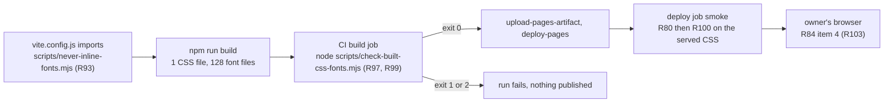

# Spec: no inlined data font URLs in built CSS

Change id: `2026-09-13-no-inlined-data-font-urls-in-built-css`. Tier: 2.
Intent: [intent.md](./intent.md), approved at G1 with the notes "Q1-Q5 as recommended" ([approvals.md](./approvals.md)).
Status: draft, revision 2, re-audited with 0 high findings (confirmed, table read). It answers the re-audit of revision 1 (audit M4, M5, L11 to L16) and the conductor's test probes. The G2 packet pass then changed only R93's comment clause, R98 case 10, R104, F12, OQ4, the Handoff and the packet (audit M6, L14, L15, L17).
Policy skills applied: wh-security-baseline, wh-readable-code, wh-adr, wh-review-packet. No compliance regime (`compliance.regimes: []`, confirmed).

Labels: "confirmed by the conductor" means the conductor read Vite 5.4.21's source, or ran a scratch script or Vitest 3.2.7
run with the repo's config, in the session scratchpad or the gitignored `.worktrees/`, deleted afterwards, nothing committed.
`scratchpad\` is `C:\Users\alqai\AppData\Local\Temp\claude\C--Users-alqai-Portfolio\d0dede8c-e802-4bb0-96b3-f53cba8c233e\scratchpad\`.
"Confirmed" alone means this agent read the file named; anything else is believed, not verified. Audit findings are
"audit M1" to "M6" and "L1" to "L17"; M1 to M7 alone are intent metrics. Ids continue from R93 (`deploy.yml` uses R52 to R87, confirmed).

## Summary

Vite inlines twelve small JetBrains Mono files (8 `.woff2`, 4 `.woff`) into the built CSS as `data:` URLs, which
`font-src 'self'` blocks, so the live site logs 12 CSP errors. Every font becomes a file through a font-only
`build.assetsInlineLimit` function in the dependency-free `scripts/never-inline-fonts.mjs` ([ADR 0001](./adr/0001-refuse-to-inline-font-files-with-a-font-only-assetsinlinelimit-function.md)).
The CSP stays byte-identical, and [The font rule](#the-font-rule) blocks the built CSS (R97) and the served CSS (R100).

## Requirements

| ID | Requirement | Acceptance check | Source |
|----|-------------|------------------|--------|
| R93 | `scripts/never-inline-fonts.mjs` (new) SHALL export one named function, `neverInlineFonts(filePath)`, and import nothing. It SHALL return `false` when `filePath` ends in `.woff2`, `.woff`, `.ttf`, `.otf` or `.eot`, ignoring case, and `undefined` otherwise. A comment of one to three lines SHALL say why (the CSP allows fonts from `'self'` only), cite ADR 0001, and say that `vite.config.js` imports the module and nothing runs it. `vite.config.js` SHALL gain only three things: one import line for it, a `build` key whose one property is `assetsInlineLimit: neverInlineFonts`, and at most one comment line (L16), which may name `scripts/never-inline-fonts.mjs` as where the inlining decision lives (audit M6). | `src/neverInlineFonts.test.js` imports nothing but `vitest` and `../scripts/never-inline-fonts.mjs`, has no `@vitest-environment` pragma, and passes 2 tests. (1) `returns false for every font extension in either letter case`: `/a/f.woff2`, `/a/F.WOFF2`, `/a/f.woff`, `/a/F.WOFF`, `/a/f.ttf`, `/a/F.TTF`, `/a/f.otf`, `/a/F.OTF`, `/a/f.eot`, `/a/F.EOT`. (2) `returns undefined for non-font assets, even inside a folder named like a font`: `/a/logo.png`, `/a/icon.svg`, `/a/index.js`, `/a/LICENSE`, `/a/woff2/logo.png`. `npm test -- src/neverInlineFonts.test.js` exits 0 with 2 passing. `grep -c "^import" scripts/never-inline-fonts.mjs` prints 0. `git diff -U0 main -- vite.config.js \| grep "^+[^+]"` prints only the import line, the `build` key's lines and at most one comment line, and the reviewer confirms the `build` object holds one property. After `npm run build`, R97 exits 0, which proves the wiring. | Outcome 1, G1 Q1, ADR 0001, audit M5, L16 |
| R94 | After `npm run build`, no `.css` file under `dist/` SHALL contain a data font URL, and every font URL SHALL begin `/Portfolio/assets/`, both as [The font rule](#the-font-rule) defines them. This covers the `.woff` fallbacks as well as `.woff2`. The rule is unconditional: the retro's draft eval GC95 excused `data:` fonts when `font-src` allowed them, and that condition is dropped. | R97 exits 0 and prints 0 data font URLs. Independent check in Git Bash: `grep -oiE "url\([[:space:]]*[\"']?data:font" dist/assets/*.css \| wc -l` prints 0. The formerly inlined files are now emitted: `ls dist/assets \| grep -cE '^jetbrains-mono-(cyrillic-ext\|vietnamese)-[4-7]00-normal-.+\.woff2$'` prints 8, and `ls dist/assets \| grep -cE '^jetbrains-mono-cyrillic-ext-[4-7]00-normal-.+\.woff$'` prints 4. | Outcome 1, M1 |
| R95 | The set of faces SHALL NOT change; only how they are delivered changes. With the pinned `@fontsource` 5.2.8 packages, the built CSS SHALL hold 64 `@font-face` blocks and 128 font URLs under `/Portfolio/assets/`, and `dist/assets` SHALL hold 128 font files. Before the fix the counts were 64, 116 and 116 (confirmed by the conductor). `src/main.jsx` lines 6 to 17 SHALL NOT change. These numbers are this change's verification targets. CI does not assert them (decision D4). | In Git Bash: `grep -o "@font-face" dist/assets/*.css \| wc -l` prints 64, `grep -oE "url\(/Portfolio/assets/[^)]+\.woff2?\)" dist/assets/*.css \| wc -l` prints 128, and `ls dist/assets \| grep -cE '\.woff2?$'` prints 128. R97's summary line shows the same 64 and 128. `git diff main -- src/main.jsx` is empty. | Outcome 5, M5, G1 Q4 |
| R96 | The CSP and referrer meta content SHALL stay byte-identical. The `content` of the CSP meta tag in `dist/index.html` SHALL equal exactly `default-src 'self'; script-src 'self'; style-src 'self' 'unsafe-inline'; img-src 'self' data:; font-src 'self'; connect-src 'self'; object-src 'none'; base-uri 'self'; form-action 'none'; upgrade-insecure-requests`. The referrer meta content SHALL be `strict-origin-when-cross-origin`. `dist/404.html` SHALL be byte-identical to `dist/index.html`. The diff to `vite.config.js` SHALL add lines only. No line of `CONTENT_SECURITY_POLICY`, `REFERRER_POLICY`, `githubPagesBuild` or `test` may change. | `grep -o 'http-equiv="Content-Security-Policy" content="[^"]*"' dist/index.html` prints that string. `grep -o 'name="referrer" content="[^"]*"' dist/index.html` prints `name="referrer" content="strict-origin-when-cross-origin"`. `cmp dist/index.html dist/404.html` exits 0. `git diff main -- vite.config.js` shows no removed line. The conductor confirmed the CSP string is identical with and without the function. | Outcome 2, M2, intent non-goals, L5 |
| R97 | `scripts/check-built-css-fonts.mjs` SHALL apply [The font rule](#the-font-rule) to every `.css` file under the directory it is given (default `dist`), per [Interfaces](#interfaces) (b). It exits 1 on a violation, naming the file and the counts. It exits 2 when it finds no directory, no CSS, 0 `@font-face` blocks in total or 0 font URLs in total, so it cannot pass on nothing. Otherwise it exits 0 and prints the counts. It uses Node built-ins only. Its header comment SHALL name the `Smoke R100` step in `.github/workflows/deploy.yml` as the other copy of the rule, and R98 and R104 as their proofs (L12). | R98 passes. `grep -c "Smoke R100" scripts/check-built-css-fonts.mjs` prints at least 1. On the dev host, run `npm run build` first, because a stale local `dist/` exists (`docs/sdlc/constraints.md` known debt 14, confirmed). Then `node scripts/check-built-css-fonts.mjs` exits 0 and prints `64 @font-face blocks, 128 font URLs, 0 data: font URLs`. To demonstrate exit 1 without editing `vite.config.js`, build with Vite's JS API into a scratch `outDir` outside the repository, with `build.emptyOutDir: true` and an inline `build.assetsInlineLimit: 4096`, as `scratchpad\inline-probe.mjs` does (confirmed, read). Run the script on that directory: it exits 1 and names `index-*.css` with 12. The inline `4096` replaces the file's function (confirmed by the conductor: `mergeConfig` yields `4096`, and `resolveConfig` merges the file config first and the inline config second, `dep-BK3b2jBa.js` line 66424). | Outcome 3, intent M3, ADR 0002, audit M1, L6, L12, L13 |
| R98 | `src/checkBuiltCssFonts.test.js` SHALL start the script with `spawnSync(process.execPath, ...)` from `node:child_process`, without importing it. It SHALL run in the default jsdom environment with no `@vitest-environment` pragma; a child Node process starts and returns its status there (confirmed by the conductor). It uses fixture directories made with `fs.mkdtempSync(path.join(os.tmpdir(), ...))` and removed in `afterEach`, as `src/checkPhoneRedaction.test.js` lines 67 to 73 do (confirmed). It resolves the script path from `import.meta.url` (believed, not verified, to be a `file:` URL under Vitest; a wrong path fails every case loudly), passes an explicit directory in every case and never reads `dist/`. It SHALL assert the exit code and output for 10 cases, 15 tests. C is the clean block `@font-face{font-family:t;src:url(/Portfolio/assets/t.woff2) format("woff2")}`. (1) Exit 0 for C; the output shows the counts. (2) Exit 1 for `url(data:font/woff2;base64,...)`; the output names the file and the count and does not contain the fixture's 200-character payload. (3) Exit 1 for each of 4 spellings: `url("data:font/woff;base64,...")`, `url( data:font/woff2;base64,...)`, `url('data:font/woff2;base64,...')` and `URL(DATA:FONT/WOFF2;BASE64,...)`. (4) Exit 1 for each of 3 `@font-face` sources outside the prefix that do not match the data font pattern: `url(data:application/vnd.ms-fontobject;base64,...)`, `url(https://cdn.example.com/font.woff2)` and `url(/* x */data:font/woff2;base64,...)`. (5) Exit 2 when the directory does not exist. (6) Exit 2 when it holds no `.css` file. (7) Exit 2 when no stylesheet holds an `@font-face` block. (8) Exit 2 when `@font-face` blocks hold no `url()`, for example `src:local(X)`. (9) Exit 0 for quoted and padded sources, `url("/Portfolio/assets/a.woff2")` and `url( '/Portfolio/assets/b.woff' )`. (10) Exit 1 for C, then an upper-case block over two lines, `@FONT-FACE{font-family:u;` then `src:url(https://cdn.example.com/u.woff2)}`, then a third line with a lower-case prefix, `@font-face{font-family:p;src:url(/portfolio/assets/p.woff2)}`; the output reports `0 data: font URL(s) and 2 @font-face URL(s) outside`, so a script that misses the upper-case block or compares the prefix ignoring case reports 1 or exits 0 (audit L17). | `npm test -- src/checkBuiltCssFonts.test.js` exits 0 with 15 passing tests. `grep -c "vitest-environment" src/checkBuiltCssFonts.test.js` prints 0. The test file is not edited to make them pass. The no-argument default is proven by the CI step (R99), which exits 2 if `dist` is wrong. | Outcome 3, intent M3, ADR 0002, audit M1, M5, L1, L7, L12 |
| R99 | The `build` job in `.github/workflows/deploy.yml` SHALL run `node scripts/check-built-css-fonts.mjs` in a step named `Built CSS inlines no font (R97)`. It goes immediately after `Build` and before `Audit runtime dependencies (blocking)`, with no `continue-on-error`. The header comment's source-of-truth lines SHALL also cite this spec for R97, R99 and R100. Apart from that header line, the diff SHALL add lines only. No added line SHALL contain `uses:` or `continue-on-error`. | `grep -n "name:" .github/workflows/deploy.yml` shows the step between `Build` and the blocking audit. `grep -c "continue-on-error" .github/workflows/deploy.yml` is still 1, on the informational audit (R57). `git diff main -- .github/workflows/deploy.yml` removes only the header source line. `git diff main -- .github/workflows/deploy.yml \| grep -cE '^\+.*(uses:\|continue-on-error)'` prints 0. The first CI run's log shows R97's summary line. | Outcome 3, audit L4 |
| R100 | The `deploy` job SHALL gain a blocking step named `Smoke R100: the served stylesheets inline no font`, after the R80 step and before R81. It applies [The font rule](#the-font-rule) to every stylesheet linked from the served HTML, per [Interfaces](#interfaces) (c) (D5). It judges only a stylesheet it fetched in this step with status 200, a `text/css` content type and a non-empty body. Any other stylesheet fails, is named, and never gets a PASS line (audit M4). Across the valid stylesheets it requires more than 0 `@font-face` blocks and more than 0 font URLs. It writes only under `smoke/r100/`. It writes to none of the runner files `$GITHUB_ENV`, `$GITHUB_PATH`, `$GITHUB_OUTPUT`, `$GITHUB_STATE` or `$GITHUB_STEP_SUMMARY` (L14). The comment above the step SHALL name `scripts/check-built-css-fonts.mjs` as the other copy of the rule, and SHALL say that any edit to the body re-runs R104 before merge (L12). | R104 passes. `grep -c "Smoke R100" .github/workflows/deploy.yml` is 1. On the body extracted as in R104, `grep -cE 'GITHUB_(ENV\|PATH\|OUTPUT\|STATE\|STEP_SUMMARY)\|count_matches'` prints 0. The reviewer confirms the step's comment names `check-built-css-fonts.mjs` and R104. The `continue-on-error` count is unchanged (R99). The first deploy after the merge logs one PASS R100 line naming `https://muhibm1.github.io/Portfolio/assets/index-<hash>.css`. | Outcome 4, M4, R83, G1 Q3, audit M3, M4, L2, L3, L12, L14 |
| R101 | The change SHALL touch only `vite.config.js`, `.github/workflows/deploy.yml`, `scripts/check-built-css-fonts.mjs`, `scripts/never-inline-fonts.mjs`, `src/checkBuiltCssFonts.test.js`, `src/neverInlineFonts.test.js` and files under `docs/sdlc/2026-09-13-no-inlined-data-font-urls-in-built-css/`. It changes no dependency, `package.json`, `package-lock.json`, `index.html`, `src/test/setup.js`, `src/data/portfolioData.js`, subset or weight. | `git diff --name-only main...HEAD` lists only those paths. `git diff main -- package.json package-lock.json index.html src/` shows only the two new test files. | Intent non-goals, CLAUDE.md, audit M5 |
| R102 | The existing gates SHALL pass under Node 22.12.0 locally and in the CI build job: `npm run lint`, `npm test` (the R52 floor of at least 12 passed, 0 pending, todo or failed), `npm run build`, and `npm audit --omit=dev --audit-level=high`. | Each command exits 0. The baseline on this branch is 191 tests in 23 files, exit 0 (confirmed by the conductor, `scratchpad\npm-test-baseline.txt`, read). This change adds 15 tests (R98) and 2 (R93), so the expected total is 208 tests in 25 files. The builder records the actual numbers. | M6 |
| R103 | Post-release acceptance, performed by the owner. After he pushes to `main` and the deploy run is green, he works through R84's four items in a real browser. Item 4 must show 0 CSP violations and 0 uncaught errors on `/` and on one deep link. He appends one dated line to `docs/hosted-config.md` section 6, in that section's format. No agent writes the line. | Section 6 carries a line of the form `YYYY-MM-DD <merge sha> no-inlined-data-font-urls 1 pass, 2 pass, 3 pass, 4 pass. <notes>`. The retro for this change reports whether it exists. This check does not block G2 to G4, because no agent can perform it before the merge. | Outcome 6, M7, change 2026-09-11 R84 |
| R104 | Before G4, the builder SHALL rehearse the committed R100 step outside CI, per [Interfaces](#interfaces) (d), and record it in `verification.md`. The body is copied byte for byte from the committed `deploy.yml` with change 2026-09-11's `scratchpad\extract-runs.js`, which copies each `run: \|` block and removes its indentation (confirmed, read). If that file is gone, the builder uses a substitute that copies the block by program, never by retyping, and pastes the substitute's source into `verification.md` (L13). The body runs in Git Bash as `bash --noprofile --norc -eo pipefail <body>`, with `ROOT_URL` and the five runner variables `GITHUB_ENV`, `GITHUB_PATH`, `GITHUB_OUTPUT`, `GITHUB_STATE` and `GITHUB_STEP_SUMMARY` exported to it, each runner variable naming that case's empty scratch file; without those exports, check (iv) proves nothing (audit L14). Any later edit to the R100 body re-runs every case before merge (L12). | `verification.md` has one row per case in (d), with the command including its six exports, the exit code, the full output and the result of checks (i) to (v). Every check matches. A mismatch blocks G4. | Audit M2, M3, M4, L2, L11 to L14, R83 |

## Design

### Architecture

The flow crosses four boundaries: the build config, `dist/`, CI and the site.



- **`scripts/never-inline-fonts.mjs` and `vite.config.js`**: the config imports the function and adds
  `build: { assetsInlineLimit: neverInlineFonts }`. Vite bundles a config's relative imports, and CSS `url()` references
  go through the same `shouldInline` decision (both confirmed; see Evidence). The `build` key leaves `outDir` `dist`,
  `assetsDir` `assets` and `base` `/Portfolio/` (confirmed by the conductor, `scratchpad\outdir-probe.mjs`, with the
  function written inline; that an import changes nothing Vite resolves is believed).
- **`scripts/check-built-css-fonts.mjs`**: judges the built CSS and nothing else. It follows
  `scripts/check-phone-redaction.mjs` (usage comment, exit codes 0, 1 and 2, no content in reports), with no exports
  and no direct-run guard ([ADR 0002](./adr/0002-check-built-css-with-a-committed-node-script-run-the-same-way-in-ci-and-locally.md)).
- **Tests**: `src/checkBuiltCssFonts.test.js` and `src/neverInlineFonts.test.js`, in `src/` only because Vitest looks
  there (`vite.config.js` line 41). Both run in the default jsdom environment with no pragma, and `src/test/setup.js`
  is untouched: a Node pragma fails in that setup file, and importing `vite.config.js` under jsdom fails at load (both
  confirmed by the conductor; see Evidence and audit M5). Importing a `scripts/*.mjs` module under jsdom works:
  `src/checkPhoneRedaction.test.js` does it and passes 17 tests in the baseline (confirmed, `npm-test-baseline.txt` line 33).
- **`.github/workflows/deploy.yml`**: one build-job step (R99) and one deploy-job step (R100); R80 is unchanged. R100
  reuses R80's origin `sed` (line 194) and link expression (line 233, without `head -n 1`). The deploy job has no
  checkout and no Node setup (lines 148 to 160, confirmed); adding them would put a new `uses:` line and repository code
  into the only job with write scopes (R60). So R100 restates the rule in bash (D5), and R104 proves that copy.
- **Coverage (G1 Q3):** R97 scans every `.css` under `dist/`, including chunks JavaScript loads later. R100 checks
  every stylesheet the served HTML links, today one (confirmed by the conductor).

### Data

Not applicable: no table, schema, migration or personal data. The build emits 128 font files instead of 116, and the
stylesheet sheds 27,544 bytes of raw font data (believed, arithmetic on the conductor's file sizes).

### Interfaces

**(a) `neverInlineFonts(filePath: string): false | undefined`**, the named export of `scripts/never-inline-fonts.mjs`.
Vite calls it with an absolute path that uses forward slashes on Windows (confirmed by the conductor). It matches the
extension alone, `/\.(woff2?|ttf|otf|eot)$/i`. `false` means "emit a file"; `undefined` means "use Vite's 4096-byte
default". Vite decides library mode, entry modules and `?inline` imports before calling it (confirmed by the conductor).

#### The font rule

Written once. `scripts/check-built-css-fonts.mjs` (R97) and the R100 step implement it identically and name each other in
a comment (L12). Whitespace is `\s` in the script and `[[:space:]]` in bash; they differ only on characters minified CSS does not emit (believed).

| Term | Definition | Count |
|------|------------|-------|
| Line breaks | Count as spaces. The script matches across lines; the bash first flattens each body with `tr '\r\n' '  '`. | |
| Data font URL | `url(`, optional whitespace, at most one `"` or `'`, then `data:font`, ignoring case, anywhere in the file | D |
| `@font-face` block | From `@font-face`, ignoring case, to the next `}`. At-rule names are ASCII case-insensitive (believed, CSS Syntax Level 3, not fetched), and descriptors hold no nested braces (believed, CSS Fonts). | F |
| Font URL | Each `url(`, ignoring case, inside a block, whatever follows. A `local()` source is not one. | U |
| Value | What follows `url(` after optional whitespace and at most one `"` or `'` | |
| Outside | A font URL whose value does not begin `/Portfolio/assets/`, compared case-sensitively. A `data:` source inside a block counts in both D and O. | O |
| Verdict | A stylesheet passes when D and O are both 0. A run passes only if F and U, in total, are both above 0. | |

**(b) `node scripts/check-built-css-fonts.mjs [directory]`** applies the font rule to every `.css` file under
`directory`, recursively.

| Element | Contract |
|---------|----------|
| Directory | Defaults to `dist`, resolved from the repository root, which the script derives from its own location. An explicit argument is resolved from the working directory. |
| Prefix | The constant `/Portfolio/assets/`. Its comment says it mirrors `PAGES_BASE` in `vite.config.js` joined to Vite's `assets` directory. |
| Per file | `<path from repo root>: <F> @font-face blocks, <U> font URLs, <D> data: font URLs` |
| Exit 0 | `Built CSS font check passed (R97): <N> CSS file(s), <F> @font-face blocks, <U> font URLs, 0 data: font URLs.` |
| Exit 1 | One line per violating file: `::error::Built CSS font check failed (R97): <path> has <D> data: font URL(s) and <O> @font-face URL(s) outside /Portfolio/assets/ (first: <at most 60 characters>). The CSP allows font-src 'self' only; see ADR 0001.` The cap keeps base64 payloads out of logs. |
| Exit 2 | `::error::Built CSS font check could not run (R97): <reason naming the directory>`, for a missing directory, no `.css` file, 0 `@font-face` blocks, 0 font URLs (audit M1) or an unreadable file. It suggests `npm run build` where that applies. `::error::` matches R52 and R85. |
| A comment after `url(` | `url(/* x */data:font/woff2;...)` escapes the data font pattern but not the prefix rule (R98 case 4), so the pattern is not widened. The only comment in the built CSS is Tailwind's licence banner, outside every block (confirmed, grep of `scratchpad\build\fontOnly\assets\index-D4xY4LDD.css`). |

**(c) Smoke step R100**, bash, in the deploy job after R80 and before R81. The quoted names are used in (d).

| Element | Contract |
|---------|----------|
| Comment | Above the step: names `scripts/check-built-css-fonts.mjs` as the other copy of the rule, and says an edit to the body re-runs R104 before merge. |
| Inputs | `$ROOT_URL` and `smoke/root.html`, both left by R63. Read, never written. |
| Start | Removes and recreates `smoke/r100/`, so no file from an earlier run is judged (L13). |
| Links | Every `<link ... rel="stylesheet">` href, in document order. None ("No-link"): `::error::R100 failed: found no stylesheet link in the body of $ROOT_URL.` and exit 1. |
| Fetch | Stylesheet n goes to `smoke/r100/stylesheet-<n>.css` with `-w "%{http_code} %{content_type}"`. A curl failure gives status `000`, as R80 does (line 200). An empty type is written `none`. Bytes is the file's size, or 0 if curl wrote none. Log: `R100 stylesheet <n>: GET <url> returned <status>, content-type <type>, <bytes> bytes`. |
| Validity | Status 200, a type matching `text/css` ignoring case, and bytes above 0. Otherwise ("Invalid"): `::error::R100 failed: GET <url> returned <status>, content-type <type>, <bytes> bytes; expected 200, text/css and a non-empty body.` That stylesheet is a failure, is not scanned, and gets no PASS line. |
| Counting | By the font rule, on each valid stylesheet. grep status 1 (no match) counts 0; any other grep failure fails the step naming the file, because under `pipefail` an unhandled no-match stops the step silently. R82's `count_matches` is not reused: it prints 0 for a missing file (line 286, audit M3). |
| Verdict | D and O both 0: `PASS R100 font URLs are files under /Portfolio/assets/: found 0 data: font and 0 outside at <url>`. Otherwise ("Delivery (D, O)"): `::error::R100 failed, font delivery: found <D> data: font URL(s) and <O> @font-face URL(s) outside /Portfolio/assets/, expected 0 and 0, at <url>`. |
| Floor | After the last stylesheet, if at least one was valid and F or U summed over the valid ones is 0 ("Floor (F, U)"): `::error::R100 failed: found <F> @font-face blocks and <U> font URLs in the stylesheets linked from $ROOT_URL, expected more than 0 of each.` If none was valid, the Invalid lines already name the cause. |
| Exit | Checks every stylesheet, then exits 1 if any failure was recorded, as R80 does. |
| Writes | Nothing outside `smoke/r100/`, and none of the five runner files. `smoke/root.html`, `smoke/module.js` and every file R81 and R82 read stay untouched (L2, L14). |
| Shell | `defaults: run: shell: bash` (lines 22 to 24, confirmed), which GitHub runs as `bash --noprofile --norc -eo pipefail {0}` (believed, not verified; docs not fetched). |

**(d) R104 rehearsal.**

- Setup: `npm run build` before P1. Each case gets a fresh scratch working directory outside the repository with
  `smoke/root.html`, and five empty scratch files exported, with `ROOT_URL`, as `GITHUB_ENV`, `GITHUB_PATH`, `GITHUB_OUTPUT`, `GITHUB_STATE` and
  `GITHUB_STEP_SUMMARY`. P1: `npm run preview` (binds `localhost`, confirmed by the auditor, `dep-BK3b2jBa.js` lines 17312
  to 17321), with `dist/index.html` as `smoke/root.html`. Others: an uncommitted scratch `node:http` script outside the
  repository on `127.0.0.1`, serving `/Portfolio/assets/<name>.css`. Both servers are stopped; a refused connection to each is recorded.
- Checks per case: (i) the exit code; (ii) each expected line appears verbatim (`grep -Fx`), written from (c)'s
  templates before the run; (iii) the counts of `::error::R100` and `PASS R100` lines equal the table's; (iv) the five
  runner files are still empty; (v) a sha256 listing of every file outside `smoke/r100/` is unchanged (L2, L14).
- C is R98's clean block. u1 and u2 are the first and second linked stylesheets.

| Case | Served at u1 (and u2) | Exit | `::error::R100` lines | PASS lines |
|------|-----------------------|------|-----------------------|------------|
| P1 | the real build through `npm run preview` | 0 | none | 1, at u1 |
| P2 | `@font-face{font-family:q;src:url("/Portfolio/assets/q.woff2"),url( '/Portfolio/assets/q.woff' )}` | 0 | none | 1, at u1 |
| F1 | C, then `@font-face{font-family:d;src:url(data:font/woff2;base64,AAAA)}` | 1 | Delivery (1, 1) at u1 | 0 |
| F2 | C, then `@font-face{font-family:d;src:URL( 'DATA:FONT/WOFF;base64,AAAA')}` | 1 | Delivery (1, 1) at u1 | 0 |
| F3 | C, then `@font-face{font-family:x;src:url(https://cdn.example.com/f.woff2)}` | 1 | Delivery (0, 1) at u1 | 0 |
| F4 | nothing: `smoke/root.html` links no stylesheet | 1 | No-link, naming `$ROOT_URL` | 0 |
| F5 | status 404, `text/css`, body C | 1 | Invalid at u1: `404`, `text/css`, C's size | 0 |
| F6 | the server destroys the connection | 1 | Invalid at u1: `000`, `none`, 0 bytes | 0 |
| F7 | status 200, `text/css`, empty body | 1 | Invalid at u1: `200`, `text/css`, 0 bytes | 0 |
| F8 | status 200, `text/html`, body C | 1 | Invalid at u1: `200`, `text/html`, C's size | 0 |
| F9 | `body{color:red}` | 1 | Floor (0, 0) | 1, at u1 |
| F10 | `@font-face{font-family:l;src:local(X)}` | 1 | Floor (1, 0) | 1, at u1 |
| F11 | F1's body at u1, linked first; C at u2 | 1 | Delivery (1, 1) at u1 | 1, at u2 |
| F12 | C, then `@FONT-FACE{font-family:u;` and, on the next line, `src:url(https://cdn.example.com/u.woff2)}`, then on a third line `@font-face{font-family:p;src:url(/portfolio/assets/p.woff2)}` | 1 | Delivery (0, 2) at u1 | 0 |

F5 and F8 serve CSS that passes if scanned, so a step without the validity rule exits 0 there. F6 and F7 differ in
their expected line, and none of F5 to F8 may print PASS (audit M4). F11 links the failing stylesheet first, so a step
that stops at its first failure misses the PASS at u2 (L11). F12 reports 2 outside only if the step matches `@font-face`
ignoring case, treats line breaks as spaces and compares the prefix case-sensitively; one `grep -i` over the whole pattern reports 1 (L12, L17).

### Security and privacy

- Data: none; fonts and CSS only (profile `special_categories: []`, confirmed). No new third party, cookie or subprocessor.
- Threat: weakening the policy is the cheapest fix. R96's exact CSP and the unconditional rule in R94, R97 and R100 close it.
- Supply chain: no new dependency or `uses:` line (R99); the scripts import only `node:` built-ins or nothing, use no
  secret and make no network call. R100 only GETs the Pages URL and writes no runner file, so it cannot change the
  environment or `PATH` of later steps in the job holding `pages: write` (L14). Logging: no `data:` payload beyond 60 characters.
- Baseline items applied: fail loudly when a check cannot run (R97 exit 2, R100 validity and floor); no silent consequential
  failure (R99, R100 block); "`CREATE OR REPLACE` is a diff", by analogy, via the added-lines-only rules in R93, R96, R99.

### Failure modes

| Trigger | What happens | Surfaced as |
|---------|--------------|-------------|
| A Vite upgrade changes or ignores the function contract | Small fonts inline again | R97 exits 1 in the build job, naming the file and count. Nothing is uploaded. |
| An edit to `scripts/never-inline-fonts.mjs` or `scripts/check-built-css-fonts.mjs`, which no sensitive or tier-floor glob covers | No owner prompt and no tier-2 floor (OQ4) | A font inlined again fails R97 before upload, and a non-font path returning `false` fails R93's test, unless the same change weakens those checks; then G4 and R100 after publication remain. D6 decides. |
| A font path reaches the function with a query or hash suffix | Does not happen in 5.4.21: Vite passes `cleanUrl(id)`, and the CSS `url()` replacer splits off `#` first (`dep-BK3b2jBa.js` lines 20427, 20430, 20479 and 36143, confirmed by the auditor). An explicit `?inline` import bypasses the function (line 20476); OQ3 covers it. | Not applicable |
| `base` or the assets directory changes | Every font URL misses `/Portfolio/assets/` | R97 exits 1 on every build until its constant changes, and R100 fails too (ADR 0002) |
| Nothing to check: no `dist/`, no CSS, no `@font-face`, or blocks with no `url()` | A check could pass on nothing | R97 exit 2 naming the directory (R98 cases 5 to 8); R100's floor (R104 F9, F10) |
| CSS output format changes (quotes, whitespace, case, line breaks) | The font rule accepts all four | R98 cases 3, 9 and 10; R104 P2, F2 and F12 |
| Pages serves a stale, missing, empty or non-CSS stylesheet, or the fetch fails | R100 never judges a response that is not 200, `text/css` and non-empty | Invalid line naming the URL, no PASS line (R104 F5 to F8) |
| R100's body is edited later without re-running R104 | The bash copy may drift from the script | The step's comment requires R104; the script still runs first, before upload |
| A CSS chunk loaded later by JavaScript (none today) | R100 cannot see it, because the HTML does not link it | R97 covers it at build time |
| Some other CSP violation, not a font | No automated control sees a browser console | R84 item 4 and R103. Accepted risk, owned by the site owner (G1 Q5). |

Retries: none; both checks are deterministic reads, and R63 already absorbs Pages propagation delay. Idempotency: both
steps only read, apart from R100's own `smoke/r100/`, which it recreates.

### Observability

No metrics or alerts exist, and none are added. A break shows as a red build job at `Built CSS inlines no font (R97)`
naming the file, counts and ADR 0001, or, after the site is live, as a red deploy job with `::error::R100 failed ... <url>`.
R97's summary line records the counts on every green run. GitHub notifies the owner of failed runs (believed, not verified).

## Alternatives considered

| Option | Why not |
|--------|---------|
| Other build-side fixes: `assetsInlineLimit: 0`, a lower number, `font-src 'self' data:`, the latin subset only | Each loses to the font-only function for a reason in [ADR 0001](./adr/0001-refuse-to-inline-font-files-with-a-font-only-assetsinlinelimit-function.md). `data:` in `font-src` is also ruled out by the intent. |
| Keep the function in `vite.config.js` and drop its unit test | Nothing would prove the `undefined` branch, the owner's G1 Q1 choice ([ADR 0001](./adr/0001-refuse-to-inline-font-files-with-a-font-only-assetsinlinelimit-function.md)) |
| Test under a `// @vitest-environment node` pragma | Fails in the shared `src/test/setup.js` (confirmed by the conductor). Editing that file is outside R101 and matches the no-edit glob `**/test/**` (profile line 52, confirmed). |
| An inline `node -e` check, or running the committed script in the deploy job for R100 | [ADR 0002](./adr/0002-check-built-css-with-a-committed-node-script-run-the-same-way-in-ci-and-locally.md) |
| A Playwright console check in CI | Rejected on cost at G1 (Q5). R84 stays the control. |

## Decisions

- [ADR 0001](./adr/0001-refuse-to-inline-font-files-with-a-font-only-assetsinlinelimit-function.md): refuse to inline font files with a font-only `assetsInlineLimit` function, kept in its own dependency-free module so it can be tested (R93).
- [ADR 0002](./adr/0002-check-built-css-with-a-committed-node-script-run-the-same-way-in-ci-and-locally.md): check the built CSS with a committed Node script, run the same way in CI and locally (R97 to R99). It also records why R100 restates the rule in bash (D5) and how the two copies are kept together. D2 to D5 are scope choices recorded in the requirements they name, and D6 is the owner's profile change recorded in OQ4 and ADR 0001's Consequences; none needs its own ADR.

## Open questions

G1 Q1 to Q5 were resolved as recommended: Q1 in R93; Q2 in R97 and R99 (D1); Q3 in R100 and D2; Q4 in R95; Q5 in R103.

| # | Question | Proposed default | Owner |
|---|----------|------------------|-------|
| OQ1 | Should the lesson go into CLAUDE.md "Mistakes to avoid"? The previous retro drafted a line about `assetsInlineLimit` (its `retro.md` line 327) that was never applied. | Yes, applied by this change's retro, not by the build | Retro |
| OQ2 | `docs/hosted-config.md` section 6 still reads "No entries yet". The first-deploy line from the previous change's `release.md` section d was never pasted. | The owner pastes that line first, then the R103 line | Site owner |
| OQ3 | Should R97 also scan the JavaScript for `data:font`? | No. Today the JavaScript holds 0 base64 data URLs (confirmed by the conductor). Revisit if a font is ever imported with `?inline`. | A later change |
| OQ4 | Should `scripts/never-inline-fonts.mjs` and `scripts/check-built-css-fonts.mjs` join `sensitive_paths` and `tier_floor_paths` 2 in `.workhorse/profile.yml` (audit M6)? Moving the function out of `vite.config.js` gives up more than the edit prompt. (1) The module also loses the tier-2 floor (profile lines 76 and 154, confirmed), so a later change that edits only it is not forced to tier 2 (believed, not verified; the classifier decides). G4 stays required at every tier (`hooks/scripts/lib.js` lines 183 to 203, confirmed). (2) The safeguard this row used to cite, R97's script and the two new tests, sits in files that are equally unprompted, so one change could weaken the module and its checks together (profile lines 73 to 79 and 154, confirmed). (3) R93's `grep -c "^import"` cannot see a dynamic `import(` that does not start a line, such as `await import(...)` (confirmed, reading the pattern). (4) R99 makes the R97 script the first repository file to run between Build and upload, and nothing stops a later edit to it from writing to `dist/`; no later step compares the CSP content (`deploy.yml` line 304, confirmed). What still holds: R100, in the sensitive `deploy.yml`, re-applies the font rule after publication. | Decided at G2 (D6). Recommended: the owner adds both files to both lists himself, after G2 and outside R101; agents do not edit the profile in this change. Alternative: accept the gap as documented here and in ADR 0001. | Site owner |

## Response to audit

Each re-audit finding is quoted in full in the [Constraint audit](#constraint-audit) table; its Resolution says what changed.
One input is not an audit row: revision 1's `src/viteConfig.test.js` also fails at load under jsdom (Evidence), so its answer
to eval gap 2, "through the default export", is withdrawn; R93 tests its own module. Revision 1's other answers stand.

## Handoff to eval designer

`evals.md` follows revision 2 and the G2 packet pass (confirmed, read: line 4, revision note items 1 to 7, 55 cases).
Item 7 applied audit L17: FL50 (R98 case 10) and FL51 (R104 F12) carry the lower-case prefix block and expect 2 outside
(lines 168 and 169). No follow-up is outstanding.

## Constraint audit

Filled by the constraint auditor. A High finding blocks G2.

Audit result: pass (0 high). Re-audit of revision 2, 2026-09-13, the final audit before G2: M4, M5, L11 to L14 and L16 are closed. L15 stays open until `evals.md` follows the Handoff. 2 new rows are open: 1 medium (audit M6, to resolve before G4) and 1 low (L17). Totals: 0 high; 6 medium, 5 closed and 1 open; 17 low, 15 closed and 2 open.

Earlier result, re-audit of revision 1, 2026-09-13: all 13 revision-0 rows are closed. 8 new rows are open: 2 medium (audit M4 and M5, to resolve before G4) and 6 low (L11 to L16). Audit M5 needs a decision before build, because R93, R98 and R102 cannot pass as written.

Resolution column updated by the spec architect in revisions 1 and 2 and in the G2 packet pass ("spec R1", "spec R2" mean revisions, not requirements). Packet pass, 2026-09-13: L15 closed against its own condition; L17 resolved in R98 case 10 and R104 F12, not re-audited; M6 decided at G2 by the owner (D6). Totals now: 0 high; 6 medium, 5 closed and M6 decided at G2; 17 low, 16 closed and L17 resolved, not re-audited; none open. Rows M4, M5 and L11 to L16 are resolved in spec R2 and have not been re-audited. Auditor, 2026-09-13: re-audited; each of those rows now ends with "Re-audit (spec R2)". This auditor ran no command. Every "confirmed" below is a file this auditor read or a search it ran, or it is credited to the conductor.

| Severity | Finding | Requirement affected | Resolution |
|----------|---------|----------------------|------------|
| Medium | M1. R97 can pass its second rule on nothing. Its exit-2 list covers a missing directory, no `.css`, 0 `@font-face` blocks and an unreadable file, but not `@font-face` blocks that yield 0 `url()` (for example a block-parsing or `url()` extraction bug). Then the font URL count is 0, the `/Portfolio/assets/` prefix rule has nothing to judge, and the script exits 0. D4 says CI "asserts only more than 0" without saying of what. The file-wide `url(data:font` rule still fires, so the headline regression is still caught (confirmed from the R97 and D3 text). Rule: security baseline "CI must fail loudly when it cannot"; intent Outcome 3 "cannot pass on nothing". | R97, R98, D4 | Resolved in spec R1 as proposed. R97 and Interfaces (b) exit 2 when the total font URL count is 0. R98 case 8 tests it. D4 now reads "more than 0 `@font-face` blocks and more than 0 font URLs in total" and defines a font URL. R100 has the same floor. Re-audit (spec R1): closed. R97 and Interfaces (b) exit 2 on 0 font URLs in total, R98 case 8 tests it, D4 defines a font URL, and Interfaces (c) gives R100 the same floor (confirmed, read). The floor is on the total, not per block; the file-wide `url(data:font` rule still covers any block the URL extraction misses (confirmed, R97 text). |
| Medium | M2. R100's fail paths are never demonstrated. Its only acceptance check is a PASS line on the first real deploy. A pattern mangled by YAML or shell quoting (it needs both quote characters inside a `run:` block, as R94's `[\"']` shows) would count 0 on every stylesheet and print PASS forever, which looks identical to a correct pass. R97 has R98 to prove its fail paths; R100 has nothing equivalent. Rule: security baseline "a green check that proves nothing is worse than no check", and the pre-ship item "every new policy ships an admit test and a deny test", applied by analogy as the spec already does for R98. | R100 | Resolved in spec R1: new R104. At verify, the committed body, copied verbatim by script, runs in Git Bash with `-eo pipefail` against local fixtures: 1 pass case and 11 fail cases, which include the four proposed. Results go in `verification.md`; a mismatch blocks G4. Re-audit (spec R1): closed. R104 runs the committed body against 1 pass case and 11 fail cases, and a mismatch blocks G4. The body is copied by `extract-runs.js`, which dedents each `run: \|` block and writes LF line endings (confirmed, read). How much those fail cases can prove is audit M4. Not a defect: `smoke.sh` line 32 ran `bash -eo pipefail` without `--noprofile --norc` (confirmed), and R104's invocation is closer to GitHub's (believed, not verified). Spec R2: now 2 pass cases and 12 fail cases (Interfaces (d)). |
| Medium | M3. R100 does not say what a valid fetched body is, so a failed fetch can still be counted as 0. The two precedents in the same file point opposite ways. R80 maps a curl transport failure to status `000` (`deploy.yml` line 200, confirmed). R82's `count_matches` helper, `{ grep -oiE ... \|\| true; } \| wc -l` (line 286, confirmed), prints 0 for a missing file. Reusing that helper on a body curl never wrote, or on a 200 response that is empty or not CSS, prints `PASS R100 ... found 0`. The run shell is bash with `-e` and `pipefail` (believed, not verified; GitHub docs not fetched), so a bare `grep \| wc -l` with 0 matches would instead abort the passing case with no `::error::` line. Rule: security baseline "fail loudly when it cannot"; intent Outcome 4; R83. | R100 | Resolved in spec R1 as proposed. Interfaces (c) counts only a file this step wrote from a 200, `text/css`, non-empty response. A curl failure is status `000` and fails. `count_matches` is not reused, and grep status 1 is handled explicitly. More than 0 `@font-face` blocks and font URLs are required. R104 F5 to F10 demonstrate it. Re-audit (spec R1): closed. Interfaces (c) does five things (all confirmed, read). It counts only a file this step wrote from a 200, `text/css`, non-empty response. It maps a curl failure to `000`, as `deploy.yml` line 200 does. It does not reuse `count_matches` (line 286). It treats grep status 1 as 0 and any other grep failure as a step failure naming the file. It requires more than 0 `@font-face` blocks and font URLs. What R104 F5 to F10 can prove is audit M4. |
| Low | L1. R94 requires the data font pattern to match whitespace after `url(`, either quote and any letter case, and Failure modes says "the patterns accept all three". R98 tests only the unquoted and double-quoted forms (cases 2 and 3). Rule: testability, every acceptance claim can be a test. | R94, R98 | Resolved in spec R1: R98 case 3 runs for 4 spellings, including `url( data:font`, `url('data:font` and `URL(DATA:FONT`. R102's total is updated to 206. Re-audit (spec R1): closed. R98 case 3 lists the four spellings, and R104 F2 covers the bash copy (confirmed, read). The counts add up: R98's 13 tests are 1 + 1 + 4 + 3 + 4, and 191 + 13 + 2 = 206 (confirmed, arithmetic). The 191 comes from `npm-test-baseline.txt`, which shows 23 files and 191 passed (read). Spec R2: R98 cases 9 and 10 make 15 tests, and the total is 191 + 15 + 2 = 208 (arithmetic). |
| Low | L2. R100 runs between R80 and R81 in the same job, and later steps read state that earlier steps leave behind: `ROOT_URL` and `MODULE_URL` in `$GITHUB_ENV` (lines 170 and 239, confirmed), `smoke/root.html` (R81 digest, R82 counts) and `smoke/module.js` (R82). Nothing in R100 stops it writing to them, and overwriting any of them would change what R81 or R82 asserts. Rule: security baseline "`CREATE OR REPLACE` is a diff", applied by analogy as the spec does. | R100 | Resolved in spec R1 as proposed. R100 writes only under `smoke/r100/` and nothing to `$GITHUB_ENV` (Interfaces (c)). R100's acceptance checks the body, and R104 checks `GITHUB_ENV` and the `smoke/root.html` digest after each case. Re-audit (spec R1): closed. Interfaces (c) confines writes to `smoke/r100/`, forbids `$GITHUB_ENV`, and leaves `smoke/root.html` and `smoke/module.js` untouched. R100's acceptance has the reviewer read the body, and R104 checks the scratch `GITHUB_ENV` file and the `root.html` digest (confirmed, read). The other runner files and a wider write check are audit L14. |
| Low | L3. R100's pattern is narrower than R97's rule. Vite writes `data:<mime>` from a MIME lookup (`dep-BK3b2jBa.js` line 20439, confirmed). An inlined `.eot` (`application/vnd.ms-fontobject`, believed) or a third-party font host would pass R100 and be caught only by R97 before upload. Nothing like that ships today: the probe found 12 data URLs and all 12 were `data:font` (confirmed by the conductor, `probe-output.json`). Rule: intent Outcome 4 wording; D2 and D3. | R100 | Resolved in spec R1 by D5: R100 applies R97's `@font-face` prefix rule too, proven by R104 F3. The owner can still choose the narrower rule at G2. Re-audit (spec R1): closed. D5 and Interfaces (c) apply the `@font-face` prefix rule in R100, proven by R98 case 4 and R104 F3 (confirmed, read). The `.eot` MIME is still believed, not verified, but no longer matters: the prefix rule fails a `data:` source of any MIME. |
| Low | L4. No requirement says the new steps add no `uses:` line, so the SHA-pin invariant in the workflow header (line 7) is assumed, not checked. There are 5 `uses:` lines today, all pinned to full commit SHAs (confirmed). Separately, a new comment containing the literal `continue-on-error` would break R99's count check. Rule: security baseline, third-party code pinned to an exact version; R83. | R99, R100 | Resolved in spec R1: R99 forbids any added line containing `uses:` or `continue-on-error`, checked by a grep of the diff. Re-audit (spec R1): closed. R99's diff grep covers every added line in both jobs. Today `deploy.yml` has 5 `uses:` lines, all full SHAs (lines 37, 43, 133, 141 and 160), and 1 `continue-on-error` (line 130) (confirmed, read). |
| Low | L5. R96 says the referrer meta must stay byte-identical, but its acceptance checks only the CSP string and `cmp`. The add-only diff rule covers the source file, not the built output. Rule: testability. | R96 | Resolved in spec R1 as proposed: R96 adds the referrer grep. Re-audit (spec R1): closed. `githubPagesBuild` gives the referrer tag `name` before `content` (`vite.config.js` line 70, confirmed). So R96's expected string matches the order Vite writes, if Vite keeps that order (believed, not verified: the conductor's probe recorded only the CSP tag). |
| Low | L6. R97's verify-time demonstration removes the function from `vite.config.js`, a sensitive path, and depends on someone putting it back. R96's add-only diff check would catch a leftover, but the approach prompts the owner twice for no benefit. Also, the stale local `dist/` (constraints known debt 14) can make a local R97 run judge old output. Rule: profile `sensitive_paths`; CLAUDE.md "Ask first". | R97 | Resolved in spec R1 as proposed. The exit-1 demonstration builds with Vite's JS API into a scratch `outDir` with an inline 4096 override, and `vite.config.js` is not edited. `npm run build` precedes any local run. Re-audit (spec R1): closed. R97's exit-1 demonstration uses Vite's JS API with an inline `build.assetsInlineLimit: 4096` and a scratch `outDir`, and does not edit `vite.config.js` (confirmed, read). The clause R97 still labels believed is now confirmed, and the architect may relabel it. `mergeConfig` of the file's function with the inline `4096` yields `4096` (confirmed by the conductor, `merge-probe.mjs`, read). `resolveConfig` merges the file config first and the inline config second (`dep-BK3b2jBa.js` line 66424, confirmed by the conductor and re-read by this auditor). `shouldInline` then takes the numeric branch (lines 20478 to 20484, confirmed). Whether the demonstration's directory starts empty is audit L13. Spec R2: R97 relabels the clause confirmed by the conductor and sets `emptyOutDir: true`. |
| Low | L7. The new test file. (a) It sits in `src/`, not beside its subject in `scripts/`, which departs from the CLAUDE.md convention that tests sit next to their subject. The reason is the Vitest include `src/**/*.test.{js,jsx}` (`vite.config.js` line 41, confirmed), which `src/checkBuiltCssFonts.test.js` matches (confirmed). `src/checkPhoneRedaction.test.js` lines 1 to 4 set the precedent (confirmed). (b) Every test runs under `environment: 'jsdom'` (line 37, confirmed), and no existing test starts a child process (the phone test imports its script in process, confirmed). Spawning under jsdom is believed to work, not verified. (c) It must not read `dist/`, which does not exist when CI runs the tests (`deploy.yml` lines 96 and 120, confirmed). All seven R98 cases pass an explicit fixture path, so no test covers the no-argument default. Rule: CLAUDE.md conventions; security baseline "CI runs the full test suite". | R98 | Resolved in spec R1 as proposed. R98 requires the Node environment docblock, `mkdtempSync` fixtures removed in `afterEach`, the script path from `import.meta.url` and an explicit directory in every case. The default `dist` is proven by R99 in CI. Re-audit (spec R1): (a) and (c) closed. The `src/` placement follows the phone-check precedent. R98 requires `mkdtempSync` fixtures removed in `afterEach`, the script path from `import.meta.url`, and an explicit directory in every case (confirmed, read; the precedent is `src/checkPhoneRedaction.test.js` lines 67 to 73). (b) closed as raised, because the new tests no longer run under jsdom. The Node docblock that replaced jsdom conflicts with the global setup file: see audit M5. Spec R2: (b) is answered after all: the docblock is removed, both new tests run under jsdom, and spawning there works (confirmed by the conductor; audit M5). |
| Low | L8. Failure modes row 2 (a font path reaching the function with a suffix after the extension, "believed not to happen") can be labelled confirmed. Vite passes `cleanUrl(id)` to the function (`dep-BK3b2jBa.js` lines 20427, 20430 and 20479, confirmed by this auditor). The CSS `url()` replacer also splits off `#` before resolving (line 36143, confirmed). The same code shows that an explicit `?inline` or `?no-inline` import bypasses the function (line 20476, confirmed), which OQ3 already covers. Rule: verify empirically before asserting. | R93, Failure modes | Resolved in spec R1: row 2 relabelled with these line references, credited to the auditor. Re-audit (spec R1): closed. Failure modes row 2 now cites lines 20427, 20430, 20479, 36143 and 20476 and credits this auditor (confirmed, read). Spec R2: now row 3, text unchanged. |
| Low | L9. `vite.config.js` and `.github/workflows/deploy.yml` are `sensitive_paths` (profile lines 74 and 76, confirmed), so each edit prompts the owner during build. No `protected_paths` entry is touched (R101's file list checked against profile lines 69 to 72, confirmed). `package.json`, `package-lock.json` and `index.html` stay unchanged (R101, ADR 0002). Rule: profile constraints. | R93, R99, R100, R101 | Decided: no action. The prompts are the control, and the owner's G2 approval covers the design. The new `src/viteConfig.test.js` matches no protected or sensitive path (profile lines 69 to 79, confirmed); it matches the fixer's no-edit glob `**/*.test.*` (line 48). Re-audit (spec R1): closed, no action needed. Revision 1 adds no path outside R101's list. `scripts/check-built-css-fonts.mjs` and both test files match no protected or sensitive glob (profile lines 69 to 79, confirmed). Spec R2: `scripts/never-inline-fonts.mjs` and `src/neverInlineFonts.test.js` also match no protected or sensitive glob (confirmed, profile read). The function leaving a sensitive path is a cost stated in ADR 0001 and asked as OQ4. |
| Low | L10. `evals.md` did not exist when this audit ran (confirmed, glob found no file), so "every failure mode has an eval category" could not be checked against the 8 rows in Failure modes. Rule: constraint auditor testability check. | Failure modes | Resolved: `evals.md` now maps all 8 original rows (FL35, EG25, FL36, FL32 to FL34, FL30, FL37, EG26, GC105; confirmed, read). The rows revision 1 changes are covered by R98 case 8 and R104 F5 to F10. The eval designer adds cases for them (see Handoff), and the reviewer confirms at G4. Re-audit (spec R1): closed at the spec level. The 8 original failure-mode rows map to eval cases as stated (confirmed, `evals.md` read). `evals.md` on disk is still revision 0 (its line 4 names R93 to R103), and some of its cases contradict revision 1: audit L15. Spec R2: Failure modes has two new rows (the unprompted module edit, covered by R93 and R97; the unrehearsed R100 edit, a process control). See L15 and the Handoff. |
| Medium | M4. R104 cannot tell a working validity rule from a missing one. Its acceptance requires only that "every exit code matches" and that an `::error::R100` line names "the URL concerned". Interfaces (c) also fails the step when the valid stylesheets hold 0 `@font-face` blocks or 0 font URLs in total. Take a step that has no status, content-type or `[ -s ]` check. It would scan the 404 body (F5), the empty body (F7) or the HTML body (F8) as CSS, print `PASS R100 ... found 0 data: font and 0 outside` for that URL, and then exit 1 on the floor, with an error naming `$ROOT_URL`. F5, F7 and F8 would then record "exit 1, matches" for exactly the defect audit M3 was raised for (confirmed, reading R104 and Interfaces (c); not run). The same holds for F6 if a file is left behind. The gap closes when two things hold. First, each F case states the message it expects and the record checks it: the validity error for F5 to F8, the font-delivery error for F1 to F3, the no-link error for F4, and the floor error for F9 and F10. Second, no `PASS R100` line names a stylesheet that failed validity. F5 and F8 fixtures whose bodies would pass if scanned also make the difference visible from the exit code alone. Rule: security baseline pre-ship checklist, "deny-side assertions must distinguish the failure modes"; audit M3; testability. | R104, R100 | Resolved in spec R2 as proposed. Interfaces (d) gives every case its exit code, its exact `::error::R100` lines from (c)'s templates, and its number of PASS lines, and R104 checks all three verbatim. F5 to F8 expect the Invalid line and 0 PASS lines; F1 to F3 and F12 expect Delivery; F4 No-link; F9 and F10 Floor. R100 and (c) forbid a PASS line for a stylesheet that failed validity. F5 and F8 serve C, so a step without the rule exits 0. The Invalid line now carries the byte count, which tells F6 and F7 apart, and the Floor line is printed only when at least one stylesheet was valid, so each case has one cause. F6 cannot see a leftover file: each case has a fresh directory and the step recreates `smoke/r100/` (L13). Not re-audited. Re-audit (spec R2): closed. Interfaces (d) gives every case an exit code, its exact `::error::R100` lines and its number of PASS lines. R104 checks (ii) and (iii) compare those with `grep -Fx` and line counts, and a mismatch blocks G4 (confirmed, read). I walked a step that lacks the validity rule through the table (confirmed, reasoning over (c) and (d); not run). At F5 and F8 it scans C, prints PASS, passes the floor and exits 0, which the exit code alone catches. At F7 it prints Floor (0, 0) instead of the Invalid line. At F6 it hits a grep failure on a missing file instead of the Invalid line. Check (ii) catches both. F5 to F8 also expect 0 PASS lines. When the only stylesheet is invalid, (c) prints no Floor line, so each case expects exactly one error line (confirmed, (c) Floor row). |
| Medium | M5. The Node environment docblock that R93 and R98 require conflicts with the global setup file. `vite.config.js` line 39 sets `setupFiles: ['./src/test/setup.js']` for every test file (confirmed). Vitest 3.2.7's runner imports every `config.setupFiles` entry before collecting each test file, with no environment condition (`node_modules/@vitest/runner/dist/chunk-hooks.js` lines 1164 to 1167; version from `node_modules/vitest/package.json` line 4; both confirmed, read). `src/test/setup.js` lines 9 to 15 register a `beforeEach` that dereferences `window`, `Element.prototype` and `HTMLCanvasElement.prototype` (confirmed). The Node environment defines none of them (believed, not verified; not run). So each of the 15 new tests is expected to fail its `beforeEach` with a ReferenceError, and R93 (2 passing), R98 (13 passing) and R102 (206) cannot be met as written. No test in `src/` uses a Node docblock today, so nothing shows one working (confirmed: grep of `src/` for `vitest-environment`, 0 matches). `src/test/setup.js` is outside R101's file list and matches the no-edit test glob `**/test/**` (profile line 52, confirmed), so the builder cannot resolve this without a spec decision. The failure is loud: CI stops at the test step, before build and upload. It removes no control, so it is medium, not high. Separately, importing `vite.config.js` from a test stays acceptable as Architecture argues. Vitest's default pool is `forks` (`node_modules/vitest/dist/chunks/defaults.B7q_naMc.js` line 83, confirmed), so the native bindings load in an ordinary child process (believed), and a missing binding fails the test step before upload (believed). Rule: testability, every acceptance check could be a test; profile `test_globs`; R101 scope; CLAUDE.md "never edit a test to make it pass". | R93, R98, R101, R102 | Resolved in spec R2. Every `@vitest-environment` pragma is removed, and `src/test/setup.js` is not edited (R101). Confirmed by the conductor: a Node-pragma file fails at `src/test/setup.js:10:19`; under jsdom, `spawnSync(process.execPath, ...)` returns the child's status, so R98 runs under jsdom. The conductor also found that revision 1's `src/viteConfig.test.js` fails under jsdom at load, on esbuild's `TextEncoder` invariant, so this row's "importing `vite.config.js` from a test stays acceptable" no longer holds. `neverInlineFonts` moves to `scripts/never-inline-fonts.mjs`, which imports nothing, and `src/neverInlineFonts.test.js` imports only it (R93, ADR 0001). R98 is 15 tests (cases 9 and 10, from L12), and R102 expects 208 tests in 25 files (arithmetic). Cost: the function leaves a sensitive path (ADR 0001, OQ4). Not re-audited. Re-audit (spec R2): closed. R93 and R98 forbid the pragma, both new tests run under jsdom, and R101 keeps `src/test/setup.js` unchanged (confirmed, read). The three premises are confirmed by the conductor. A Node pragma fails at `src/test/setup.js:10:19`. Under jsdom, `spawnSync(process.execPath, ...)` returns the child's status, 3. Importing `vite.config.js` under jsdom fails on esbuild's `TextEncoder` invariant, and `src/neverInlineFonts.test.js` imports only the module (confirmed, R93 text). The precedent holds: `src/checkPhoneRedaction.test.js` has no pragma and imports `../scripts/check-phone-redaction.mjs` (lines 1 to 18, confirmed), and no file in `src/` has a pragma (grep, 0 matches, confirmed). That module calls `fileURLToPath(import.meta.url)` when it loads (line 55, confirmed), and its tests pass in the baseline. So `import.meta.url` is a `file:` URL for a project module under this config. That the test file gets the same is still believed, as R98 says. Counts: R98 is 1 + 1 + 4 + 3 + 1 + 1 + 1 + 1 + 1 + 1 = 15 tests, and 191 + 15 + 2 = 208 in 23 + 2 = 25 files (arithmetic; the baseline is confirmed by the conductor). The cost this row names is audit M6. |
| Low | L11. R104 F11 does not fix the order of its two stylesheets. If the clean one is linked first, a step that exits at its first failure still prints the clean PASS and names only the failing URL. F11 would then pass without proving the contract line "It checks every stylesheet, then exits 1 if any failure was recorded" (confirmed, reading R104 and Interfaces (c)). Linking the failing stylesheet first proves it. Rule: testability. | R104, R100 | Resolved in spec R2 as proposed. F11 links the failing stylesheet first, and it expects Delivery at u1 and a PASS at u2 (Interfaces (d)). Not re-audited. Re-audit (spec R2): closed. F11 serves F1's body at u1, linked first, and C at u2. It expects Delivery (1, 1) at u1 and one PASS at u2. A step that stops at its first failure never prints the u2 PASS, which fails check (iii) (confirmed, Interfaces (d)). |
| Low | L12. The font rule now lives in two copies, and nothing detects drift between them. The definitions already differ at spec time. (1) Interfaces (c) tests the prefix on the value "after optional whitespace and one optional quote". Interfaces (b) and R94 say only that each `url()` inside `@font-face` "begins `/Portfolio/assets/`". So a valid quoted or space-padded source, such as `url("/Portfolio/assets/f.woff2")`, has a defined verdict in bash and an undefined one in the script, and no R98 or R104 case covers it. (2) Neither (b) nor (c) says whether `@font-face` itself is matched ignoring case, although the data font pattern is. If both copies match it case-sensitively, an upper-case `@FONT-FACE` block with a third-party source passes both; a `data:` font in it is still caught by the file-wide pattern. (3) Neither copy has to carry a comment naming the other, R98 or R104, so ADR 0002's "a change to one must be made to the other" is a convention. R98 re-proves the script on every `npm test`. The bash copy is proven once, by R104, and a later edit to the R100 step has no rehearsal requirement. All confirmed, read. Apart from (2), every divergence found fails loudly: the script runs before upload, and R100 fails after publication. The risk register rates it low. Rule: security baseline "verify empirically before asserting"; ADR 0002 Consequences; testability. | R94, R97, R98, R100, R104 | Resolved in spec R2. (1) and (2): [The font rule](#the-font-rule) is written once for both copies. `@font-face` and `url(` are matched ignoring case, and line breaks count as spaces. The value is read after optional whitespace and one optional quote, and the prefix is compared case-sensitively. R98 cases 9 and 10 and R104 P2 and F12 test the quoted, padded, upper-case and two-line forms in each copy. (3) Each copy's comment names the other (R97, R100). Any edit to the R100 body re-runs R104 before merge (R100, R104, ADR 0002). Nothing compares the two copies mechanically; the re-run rule is a process control, and the script still runs first, before upload. Not re-audited. Re-audit (spec R2): closed. [The font rule](#the-font-rule) defines each term once for both copies (confirmed, read). I walked P2, F1 to F3, F9 to F12 and R98 cases 1 to 4 and 8 to 10 through it, and each expected count follows from the definitions (confirmed, reasoning; not run). Each copy's comment must name the other: R97's `grep -c "Smoke R100"` checks one, and the reviewer checks R100's (confirmed, R97 and R100 text). One clause, the case-sensitive prefix, has no test in either copy: audit L17. The whitespace difference (`\s` against `[[:space:]]`) stays believed, as the table labels it. |
| Low | L13. The two local demonstrations do not state their clean-up or their inputs. (a) R104 starts `npm run preview` and a scratch `node:http` server but does not require either to be stopped, or `verification.md` to record that it was. Vite preview binds `localhost` when no host is given (`dep-BK3b2jBa.js` lines 17312 to 17321, confirmed). A `node:http` `listen(port)` with no host binds every interface (believed, Node default), so the fixture server should name `127.0.0.1`. (b) R104 does not require `npm run build` before P1, so P1 can serve the stale local `dist/` (constraints known debt 14, confirmed). That fails loudly, as a P1 mismatch. (c) R104 does not require a fresh working directory per case. If curl creates no output file for F7's empty 200 body (believed, not verified), a `smoke/r100/stylesheet-1.css` left by an earlier case would be scanned instead. `smoke.sh` avoided this with `rm -rf` per workspace (line 16, confirmed). R97's exit-1 demonstration likewise names a scratch `outDir` but not an empty one. Vite does not empty an `outDir` outside the root unless told to (believed), and `inline-probe.mjs` passes `emptyOutDir: true` (line 29, confirmed). (d) `extract-runs.js` exists only in this session's temporary scratchpad, not in the repository (confirmed). If it is gone at verify, `verification.md` should name the substitute and its source. Confirmed as meeting the conductor's checks: both demonstrations keep fixtures, the fixture server and the scratch build outside the repository, so R101's file-list check would catch an accidental commit, and neither edits `vite.config.js` (R97 and R104 text, read). Rule: security baseline "never let a failure path be both silent and consequential"; testability. | R97, R104 | Resolved in spec R2 as proposed. (a) Both servers are stopped, a refused connection to each port is recorded, and the fixture server listens on `127.0.0.1` (Interfaces (d)). (b) `npm run build` runs before P1. (c) Each case gets a fresh working directory, the R100 step itself recreates `smoke/r100/` (Interfaces (c)), and R97's demonstration sets `emptyOutDir: true`. (d) A substitute copies the block by program, and its source goes in `verification.md` (R104). Not re-audited. Re-audit (spec R2): closed. Interfaces (d), Interfaces (c) "Start" and R97 carry (a) to (d) as stated (confirmed, read). The fixture server listens on `127.0.0.1`, and `npm run preview` binds `localhost` (confirmed in the earlier round). Both servers are stopped, with a refused connection recorded for each. Each case has a fresh directory, and R97's demonstration sets `emptyOutDir: true`. `extract-runs.js` is still in the session scratchpad today (confirmed, glob), and the substitute rule covers it disappearing. |
| Low | L14. Interfaces (c) forbids writes to `$GITHUB_ENV` only. `$GITHUB_PATH` and `$GITHUB_OUTPUT` are also runner files that a step can write to change what later steps run or read. `$GITHUB_PATH` would change which binaries R81 and R82 execute, in the job that holds `pages: write` and `id-token: write` (believed, GitHub docs not fetched; permissions at `deploy.yml` lines 154 to 156, confirmed). R100 needs none of them. R104's write check also covers only the scratch `GITHUB_ENV` file and the `smoke/root.html` digest, so a new file elsewhere in the working directory would go unseen. A before-and-after listing of the working directory, excluding `smoke/r100/`, would test what the reviewer's reading of the body asserts. Rule: audit L2 by analogy ("`CREATE OR REPLACE` is a diff"); R60 least privilege. | R100, R104 | Resolved in spec R2 as proposed. R100 writes to none of `$GITHUB_ENV`, `$GITHUB_PATH`, `$GITHUB_OUTPUT`, `$GITHUB_STATE` or `$GITHUB_STEP_SUMMARY`, checked by a grep of the body. R104 points all five at empty scratch files and compares a sha256 listing of the working directory outside `smoke/r100/` before and after (checks (iv) and (v)). Not re-audited. Re-audit (spec R2): closed. R100 and Interfaces (c) "Writes" forbid all five runner files, and R100's acceptance greps the body for their names and for `count_matches`. R104 checks (iv) and (v) test the result, and (v)'s listing also shows any file added outside `smoke/r100/` (confirmed, read). Note for the builder: check (iv) proves something only if each of the five variables, and `ROOT_URL`, is exported to the body with its scratch value. Interfaces (d) provides five scratch files "for" the variables but does not say to export them. A write to an unset variable fails the step anyway (believed), which would show as an exit-code mismatch at P1. Spec R2, packet pass: R104 and Interfaces (d) now require `ROOT_URL` and all five variables to be exported to the body, and `verification.md` records the exports. |
| Low | L15. `evals.md` on disk is revision 0 and contradicts revision 1 in places the Handoff does not list. FL35 (line 102) demonstrates the regression by building "with the function removed", the `vite.config.js` edit that L6 retired. AD22 (line 118) replaces a line of `vite.config.js` on a throwaway branch. GC103 (line 73) lists one new test file where R101 lists two. GC95 (line 65) says the function gets no direct unit test. The Handoff names only R98 cases 3, 4 and 8, EG24, EG25, R104 and GC104. All confirmed, read. The conductor has dispatched the eval designer to reconcile (`conductor-log.md` line 14, confirmed). Rule: profile `sensitive_paths` and CLAUDE.md "Ask first" (as in L6); testability. | R93, R96, R97, R101 | Partly closed by `evals.md` as it stands (confirmed, read after the eval designer's reconciliation). FL35 now uses the inline override and edits nothing, GC103 lists both test files, and GC95 cites a unit test. Still open: AD22 (now line 152) replaces a line of `vite.config.js` on a throwaway branch or in a local diff, and revision 2 changes the cases listed in the [Handoff](#handoff-to-eval-designer). The Handoff lists AD22's fix, `git diff --no-index` on two scratch copies outside the repository. Open until the eval designer updates `evals.md`. Re-audit (spec R2): still open. `evals.md` line 4 still reads "spec revision 1". GC103 (line 89) still lists `src/viteConfig.test.js`, NF23 (line 163) still targets 206 tests, and the failure target (line 73) still counts R98's 13 tests and R104's F1 to F11 (confirmed, grep). The conductor dispatched the eval designer alongside this re-audit (`conductor-log.md` line 19, confirmed). The row closes when `evals.md` follows the Handoff. It does not block G2, and section 7 already makes it a condition before build. Spec R2, packet pass: closed against this row's own condition (confirmed, `evals.md` read). Line 4 reads "spec revision 2", and the revision note marks Handoff items 1 to 6 done. GC103 (line 110) lists both new test files, and NF23 (line 191) targets 208 tests in 25 files. The failure target (line 94) counts 13 of R98's 15 tests and R104's F1 to F12. FL35 (line 149) sets `emptyOutDir: true`, and AD22 (line 180) diffs two scratch copies with `git diff --no-index`. EG31, EG32, FL50 and FL51 cover R98 cases 9 and 10 and R104 P2 and F12, and the totals are 55 cases (line 225). Closed. |
| Low | L16. R96's add-only rule limits what `vite.config.js` loses, not what it gains. The conductor's confirmation that `outDir` stays `dist` and `base` stays `/Portfolio/` holds for a `build` key holding only `assetsInlineLimit` (confirmed by the conductor, `outdir-probe.mjs`, read). R93 does not say the key holds nothing else, and a second `base:` key or a `build.assetsDir` would still be an add-only diff. Each such addition would fail loudly: R97's prefix rule exits 1, an `outDir` change makes R99's default run exit 2, and R95's counts and R80 fail live (confirmed, reading those requirements). So the invariants the conductor asked about stay covered. The CSP is held by R96's exact string, which also catches an added directive line. The referrer is held by R96's grep, `404.html` by R96's `cmp`, and `base` by R97, R95 and R80. Rule: testability; profile `sensitive_paths`. | R93, R96 | Resolved in spec R2 as proposed. R93 limits `vite.config.js` to one import line, a `build` key whose one property is `assetsInlineLimit`, and at most one comment line, checked on the diff's added lines. Not re-audited. Re-audit (spec R2): closed. R93 limits the added lines to the import, a `build` key with one property and at most one comment line, checked by a diff grep and the reviewer (confirmed, read). The insertion can stay add-only, because `plugins: [...]` and `test: {...}` already end with commas (`vite.config.js` lines 35 and 43, confirmed). The CSP, referrer policy, `base` and `404.html` stay covered. R96's exact string, referrer grep and `cmp` hold the first two and `404.html`, and R97, R95 and R80 hold `base` (confirmed, read). R96's literal still equals the array in `vite.config.js` lines 13 to 24, joined with `; ` (confirmed, re-read). |
| Medium | M6. OQ4 and ADR 0001 understate what moving `neverInlineFonts` out of `vite.config.js` gives up, and they say nothing about the same gap for `scripts/check-built-css-fonts.mjs`. (1) The profile protects `vite.config.js` in two ways: an edit-time prompt (`sensitive_paths`, line 76) and a tier-2 floor (`tier_floor_paths`, line 154) (confirmed). The module gets neither, and ADR 0001 and OQ4 mention only the prompt. Without the floor, a later change that edits only the module is not forced to tier 2; its tier is the classifier's call (believed). Tier 1 requires G2 and G4, tier 0 only G4, and every tier requires G4 (`hooks/scripts/lib.js` lines 183 to 203, confirmed). (2) OQ4's reason, "R97 and R93's test fail any change that matters", relies on three files just as unprompted: the R97 script, `src/checkBuiltCssFonts.test.js` and `src/neverInlineFonts.test.js`. None matches a sensitive or floor glob (profile lines 73 to 79 and 154, confirmed), and `test_globs` limits only the fixer (line 47, confirmed). So one unprompted change could weaken the module and the checks that guard it together. (3) R93 checks "imports nothing" only with `grep -c "^import"`, which a dynamic `import(` or a use of `process` would pass. The module is bundled into the config (`dep-BK3b2jBa.js` lines 66851 and 66890 to 66891, confirmed), so it runs whenever Vite or Vitest loads the config (believed). (4) R99 makes the R97 script the first repository file that runs between Build and upload (ADR 0002 Consequences, confirmed), and it can write to `dist/`. No later CI step compares the CSP content: R82 counts the CSP meta tags without reading them (`deploy.yml` line 304, confirmed). What still holds: this change passes G2 and G4, and every later change needs G4. R100 lives in `deploy.yml`, a sensitive path, and applies the rule independently after publication (confirmed, R100 text). The module decides whether fonts are blocked by the CSP; it guards no access boundary. So no control the baseline or a regime requires is removed, and this is medium, not high. The gap closes when OQ4 states (1) to (4) and asks the owner at G2 whether to add `scripts/never-inline-fonts.mjs` and `scripts/check-built-css-fonts.mjs` to `sensitive_paths` and `tier_floor_paths` 2. He edits the profile himself, outside R101, so this change's scope does not grow, and the hook reads the profile globs directly (`protect-paths.js` lines 31 and 32, confirmed). R93's module comment already names `vite.config.js` (confirmed), and the one comment line R93 allows in `vite.config.js` could name the module in return. Rule: profile `sensitive_paths` and `tier_floor_paths`; security baseline "when a fix is scoped narrower than the problem, say so, say why, and describe what remains"; audit L9. | R93, R97, R99, OQ4, ADR 0001, ADR 0002 | decided at G2 by the owner (D6). Spec R2, packet pass: OQ4 and ADR 0001's Consequences now state (1) to (4), R93 lets its one `vite.config.js` comment line name the module without adding a line, and D6 puts the profile change to the owner. Not re-audited. |
| Low | L17. One clause of [The font rule](#the-font-rule) has no test in either copy: the prefix is "compared case-sensitively". No R98 case and no R104 case serves a source such as `url(/portfolio/assets/f.woff2)` (confirmed, reading R98 and Interfaces (d)). The bash copy must match `url(` ignoring case (R104 F2) but the prefix exactly. A single `grep -i` over the whole pattern, the habit R80 and R82 show (`deploy.yml` lines 208 and 286, confirmed), would pass a lower-case prefix. A correct script still fails such CSS before upload. Pages paths are case-sensitive (believed, not verified), so a lower-case font URL would 404 with no CSP error. Rule: testability, every acceptance claim can be a test; audit L12. | R98, R100, R104 | Resolved in spec R2, packet pass, with a test and no change to the test count. R98 case 10 and R104 F12 each gain a third block, `@font-face{font-family:p;src:url(/portfolio/assets/p.woff2)}`, and expect exit 1 with 0 data: font URL(s) and 2 outside. A copy that compares the prefix ignoring case reports 1 and fails the case; one that also misses the upper-case block exits 0 (R98, Interfaces (d)). FL50 and FL51 in `evals.md` follow ([Handoff](#handoff-to-eval-designer)). Not re-audited. |

Auditor notes, 2026-09-13:

- Confirmed by this auditor, reading the files: Vite 5.4.21 `constants.js` line 109 (`DEFAULT_ASSETS_INLINE_LIMIT = 4096`); `index.d.ts` line 2401 (function form); `dep-BK3b2jBa.js` lines 20473 to 20488 (`null` or `undefined` falls back to 4096). `probe-output.json` holds 64/12/116/116 before and 64/0/128/128 after, with the CSP string identical and `404.html` identical in both builds. The CSP array in `vite.config.js` lines 13 to 24, joined with `; `, equals R96's literal. The profile, CLAUDE.md and constraints show no dependency, `package.json` or protected-path conflict. Traceability: Outcomes 1 to 6 and M6 each map to at least one of R93 to R103, and every requirement names a source. ADR 0002's claim about the phone-check guard matches `scripts/check-phone-redaction.mjs` lines 92 and 174 to 181 and the previous retro's follow-up 2.
- Believed, not verified: GitHub's `shell: bash` uses `-eo pipefail` (M3); a child process starts cleanly under Vitest's jsdom environment (L7); Vite's MIME for `.eot` (L3); and `build.outDir` still defaults to `dist` once `build: { assetsInlineLimit }` is added. The probe passed its own `outDir`, so the exact R93 config shape has not been built yet. R96's checks at verify cover it, and a wrong `outDir` makes R97 exit 2 in CI.

Spec architect: the `outDir` and jsdom items are now confirmed by the conductor; the shell flags and `.eot` MIME remain believed.

Auditor notes, 2026-09-13, re-audit of revision 2:

- Confirmed by this auditor, reading the files: WorkHorse gate table (`hooks/scripts/lib.js` lines 183 to 203: G4 at every tier, G1 to G5 at tiers 2 and 3). `protect-paths.js` lines 28 to 32 deny on `protected_paths` and ask on `sensitive_paths`, both read from the profile. `package.json` line 5 is `"type": "module"`. No file in `src/` has an `@vitest-environment` pragma. `deploy.yml` line 304 counts CSP meta tags without comparing their content. `vite.config.js` lines 35 and 43 end with commas.
- Confirmed by the conductor, cited, not re-run: the Node-pragma failure, the jsdom `spawnSync` status 3, the `vite.config.js` import failure under jsdom, the 191-test baseline, `mergeConfig` yielding `4096`, and `resolveConfig` keeping `outDir` `dist` and `base` `/Portfolio/`.
- Believed, not verified: GitHub's bash flags, the `\s` and `[[:space:]]` equivalence on minified CSS, Pages path case sensitivity (L17), the tier a module-only change would get (M6), and that the module loads during `npm test` (M6).
- Not checked: nothing was run. This auditor has no shell in this session, so R93, R97, R98, R102 and R104 stay unproven until build and verify.

## Findings outside scope

- The R80 comment and step still check only the first `.woff2`, which is sufficient for its purpose.
- The CLAUDE.md "Commands" lines for lint and test are stale; the previous retro's replacements were never applied.

---

# G2 packet

## 1. TL;DR

Vite inlines twelve small JetBrains Mono files as `data:` URLs that `font-src 'self'` blocks (confirmed by the conductor).
This spec makes every font a file with a font-only `build.assetsInlineLimit` function in `scripts/never-inline-fonts.mjs`,
keeps the CSP byte-identical, and blocks on one font rule applied to the built CSS (R97) and the served stylesheets (R100).
Revision 2 has been re-audited with 0 high findings and `evals.md` is at revision 2 with 55 cases, including L17's lower-case prefix in FL50 and FL51 (both confirmed, read), so you are asked to approve 12 requirements (R93 to R104), 2 ADRs and D1 to D6 in five rows, where D6 settles the one medium the audit left to you (M6).

## 2. Decisions requested

| # | Decision | Recommendation | Alternative | If you pick the alternative |
|---|----------|----------------|-------------|------------------------------|
| D1 | How the build check is packaged. This refines the letter of G1 Q2 ("`node -e` step"), not its intent. | A committed script, `node scripts/check-built-css-fonts.mjs`, run the same way in CI and in any local shell, and tested on every `npm test` (ADR 0002) | An inline `node -e` step, like R52 and R85 | R98 and its test file are dropped. The local command becomes a copy of the YAML that works in Git Bash only (believed). Intent M3 is proven once, by hand, at verify. |
| D2 | Smoke scope (G1 Q3) | Every stylesheet linked from the served HTML, which today is one | Only R80's saved `smoke/stylesheet.css` | About five fewer shell lines. A second linked stylesheet would be checked at build time (R97) but not as served. |
| D3 and D5 | The font rule, one decision for both copies (audit L3, eval gap 1) | The font rule (build check and smoke step alike) rejects any `url(data:font` and any `@font-face` URL outside `/Portfolio/assets/`, as [The font rule](#the-font-rule) defines them: R97 in the script, R100 in bash | D3: the build check fails only on `url(data:font`, the intent's literal wording. D5: R100 checks only `url(data:font`, and R97 alone applies the prefix rule. | D3: an inlined font with a non-`font/` MIME type (for example `.eot`, believed) or a third-party font host would pass the build check and fail only in a browser. D5: about four fewer shell lines and two fewer rehearsal cases (R104 F3, F12); a third-party host or non-`font/` data URL in the served CSS would pass live, and today such CSS can reach Pages only through R97, which rejects it. |
| D4 | What CI asserts about counts | More than 0 `@font-face` blocks and more than 0 font URLs in total, as [The font rule](#the-font-rule) defines them. R97 counts over every `.css` under `dist/`, and R100 over every valid fetched stylesheet. 64 and 128 are verification targets only (R95). | CI asserts exactly 64 faces and 128 URLs | Any `@fontsource` update that changes subsets fails the deploy until someone edits the numbers |
| D6 | Profile protection for the two new `scripts/` files (audit M6, OQ4) | You add `scripts/never-inline-fonts.mjs` and `scripts/check-built-css-fonts.mjs` to `sensitive_paths` and to `tier_floor_paths` 2 in `.workhorse/profile.yml` yourself, after G2 and outside R101. Agents do not edit the profile in this change. If you do it before build, creating the two files prompts you during build too (believed, not verified, from `protect-paths.js` lines 31 and 32). | Accept the gap as documented in OQ4 and ADR 0001 | A later change can edit the module or the R97 script with no prompt and no tier-2 floor, and could weaken the module and its checks together. G4 is still required at every tier (confirmed, `lib.js` lines 183 to 203), and R100 still re-checks the served CSS after publication. |

## 3. Evidence

| Check | Command or source | Exit | Output | Status |
|-------|-------------------|------|--------|--------|
| Vite 5.4.21: 4096-byte default, function form, `undefined` falls back, CSS `url()` goes through `shouldInline`, a config's relative imports are bundled | `constants.js:109`; `index.d.ts:2401`; `dep-BK3b2jBa.js:20371-20376, 20430, 20473-20488, 36134, 36147, 66851, 66890-66891` | n/a | as cited | confirmed by the conductor, three lines re-read by the auditor; 66851 and 66890-66891 read in spec revision 2 and by the auditor |
| Scratch build, before and after the fix | `scratchpad\inline-probe.mjs` | 0 | `probe-output.json`: 64/12/116/116 before, 64/0/128/128 after (faces, data font URLs, file font URLs, font files); CSP and 404 identical; function called 128 times, all fonts | confirmed by the conductor; output read by this agent in revision 1 |
| `resolveConfig` output location with the `build` key added | `scratchpad\outdir-probe.mjs` | 0 | `outDir` `dist`, `assetsDir` `assets`, `base` `/Portfolio/` | confirmed by the conductor; function written inline, not imported |
| `mergeConfig`: an inline `4096` replaces the file's function | `scratchpad\merge-probe.mjs`; `dep-BK3b2jBa.js:66424` | 0 | `4096`; file config merged first, inline second | confirmed by the conductor |
| Test baseline on this branch | `npm test` | 0 | `scratchpad\npm-test-baseline.txt` lines 42 and 43: 23 files, 191 passed. Line 33: `src/checkPhoneRedaction.test.js`, which imports a `scripts/*.mjs` module under jsdom, 17 tests | confirmed by the conductor; those lines read by this agent |
| A `// @vitest-environment node` file under the repo config | scratch Vitest 3.2.7 run | failed | `ReferenceError: window is not defined` at `src/test/setup.js:10:19` | confirmed by the conductor; exit code not reported |
| Child process from a test in the default jsdom environment | scratch test under `.worktrees/` | passed | `spawnSync(process.execPath, ['-e', 'process.exit(3)'])` status 3; `typeof window` `'object'`; `node:fs`, `node:os`, `node:path` usable | confirmed by the conductor |
| Importing `vite.config.js` from a jsdom test | scratch test | failed at load | esbuild `TextEncoder` invariant, `esbuild/lib/main.js:201` | confirmed by the conductor; the path through the `vite` import believed, not verified |
| WorkHorse gates and path hooks (audit M6) | `hooks/scripts/lib.js` lines 183-204; `protect-paths.js` lines 28-32; profile lines 73-79, 152-154 | n/a | G4 at every tier (tier 0 G4 only; tier 1 G2 and G4); deny on `protected_paths`, ask on `sensitive_paths`, both read from the profile; neither `scripts/` file matches a sensitive or floor glob | confirmed, read by this agent and the auditor |
| Workflow: default shell; one `continue-on-error`; deploy job has no checkout or Node setup; R82 counts CSP meta tags without reading them | `deploy.yml` lines 22-24, 130, 148-160, 304 | n/a | read | confirmed (line 304 by this agent in this pass, the rest in revision 2 and by the auditor) |
| GitHub runs `shell: bash` with `--noprofile --norc -eo pipefail` | GitHub docs not fetched | n/a | n/a | believed, not verified |
| `evals.md` FL50 and FL51 carry L17's lower-case prefix block (audit L17) | `evals.md` lines 38 to 41 (revision note item 7), 168 and 169 | n/a | both add `@font-face{font-family:p;src:url(/portfolio/assets/p.woff2)}` and expect exit 1 with 0 data: font URL(s) and 2 outside; FL51 expects the Delivery line at u1 and no PASS line | confirmed, read by this agent in this pass |
| Comments in built CSS; previous rehearsal method | grep `/\*` in `scratchpad\build\fontOnly\assets\index-D4xY4LDD.css`; `scratchpad\extract-runs.js`, `scratchpad\smoke.sh` | n/a | 1 comment, the Tailwind banner, outside `@font-face`; the extraction R104 reuses | confirmed, read in spec revision 2 |
| `npm run build`, lint, audit, the new tests, the R104 rehearsal | not run: the spec phase changes no code | n/a | n/a | not verified |

Evals: [evals.md](./evals.md) is at revision 2 (confirmed, line 4 and its revision note read): 12 golden (1 manual), 9 edge,
23 failure, 4 adversarial, 7 non-functional, 55 cases. None has run, so no category has a pass rate against its target
(100% for golden, edge, failure and adversarial; the M1 to M7 values for non-functional).

## 4. Constraint audit

| Severity | Total | Closed | Decided at G2 | Resolved, not re-audited | Open |
|----------|-------|--------|---------------|--------------------------|------|
| High | 0 | 0 | 0 | 0 | 0 |
| Medium | 6 | 5 (M1 to M5) | 1 (M6, as D6) | 0 | 0 |
| Low | 17 | 16 (L1 to L16) | 0 | 1 (L17) | 0 |

Three audits, each 0 high, so G2 is not blocked (confirmed, [Constraint audit](#constraint-audit) table). The final re-audit of revision 2 closed M4, M5, L11 to L14 and L16 and raised M6 and L17. This packet pass closed L15 against its own condition (`evals.md` at revision 2, read), made R98 case 10 and R104 F12 test L17's lower-case prefix (carried into `evals.md` FL50 and FL51, confirmed, read), and wrote M6's four points into OQ4 and ADR 0001; the profile change M6 asks for is yours (D6). M5 is proven at build (R93, R98, R102) and M4 at verify (R104), both before G4.

## 5. Risk register

| Risk | Likelihood | Impact | Mitigation | Owner |
|------|------------|--------|------------|-------|
| A later Vite upgrade changes how `assetsInlineLimit` is handled | Low | The data fonts and console errors return | R97 blocks the build job before upload | Build phase, then the site owner |
| A CSP violation that is not a font ships, and R103, the only control for it, is never logged (R84 went unlogged after the first deploy) | Medium | Console errors or a broken feature, and the change closes without its only browser evidence | R84 item 4 after every `vite.config.js` change (R103), a named acceptance check the retro reports on. No browser in CI (G1 Q5). | Site owner |
| The base path changes and R97 and R100 fail every run | Low | Deploys stay blocked until the constants change | The messages name the prefix; ADR 0002 records the cost | Whoever changes `base` |
| R100's bash copy of the rule drifts from the script | Low | The live check becomes stricter or looser than the build check | One written rule; each copy names the other; R104 re-runs on any R100 edit; the script runs first | Whoever edits either |
| `scripts/never-inline-fonts.mjs` or `scripts/check-built-css-fonts.mjs` is edited later with no owner prompt and no tier-2 floor (audit M6) | Low (believed) | Fonts inline again, images stop inlining, or a weakened R97 script passes, or writes to `dist/`, before upload | D6 adds both to the profile. Otherwise G4 at every tier, and R100 in the sensitive `deploy.yml` re-checks the served CSS after publication. | Site owner |
| Git Bash tools differ from the Ubuntu runner's, so R104 passes and R100 misbehaves in CI | Low | A false PASS, or a red run after publication | The first deploy's PASS line (R100 acceptance) | Site owner |
| The test design rests on the conductor's probes, not on the final tests | Low | R93, R98 or R102 fail at build | The builder runs them first; the failure is loud, before upload | Build phase |

## 6. Design tour

1. **`.github/workflows/deploy.yml`** (sensitive; the only route to production): R99's build step; R100's smoke step (the rule in bash, strict validity, no runner-file writes, a comment naming the script); one header line (R99).
2. **`vite.config.js`** (sensitive; holds the CSP): one import line, one `build` key with one property, and at most one comment line, which may name the module (R93, L16).
3. **`scripts/never-inline-fonts.mjs`** (new; outside `sensitive_paths` and `tier_floor_paths` unless D6): the font-only function, moved out of the config so a test can load it without Vite (ADR 0001). It decides the build output with no prompt and no floor (M6).
4. **`scripts/check-built-css-fonts.mjs`** (new; same exposure, D6): the first repository file CI runs between Build and upload (R97, R99), exit 2 on nothing to check.
5. **Tests** (new; jsdom, no pragma, `src/test/setup.js` unchanged): `src/checkBuiltCssFonts.test.js` 15 (R98), `src/neverInlineFonts.test.js` 2 (R93).
6. **Rehearsal** (R104, nothing committed): the committed R100 body, with `ROOT_URL` and the five runner variables exported, against 2 pass and 12 fail fixtures before G4.
7. **Docs**: this spec, [ADR 0001](./adr/0001-refuse-to-inline-font-files-with-a-font-only-assetsinlinelimit-function.md) and [ADR 0002](./adr/0002-check-built-css-with-a-committed-node-script-run-the-same-way-in-ci-and-locally.md).

## 7. Checklist

- [ ] A font-only function rather than `0` is still what you want (G1 Q1, ADR 0001)
- [ ] D6: you add both `scripts/` files to `sensitive_paths` and `tier_floor_paths` 2 yourself after G2, or you accept the gap (OQ4, ADR 0001)
- [ ] D1 to D5 above (D3 and D5 are one row)
- [ ] The CSP string in R96 is exactly the one you expect to keep
- [ ] R104's rehearsal record in `verification.md` is reviewed at G4
- [ ] After your push you will run R84 in a browser and log it in `docs/hosted-config.md` (R103)

Security baseline pre-ship checklist:

- [ ] Every new or changed `for update` policy: all columns listed, each decided, pinning trigger added where the policy is not sufficient. Waived: no database (profile `database: none`, confirmed).
- [ ] Every new or changed `for insert` policy: the UPDATE path re-checks the same invariants. Waived: no database.
- [ ] Every new function: explicit grant or revoke in the same migration; `SECURITY DEFINER` justified; `search_path` set; anchored to `auth.uid()` or the reason stated. Waived: no database functions. `neverInlineFonts` is a build-time JavaScript function.
- [ ] Every `CREATE OR REPLACE`: diffed line by line; side effects confirmed present. Waived: no SQL. The analogous rule is applied to `vite.config.js` and `deploy.yml` through the added-lines-only checks in R93, R96 and R99.
- [ ] Every new policy ships two tests in the same commit: one admitting the right rows, one denying the wrong ones. Waived: no RLS policies. The analogous pairs are R98 cases 1 and 9 against the rest, and R104 P1 and P2 against F1 to F12.
- [ ] Deny-side assertions distinguish failure modes: hidden-ness for reads, rejection for writes, and read-back with an admin client for blocked updates. Waived: no RLS. R98 distinguishes exit 1 (violation) from exit 2 (nothing to check), and R104 checks the exact message for each failure cause (audit M4).
- [ ] New storage bucket: private unless there is a written reason. Waived: no storage.
- [ ] New table holding user free text: length constraint, and a rate limit if insertable in a loop. Waived: no tables.
- [ ] New admin capability writes to an append-only log. Waived: no admin surface.
- [ ] New secret or env var covered by `.gitignore` as a pattern; confirmed with `git ls-files`. Waived: no secret or environment variable is added. R100 reads `ROOT_URL`, which R63 already sets, and writes to no runner file.
- [ ] New third-party import in a runtime path pinned to an exact version. Waived: no new import. Both scripts use only `node:` built-ins or nothing (R93, R97, R101).

Recommend approve with conditions: you choose D6, which closes audit M6 (recommended: add both `scripts/` files to `sensitive_paths` and `tier_floor_paths` 2 yourself, after G2).

```
/workhorse:approve G2
/workhorse:approve G2 --reject "notes"
```
