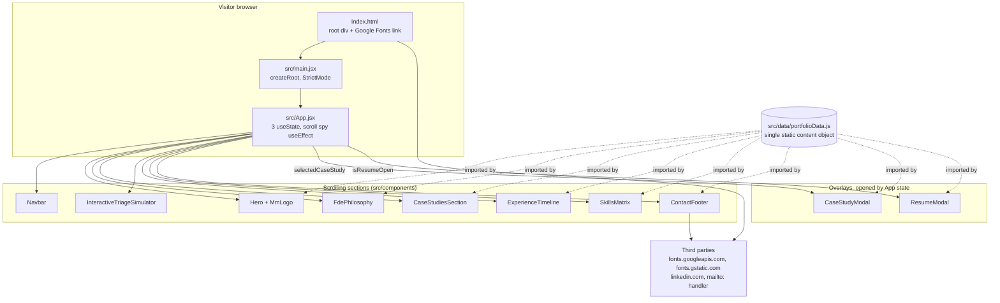

# Codebase map

Muhammad Muhibullah personal portfolio. Written 2026-09-10 by the discovery analyst against
commit `b50497f` (the only commit on `main`).

Every statement below is marked **confirmed** (observed by reading a file or running a read-only
command) or **believed** (inferred, stated by the owner, or planned but not yet in the repo).

---

## What this is

A static single-page React application that presents the owner's experience and case studies to
recruiters and hiring managers. There is no backend, no database, no authentication, no API, and
no visitor data collection. The whole product is HTML, CSS and JavaScript served from a static
host. **Confirmed**: `git ls-files` lists 32 files, all of them source, config, or images; a
search of `src/` and `index.html` for `fetch(`, `XMLHttpRequest`, `axios`, `localStorage`,
`sessionStorage`, `document.cookie`, `gtag`, `analytics` and `dataLayer` returns nothing.

## Stack

| Thing | Value | Status |
| --- | --- | --- |
| Language | JavaScript with JSX, no TypeScript | confirmed (`package.json`, no `tsconfig.json`) |
| UI | React 19.2.8, React DOM 19.2.8 | confirmed (`package.json`) |
| Build | Vite 5.4.11 (`vite --help` prints `vite/5.4.11`) | confirmed |
| Styling | Tailwind CSS v4 via `@tailwindcss/vite`, plus `src/index.css` | confirmed (`vite.config.js`, `src/index.css` line 1 `@import "tailwindcss"`) |
| Icons | `lucide-react` 1.44.0 | confirmed |
| Animation package | `thinking-orbs` 0.3.1, installed, **not imported anywhere yet** | confirmed (`grep` finds no import) |
| Linter | oxlint 1.82.0 installed, config `.oxlintrc.json` | confirmed |
| Formatter | none | confirmed (no prettier, no `.editorconfig`) |
| Test runner | none | confirmed (no test dependency, no test file, no `test` script) |
| Package manager | npm 10.5.0 on Node v21.7.3 | confirmed (`npm --version`, `node --version`) |
| Host OS | Windows 10, PowerShell primary, Git Bash available | confirmed |
| Hosting | GitHub Pages from `muhibm1/Portfolio` | **believed**, not configured |
| CI | GitHub Actions | **believed**, no `.github/` directory exists |

## Commands

Confirmed by reading `package.json` and by running each tool's `--help`, which cannot mutate
anything.

| Purpose | Command | Status |
| --- | --- | --- |
| Install | `npm ci` | confirmed the subcommand exists (`npm ci --help`); not run |
| Dev server | `npm run dev` (`vite`) | confirmed the script exists; not run |
| Build | `npm run build` (`vite build`) | confirmed the script exists; not run |
| Preview | `npm run preview` (`vite preview`) | confirmed the script exists; not run |
| Lint | `npm run lint` (`oxlint`) | **confirmed broken on this machine**, see below |
| Security audit | `npm audit --audit-level=high` | confirmed the flag exists (`npm audit --help`); not run |
| Typecheck | none | confirmed absent |
| Test | none | confirmed absent |

`npm run lint` currently fails for an environment reason, not a code reason. **Confirmed**:
`node_modules/@oxlint/` is an empty directory, so oxlint cannot load any native binding;
`./node_modules/.bin/oxlint --version` exits `1` with
`Cannot find native binding ... Cannot find module '@oxlint/binding-wasm32-wasi'`. This is the
npm optional-dependency bug the error message itself names (npm/cli issue 4828). The fix is to
delete `node_modules` and `package-lock.json` and reinstall. Until then the verifier will report
lint as failing on every change.

---

## Architecture

One React root, one page, no router. Everything a visitor can reach is rendered by `App.jsx`,
either as a scrolling section or as a modal overlay.

**Confirmed** by reading `src/main.jsx`, `src/App.jsx` and every file in `src/components/`.

### The one request path

There is no request path in the server sense. The full lifecycle is:

1. A visitor loads `index.html`. It declares the page title and description, preconnects to
   `fonts.googleapis.com` and `fonts.gstatic.com`, and loads Inter, JetBrains Mono and Space
   Grotesk from Google Fonts. **Confirmed**, `index.html` lines 8 to 10.
2. `src/main.jsx` mounts `App` into `#root` inside `StrictMode`. **Confirmed**.
3. `App` imports every section component and renders them in a fixed order inside `<main>`,
   with `ContactFooter` outside it. **Confirmed**, `src/App.jsx` lines 49 to 89.
4. Components read their content from the single `portfolioData` object. Nothing is fetched.
5. Interaction is local state only: opening a case study modal, opening the resume modal,
   smooth-scrolling to the simulator, and the simulator's own staged animation.

### State and interaction patterns

- **Top-level state lives in `App`.** Three `useState` hooks: `activeSection`,
  `selectedCaseStudy`, `isResumeOpen`. Children receive callbacks as props
  (`onSelectCaseStudy`, `onOpenResume`, `onOpenSimulator`). There is no context, no reducer and
  no state library. **Confirmed**, `src/App.jsx` lines 15 to 17 and 52 to 96.
- **Scroll spy** is a `window.scroll` listener in `App` that compares `window.scrollY + 200`
  against each section's `offsetTop`. **Confirmed**, `src/App.jsx` lines 20 to 40.
- **Modals are conditional renders**, not portals: `{selectedCaseStudy && <CaseStudyModal .../>}`.
  **Confirmed**, `src/App.jsx` lines 91 to 101.
- **Staged animation via `setTimeout`.** `InteractiveTriageSimulator` advances a numeric
  `processingStage` through four timeouts to fake an OAuth check, a schema check, LLM reasoning
  and a verdict. The timeouts are not cleared on unmount. **Confirmed**,
  `src/components/InteractiveTriageSimulator.jsx` lines 64 to 90.
- **Browser APIs used directly**: `navigator.clipboard.writeText` and `window.print` in
  `ResumeModal`, `element.scrollIntoView` in `App`. The clipboard call has no `catch`, so a
  denied clipboard permission fails silently and still flips the button to "Copied".
  **Confirmed**, `src/components/ResumeModal.jsx` lines 9 to 17.

### Patterns to follow, with example paths

| Pattern | Example | Note |
| --- | --- | --- |
| One default-exported function component per file | `src/components/SkillsMatrix.jsx` | every component file follows this, confirmed by `grep "^export"` |
| Content comes from the data module | `src/components/ExperienceTimeline.jsx` imports `portfolioData` | the pattern the whole site is built on |
| Section wrapper with an `id` for scroll spy | `src/components/Hero.jsx` line 10, `<section id="overview">` | the `id` must match the list in `App.jsx` line 22 |
| Styling by Tailwind utility classes inline | all components | colours are hard-coded hex in JSX, not the CSS variables |
| Shared animation and colour tokens | `src/index.css` lines 5 to 17 and 47 to 86 | `:root` variables and two keyframe animations |
| External link hygiene | `src/components/ContactFooter.jsx` lines 79 to 80 | `target="_blank"` always paired with `rel="noopener noreferrer"`, confirmed at all three external links |

Two inconsistencies with the patterns above, both confirmed:

- `src/components/CaseStudyModal.jsx` line 298 hard-codes the owner's email address in a
  `mailto:` href instead of reading `personal.email` like every other component does.
- Components hard-code hex colours rather than using the `:root` variables defined in
  `src/index.css`. The variables are currently unused.

### Validation, errors, auth, logging

- **Validation**: none, and none needed. There is no input from anyone. The simulator's
  "payloads" are hard-coded constants in the component. **Confirmed**.
- **Errors**: there is no error boundary, no try/catch and no error reporting anywhere in
  `src/`. A render-time exception in any component blanks the page with no message.
  **Confirmed** by searching for `try`, `catch`, `ErrorBoundary` and `componentDidCatch`.
- **Auth**: none. There is nothing to sign in to. **Confirmed**.
- **Logging**: none. No `console.*` calls in `src/`. For a static marketing page with no
  failure path this is acceptable, and it is the reason the usual "error tracking from day one"
  default does not apply here. **Confirmed**.

---

## Data inventory

There is no database, no storage bucket, no cookie and no form. The only data in the system is
static content compiled into the JavaScript bundle and served to everyone.

| Where | What | Category | Status |
| --- | --- | --- | --- |
| `src/data/portfolioData.js`, `personal` | Owner's name, role, email, city, LinkedIn URL, GitHub profile URL, availability statement, summary. The phone number was removed by change 2026-09-11 (spec R41) | **Personal data, the owner's own**, published deliberately | confirmed |
| `src/data/portfolioData.js`, `telemetry` | Four headline metrics (350+ tickets/day, 50+ regions, -40% incidents, 99.9% reliability) | Employer-derived claims | confirmed |
| `src/data/portfolioData.js`, `philosophy` | Three principles, free text | None | confirmed |
| `src/data/portfolioData.js`, `caseStudies` | Case studies naming Apple, TCS and Neural Newsletters, with challenge, solution, impact, diagram steps and tech stack | **Former and current employer detail**, see constraints | confirmed |
| `src/data/portfolioData.js`, `experience` | Three roles with dated bullet points | Employment history | confirmed |
| `src/data/portfolioData.js`, `education` | Two degrees | Education history | confirmed |
| `src/data/portfolioData.js`, `skills` | Four skill lists | None | confirmed |
| `src/components/InteractiveTriageSimulator.jsx`, `PRESETS` | Three invented ticket payloads with plausible-looking internal system names, OAuth scopes and region identifiers | **Fictional but Apple-flavoured**, see constraints | confirmed |
| `public/`, `src/assets/`, `docs/design/` | Favicon and icon sprite in `public/`; `hero.png` and two framework SVGs in `src/assets/`; four design mockup JPEGs in `docs/design/` (moved out of `public/` by change 2026-09-11, R92) | None | confirmed |

**No special-category data** as GDPR Art. 9 defines it: no health, no biometrics, no politics,
no religion, no union membership, no sexual orientation, and nothing from which those are
inferable. **Confirmed** by reading the whole of `portfolioData.js`.

**No visitor data of any kind is collected.** No analytics, no cookies, no local storage, no
form, no server. Contact is a `mailto:` link, which opens the visitor's own mail client and
sends nothing to this site. **Confirmed**.

---

## Boundaries

Four, all outbound, all optional to the visitor except the first.

1. **Google Fonts** (`fonts.googleapis.com`, `fonts.gstatic.com`). Loaded on every page view from
   `index.html`. The visitor's IP address and user agent go to Google on every load. This is the
   only third party that receives anything about a visitor, and it is the entire privacy surface
   of the site. **Confirmed**, `index.html` lines 8 to 10.
2. **LinkedIn** (`https://www.linkedin.com/in/muhibm1/`). A link the visitor may click, from
   `Hero.jsx` and `ContactFooter.jsx`. **Confirmed**.
3. **`mailto:` links** in `ContactFooter.jsx`, `ResumeModal.jsx` and `CaseStudyModal.jsx`.
   Handled entirely by the visitor's own mail client. **Confirmed**.
4. **GitHub Pages**, the host, once deployment exists. **Believed**, not yet configured.

There is no inbound boundary at all: no HTTP handler, no queue, no webhook, no database
connection.

---

## Build and deploy

- `npm run build` runs `vite build`, which writes to `dist/`. `dist/` is untracked and
  git-ignored. A stale `dist/` from a previous local build is present on disk. **Confirmed**
  (`.gitignore` line 11, `git ls-files` shows no `dist` entry, `ls dist/` shows built assets).
- `vite.config.js` sets **no `base`**. A GitHub Pages project site is served from
  `https://muhibm1.github.io/Portfolio/`, so the default `base: "/"` would make every asset URL
  resolve to the wrong path. `docs/design-brief.md` section 4 already flags that `base` must
  become `/Portfolio/` unless a custom domain is used. **Confirmed** that `base` is absent;
  **believed** that this will break the deploy, since no deploy exists yet to observe.
- There is no `.github/` directory, so no workflow, no Dependabot config and no `CODEOWNERS`.
  **Confirmed** by `find`.

---

## Test layout

There is none. No test runner, no test file, no test script, no fixture directory.
**Confirmed**.

When tests arrive, the profile's `conventions.test_globs` already names where the fixer must not
edit: `**/*.test.*`, `**/*.spec.*`, `**/__tests__/**`, `**/tests/**`, `**/test/**`. The
recommendation recorded in `.workhorse/profile.yml` `notes` is Vitest plus React Testing Library,
with tests placed next to the component as `src/components/Hero.test.jsx`, because that matches
the flat one-component-per-file layout already in use. **Believed to be the right choice**, not
yet agreed by the owner; this is a G0 question.

---

## Files that are not part of the product

- `generate_viewer.cjs` at the repo root. It reads two JPEGs from
  `C:\Users\alqai\.gemini\antigravity\brain\10bf30e7-...`, a path outside the repository that no
  other machine has, base64-inlines them into an HTML file, and writes that file back to the same
  outside directory. It is not referenced by `package.json`, by `index.html`, or by anything in
  `src/`. It is dead. **Confirmed** by reading it and by `grep`.
- `README.md` is still the unmodified `create-vite` React template readme. It describes plugin
  choices and a TypeScript template, and says nothing about this project. **Confirmed**.
- `src/assets/react.svg`, `src/assets/vite.svg` and `src/assets/hero.png` are not imported by any
  component. **Confirmed** by `grep`.
- `docs/design/mockup-*.jpg` are four design mockups referenced by `docs/design-brief.md`. They
  are design artefacts, not site content. Change 2026-09-11 (R92) moved them out of `public/`,
  which Vite copies to the site root, and `src/publicDirectory.test.js` fails if one returns
  there or is referenced from `src/` or `index.html`.
